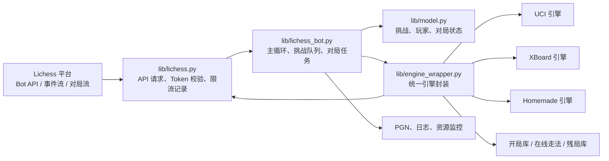

**lichess-bot 是连接 Lichess Bot API 与国际象棋引擎的桥接程序**：它让你把本地或服务器上的棋类引擎接到 lichess.org，使 BOT 账号能够接受挑战、下棋、聊天、保存棋谱，并在 Lichess 页面上实时展示对局。本页是整个文档的入口，只解释“这个项目是什么、由哪些部分组成、第一次阅读应如何推进”，不展开安装、Token、引擎配置或生产部署细节。Sources: [README.md](README.md#L18-L25), [README.md](README.md#L27-L42)

## 你当前所在的位置

你现在位于目录中的 **[概览](1-gai-lan)** 页面，它属于“快速开始”分组的第一篇。建议把本页当作地图：先理解 lichess-bot 的基本角色，再进入 [快速开始](2-kuai-su-kai-shi)，随后按首次部署顺序阅读账号、Python、引擎、启动和 Docker 相关页面。Sources: [README.md](README.md#L44-L50)

## 一句话理解项目

从第一性原理看，lichess-bot 做的事情很简单：**Lichess 负责在线平台和对局事件，棋类引擎负责计算走法，lichess-bot 负责在两者之间翻译、调度和容错**。入口脚本 `lichess-bot.py` 只调用 `lib.lichess_bot.start_program()`，而主模块负责启动参数解析、读取配置、验证引擎、创建 Lichess API 客户端，并在账号是 BOT 时进入主运行流程。Sources: [lichess-bot.py](lichess-bot.py#L1-L6), [lib/lichess_bot.py](lib/lichess_bot.py#L1341-L1381)

## 适合初学者的项目心智模型

你可以把 lichess-bot 想成一个“在线裁判席旁的助手”：它监听 Lichess 发来的账号事件和对局事件；当轮到机器人走棋时，它把当前棋盘交给引擎或开局库、残局库、在线走法来源；拿到结果后再通过 Lichess API 发送走法、认输或求和操作。这个模型在代码中对应三个核心区域：`lib/lichess.py` 封装 API 通信，`lib/lichess_bot.py` 控制主循环和对局生命周期，`lib/engine_wrapper.py` 统一封装 UCI、XBoard 与 Homemade 引擎。Sources: [lib/lichess.py](lib/lichess.py#L127-L168), [lib/lichess_bot.py](lib/lichess_bot.py#L395-L523), [lib/engine_wrapper.py](lib/engine_wrapper.py#L35-L65)

## 架构总览

下面的图展示的是入门级架构视角：左侧是 Lichess 平台，中间是 lichess-bot 的控制层和 API 封装，右侧是棋类引擎与可选走法来源。你不需要先理解每个函数，只要记住数据流方向：**事件从 Lichess 流入，棋盘状态进入引擎，走法再回到 Lichess**。Sources: [lib/lichess.py](lib/lichess.py#L21-L45), [lib/lichess_bot.py](lib/lichess_bot.py#L128-L157), [lib/engine_wrapper.py](lib/engine_wrapper.py#L196-L251)



Sources: [lib/lichess.py](lib/lichess.py#L21-L45), [lib/lichess_bot.py](lib/lichess_bot.py#L304-L365), [lib/engine_wrapper.py](lib/engine_wrapper.py#L35-L65)

## 运行时发生了什么

启动后，程序会解析命令行参数，例如 `--config` 指定配置文件、`-u` 升级 BOT 账号、`-v` 输出更详细日志；随后加载 `config.yml`，检查引擎配置是否可用，创建 `Lichess` 客户端并读取账号资料。如果账号已经是 BOT，程序进入 `start()`，开始监听挑战、对局和后台任务。Sources: [lib/lichess_bot.py](lib/lichess_bot.py#L1341-L1381)

`start()` 会建立多个协作组件：账号级事件流监听进程、控制流看门狗、通信棋检查进程、日志监听进程、PGN 写入进程，以及可选资源监控进程。对初学者而言，关键点不是“多进程如何实现”，而是理解 lichess-bot 不是一次性脚本；它是一个长期运行的事件驱动程序。Sources: [lib/lichess_bot.py](lib/lichess_bot.py#L304-L381)

主循环 `lichess_bot_main()` 会处理几类核心事件：收到挑战时检查规则并排队，收到 `gameStart` 时启动对局任务，对局结束时释放活动游戏记录，同时周期性执行竞技场、主动配对、在线状态检查和控制流健康检查。Sources: [lib/lichess_bot.py](lib/lichess_bot.py#L395-L523)

## 对局中发生了什么

每一盘棋由 `play_game()` 处理：它打开 Lichess 的对局流，读取初始局面，创建 `model.Game`，再创建对应引擎封装；随后在循环中响应聊天消息、棋局状态更新、悔棋请求、游戏结束和断线重连。轮到机器人走棋时，程序会构造棋盘、计算时间限制，然后调用 `engine.play_move()`。Sources: [lib/lichess_bot.py](lib/lichess_bot.py#L759-L923)

`engine.play_move()` 的走法选择顺序对初学者很重要：它会先尝试本地 Polyglot 开局库，再尝试 lichess-bot 管理的残局库，再尝试在线走法来源；如果这些来源没有可直接使用的走法，才让引擎搜索。搜索结果产生后，程序会记录注释和统计信息，并向 Lichess 发送走法；如果配置允许并满足条件，也可能认输。Sources: [lib/engine_wrapper.py](lib/engine_wrapper.py#L196-L251)

## 主要功能速览

| 功能类别 | lichess-bot 能做什么 | 入门理解 |
|---|---|---|
| 平台连接 | 连接 Lichess Bot API、监听事件流、发送走法和聊天 | 它是 Lichess 与本地程序之间的通信层 |
| 引擎支持 | 支持 UCI、XBoard、Homemade 引擎 | 你可以接入常见国际象棋引擎，也可以写自定义引擎 |
| 挑战处理 | 接受或拒绝挑战，支持并发对局限制 | 配置决定机器人愿意和谁下、下什么规则 |
| 走法来源 | 支持本地/在线开局库和本地/在线残局库 | 不一定每一步都要由主引擎搜索 |
| 对局行为 | 可求和、认输、接受悔棋、发送问候语 | 机器人不只是走棋，也会处理对局交互 |
| 记录与运维 | 可保存 PGN、输出日志、采集资源数据 | 便于复盘、排错和观察运行状态 |

Sources: [README.md](README.md#L27-L42), [config.yml.default](config.yml.default#L59-L68), [config.yml.default](config.yml.default#L224-L234)

## 配置文件从哪里开始看

`config.yml.default` 展示了配置文件的基本形状：顶部是 Lichess `token` 和 `url`，随后是 `engine` 引擎配置，包括引擎目录、引擎名称、协议、是否 ponder，以及 UCI/XBoard/Homemade 的相关选项。初学者第一次配置时，最先需要关注的是 Token、引擎路径、引擎名称和协议。Sources: [config.yml.default](config.yml.default#L1-L15), [config.yml.default](config.yml.default#L119-L149)

挑战相关配置集中在 `challenge` 段，包括同时对局数、挑战排序偏好、是否接受 BOT、时间控制、变体、模式、评级限制和同一用户最大同时对局数。你可以先把它理解为“机器人接单规则”：只有符合规则的挑战才会被接受或进入队列。Sources: [config.yml.default](config.yml.default#L163-L213)

扩展能力也集中在配置中，例如问候语、PGN 保存、资源监控、竞技场和主动配对。概览阶段只需要知道这些能力存在；具体字段含义和推荐值应在后续基础配置与扩展使用页面中逐项学习。Sources: [config.yml.default](config.yml.default#L214-L234), [config.yml.default](config.yml.default#L236-L288)

## 配置区域快速对照

| 配置区域 | 作用 | 初学者优先级 |
|---|---|---|
| `token` / `url` | 指定 Lichess OAuth Token 与站点地址 | 必看 |
| `engine` | 指定引擎路径、协议、选项和走法来源 | 必看 |
| `challenge` | 控制接受哪些挑战、允许多少并发对局 | 必看 |
| `greeting` | 控制开局和结束时发送的聊天消息 | 可稍后看 |
| `pgn_directory` / `pgn_file_grouping` | 控制是否保存棋谱以及如何分组 | 可稍后看 |
| `resource_monitor` | 记录 CPU 和内存使用情况 | 进阶运维再看 |
| `arena` | 自动加入团队竞技场锦标赛 | 扩展使用再看 |
| `matchmaking` | 主动挑战其他机器人 | 扩展使用再看 |

Sources: [config.yml.default](config.yml.default#L1-L15), [config.yml.default](config.yml.default#L163-L213), [config.yml.default](config.yml.default#L214-L288)

## 项目结构导览

下面是从初学者角度最值得认识的目录结构。入口文件在根目录，核心代码集中在 `lib/`，默认配置在 `config.yml.default`，测试在 `test_bot/`，历史英文 wiki 和使用说明在 `wiki/`，部署、安全和贡献说明在 `docs/`。Sources: [lichess-bot.py](lichess-bot.py#L1-L6), [README.md](README.md#L52-L57), [lib/lichess_bot.py](lib/lichess_bot.py#L1-L6)

```text
lichess-bot/
├── lichess-bot.py          # 程序入口：调用主启动函数
├── config.yml.default      # 默认配置模板
├── lib/
│   ├── lichess_bot.py      # 主循环、事件处理、对局调度
│   ├── lichess.py          # Lichess API 封装
│   ├── engine_wrapper.py   # UCI / XBoard / Homemade 引擎封装
│   ├── config.py           # 配置读取、默认值、校验
│   ├── model.py            # 挑战、玩家、对局状态等领域模型
│   ├── conversation.py     # 聊天与命令响应
│   ├── matchmaking.py      # 主动配对
│   ├── arena.py            # 竞技场相关逻辑
│   └── resource_monitor.py # 资源监控
├── engines/                # 通常放置棋类引擎文件
├── test_bot/               # 测试代码与模拟引擎
├── docs/                   # 部署、安全、贡献等说明
└── wiki/                   # 旧版英文 wiki 页面
```

Sources: [lichess-bot.py](lichess-bot.py#L1-L6), [lib/lichess_bot.py](lib/lichess_bot.py#L1-L47), [lib/engine_wrapper.py](lib/engine_wrapper.py#L1-L24), [lib/config.py](lib/config.py#L1-L10)

## 模块职责速览

| 模块 | 主要职责 | 初学者怎样理解 |
|---|---|---|
| `lichess-bot.py` | 启动入口 | “点火开关” |
| `lib/lichess_bot.py` | 主控制器、事件循环、对局任务 | “机器人总调度室” |
| `lib/lichess.py` | API endpoint、请求、Token 校验、限流记录 | “和 Lichess 说话的人” |
| `lib/engine_wrapper.py` | 创建和调用 UCI、XBoard、Homemade 引擎 | “和棋类引擎说话的人” |
| `lib/config.py` | 配置对象、默认值、校验工具 | “把 YAML 变成程序可用设置” |
| `config.yml.default` | 用户配置模板 | “复制后改成自己的 config.yml” |

Sources: [lichess-bot.py](lichess-bot.py#L1-L6), [lib/lichess_bot.py](lib/lichess_bot.py#L304-L381), [lib/lichess.py](lib/lichess.py#L127-L168), [lib/engine_wrapper.py](lib/engine_wrapper.py#L35-L65), [lib/config.py](lib/config.py#L15-L66)

## 推荐阅读路线

如果你是第一次使用，建议按目录顺序阅读：先读本页，再进入 [快速开始](2-kuai-su-kai-shi)，然后依次完成 [创建 Lichess BOT 账号与 OAuth Token](3-chuang-jian-lichess-bot-zhang-hao-yu-oauth-token)、[安装 Python 环境并运行测试](4-an-zhuang-python-huan-jing-bing-yun-xing-ce-shi)、[配置并验证国际象棋引擎](5-pei-zhi-bing-yan-zheng-guo-ji-xiang-qi-yin-qing)、[启动机器人并观察运行日志](6-qi-dong-ji-qi-ren-bing-guan-cha-yun-xing-ri-zhi)。如果你更倾向容器化部署，再阅读 [使用 Docker 运行机器人](7-shi-yong-docker-yun-xing-ji-qi-ren)。Sources: [README.md](README.md#L44-L50)

当机器人能跑起来后，再进入基础配置页面：[配置文件结构与必填字段](8-pei-zhi-wen-jian-jie-gou-yu-bi-tian-zi-duan)、[挑战接收规则：变体、时限、评级与并发](9-tiao-zhan-jie-shou-gui-ze-bian-ti-shi-xian-ping-ji-yu-bing-fa)、[开局库、在线走法与残局库配置](10-kai-ju-ku-zai-xian-zou-fa-yu-can-ju-ku-pei-zhi)、[认输、求和、悔棋与聊天行为配置](11-ren-shu-qiu-he-hui-qi-yu-liao-tian-xing-wei-pei-zhi)。这些页面对应配置模板中的 `engine`、`challenge`、`greeting`、PGN 和资源相关区域。Sources: [config.yml.default](config.yml.default#L4-L15), [config.yml.default](config.yml.default#L59-L117), [config.yml.default](config.yml.default#L163-L234)

如果你已经理解基本运行方式，可以继续阅读扩展使用：[启用主动配对并挑战其他机器人](12-qi-yong-zhu-dong-pei-dui-bing-tiao-zhan-qi-ta-ji-qi-ren)、[参加竞技场锦标赛与团队赛事](13-can-jia-jing-ji-chang-jin-biao-sai-yu-tuan-dui-sai-shi)、[创建自定义 Homemade 引擎](14-chuang-jian-zi-ding-yi-homemade-yin-qing)、[保存 PGN、采集资源数据与导出报告](15-bao-cun-pgn-cai-ji-zi-yuan-shu-ju-yu-dao-chu-bao-gao)。这些主题在代码中分别对应 matchmaking、arena、homemade 引擎和 PGN/资源监控能力。Sources: [README.md](README.md#L54-L57), [config.yml.default](config.yml.default#L230-L288), [lib/engine_wrapper.py](lib/engine_wrapper.py#L50-L65)

## 本页之后你应该能回答的问题

读完本页，你应该能回答三个问题：第一，lichess-bot 是 **Lichess 与棋类引擎之间的桥接层**；第二，启动流程大致是“入口脚本 → 读取配置 → 验证引擎 → 验证 BOT 账号 → 进入事件循环”；第三，一盘棋中的走法会经过“对局状态 → 棋盘构造 → 开局库/残局库/在线来源/引擎搜索 → API 发送走法”的路径。Sources: [README.md](README.md#L20-L23), [lib/lichess_bot.py](lib/lichess_bot.py#L1341-L1381), [lib/lichess_bot.py](lib/lichess_bot.py#L759-L923), [lib/engine_wrapper.py](lib/engine_wrapper.py#L196-L251)