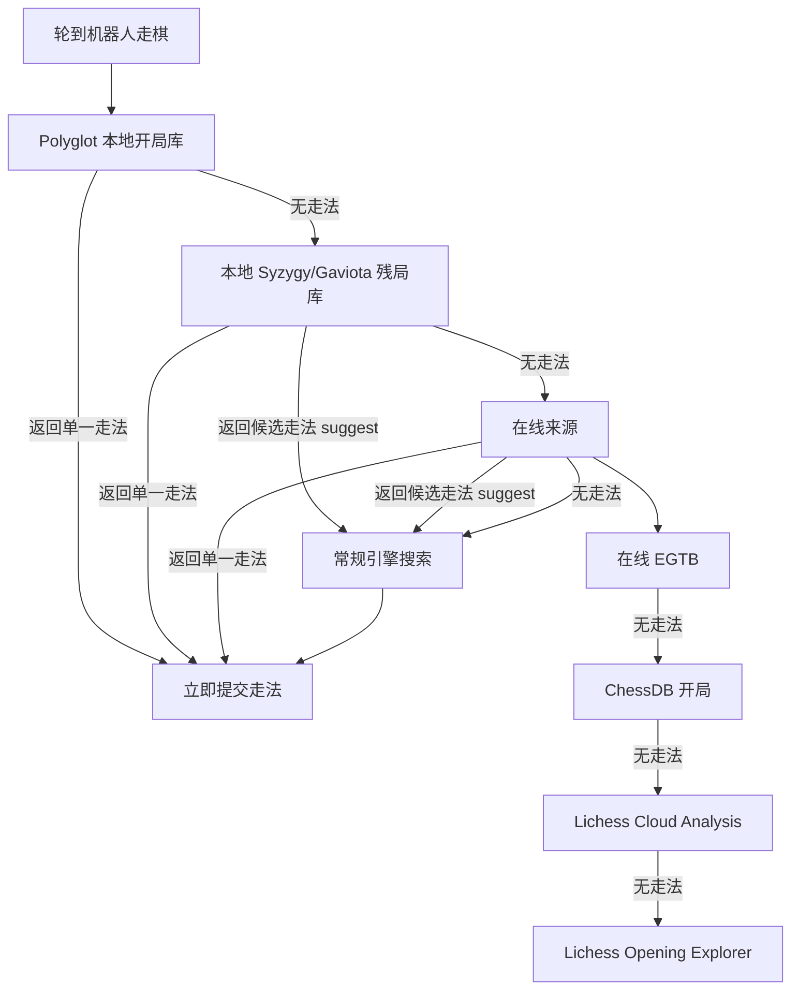

本页聚焦 lichess-bot 在**引擎真正搜索之前**如何尝试使用外部走法来源：本地 Polyglot 开局库、本地 Syzygy/Gaviota 残局库、在线残局库、ChessDB、Lichess Cloud Analysis 与 Lichess Opening Explorer。核心结论是：这些配置并不是引擎参数本身，而是 `lichess-bot` 在 `EngineWrapper.play_move()` 中先行决策的“走法供应层”；只有当这些来源没有返回单一走法或只返回候选根走法时，才进入引擎搜索。Sources: [engine_wrapper.py](lib/engine_wrapper.py#L196-L229)

## 架构假设与验证结论

本页的架构假设是：`engine.polyglot`、`engine.lichess_bot_tbs` 与 `engine.online_moves` 构成一个按优先级排列的外部走法管线；该假设由 `play_move()` 的调用顺序验证：先调用 `get_book_move()` 读取 Polyglot，再调用 `get_egtb_move()` 读取本地残局库，最后调用 `get_online_move()` 访问在线来源；如果返回的是候选走法列表或没有走法，才把候选作为 `root_moves` 交给引擎搜索。Sources: [engine_wrapper.py](lib/engine_wrapper.py#L196-L229)



上图中的“在线来源”内部也有固定顺序：`get_online_move()` 会先检查在线残局库 `online_egtb`，随后在开局类在线来源中依次尝试 ChessDB、Lichess Cloud Analysis、Lichess Opening Explorer；在线开局来源受 `max_depth` 与 `max_out_of_book_moves` 控制，而在线残局库不属于这个“脱离开局库次数”限制。Sources: [engine_wrapper.py](lib/engine_wrapper.py#L980-L1029)

## 配置文件中的相关区域

与本页相关的配置集中在 `engine` 下的三个子树：`polyglot` 负责本地 `.bin` 开局库，`online_moves` 负责在线走法与在线残局库，`lichess_bot_tbs` 负责由 lichess-bot 自己读取的本地残局库；注意 `uci_options.SyzygyPath` 是传给引擎读取的路径，不属于 `lichess_bot_tbs` 这条由 bot 读取的残局库路径。Sources: [config.yml.default](config.yml.default#L16-L30), [config.yml.default](config.yml.default#L70-L117), [config.yml.default](config.yml.default#L125-L130)

```text
engine:
  polyglot:
    enabled: false
    book:
      standard:
        - engines/book1.bin

  online_moves:
    max_out_of_book_moves: 10
    max_retries: 2
    chessdb_book: ...
    lichess_cloud_analysis: ...
    lichess_opening_explorer: ...
    online_egtb: ...

  lichess_bot_tbs:
    syzygy:
      enabled: false
      paths:
        - engines/syzygy
    gaviota:
      enabled: false
      paths:
        - engines/gaviota
```

配置加载阶段会为这些区域填入默认值：在线走法默认最多连续 10 次找不到在线开局走法后停止尝试，在线请求默认最多重试 2 次，在线开局深度默认无限制；Polyglot 默认关闭，默认 `max_depth` 为 8、选择策略为 `weighted_random`、最低权重为 1、归一化为 `none`。Sources: [config.py](lib/config.py#L207-L247)

## 本地 Polyglot 开局库

Polyglot 的最小启用方式是打开 `enabled` 并为具体变体提供书库路径；默认配置示例为 `standard` 变体列出多个 `.bin` 文件，同时注释说明可按同样模式为 `chess960`、`giveaway`、`crazyhouse`、`horde`、`kingofthehill`、`racingkings` 与 `3check` 等变体配置独立书库。Sources: [config.yml.default](config.yml.default#L16-L30)

```yaml
engine:
  polyglot:
    enabled: true
    book:
      standard:
        - engines/book1.bin
        - engines/book2.bin
    min_weight: 1
    selection: "weighted_random"
    max_depth: 20
    normalization: "none"
```

运行时，机器人会先根据棋盘判断变体：Chess960 使用 `chess960`，普通国际象棋使用 `standard`，其他变体使用 `board.uci_variant` 的字符串；随后把对应 `book.<variant>` 统一转换为列表、随机打乱书库顺序，并逐个尝试读取。Sources: [engine_wrapper.py](lib/engine_wrapper.py#L933-L953)

| 参数 | 作用 | 可选值或行为 | 默认/示例 |
|---|---|---|---|
| `enabled` | 是否启用 Polyglot | `true` / `false` | 默认 `false` |
| `book.<variant>` | 某个变体的书库路径列表 | 路径列表；也会被兼容转换为列表 | 示例 `standard: [engines/book1.bin]` |
| `max_depth` | 从开局起最多使用多少“回合深度” | 代码按 `max_depth * 2 - 1` 与半回合数比较 | 默认填充为 `8`，示例为 `20` |
| `selection` | 从书库候选中选法 | `weighted_random`、`uniform_random`、`best_move` | 默认 `weighted_random` |
| `min_weight` | 排除低权重走法 | 与 `normalization` 联动计算阈值 | 默认 `1` |
| `normalization` | 权重归一化方式 | `none`、`sum`、`max` | 默认 `none` |

Sources: [config.py](lib/config.py#L242-L247), [config.py](lib/config.py#L481-L503), [engine_wrapper.py](lib/engine_wrapper.py#L938-L968)

`selection` 的语义由 python-chess Polyglot reader 调用体现：`weighted_random` 使用 `weighted_choice()`，`uniform_random` 使用带 `minimum_weight` 的 `choice()`，`best_move` 使用带 `minimum_weight` 的 `find()`；如果当前局面在某本书中没有条目，会捕获 `IndexError` 并尝试下一本书。Sources: [engine_wrapper.py](lib/engine_wrapper.py#L952-L977)

### 针对人类与机器人对手使用不同书库策略

`opponent_selection` 允许对 `human` 与 `bot` 两类对手覆盖 Polyglot 基础配置；运行时根据 `game.opponent.is_bot` 选择 `bot` 或 `human`，再用覆盖配置与基础配置合并。Sources: [config.yml.default](config.yml.default#L31-L42), [engine_wrapper.py](lib/engine_wrapper.py#L925-L930)

```yaml
engine:
  polyglot:
    enabled: true
    book:
      standard:
        - engines/general.bin
    selection: "weighted_random"
    min_weight: 1
    max_depth: 20
    opponent_selection:
      human:
        selection: "uniform_random"
        min_weight: 25
        max_depth: 8
      bot:
        book:
          standard:
            - engines/strongest-book.bin
        selection: "best_move"
        min_weight: 20
        max_depth: 12
```

校验逻辑限定 `opponent_selection` 只能是字典，键只能是 `human` 或 `bot`，每个覆盖项也必须是字典；覆盖项中的 `selection` 仍必须属于 `weighted_random`、`uniform_random`、`best_move`，`normalization` 仍必须属于 `none`、`max`、`sum`。Sources: [config.py](lib/config.py#L500-L522)

## 在线走法：全局控制

`online_moves` 的全局参数控制在线来源的使用边界：`max_retries` 会传入 `Lichess` API 封装，用于在线走法请求的 backoff 最大尝试次数；`max_out_of_book_moves` 只在在线开局来源连续找不到走法时累加，达到阈值后停止继续查询在线开局来源；`max_depth` 用于限制从开局开始的在线开局使用深度。Sources: [config.yml.default](config.yml.default#L70-L73), [engine_wrapper.py](lib/engine_wrapper.py#L1008-L1029), [lichess_bot.py](lib/lichess_bot.py#L1364-L1367)

在线请求由 `Lichess.online_book_get()` 执行，支持认证或非认证 session，并使用 `backoff.on_exception` 在连接中断、HTTP 错误、读取超时等异常上重试；请求超时时间为 2 秒，重试上限来自 `self.max_retries`。Sources: [lichess.py](lib/lichess.py#L530-L546)

| 全局参数 | 影响范围 | 行为 |
|---|---|---|
| `max_retries` | ChessDB、Lichess Cloud、Opening Explorer、在线 EGTB 的 HTTP 获取 | 作为 `online_book_get()` 的最大尝试次数 |
| `max_out_of_book_moves` | 在线开局来源，不包含在线 EGTB | 连续若干局面没有在线开局走法后停止尝试 |
| `max_depth` | 在线开局来源，不包含在线 EGTB | 按 `max_depth * 2 - 1` 与半回合数比较 |

Sources: [config.py](lib/config.py#L207-L215), [engine_wrapper.py](lib/engine_wrapper.py#L1008-L1029), [lichess.py](lib/lichess.py#L530-L546)

## ChessDB 开局库

`chessdb_book` 只在启用、剩余时间不低于 `min_time`、初始时限不超过 `max_time`、且变体为标准国际象棋时查询；它访问 `https://www.chessdb.cn/cdb.php`，并根据 `move_quality` 把请求动作映射为 `querypv`、`querybest` 或 `query`。Sources: [config.yml.default](config.yml.default#L74-L79), [engine_wrapper.py](lib/engine_wrapper.py#L1032-L1051)

| `move_quality` | 请求动作 | 代码行为 |
|---|---|---|
| `best` | `querypv` | 要求返回深度达到 `min_depth`，并记录 score、depth、pv |
| `good` | `querybest` | 使用返回的 `move` |
| `all` | `query` | 使用返回的 `move` |

Sources: [config.py](lib/config.py#L481-L498), [engine_wrapper.py](lib/engine_wrapper.py#L1042-L1067)

当 `move_quality: "best"` 时，只有 ChessDB 返回状态为 `ok` 且 `depth >= min_depth` 才会采用 PV 的第一个走法，并把分数、深度与 PV 写入注释信息；其他质量模式则直接使用响应中的 `move`。Sources: [engine_wrapper.py](lib/engine_wrapper.py#L1052-L1067)

## Lichess Cloud Analysis

`lichess_cloud_analysis` 在启用、剩余时间达到 `min_time`、初始时限不超过 `max_time` 时请求 `https://lichess.org/api/cloud-eval`；请求参数包含当前 FEN、`multiPv` 与变体，其中 `move_quality: "best"` 使用 `multiPv = 1`，`move_quality: "good"` 使用 `multiPv = 5`。Sources: [config.yml.default](config.yml.default#L80-L87), [engine_wrapper.py](lib/engine_wrapper.py#L1070-L1091)

| 参数 | 作用 |
|---|---|
| `move_quality` | `best` 取第一条 PV；`good` 在接近最佳分数的 PV 中随机选择 |
| `max_score_difference` | 仅用于 `good`，限制候选 PV 与最佳评估的分差 |
| `min_depth` | 云分析深度必须达到该值 |
| `min_knodes` | 云分析节点数必须达到该值 |

Sources: [config.yml.default](config.yml.default#L84-L87), [engine_wrapper.py](lib/engine_wrapper.py#L1093-L1118)

当云分析响应没有 `error`，且 `depth >= min_depth`、`knodes >= min_knodes` 时，机器人才会从 PV 中取走法；对白方时间侧使用正向 cp，对黑方时间侧会取相反分数，以便把评估转换到当前行棋方视角。Sources: [engine_wrapper.py](lib/engine_wrapper.py#L1092-L1118)

## Lichess Opening Explorer

`lichess_opening_explorer` 支持 `masters`、`lichess` 与 `player` 三种来源：`masters` 请求 `/masters` 数据，`player` 请求指定玩家或机器人用户名的数据，其他情况请求 `/lichess` 数据；配置中的 `sort` 控制按胜率或对局数排序，`min_games` 控制某个候选走法至少出现多少局才可被采用。Sources: [config.yml.default](config.yml.default#L88-L95), [engine_wrapper.py](lib/engine_wrapper.py#L1122-L1172)

| 参数 | 可选值 | 行为 |
|---|---|---|
| `source` | `lichess`、`masters`、`player` | 决定查询哪个 Opening Explorer 数据源 |
| `player_name` | 用户名或空字符串 | `source: player` 且为空时使用机器人用户名 |
| `sort` | `winrate`、`games_played` | 决定首要排序指标 |
| `min_games` | 整数 | 候选走法总对局数达到阈值才纳入排序 |

Sources: [config.py](lib/config.py#L545-L554), [engine_wrapper.py](lib/engine_wrapper.py#L1140-L1169)

Opening Explorer 的胜率计算使用 `white + draws * 0.5` 除以总局数；当机器人执黑时，代码用 `1 - winrate` 转换为黑方视角，然后按 `sort` 指定的主指标和另一个指标作为次级排序，选排序第一的 UCI 走法。Sources: [engine_wrapper.py](lib/engine_wrapper.py#L1156-L1170)

## 在线残局库 online_egtb

`online_egtb` 是在线走法中的残局分支，但它在 `get_online_move()` 内部优先于在线开局来源；启用条件包括：剩余时间达到 `min_time`、初始时限不超过 `max_time`、棋子数不超过 `max_pieces`、没有王车易位权，并且变体与来源匹配。Sources: [config.yml.default](config.yml.default#L96-L102), [engine_wrapper.py](lib/engine_wrapper.py#L980-L1007), [engine_wrapper.py](lib/engine_wrapper.py#L1175-L1209)

`source: "lichess"` 支持标准国际象棋、antichess 与 atomic 的在线残局查询；`source: "chessdb"` 只用于标准国际象棋；如果条件通过，Lichess 来源请求 `https://tablebase.lichess.ovh/{variant}`，ChessDB 来源请求 `https://www.chessdb.cn/cdb.php`。Sources: [engine_wrapper.py](lib/engine_wrapper.py#L1182-L1207), [engine_wrapper.py](lib/engine_wrapper.py#L1266-L1320), [engine_wrapper.py](lib/engine_wrapper.py#L1323-L1373)

| `move_quality` | 返回类型 | 后续行为 |
|---|---|---|
| `best` | 单一 UCI 走法 | bot 直接走该步 |
| `suggest` | 同 WDL 的候选 UCI 走法列表，若只有一个候选则退化为单一走法 | 引擎只在这些候选根走法中搜索 |

Sources: [engine_wrapper.py](lib/engine_wrapper.py#L1175-L1209), [engine_wrapper.py](lib/engine_wrapper.py#L1266-L1320), [engine_wrapper.py](lib/engine_wrapper.py#L1323-L1373)

在线残局库返回 WDL 后，`get_online_move()` 会把 WDL 映射成 cp 分数写入注释；如果认输/求和配置允许，WDL 为 0 时可触发求和，WDL 为 -2 时可触发认输。Sources: [engine_wrapper.py](lib/engine_wrapper.py#L987-L1007)

## 本地残局库：Syzygy 与 Gaviota

`lichess_bot_tbs` 下的 Syzygy 与 Gaviota 是由 lichess-bot 读取的本地残局库，而不是传给引擎的 `SyzygyPath`；默认示例中 Syzygy 可配置多个路径、最大 7 子，Gaviota 默认最大 5 子，并带有 `min_dtm_to_consider_as_wdl_1` 参数。Sources: [config.yml.default](config.yml.default#L104-L117), [config.yml.default](config.yml.default#L125-L130)

```yaml
engine:
  lichess_bot_tbs:
    syzygy:
      enabled: true
      paths:
        - "engines/syzygy"
      max_pieces: 7
      move_quality: "best"
    gaviota:
      enabled: false
      paths:
        - "engines/gaviota"
      max_pieces: 5
      min_dtm_to_consider_as_wdl_1: 120
      move_quality: "best"
```

本地残局库的顺序是先 Syzygy 后 Gaviota：`get_egtb_move()` 先调用 `get_syzygy()`，只有没有走法时才调用 `get_gaviota()`；如果返回单一走法，会构造 `PlayResult`，如果返回候选列表，则交给后续引擎搜索作为根走法限制。Sources: [engine_wrapper.py](lib/engine_wrapper.py#L1212-L1238)

Syzygy 的使用条件是启用、棋子数不超过 `max_pieces`，并且变体属于 `chess`、`antichess` 或 `atomic`；它会打开第一个路径并添加后续路径，优先按 DTZ 给合法走法打分，在 `move_quality: "suggest"` 且存在多个同 WDL 好走法时返回候选列表。Sources: [engine_wrapper.py](lib/engine_wrapper.py#L1376-L1427)

Gaviota 的使用条件是启用、棋子数不超过 `max_pieces`，并且只支持标准国际象棋；它按 DTM 打分，再通过 `dtm_to_wdl()` 把 DTM 映射为类似 Syzygy 的 WDL，并在 `suggest` 模式下返回足够好的候选走法。Sources: [engine_wrapper.py](lib/engine_wrapper.py#L1450-L1499), [engine_wrapper.py](lib/engine_wrapper.py#L1515-L1545)

## `best` 与 `suggest` 的选择策略

残局库中的 `move_quality: "best"` 与 `"suggest"` 决定 bot 是直接采用外部来源给出的最佳走法，还是只让引擎在同等 WDL 的候选走法里搜索；这一区别同时适用于在线 EGTB、本地 Syzygy 与本地 Gaviota，但 XBoard 引擎不能与启用状态下的 `suggest` 模式组合使用。Sources: [engine_wrapper.py](lib/engine_wrapper.py#L980-L1007), [engine_wrapper.py](lib/engine_wrapper.py#L1212-L1238), [config.py](lib/config.py#L383-L389)

| 场景 | 推荐配置 | 行为结果 |
|---|---|---|
| 希望残局最快落子 | `move_quality: "best"` | 外部残局库返回单一最佳走法，bot 直接提交 |
| 希望保留引擎风格 | `move_quality: "suggest"` | 外部残局库给出同 WDL 候选，引擎在候选中搜索 |
| 使用 XBoard 引擎 | 不要在启用的 EGTB/TB 中使用 `suggest` | 配置校验会拒绝该组合 |

Sources: [config.py](lib/config.py#L383-L389), [config.py](lib/config.py#L537-L543), [engine_wrapper.py](lib/engine_wrapper.py#L340-L351)

## 配置组合示例

如果目标是“本地开局库优先，残局用本地 Syzygy，在线只作为补充”，可以启用 Polyglot 与 Syzygy，并只打开在线残局库；由于 `play_move()` 的顺序固定，本地开局库和本地残局库会先于在线来源生效。Sources: [engine_wrapper.py](lib/engine_wrapper.py#L196-L215)

```yaml
engine:
  polyglot:
    enabled: true
    book:
      standard:
        - engines/main-book.bin
    selection: "weighted_random"
    min_weight: 1
    max_depth: 16
    normalization: "none"

  lichess_bot_tbs:
    syzygy:
      enabled: true
      paths:
        - "engines/syzygy"
      max_pieces: 7
      move_quality: "best"
    gaviota:
      enabled: false

  online_moves:
    max_out_of_book_moves: 5
    max_retries: 2
    chessdb_book:
      enabled: false
    lichess_cloud_analysis:
      enabled: false
    lichess_opening_explorer:
      enabled: false
    online_egtb:
      enabled: true
      min_time: 20
      max_time: 10800
      max_pieces: 7
      source: "lichess"
      move_quality: "best"
```

如果目标是“没有本地书库时使用在线开局数据”，可以关闭 Polyglot，并按质量偏好选择 ChessDB、Cloud Analysis 或 Opening Explorer；代码会按 ChessDB、Cloud Analysis、Opening Explorer 的顺序尝试，因此同时启用多个来源时，前者有机会先返回走法。Sources: [engine_wrapper.py](lib/engine_wrapper.py#L1014-L1024)

```yaml
engine:
  polyglot:
    enabled: false

  online_moves:
    max_out_of_book_moves: 10
    max_retries: 2
    max_depth: 12

    chessdb_book:
      enabled: true
      min_time: 20
      max_time: 10800
      move_quality: "good"
      min_depth: 20

    lichess_cloud_analysis:
      enabled: true
      min_time: 20
      max_time: 10800
      move_quality: "best"
      min_depth: 20
      min_knodes: 0

    lichess_opening_explorer:
      enabled: true
      min_time: 20
      max_time: 10800
      source: "masters"
      sort: "winrate"
      min_games: 10
```

## Before / After：从默认关闭到启用外部走法

默认配置中 Polyglot、ChessDB、Lichess Cloud、Opening Explorer、在线 EGTB、本地 Syzygy 与本地 Gaviota 都是关闭状态；启用时应只打开你确实准备使用的数据源，并为本地路径提供真实可读的目录或书库文件。Sources: [config.yml.default](config.yml.default#L16-L30), [config.yml.default](config.yml.default#L70-L117)

| Before：默认关闭 | After：启用本地书库与 Syzygy |
|---|---|
| `polyglot.enabled: false` | `polyglot.enabled: true` 并配置 `book.standard` |
| `lichess_bot_tbs.syzygy.enabled: false` | `lichess_bot_tbs.syzygy.enabled: true` 并配置 `paths` |
| `online_moves.*.enabled: false` | 按需启用一个或多个在线来源 |
| `online_egtb.enabled: false` | 可作为无本地残局库时的补充来源 |

Sources: [config.yml.default](config.yml.default#L16-L30), [config.yml.default](config.yml.default#L74-L117)

## 校验规则与常见错误

配置校验会限制若干枚举值：Polyglot `selection` 只能是 `weighted_random`、`uniform_random`、`best_move`；ChessDB `move_quality` 只能是 `all`、`good`、`best`；Lichess Cloud `move_quality` 只能是 `good`、`best`；在线 EGTB `move_quality` 只能是 `best`、`suggest`。Sources: [config.py](lib/config.py#L481-L498)

Opening Explorer 的 `source` 只能是 `lichess`、`masters`、`player`，`sort` 只能是 `winrate` 或 `games_played`；本地 `lichess_bot_tbs.syzygy.move_quality` 与 `lichess_bot_tbs.gaviota.move_quality` 只能是 `best` 或 `suggest`。Sources: [config.py](lib/config.py#L537-L554)

| 症状 | 可验证原因 | 修复方向 |
|---|---|---|
| Polyglot 不走书 | `enabled` 未启用、超过 `max_depth`、当前变体没有对应 `book.<variant>`，或书中无当前局面 | 检查变体键、路径与深度 |
| 在线开局突然停止 | 某局中连续无在线开局走法次数达到 `max_out_of_book_moves` | 增大阈值或减少无效在线来源 |
| ChessDB 没有返回走法 | 非标准变体、时间不足、初始时限超出、或 `best` 模式深度不足 | 检查 `min_time`、`max_time`、`min_depth` |
| XBoard + `suggest` 报错 | 校验禁止 XBoard 与启用的 `suggest` EGTB/TB 组合 | 改为 `best` 或使用非 XBoard 引擎 |

Sources: [engine_wrapper.py](lib/engine_wrapper.py#L938-L977), [engine_wrapper.py](lib/engine_wrapper.py#L1008-L1029), [engine_wrapper.py](lib/engine_wrapper.py#L1032-L1067), [config.py](lib/config.py#L383-L389)

## 推荐阅读路径

完成本页后，如果你想理解这些外部来源如何与引擎搜索、时间管理和根走法限制结合，建议继续阅读[外部走法来源：Polyglot、云分析、Opening Explorer 与 Tablebase](26-wai-bu-zou-fa-lai-yuan-polyglot-yun-fen-xi-opening-explorer-yu-tablebase)；如果你要配置专门的残局引擎，而不是本页的残局库走法来源，请阅读[残局专用引擎与浅层搜索保护](27-can-ju-zhuan-yong-yin-qing-yu-qian-ceng-sou-suo-bao-hu)；如果你还没有完成引擎基础配置，请回到[配置并验证国际象棋引擎](5-pei-zhi-bing-yan-zheng-guo-ji-xiang-qi-yin-qing)。Sources: [engine_wrapper.py](lib/engine_wrapper.py#L129-L155), [engine_wrapper.py](lib/engine_wrapper.py#L308-L351), [config.yml.default](config.yml.default#L44-L51)