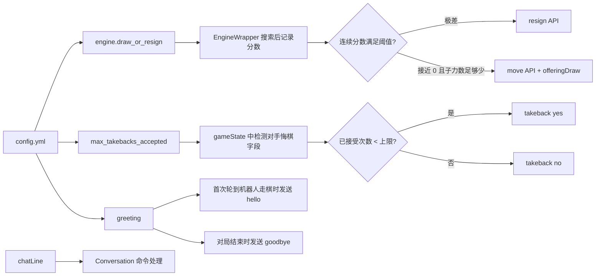
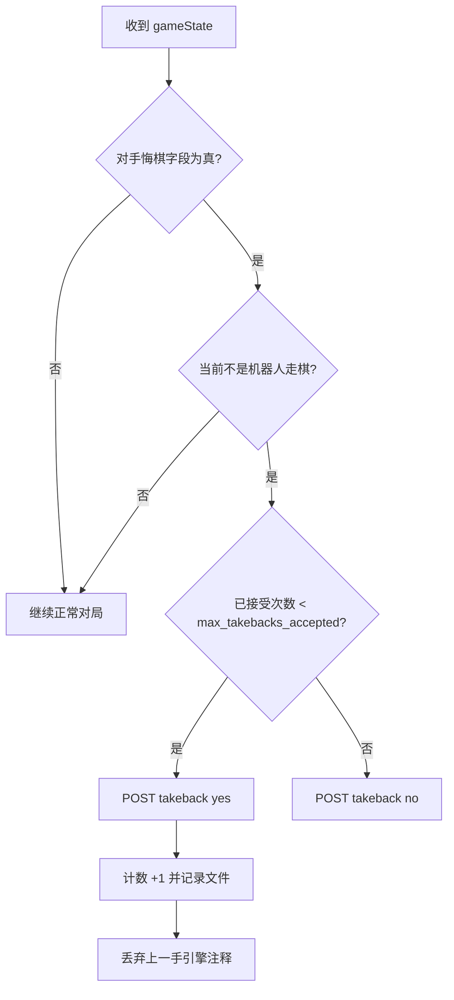

本页位于“基础配置”路径中的 **[认输、求和、悔棋与聊天行为配置](11-ren-shu-qiu-he-hui-qi-yu-liao-tian-xing-wei-pei-zhi)**，聚焦四类对局交互：基于引擎评估的认输、基于评估或残局库 WDL 的求和/接受和棋、对手悔棋请求的接受上限，以及开局/终局问候与聊天命令响应；它不讨论挑战过滤、开局库、时间管理或部署细节。Sources: [config.yml.default](config.yml.default#L59-L68), [config.yml.default](config.yml.default#L154-L154), [config.yml.default](config.yml.default#L214-L222), [lib/conversation.py](lib/conversation.py#L54-L99)

## 架构假设与验证结论

从第一原则看，这组配置不会直接改变引擎棋力，而是控制 **对局状态事件 → 决策封装 → Lichess API 动作** 之间的交互边界：认输和求和依赖搜索结果中的分数序列，悔棋依赖游戏流中的 `wtakeback`/`btakeback` 状态字段，聊天依赖 `chatLine` 事件与 `greeting` 文本模板。代码验证表明，`draw_or_resign` 位于 `engine` 配置下，悔棋上限位于顶层 `max_takebacks_accepted`，问候语位于顶层 `greeting`，三者在运行时分别由 `engine_wrapper.py`、`lichess_bot.py` 与 `conversation.py` 消费。Sources: [config.yml.default](config.yml.default#L59-L68), [config.yml.default](config.yml.default#L154-L154), [config.yml.default](config.yml.default#L214-L222), [lib/engine_wrapper.py](lib/engine_wrapper.py#L263-L292), [lib/lichess_bot.py](lib/lichess_bot.py#L837-L897), [lib/conversation.py](lib/conversation.py#L56-L99)



上图中的关键点是：求和不是独立 API 调用，而是在走棋请求中携带 `offeringDraw` 参数；认输是独立 `resign` API；悔棋是对 `takeback/{yes|no}` 端点的响应；聊天消息则发送到 `player` 或 `spectator` 房间。Sources: [lib/lichess.py](lib/lichess.py#L368-L386), [lib/lichess.py](lib/lichess.py#L390-L404), [lib/lichess.py](lib/lichess.py#L447-L449)

## 配置位置速览

这些字段分布在配置文件的三个位置：`engine.draw_or_resign` 管认输与求和，`max_takebacks_accepted` 管每局允许接受对手悔棋的次数，`greeting` 管玩家聊天室与观众聊天室的开局/结束消息。默认配置示例中，认输默认关闭，求和默认开启，对手悔棋默认接受 0 次，四类问候语均有示例文本。Sources: [config.yml.default](config.yml.default#L59-L68), [config.yml.default](config.yml.default#L150-L155), [config.yml.default](config.yml.default#L214-L222)

```text
config.yml
├── engine
│   └── draw_or_resign
│       ├── resign_enabled
│       ├── resign_score
│       ├── resign_for_egtb_minus_two
│       ├── resign_moves
│       ├── offer_draw_enabled
│       ├── offer_draw_score
│       ├── offer_draw_for_egtb_zero
│       ├── offer_draw_moves
│       └── offer_draw_pieces
├── max_takebacks_accepted
└── greeting
    ├── hello
    ├── goodbye
    ├── hello_spectators
    └── goodbye_spectators
```

| 配置区域 | 作用对象 | 触发时机 | 运行时处理模块 |
|---|---|---|---|
| `engine.draw_or_resign` | 认输、求和/接受和棋 | 引擎搜索后或在线残局库返回 WDL 后 | `lib/engine_wrapper.py` |
| `max_takebacks_accepted` | 对手悔棋请求 | 游戏状态更新中出现对手悔棋字段时 | `lib/lichess_bot.py`、`lib/lichess.py` |
| `greeting` | 玩家/观众聊天室消息 | 首次走棋前后与对局结束时 | `lib/lichess_bot.py`、`lib/conversation.py` |
| 聊天命令 | `!help`、`!wait`、`!name`、`!eval`、`!queue`、`!rating` | 收到 `chatLine` 且文本以 `!` 开头 | `lib/conversation.py` |

Sources: [lib/engine_wrapper.py](lib/engine_wrapper.py#L263-L292), [lib/lichess_bot.py](lib/lichess_bot.py#L862-L897), [lib/lichess_bot.py](lib/lichess_bot.py#L964-L976), [lib/conversation.py](lib/conversation.py#L56-L99)

## 认输配置：连续劣势才认输

`resign_enabled` 决定机器人是否允许根据评估认输；`resign_score` 是厘兵值阈值，默认 `-1000` 表示当己方评估小于等于 -1000 cp 时才视为达到认输条件；`resign_moves` 要求最近若干次记录的搜索分数全部满足该阈值，默认 3 次，从而避免一次异常搜索直接触发认输。实际实现中，搜索完成后会记录最终 `score`，再检查最近 `resign_moves` 个分数是否全部小于等于 `resign_score`，满足时将 `PlayResult.resigned` 设为 `True`。Sources: [config.yml.default](config.yml.default#L59-L63), [lib/engine_wrapper.py](lib/engine_wrapper.py#L282-L292), [lib/engine_wrapper.py](lib/engine_wrapper.py#L401-L405)

```yaml
engine:
  draw_or_resign:
    resign_enabled: true
    resign_score: -1000
    resign_moves: 3
    resign_for_egtb_minus_two: true
```

当 `PlayResult.resigned` 为真且棋盘已有至少两步棋时，机器人调用 Lichess 的 `resign` API；如果机器人生成非法着法，代码也会根据当前对局是否仍可中止选择 `abort` 或 `resign` 结束游戏，但这属于错误保护路径，不是 `draw_or_resign` 的正常评估认输路径。Sources: [lib/engine_wrapper.py](lib/engine_wrapper.py#L230-L249), [lib/lichess.py](lib/lichess.py#L447-L449)

| 字段 | 类型 | 默认示例 | 判定含义 |
|---|---:|---:|---|
| `resign_enabled` | boolean | `false` | 是否允许自动认输 |
| `resign_score` | integer，cp | `-1000` | 最近评估必须小于等于该值 |
| `resign_moves` | integer | `3` | 连续多少次评估满足阈值才认输 |
| `resign_for_egtb_minus_two` | boolean | `true` | 在线残局库 WDL 为 `-2` 时是否认输 |

Sources: [config.yml.default](config.yml.default#L60-L63), [lib/config.py](lib/config.py#L198-L206), [lib/engine_wrapper.py](lib/engine_wrapper.py#L282-L292)

## 求和配置：接近均势且子力减少后再提出

`offer_draw_enabled` 决定机器人是否允许根据评估求和或接受和棋；`offer_draw_score` 是“接近均势”的厘兵范围，默认 `0` 表示只有绝对评估为 0 时才满足；`offer_draw_moves` 要求最近若干次评估都处于该范围；`offer_draw_pieces` 进一步要求棋盘上总子力数小于等于该值，默认示例为 10。实现中先统计 `board.occupied` 的子力数量，再检查最近 `offer_draw_moves` 个分数的绝对值是否全部小于等于 `offer_draw_score`，满足时将 `PlayResult.draw_offered` 设为 `True`。Sources: [config.yml.default](config.yml.default#L64-L68), [lib/engine_wrapper.py](lib/engine_wrapper.py#L268-L281)

```yaml
engine:
  draw_or_resign:
    offer_draw_enabled: true
    offer_draw_score: 10
    offer_draw_moves: 8
    offer_draw_pieces: 10
    offer_draw_for_egtb_zero: true
```

求和动作通过走棋请求发送：`make_move()` 把 `PlayResult.draw_offered` 转换成 `offeringDraw=true|false` 参数提交给 Lichess；同时，搜索函数会把当前是否收到对手求和作为 `draw_offered` 参数传给引擎搜索。Sources: [lib/lichess.py](lib/lichess.py#L368-L376), [lib/engine_wrapper.py](lib/engine_wrapper.py#L217-L229), [lib/engine_wrapper.py](lib/engine_wrapper.py#L340-L351)

| 字段 | 类型 | 默认示例 | 判定含义 |
|---|---:|---:|---|
| `offer_draw_enabled` | boolean | `true` | 是否允许自动求和/接受和棋 |
| `offer_draw_score` | integer，cp | `0` | 最近评估绝对值必须小于等于该值 |
| `offer_draw_moves` | integer | `10` | 连续多少次评估满足均势阈值 |
| `offer_draw_pieces` | integer | `10` | 棋盘总子力数必须小于等于该值 |
| `offer_draw_for_egtb_zero` | boolean | `true` | 在线残局库 WDL 为 `0` 时是否求和/接受和棋 |

Sources: [config.yml.default](config.yml.default#L64-L68), [lib/config.py](lib/config.py#L198-L206), [lib/engine_wrapper.py](lib/engine_wrapper.py#L268-L281)

## 在线残局库 WDL 对认输与求和的影响

当在线残局库返回 WDL 时，`wdl == 0` 可在 `offer_draw_enabled` 与 `offer_draw_for_egtb_zero` 同时为真时触发求和标记；`wdl == -2` 可在 `resign_enabled` 与 `resign_for_egtb_minus_two` 同时为真时触发认输标记。代码中对 Lichess 与 ChessDB 在线残局来源都存在这种处理逻辑，最终返回带有 `draw_offered` 或 `resigned` 标志的 `PlayResult`。Sources: [lib/engine_wrapper.py](lib/engine_wrapper.py#L981-L1005), [lib/engine_wrapper.py](lib/engine_wrapper.py#L1213-L1236)

| WDL 返回值 | 相关配置 | 结果 |
|---:|---|---|
| `0` | `offer_draw_enabled: true` 且 `offer_draw_for_egtb_zero: true` | 标记 `draw_offered` |
| `-2` | `resign_enabled: true` 且 `resign_for_egtb_minus_two: true` | 标记 `resigned` |
| 其他值 | 无匹配条件 | 不因该 WDL 自动求和或认输 |

Sources: [lib/engine_wrapper.py](lib/engine_wrapper.py#L990-L1005), [lib/engine_wrapper.py](lib/engine_wrapper.py#L1225-L1236)

## 悔棋配置：只响应对手请求，不主动请求

`max_takebacks_accepted` 是顶层配置，表示单局中允许接受对手悔棋的次数，默认示例为 `0`，即不接受。运行时，机器人读取当前局已接受次数，并在每次 `gameState` 更新中查看对手颜色对应的悔棋字段：机器人执白时检查 `btakeback`，机器人执黑时检查 `wtakeback`。Sources: [config.yml.default](config.yml.default#L150-L155), [lib/lichess_bot.py](lib/lichess_bot.py#L837-L838), [lib/lichess_bot.py](lib/lichess_bot.py#L864-L868)

```yaml
max_takebacks_accepted: 1
```

只有在出现对手悔棋请求、当前不是机器人该走棋、且 `accepted_count < max_takebacks_accepted` 时，机器人向 Lichess 发送 `takeback yes`；否则发送 `takeback no`。接受后，代码会增加已接受次数、写入本局计数文件，并丢弃上一手引擎注释，避免注释与棋盘历史不一致。Sources: [lib/lichess_bot.py](lib/lichess_bot.py#L891-L897), [lib/lichess.py](lib/lichess.py#L378-L386)

悔棋计数会持久化到自动日志目录下的 `takeback-count-<game_id>.txt` 文件；游戏结束后会删除对应记录，启动时也会清理不再活跃对局的悔棋记录。Sources: [lib/lichess_bot.py](lib/lichess_bot.py#L925-L961)



悔棋功能还依赖 Lichess 账号偏好允许对手请求悔棋：官方配置文档指出，需要在机器人账号的网页偏好中把 `Takebacks (with opponent approval)` 设为 `Always` 或 `In casual games only`；同时，机器人主动请求悔棋不受支持。Sources: [wiki/Configure-lichess-bot.md](wiki/Configure-lichess-bot.md#L239-L244)

## 问候语配置：玩家房间与观众房间分离

`greeting` 支持四个字段：`hello` 发送给对手房间，`goodbye` 发送给对手房间，`hello_spectators` 发送给观众房间，`goodbye_spectators` 发送给观众房间。默认文本中，开局消息还提示可以输入 `!help` 查看机器人可响应的命令。Sources: [config.yml.default](config.yml.default#L214-L222), [wiki/Configure-lichess-bot.md](wiki/Configure-lichess-bot.md#L221-L232)

```yaml
greeting:
  hello: "Hi, {opponent}! I'm {me}. Good luck!"
  goodbye: "Good game!"
  hello_spectators: "Hi! I'm {me}. Type !help for a list of commands I can respond to."
  goodbye_spectators: "Thanks for watching!"
```

`{me}` 会被替换为机器人账号名，`{opponent}` 会被替换为对手账号名；代码使用带默认空字符串的 `keyword_map` 执行格式化，因此未识别的占位符会得到空字符串。`greeting` 字段也可以是字符串列表，运行时会随机选择其中一个；空列表会产生空消息。Sources: [config.yml.default](config.yml.default#L215-L219), [lib/lichess_bot.py](lib/lichess_bot.py#L840-L844), [lib/lichess_bot.py](lib/lichess_bot.py#L964-L969), [test_bot/test_greetings.py](test_bot/test_greetings.py#L8-L29)

问候语的发送时机由对局状态控制：当轮到机器人走棋且棋盘已走步数小于 2 时，发送 `hello` 与 `hello_spectators`；当检测到游戏结束时，发送 `goodbye` 与 `goodbye_spectators`。`Conversation.send_message()` 会忽略空字符串，因此把某个字段配置为空即可关闭对应消息。Sources: [lib/lichess_bot.py](lib/lichess_bot.py#L869-L890), [lib/lichess_bot.py](lib/lichess_bot.py#L972-L976), [lib/conversation.py](lib/conversation.py#L158-L162)

## 聊天命令行为

机器人会记录并打印收到的聊天行；如果消息第一个字符是 `!`，则把后续文本转为小写并进入命令处理。当前命令前缀固定为 `!`，支持 `!commands`/`!help`、`!wait`、`!name`、`!eval`、`!queue` 与 `!rating` 相关命令。Sources: [lib/conversation.py](lib/conversation.py#L54-L80), [lib/conversation.py](lib/conversation.py#L81-L99)

| 命令 | 可见行为 | 限制 |
|---|---|---|
| `!help` / `!commands` | 回复支持的命令列表 | 无额外限制 |
| `!wait` | 在可中止阶段让机器人等待 60 秒 | 仅当 `game.is_abortable()` 为真 |
| `!name` | 回复机器人账号、引擎名与 lichess-bot 版本 | 无额外限制 |
| `!eval` 或以 `!eval` 开头 | 返回引擎统计信息 | 仅机器人自己或观众房间可看；对手房间会被拒绝 |
| `!queue` | 返回当前挑战队列 | 队列为空时回复无排队挑战 |
| `!rating` / `!rating <elo\|full>` | 查询或调整运行时 UCI_Elo | 需要启用 rating control 且发送者是管理员 |

Sources: [lib/conversation.py](lib/conversation.py#L77-L99), [lib/conversation.py](lib/conversation.py#L101-L146)

聊天回复通过 `li.chat(game_id, room, reply)` 发送到原消息所在房间；Lichess 封装中定义最大聊天长度为 140 字符，超过时会记录警告，但代码仍构造聊天请求并调用 API。Sources: [lib/conversation.py](lib/conversation.py#L148-L156), [lib/lichess.py](lib/lichess.py#L50-L50), [lib/lichess.py](lib/lichess.py#L390-L404)

## 推荐配置模板

如果你希望机器人行为保守，可以关闭自动认输、只在非常明确的均势残局求和、不接受悔棋，并保留简短问候语。这种配置最接近默认示例：`resign_enabled: false`，`offer_draw_enabled: true`，`offer_draw_score: 0`，`offer_draw_pieces: 10`，`max_takebacks_accepted: 0`。Sources: [config.yml.default](config.yml.default#L59-L68), [config.yml.default](config.yml.default#L154-L154), [config.yml.default](config.yml.default#L214-L222)

```yaml
engine:
  draw_or_resign:
    resign_enabled: false
    resign_score: -1000
    resign_for_egtb_minus_two: true
    resign_moves: 3
    offer_draw_enabled: true
    offer_draw_score: 0
    offer_draw_for_egtb_zero: true
    offer_draw_moves: 10
    offer_draw_pieces: 10

max_takebacks_accepted: 0

greeting:
  hello: "Hi! I'm {me}. Good luck! Type !help for a list of commands I can respond to."
  goodbye: "Good game!"
  hello_spectators: "Hi! I'm {me}. Type !help for a list of commands I can respond to."
  goodbye_spectators: "Thanks for watching!"
```

如果你希望机器人在明显败势中自动认输，可以只打开 `resign_enabled`，并保持 `resign_moves` 大于 1；这与实现中的“连续分数窗口”匹配，能避免单次异常评估直接认输。Sources: [lib/engine_wrapper.py](lib/engine_wrapper.py#L282-L292), [config.yml.default](config.yml.default#L60-L63)

```yaml
engine:
  draw_or_resign:
    resign_enabled: true
    resign_score: -1200
    resign_moves: 3
    resign_for_egtb_minus_two: true
```

## 修改前后对比

| 场景 | 修改前 | 修改后 | 效果 |
|---|---|---|---|
| 不自动认输 | `resign_enabled: false` | `resign_enabled: true` | 满足连续败势阈值后调用认输 |
| 只在完全均势求和 | `offer_draw_score: 0` | `offer_draw_score: 20` | 允许 ±20 cp 内的连续评估触发求和 |
| 不接受悔棋 | `max_takebacks_accepted: 0` | `max_takebacks_accepted: 1` | 每局最多接受一次对手悔棋 |
| 固定问候语 | `hello: "Hi!"` | `hello: ["Hi, {opponent}!", "Good luck, {opponent}!"]` | 每局随机选择一条开局消息 |

Sources: [config.yml.default](config.yml.default#L59-L68), [config.yml.default](config.yml.default#L154-L154), [lib/lichess_bot.py](lib/lichess_bot.py#L964-L969), [test_bot/test_greetings.py](test_bot/test_greetings.py#L16-L29)

## 排错表

| 现象 | 可验证原因 | 处理方式 |
|---|---|---|
| 机器人从不认输 | `resign_enabled` 为 `false`，或最近 `resign_moves` 个分数并非全部小于等于 `resign_score` | 打开 `resign_enabled`，并检查阈值是否过低 |
| 机器人很少求和 | 子力数大于 `offer_draw_pieces`，或最近评估绝对值没有连续落入 `offer_draw_score` | 增大 `offer_draw_score` 或 `offer_draw_pieces`，但保持符合你的策略 |
| 对手悔棋没有被接受 | `max_takebacks_accepted` 为 0，或本局已达到上限，或 Lichess 账号偏好不允许悔棋请求 | 增大上限，并在网页偏好中允许 takebacks |
| 问候语没有发送 | 对应 `greeting` 字段为空，或不是对局早期首次走棋时机 | 填入非空字符串，确认对局开始时机器人实际进入走棋流程 |
| `!eval` 对手看不到 | 对手房间请求会被明确拒绝 | 在观众房间或机器人自己发送该命令 |

Sources: [lib/engine_wrapper.py](lib/engine_wrapper.py#L268-L292), [lib/lichess_bot.py](lib/lichess_bot.py#L891-L897), [wiki/Configure-lichess-bot.md](wiki/Configure-lichess-bot.md#L239-L244), [lib/lichess_bot.py](lib/lichess_bot.py#L972-L976), [lib/conversation.py](lib/conversation.py#L87-L91)

## 下一步阅读

完成本页后，建议继续阅读 [启用主动配对并挑战其他机器人](12-qi-yong-zhu-dong-pei-dui-bing-tiao-zhan-qi-ta-ji-qi-ren)，因为聊天与对局礼仪配置完成后，下一类常见基础能力是主动发起挑战；如果你想理解这些配置在运行时如何与平台事件结合，可转到深入解析中的 [聊天、问候语、悔棋、求和与认输交互](29-liao-tian-wen-hou-yu-hui-qi-qiu-he-yu-ren-shu-jiao-hu)。Sources: [lib/lichess_bot.py](lib/lichess_bot.py#L862-L897), [lib/conversation.py](lib/conversation.py#L56-L99), [lib/engine_wrapper.py](lib/engine_wrapper.py#L263-L292)