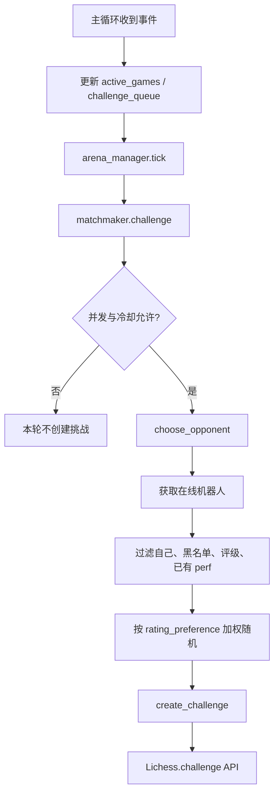
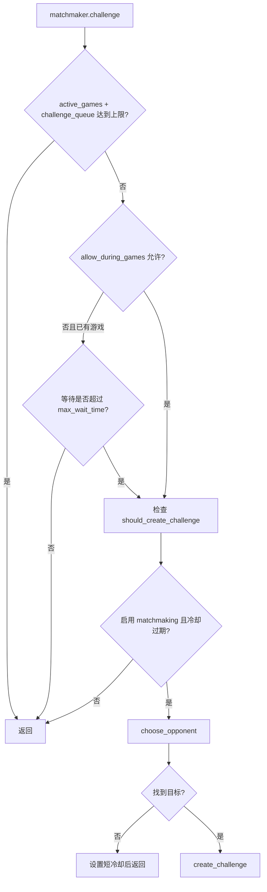

本页聚焦 **matchmaking 主动配对**：让 lichess-bot 在空闲或满足并发条件时，主动从在线机器人列表中选择目标并发送挑战。它不覆盖“接受别人挑战”的规则细节，也不讨论竞技场配对；如需回顾入站挑战过滤，请先读 [挑战接收规则：变体、时限、评级与并发](9-tiao-zhan-jie-shou-gui-ze-bian-ti-shi-xian-ping-ji-yu-bing-fa)，如需赛事配对请继续读 [参加竞技场锦标赛与团队赛事](13-can-jia-jing-ji-chang-jin-biao-sai-yu-tuan-dui-sai-shi)。Sources: [config.yml.default](config.yml.default#L262-L288), [lib/lichess_bot.py](lib/lichess_bot.py#L516-L518)

## 架构假设与验证结论

主动配对的核心模式是：主循环在每个控制流事件处理后调用 `matchmaker.challenge(...)`，由 `Matchmaking` 根据配置、当前对局数量、挑战队列、冷却计时器、在线机器人列表和评级过滤决定是否创建挑战；真正的 Lichess API 调用被封装为 `Lichess.challenge(username, payload)`。Sources: [lib/lichess_bot.py](lib/lichess_bot.py#L456-L523), [lib/matchmaking.py](lib/matchmaking.py#L274-L302), [lib/lichess.py](lib/lichess.py#L521-L528)



上图中的关键边界是 **主循环只触发决策，Matchmaking 负责策略，Lichess 负责 HTTP API**。这使配置修改集中在 `matchmaking:` 段，运行时行为则由 `lib/matchmaking.py` 的计时器、过滤器和 API 响应处理共同控制。Sources: [lib/lichess_bot.py](lib/lichess_bot.py#L438-L441), [lib/lichess_bot.py](lib/lichess_bot.py#L516-L518), [lib/matchmaking.py](lib/matchmaking.py#L28-L67)

## 相关项目结构

主动配对相关文件很集中：默认配置在 `config.yml.default` 的 `matchmaking:` 段；运行时策略在 `lib/matchmaking.py`；主循环集成点在 `lib/lichess_bot.py`；挑战与取消 API 在 `lib/lichess.py`；配置默认值、校验和黑名单合并在 `lib/config.py`。Sources: [config.yml.default](config.yml.default#L262-L316), [lib/matchmaking.py](lib/matchmaking.py#L28-L67), [lib/config.py](lib/config.py#L283-L327)

```text
lichess-bot/
├── config.yml.default        # matchmaking 默认配置与示例 overrides
├── lib/
│   ├── lichess_bot.py        # 主循环调用 matchmaker.challenge(...)
│   ├── matchmaking.py        # 主动挑战选择、冷却、状态持久化
│   ├── lichess.py            # challenge / cancel API 封装
│   └── config.py             # matchmaking 默认值与配置校验
└── runtime_state/
    └── matchmaking_state.json # 默认 state_file，运行后用于保存冷却状态
```

## 第一步：开启 matchmaking

默认配置中 `matchmaking.allow_matchmaking` 是 `false`，因此机器人不会主动挑战其他机器人；要启用主动配对，需要在你的实际配置文件中把它改为 `true`，并确保至少配置了实时棋的 `challenge_initial_time` 与 `challenge_increment`，或配置了通信棋的 `challenge_days`。Sources: [config.yml.default](config.yml.default#L262-L275), [lib/config.py](lib/config.py#L461-L469)

| 配置状态 | YAML 片段 | 运行结果 |
|---|---|---|
| 启用前 | `allow_matchmaking: false` | 不主动创建挑战 |
| 启用后 | `allow_matchmaking: true` | 主循环允许 `Matchmaking` 在条件满足时创建挑战 |

Sources: [config.yml.default](config.yml.default#L262-L266), [lib/matchmaking.py](lib/matchmaking.py#L69-L83)

建议从最小可控配置开始，只启用标准棋、少量时限和非激进的挑战频率；`challenge_variant: "random"` 会从 `challenge.variants` 中选择，但 `Matchmaking` 初始化时会排除 `fromPosition`。Sources: [config.yml.default](config.yml.default#L176-L187), [config.yml.default](config.yml.default#L265-L272), [lib/matchmaking.py](lib/matchmaking.py#L31-L39)

```yaml
matchmaking:
  allow_matchmaking: true
  allow_during_games: false
  challenge_variant: "random"
  challenge_timeout: 30
  challenge_initial_time:
    - 60
    - 180
  challenge_increment:
    - 1
    - 2
  opponent_rating_difference: 300
  rating_preference: "none"
  challenge_mode: "random"
  challenge_filter: none
```

## 第二步：理解一次主动挑战的决策流程

`Matchmaking.challenge(...)` 会先根据 `challenge.concurrency`、当前活跃对局数、挑战队列长度、是否允许对局中继续发起挑战、最近挑战计时器和冷却计时器决定是否返回；只有这些条件通过后，才会调用 `choose_opponent()` 选择目标。Sources: [lib/lichess_bot.py](lib/lichess_bot.py#L421-L439), [lib/matchmaking.py](lib/matchmaking.py#L274-L287)



`should_create_challenge()` 要求 `allow_matchmaking` 为真，同时赛后等待、速率限制等待、无候选等待均已过期；如果已有未处理的外发挑战且创建后已过期，它会先取消该挑战并清理挑战状态。Sources: [lib/matchmaking.py](lib/matchmaking.py#L69-L83), [lib/matchmaking.py](lib/matchmaking.py#L303-L317)

## 第三步：配置时间控制

实时棋挑战由 `challenge_initial_time` 和 `challenge_increment` 共同构成，代码会从两个列表中分别随机取一个值，并通过 `clock.limit` 与 `clock.increment` 发送给 Lichess；通信棋挑战由 `challenge_days` 构成，并通过 `days` 参数发送。Sources: [config.yml.default](config.yml.default#L267-L275), [lib/matchmaking.py](lib/matchmaking.py#L201-L212), [lib/matchmaking.py](lib/matchmaking.py#L85-L99)

| 目标 | 关键字段 | API 参数生成方式 |
|---|---|---|
| 实时棋 | `challenge_initial_time` + `challenge_increment` | `clock.limit` + `clock.increment` |
| 通信棋 | `challenge_days` | `days` |
| 配置错误 | 三者都没有有效值 | 配置校验会阻止启用后的无时限主动挑战 |

Sources: [lib/matchmaking.py](lib/matchmaking.py#L88-L99), [lib/config.py](lib/config.py#L461-L469)

`game_category()` 会用 `base_time + increment * 40` 对标准棋实时对局分类：小于 179 秒为 bullet，小于 479 秒为 blitz，小于 1499 秒为 rapid，否则为 classical；非标准变体直接按变体名作为类别，通信棋返回 `correspondence`。Sources: [lib/matchmaking.py](lib/matchmaking.py#L503-L524)

## 第四步：限制挑战目标

主动配对只会从在线机器人中选目标，并过滤掉自己、黑名单中的用户、没有对应 `perf` 对局记录的用户，以及不在评级区间内的用户；随后会按 `rating_preference` 计算权重并随机选择。Sources: [lib/matchmaking.py](lib/matchmaking.py#L223-L267), [lib/matchmaking.py](lib/matchmaking.py#L169-L187)

| 字段 | 作用 | 代码行为 |
|---|---|---|
| `opponent_min_rating` | 目标最低评级 | 默认填充为 600 |
| `opponent_max_rating` | 目标最高评级 | 默认填充为 4000 |
| `opponent_rating_difference` | 相对自己评级的最大差值 | 若机器人自身对应类别有评级，则收窄 min/max |
| `rating_preference: none` | 不偏向高低分 | 所有候选权重为 1 |
| `rating_preference: high` | 更偏向高分机器人 | 高评级候选权重更高 |
| `rating_preference: low` | 更偏向低分机器人 | 低评级候选权重更高 |

Sources: [config.yml.default](config.yml.default#L276-L280), [lib/config.py](lib/config.py#L299-L303), [lib/matchmaking.py](lib/matchmaking.py#L214-L221), [lib/matchmaking.py](lib/matchmaking.py#L169-L187)

如果 `challenge_variant` 或 `challenge_mode` 设置为 `"random"`，`Matchmaking` 会在可选值中随机取值；`challenge_variant` 的随机来源是 `challenge.variants`，`challenge_mode` 的随机来源是 `casual` 与 `rated`。Sources: [config.yml.default](config.yml.default#L265-L281), [lib/matchmaking.py](lib/matchmaking.py#L196-L199), [lib/matchmaking.py](lib/matchmaking.py#L269-L272)

## 第五步：设置黑名单与在线黑名单

`matchmaking.block_list` 用于声明永不主动挑战的机器人；`matchmaking.online_block_list` 可从 URL 获取文本名单；`include_challenge_block_list: true` 时，`challenge.block_list` 会被合并进 matchmaking 黑名单。Sources: [config.yml.default](config.yml.default#L283-L288), [lib/config.py](lib/config.py#L320-L327), [lib/matchmaking.py](lib/matchmaking.py#L64-L67)

```yaml
matchmaking:
  block_list:
    - SomeBot
    - AnotherBot
  online_block_list:
    - example.com/blocklist
  include_challenge_block_list: false
```

黑名单在代码中表现为长期冷却：初始化时会对 `matchmaking.block_list` 中的名字调用 `add_to_block_list()`，而该方法会添加一个 10 年计时器；在线黑名单则通过 `OnlineBlocklist` 在选择候选前刷新。Sources: [lib/matchmaking.py](lib/matchmaking.py#L64-L67), [lib/matchmaking.py](lib/matchmaking.py#L230-L236), [lib/matchmaking.py](lib/matchmaking.py#L330-L337)

## 第六步：选择 challenge_filter 策略

`challenge_filter` 控制对方拒绝挑战后的冷却粒度：`none` 表示不因拒绝而过滤；`coarse` 表示对该机器人整体冷却；`fine` 表示按变体、速度或模式等维度冷却。Sources: [config.yml.default](config.yml.default#L281-L282), [lib/matchmaking.py](lib/matchmaking.py#L236-L247), [lib/matchmaking.py](lib/matchmaking.py#L457-L500)

| `challenge_filter` | 拒绝后的效果 | 适用场景 |
|---|---|---|
| `none` | 不记录拒绝过滤 | 想保持最简单行为 |
| `coarse` | 对该机器人整体冷却 | 对方不想被继续挑战时减少重复打扰 |
| `fine` | 只对相关方面冷却，如速度、变体、rated/casual | 想保留对同一机器人发起其他类型挑战的机会 |

Sources: [lib/config.py](lib/config.py#L471-L475), [lib/matchmaking.py](lib/matchmaking.py#L472-L499)

如果对方拒绝原因是 `nobot`，代码会把对手加入长期黑名单；如果拒绝原因是 `rated` 或 `casual`，且你的 `challenge_mode` 不是 `"random"`，代码还会对该机器人整体冷却 6 小时。Sources: [lib/matchmaking.py](lib/matchmaking.py#L472-L499)

## 第七步：使用 overrides 创建多套主动挑战画像

`overrides` 允许在创建挑战时随机选择默认 matchmaking 配置或某个覆盖配置；覆盖项只改变列出的字段，其余字段沿用默认 matchmaking 配置。Sources: [config.yml.default](config.yml.default#L290-L316), [lib/matchmaking.py](lib/matchmaking.py#L189-L199)

```yaml
matchmaking:
  allow_matchmaking: true
  challenge_variant: "random"
  challenge_initial_time:
    - 60
    - 180
  challenge_increment:
    - 1
    - 2
  challenge_mode: "random"

  overrides:
    easy_chess960:
      challenge_variant: "chess960"
      opponent_min_rating: 400
      opponent_max_rating: 1200
      opponent_rating_difference:
      challenge_mode: casual
```

不能通过 `overrides` 覆盖的字段包括 `allow_matchmaking`、`challenge_timeout`、`challenge_filter` 和 `block_list`；默认配置文件在注释中明确标出这些限制。Sources: [config.yml.default](config.yml.default#L290-L316)

## 运行时冷却与速率限制

主动配对内置多个计时器：外发挑战创建后约 25 秒用于处理过期挑战，挑战之间至少等待 60 秒，普通无候选情况等待 15 分钟，拒绝后的默认冷却是 6 小时，未应答的外发挑战目标会冷却 12 小时。Sources: [lib/matchmaking.py](lib/matchmaking.py#L20-L25), [lib/matchmaking.py](lib/matchmaking.py#L37-L46), [lib/matchmaking.py](lib/matchmaking.py#L338-L358), [lib/matchmaking.py](lib/matchmaking.py#L427-L437)

配置校验还会在启用 matchmaking 时检查评级上下限、负数评级差，并提示机器人每天对其他机器人最多允许 100 局；该提示基于 `challenge_timeout` 估算是否可能过快耗尽额度。Sources: [lib/config.py](lib/config.py#L411-L424)

当 Lichess 返回结构化速率限制时，`Matchmaking` 会设置对应的 `rate_limit_timer`；当返回旧式 “too many requests” 文本时，它会使用指数退避，从 30 分钟开始，最大到 1440 分钟，并将目标当天冷却。Sources: [lib/matchmaking.py](lib/matchmaking.py#L122-L150)

## 状态持久化

默认配置将 `state_file` 设置为 `runtime_state/matchmaking_state.json`，用于跨进程重启保存拒绝冷却和挑战速率限制冷却；`save_state()` 会写入冷却列表、普通速率限制失败次数和速率限制过期时间，`load_state()` 会在初始化时恢复仍未过期的计时器。Sources: [config.yml.default](config.yml.default#L281-L282), [lib/matchmaking.py](lib/matchmaking.py#L60-L62), [lib/matchmaking.py](lib/matchmaking.py#L382-L425)

如果你不想保留历史冷却，可以清空或更改 `state_file`；如果保留默认值，目录会在保存状态时自动创建。Sources: [lib/matchmaking.py](lib/matchmaking.py#L396-L400)

## 推荐配置模板

下面的模板适合中等强度、低扰动的主动配对：不在已有对局中继续发挑战，使用 30 分钟空闲间隔，限制评级差，使用 `fine` 过滤减少重复发送对方刚刚拒绝过的同类挑战。Sources: [config.yml.default](config.yml.default#L262-L288), [lib/matchmaking.py](lib/matchmaking.py#L214-L247)

```yaml
matchmaking:
  allow_matchmaking: true
  allow_during_games: false
  challenge_variant: "random"
  challenge_timeout: 30
  challenge_initial_time:
    - 60
    - 180
  challenge_increment:
    - 1
    - 2
  opponent_min_rating: 600
  opponent_max_rating: 4000
  opponent_rating_difference: 300
  rating_preference: "none"
  challenge_mode: "random"
  challenge_filter: fine
  state_file: "runtime_state/matchmaking_state.json"
  block_list: []
  online_block_list: []
  include_challenge_block_list: false
```

## Before / After 配置对照

| 修改点 | Before | After |
|---|---|---|
| 开启主动配对 | `allow_matchmaking: false` | `allow_matchmaking: true` |
| 控制对局中是否继续挑战 | `allow_during_games: false` | 保持 `false`，除非你明确希望长局期间继续发起挑战 |
| 设置目标时限 | 默认 `60/180 + 1/2` | 按机器人算力和目标节奏调整列表 |
| 控制目标范围 | 仅默认评级上下限 | 增加 `opponent_rating_difference: 300` |
| 处理拒绝 | `challenge_filter: none` | 改为 `fine` 或 `coarse` |

Sources: [config.yml.default](config.yml.default#L262-L288), [lib/matchmaking.py](lib/matchmaking.py#L282-L287), [lib/matchmaking.py](lib/matchmaking.py#L457-L500)

## 故障排查

| 现象 | 可验证原因 | 处理方式 |
|---|---|---|
| 没有主动挑战 | `allow_matchmaking` 未启用，或时限配置无有效值 | 设置 `allow_matchmaking: true`，并配置实时棋或通信棋时限 |
| 日志显示没有合适机器人 | 在线机器人经过评级、黑名单、perf 和过滤器后为空 | 放宽评级范围、减少黑名单、调整 `challenge_filter` |
| 挑战很久才再次出现 | 赛后等待、最小挑战间隔、无候选冷却或速率限制冷却未过期 | 查看 “Next challenge will be created after ...” 日志 |
| 某个机器人不再被挑战 | 被加入 `block_list`、在线黑名单、拒绝冷却或未应答冷却 | 检查配置黑名单与 `state_file` |
| 配置启动时报错 | 启用 matchmaking 但没有有效 `challenge_initial_time` + `challenge_increment` 或 `challenge_days` | 补齐时间控制列表 |

Sources: [lib/config.py](lib/config.py#L461-L479), [lib/matchmaking.py](lib/matchmaking.py#L248-L267), [lib/matchmaking.py](lib/matchmaking.py#L319-L328), [lib/matchmaking.py](lib/matchmaking.py#L427-L437)

## 下一步阅读

完成主动配对后，如果你想让机器人进入团队或竞技场环境，继续阅读 [参加竞技场锦标赛与团队赛事](13-can-jia-jing-ji-chang-jin-biao-sai-yu-tuan-dui-sai-shi)；如果你想理解主循环为什么能同时处理事件流、挑战和对局，阅读 [主循环、事件流与多进程任务协作](17-zhu-xun-huan-shi-jian-liu-yu-duo-jin-cheng-ren-wu-xie-zuo)；如果你遇到速率限制或挑战冷却行为，阅读 [速率限制识别、退避策略与挑战冷却](30-su-lu-xian-zhi-shi-bie-tui-bi-ce-lue-yu-tiao-zhan-leng-que)。Sources: [lib/lichess_bot.py](lib/lichess_bot.py#L456-L523), [lib/matchmaking.py](lib/matchmaking.py#L122-L150), [lib/matchmaking.py](lib/matchmaking.py#L382-L425)