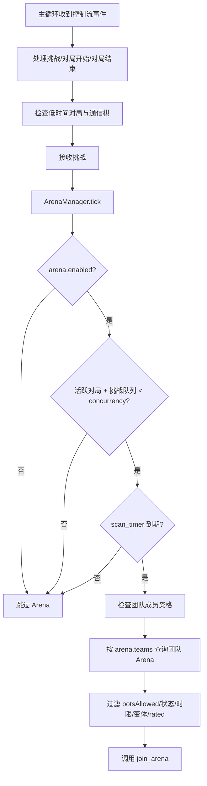

本页聚焦 lichess-bot 的 **Arena 集成**：机器人如何按配置扫描指定团队的 Arena 锦标赛、在容量允许时自动加入、在团队战中携带 team 参数，并通过 `pairMeAsap` 请求尽快配对；它不覆盖主动配对、普通挑战接收、引擎配置或 PGN 保存等相邻主题。Sources: [arena.py](lib/arena.py#L23-L52), [config.yml.default](config.yml.default#L236-L260)

## 架构假设与验证结论

从第一性原理看，参加团队 Arena 需要四个条件同时成立：**机器人有空闲对局容量**、**能找到团队下可加入的 Arena**、**Arena 的时间控制/变体/ rated 模式符合配置**、以及 **Lichess API 接受加入请求**。代码验证表明，这些职责集中在 `ArenaManager`：主循环创建该管理器，并在每轮事件处理后调用 `arena_manager.tick(active_games, challenge_queue, max_games)`；`tick` 会先检查 `arena.enabled`、当前活跃对局与挑战队列是否已经达到 `challenge.concurrency`，再按扫描周期查询团队赛事。Sources: [lichess_bot.py](lib/lichess_bot.py#L438-L440), [lichess_bot.py](lib/lichess_bot.py#L516-L518), [arena.py](lib/arena.py#L36-L52)



上图反映的是 Arena 集成在主循环中的位置：它不是独立调度器，而是依附于账号级事件循环，每次事件处理后才有机会扫描；因此 Arena 加入行为天然受 `challenge.concurrency` 约束，也会与挑战队列共享容量。Sources: [lichess_bot.py](lib/lichess_bot.py#L456-L523), [arena.py](lib/arena.py#L36-L45)

## 最小启用路径

启用 Arena 的最小路径是在 `config.yml` 中打开 `arena.enabled`，填入要扫描的团队 ID，并保持时间控制、变体和 rated 模式过滤条件与你希望参加的赛事一致；默认配置中 Arena 功能是关闭的，`teams` 为空，默认只扫描 `started` 状态、`standard` 变体、`rated` 与 `casual` 两种模式，并要求 API 明确返回 `botsAllowed: true`。Sources: [config.yml.default](config.yml.default#L236-L260)

```yaml
arena:
  enabled: true
  teams:
    - lichess-bots
  join_teams: true
  team_join_message: "Bot account for automated games and tournament testing."
  min_base: 0
  max_base: 300
  min_increment: 0
  max_increment: 3
  variants:
    - standard
  rated_modes:
    - rated
    - casual
  statuses:
    - started
  require_bots_allowed: true
```

如果 `join_teams` 为 `true`，管理器会周期性查询机器人当前加入的团队；当配置中的团队 ID 不在当前团队列表中时，它会调用加入团队接口，并传入 `team_join_message` 与可选的团队密码。Sources: [arena.py](lib/arena.py#L54-L72), [lichess.py](lib/lichess.py#L472-L489)

## 配置项速查

| 配置项 | 作用 | 默认值 |
|---|---|---|
| `arena.enabled` | 是否启用团队 Arena 扫描与加入 | `false` |
| `arena.teams` | 要扫描 Arena 的团队 ID 列表 | `[]` |
| `arena.join_teams` | 是否在尚未加入团队时请求加入 | `false` |
| `arena.team_join_message` | 加入团队时附带的申请信息 | `""` |
| `arena.team_passwords` | 团队 ID 到密码的映射 | `{}` |
| `arena.arena_passwords` | 锦标赛 ID 到密码的映射 | `{}` |
| `arena.max_tournaments` | 每个团队、每种状态最多拉取的赛事数量 | `20` |
| `arena.scan_period` | 两次 Arena 扫描之间的秒数 | `300` |
| `arena.pair_period` | 同一 Arena 两次成功 `pairMeAsap` 刷新之间的秒数 | `60` |
| `arena.error_period` | 加入 Arena 失败后的等待秒数 | `600` |
| `arena.team_check_period` | 两次团队成员资格检查之间的秒数 | `3600` |
| `arena.join_created_before_start` | 对 `created` 状态赛事，仅在距离开始不超过该秒数时加入 | `600` |
| `arena.min_base` / `arena.max_base` | 允许的初始时间范围，单位秒 | `0` / `300` |
| `arena.min_increment` / `arena.max_increment` | 允许的加秒范围，单位秒 | `0` / `3` |
| `arena.variants` | 允许的变体 key 列表 | `["standard"]` |
| `arena.rated_modes` | 允许的模式：`rated`、`casual` | `["rated", "casual"]` |
| `arena.statuses` | 查询与过滤的赛事状态：`created`、`started`、`finished` | `["started"]` |
| `arena.require_bots_allowed` | 是否跳过未声明允许机器人的 Arena | `true` |

这些默认值由配置加载阶段补齐，并在校验阶段要求扫描周期、配对周期、错误等待周期、团队检查周期与最大拉取数量必须大于 0；校验还会提示 `min_base > max_base` 或 `min_increment > max_increment` 会导致没有 Arena 被加入，并限制 `statuses` 与 `rated_modes` 只能使用允许值。Sources: [config.py](lib/config.py#L156-L179), [config.py](lib/config.py#L445-L459)

## 加入流程：从团队到 Arena

Arena 查询通过 Lichess 封装层访问 `/api/team/{team}/arena`，并以 `status` 与 `max` 作为查询参数；返回内容按行解析为 JSON 对象列表。加入 Arena 则调用 `/api/tournament/{id}/join`，请求体包含 `pairMeAsap`，并在需要时附加 `team` 与 `password`。Sources: [lichess.py](lib/lichess.py#L41-L44), [lichess.py](lib/lichess.py#L491-L519)

```mermaid
flowchart LR
    A[arena.teams 中的 team_id] --> B[get_team_arenas(team_id, status, max)]
    B --> C{逐个 tournament 过滤}
    C -->|通过| D[team_for_tournament]
    D --> E{是否团队战?}
    E -->|teamBattle.teams 或 teamMember 匹配| F[team = team_id]
    E -->|不匹配| G[team = null]
    F --> H[join_arena(id, team, password, pairMeAsap)]
    G --> H
```

团队战参数的判断非常直接：如果赛事对象的 `teamBattle.teams` 包含当前 `team_id`，或者 `teamMember` 等于当前 `team_id`，机器人加入 Arena 时就会传入该团队 ID；否则以普通 Arena 加入，不带 `team` 参数。Sources: [arena.py](lib/arena.py#L121-L143)

## Arena 过滤规则

`is_joinable` 是加入前的核心过滤函数：当 `require_bots_allowed` 为真时，只有 `botsAllowed` 明确为 `True` 的赛事会被考虑；赛事状态必须在配置状态对应的数值集合中，其中 `created` 状态还要求 `secondsToStart` 存在且不大于 `join_created_before_start`。Sources: [arena.py](lib/arena.py#L88-L100)

随后，管理器读取赛事的 `clock.limit` 与 `clock.increment`，并要求二者都存在且落入 `min_base/max_base` 与 `min_increment/max_increment` 范围；赛事变体来自 `variant.key`，必须在 `arena.variants` 中；rated 模式由赛事的 `rated` 布尔值映射为 `rated` 或 `casual`，并要求出现在 `arena.rated_modes` 中。Sources: [arena.py](lib/arena.py#L101-L118)

最后，同一 Arena 还受 `pair_timers` 限制：成功加入后会设置 `pair_period` 冷却，失败后会设置 `error_period` 冷却，因此机器人不会在同一赛事上连续高频刷新配对请求。Sources: [arena.py](lib/arena.py#L119-L135)

## 配置前后对比

| 场景 | 配置片段 | 行为 |
|---|---|---|
| 默认关闭 | `arena.enabled: false` | `tick` 立即返回，不扫描团队、不加入赛事 |
| 启用并扫描团队 | `arena.enabled: true`<br>`arena.teams: ["lichess-bots"]` | 到达扫描周期且有容量时，查询该团队的 Arena |
| 自动申请入队 | `join_teams: true`<br>`team_join_message: "..."` | 周期性检查团队成员资格，未加入时提交入队请求 |
| 只参加已开始赛事 | `statuses: ["started"]` | 查询和过滤 `started` 状态赛事，加入时 `pairMeAsap` 为 `true` |
| 允许临近开赛赛事 | `statuses: ["created", "started"]`<br>`join_created_before_start: 600` | 对 `created` 赛事，仅当距离开始不超过 600 秒时通过过滤 |

这些行为可以直接从 `tick`、`ensure_team_memberships`、`find_joinable_arena`、`is_joinable` 与 `join_arena` 的控制流读出；测试也验证了匹配的已开始团队 Arena 会触发 `join_team` 与 `join_arena(..., pair_me_asap=True)`，而不匹配过滤条件的 Arena 不会被加入。Sources: [arena.py](lib/arena.py#L36-L86), [arena.py](lib/arena.py#L88-L135), [test_arena.py](test_bot/test_arena.py#L34-L97)

## 容量与并发边界

Arena 加入不会绕过普通挑战并发限制：`max_games` 来自 `config.challenge.concurrency`，当 `len(active_games) + len(challenge_queue) >= max_games` 时，Arena 扫描直接返回；测试覆盖了这一点，即当已有活跃对局占满容量时，不会查询团队 Arena，也不会调用加入 Arena。Sources: [lichess_bot.py](lib/lichess_bot.py#L421-L440), [arena.py](lib/arena.py#L36-L45), [test_arena.py](test_bot/test_arena.py#L100-L110)

这意味着 Arena 适合作为 **额外配对来源**，而不是独立的无限制参赛模式；如果机器人正在处理普通挑战或已有足够多的活跃对局，Arena 逻辑会等待容量释放后再运行。Sources: [arena.py](lib/arena.py#L36-L45), [lichess_bot.py](lib/lichess_bot.py#L470-L518)

## 故障排查

| 现象 | 可验证原因 | 处理方向 |
|---|---|---|
| 没有任何 Arena 加入 | `arena.enabled` 为 `false`，或 `teams` 为空 | 打开 `arena.enabled` 并填写团队 ID |
| 已有赛事但机器人不加入 | 活跃对局数 + 挑战队列数达到 `challenge.concurrency` | 提高并发或等待当前对局结束 |
| 团队赛事不带团队参赛 | 赛事对象未在 `teamBattle.teams` 或 `teamMember` 中匹配当前团队 ID | 确认配置的团队 ID 与赛事团队 ID 一致 |
| Created 状态赛事被跳过 | `secondsToStart` 缺失，或大于 `join_created_before_start` | 调整 `join_created_before_start`，或只使用 `started` |
| Arena 被过滤 | `botsAllowed`、时限、加秒、变体、rated 模式任一不匹配 | 对照 `is_joinable` 的过滤项逐一放宽配置 |
| 加入失败后长时间不重试 | 失败后同一 Arena 会进入 `error_period` 冷却 | 检查日志与密码配置，等待冷却结束 |

这些排查项对应管理器的早退条件、团队战参数判断、赛事过滤逻辑以及成功/失败后的定时器设置；由于 `get_team_arenas` 内部捕获异常并返回空列表，API 拉取失败时表现也可能像“没有赛事”。Sources: [arena.py](lib/arena.py#L36-L52), [arena.py](lib/arena.py#L88-L143), [lichess.py](lib/lichess.py#L491-L499)

## 建议阅读路径

如果你还没有确定机器人接受挑战的容量和过滤条件，先阅读 [挑战接收规则：变体、时限、评级与并发](9-tiao-zhan-jie-shou-gui-ze-bian-ti-shi-xian-ping-ji-yu-bing-fa)，因为 Arena 加入共享 `challenge.concurrency`；如果你希望机器人主动寻找非 Arena 对手，继续阅读 [启用主动配对并挑战其他机器人](12-qi-yong-zhu-dong-pei-dui-bing-tiao-zhan-qi-ta-ji-qi-ren)；完成 Arena 配置后，下一步可以进入 [创建自定义 Homemade 引擎](14-chuang-jian-zi-ding-yi-homemade-yin-qing)，或在深入解析中查看 [主循环、事件流与多进程任务协作](17-zhu-xun-huan-shi-jian-liu-yu-duo-jin-cheng-ren-wu-xie-zuo)。Sources: [lichess_bot.py](lib/lichess_bot.py#L421-L440), [lichess_bot.py](lib/lichess_bot.py#L456-L523)