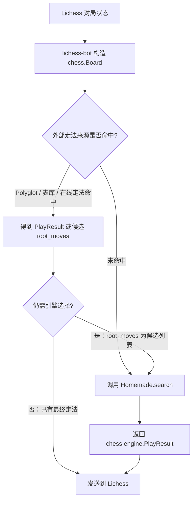

本页位于“扩展使用”路径中的 **[创建自定义 Homemade 引擎](14-chuang-jian-zi-ding-yi-homemade-yin-qing)**，目标是帮助中级开发者用 Python 类直接实现走法选择逻辑，而不是编写完整的 UCI 或 XBoard 协议引擎；仓库已经在根目录提供 `homemade.py` 示例，并在引擎封装层把 `protocol: "homemade"` 映射到 `MinimalEngine` 子类。Sources: [homemade.py](homemade.py#L1-L10), [engine_wrapper.py](lib/engine_wrapper.py#L35-L65), [Create-a-homemade-engine.md](wiki/Create-a-homemade-engine.md#L1-L14)

## 架构假设与验证结论

Homemade 引擎的核心模式是：**lichess-bot 仍然负责 Lichess 对局流、时间限制、开局库/残局库/在线走法前置决策与最终落子，而你的自定义类只负责在需要本地搜索时，从 `chess.Board` 中返回一个 `chess.engine.PlayResult`**；这一点可以从 `play_move()` 的调用链验证：系统先尝试 Polyglot、表库和在线走法，如果仍需要引擎决策，才调用 `self.search(...)`，随后把结果传给 `li.make_move(...)`。Sources: [engine_wrapper.py](lib/engine_wrapper.py#L196-L229), [engine_wrapper.py](lib/engine_wrapper.py#L240-L251)



图中的关键边界是 `search()`：`MinimalEngine.search()` 明确要求返回 `chess.engine.PlayResult`，示例 `RandomMove`、`Alphabetical`、`FirstMove` 和 `ComboEngine` 都通过 `PlayResult(move, None)` 或带额外标志的 `PlayResult(...)` 返回走法；因此 Homemade 引擎不是独立进程协议适配器，而是被 `FillerEngine` 包装进统一的 `EngineWrapper` 生命周期中。Sources: [engine_wrapper.py](lib/engine_wrapper.py#L668-L705), [engine_wrapper.py](lib/engine_wrapper.py#L725-L749), [homemade.py](homemade.py#L26-L51), [homemade.py](homemade.py#L54-L96)

## 适用场景与边界

如果你的目标是快速实验走法策略、教学型机器人、规则型机器人或 Python 内部算法原型，Homemade 是最短路径：你只需在根目录 `homemade.py` 中添加一个继承 `MinimalEngine` 或示例基类 `ExampleEngine` 的类，并实现 `search()`；官方旧版页面也把流程概括为设置 `protocol`、创建类、实现 `search()`、把 `engine.name` 改成类名。Sources: [homemade.py](homemade.py#L20-L31), [wiki/Create-a-homemade-engine.md](wiki/Create-a-homemade-engine.md#L4-L14)

| 方案 | 你需要实现什么 | lichess-bot 如何创建 | 典型配置字段 |
|---|---|---|---|
| UCI | 外部 UCI 引擎协议 | `UCIEngine` | `protocol: "uci"`、`uci_options` |
| XBoard | 外部 XBoard 引擎协议 | `XBoardEngine` | `protocol: "xboard"`、`xboard_options` |
| Homemade | Python 类的 `search()` 方法 | `get_homemade_engine(cfg.name)` 返回类 | `protocol: "homemade"`、`name: "<类名>"` |

这张表只描述引擎创建层的差异：`create_engine()` 根据 `cfg.protocol` 选择 `XBoardEngine`、`UCIEngine` 或 `get_homemade_engine(cfg.name)` 返回的 Homemade 类，并统一传入命令、选项、认输/求和配置、对局对象与调试标志。Sources: [engine_wrapper.py](lib/engine_wrapper.py#L35-L65), [config.yml.default](config.yml.default#L4-L14), [config.yml.default](config.yml.default#L122-L136)

## 创建步骤

下面的流程是 Homemade 页面范围内的最小闭环：修改配置、添加类、实现 `search()`、验证类名能被加载；安装 Python、Token、挑战规则等前置内容不在本页展开，必要时请先回到 [安装 Python 环境并运行测试](4-an-zhuang-python-huan-jing-bing-yun-xing-ce-shi) 与 [配置并验证国际象棋引擎](5-pei-zhi-bing-yan-zheng-guo-ji-xiang-qi-yin-qing)。Sources: [wiki/Create-a-homemade-engine.md](wiki/Create-a-homemade-engine.md#L4-L14), [config.yml.default](config.yml.default#L1-L14)

```mermaid
flowchart LR
    A[打开 config.yml] --> B[engine.protocol 改为 homemade]
    B --> C[engine.name 改为 Homemade 类名]
    C --> D[在根目录 homemade.py 添加类]
    D --> E[继承 ExampleEngine 或 MinimalEngine]
    E --> F[实现 search(board, ...)]
    F --> G[返回 chess.engine.PlayResult]
    G --> H[启动 bot 验证落子]
```

第一步，在 `config.yml` 的 `engine` 段把协议改成 `homemade`，并把 `name` 设置为你在 `homemade.py` 中定义的类名；默认配置展示了 `engine.name`、`engine.protocol` 和 `homemade_options` 的位置，其中 `protocol` 支持 `"uci"`、`"xboard"` 或 `"homemade"`。Sources: [config.yml.default](config.yml.default#L4-L14), [config.yml.default](config.yml.default#L119-L124)

| 修改前 | 修改后 |
|---|---|
| `protocol: "uci"` | `protocol: "homemade"` |
| `name: "engine_name"` | `name: "RandomMove"` 或你的类名 |
| 使用 `uci_options` / `xboard_options` | 使用 `homemade_options` 作为 Homemade 配置入口 |

这些字段最终进入 `create_engine()`：当 `cfg.protocol == "homemade"` 时，代码不会启动 UCI/XBoard 外部协议，而是通过 `get_homemade_engine(cfg.name)` 在根模块 `homemade` 中按类名查找并实例化。Sources: [engine_wrapper.py](lib/engine_wrapper.py#L45-L65), [engine_wrapper.py](lib/engine_wrapper.py#L755-L769)

第二步，在仓库根目录的 `homemade.py` 中添加类；文件已经导入了 `chess`、`PlayResult`、`Limit`、`MinimalEngine`、`MOVE` 与 `HOMEMADE_ARGS_TYPE`，并定义了 `ExampleEngine(MinimalEngine)`，因此最短写法可以直接继承 `ExampleEngine`。Sources: [homemade.py](homemade.py#L6-L21), [lib/lichess_types.py](lib/lichess_types.py#L12-L21)

```python
class MyEngine(ExampleEngine):
    """选择一个合法走法。"""

    def search(self, board: chess.Board, *args: HOMEMADE_ARGS_TYPE) -> PlayResult:
        move = next(iter(board.legal_moves))
        return PlayResult(move, None)
```

这个最小示例与仓库中的 `RandomMove`、`Alphabetical`、`FirstMove` 属于同一模式：从 `board.legal_moves` 产生合法走法，然后返回 `PlayResult(move, None)`；区别只在于走法选择策略是随机、SAN 字母序、UCI 字符串序，还是你自己的算法。Sources: [homemade.py](homemade.py#L26-L51)

## `search()` 方法契约

`search()` 的最低契约是接收当前 `chess.Board` 并返回 `chess.engine.PlayResult`；`MinimalEngine.search()` 的签名展示了完整参数：`board`、`time_limit`、`ponder`、`draw_offered`、`root_moves`，而示例中也允许用 `*args: HOMEMADE_ARGS_TYPE` 简化未使用参数。Sources: [engine_wrapper.py](lib/engine_wrapper.py#L697-L705), [homemade.py](homemade.py#L29-L31), [lib/lichess_types.py](lib/lichess_types.py#L12-L21)

| 参数 | 类型线索 | 含义 | 何时使用 |
|---|---|---|---|
| `board` | `chess.Board` | 当前局面 | 总是使用，用于读取合法走法、棋盘状态与行棋方 |
| `time_limit` | `chess.engine.Limit` | 本步可用时间、双方时钟或固定搜索限制 | 做时间管理或不同速度策略时使用 |
| `ponder` | `bool` | 是否允许思考对手时间 | Homemade 可接收该值，但示例 `ComboEngine` 未使用 |
| `draw_offered` | `bool` | 对手是否提出求和 | 返回 `PlayResult(..., draw_offered=draw_offered)` 可接受/回应求和 |
| `root_moves` | `MOVE`，即 `PlayResult \| list[Move]` | 外部来源给出的候选走法或已有结果 | 若为列表，应只在候选列表中选走法 |

这些参数的实际传递点在 `play_move()`：当需要引擎选择时，lichess-bot 会计算 `draw_offered`、`time_limit` 和 `can_ponder`，再调用 Homemade 的 `search(board, time_limit, can_ponder, draw_offered, best_move)`；其中 `best_move` 可能是候选列表，也可能是尚未命中的 `PlayResult`。Sources: [engine_wrapper.py](lib/engine_wrapper.py#L217-L229), [lib/lichess_types.py](lib/lichess_types.py#L12-L21)

## 使用 `root_moves` 与时间限制

如果启用了某些外部走法来源，它们可能不会直接给出最终走法，而是给出候选 `root_moves` 列表；`ComboEngine` 展示了正确处理方式：当 `root_moves` 是列表时从该列表中选，否则从 `board.legal_moves` 中选，避免 Homemade 引擎忽略候选约束。Sources: [homemade.py](homemade.py#L61-L87), [engine_wrapper.py](lib/engine_wrapper.py#L320-L347)

```python
class CandidateAware(ExampleEngine):
    def search(
        self,
        board: chess.Board,
        time_limit: Limit,
        ponder: bool,
        draw_offered: bool,
        root_moves: MOVE,
    ) -> PlayResult:
        possible_moves = root_moves if isinstance(root_moves, list) else list(board.legal_moves)
        possible_moves.sort(key=str)
        return PlayResult(possible_moves[0], None, draw_offered=draw_offered)
```

`ComboEngine` 还展示了时间字段的读取方式：如果 `time_limit.time` 是整数就作为固定思考时间，否则根据 `board.turn` 读取 `white_clock`/`black_clock` 与对应增量；示例随后用 `my_time / 60 + my_inc > 10` 在随机策略和字母序策略之间切换。Sources: [homemade.py](homemade.py#L77-L96)

## 返回值、求和与认输行为

Homemade 引擎返回的对象必须是 `chess.engine.PlayResult`；普通走法可以返回 `PlayResult(move, None)`，如果要回应求和，可以像 `ComboEngine` 那样传入 `draw_offered=draw_offered`。Sources: [engine_wrapper.py](lib/engine_wrapper.py#L697-L705), [homemade.py](homemade.py#L89-L96)

| 返回方式 | 作用 | 仓库示例 |
|---|---|---|
| `PlayResult(move, None)` | 下出一个普通合法走法 | `RandomMove`、`Alphabetical`、`FirstMove` |
| `PlayResult(move, None, draw_offered=draw_offered)` | 在返回走法时携带求和回应标志 | `ComboEngine` |
| `PlayResult(..., resigned=True)` | 统一封装层会根据 `resigned` 触发认输 | `play_move()` 检查 `best_move.resigned` |

封装层在拿到 `best_move` 后会先记录注释与统计，再检查 `best_move.resigned`；如果为真并且已至少走过两步，就调用 Lichess 的 resign，否则调用 `make_move(game.id, best_move)` 发送走法。Sources: [engine_wrapper.py](lib/engine_wrapper.py#L240-L251)

## 可选：自定义初始化与配置读取

Homemade 类可以重写 `__init__()`，测试用的 `ScholarsMate` 就显式接收 `commands`、`options`、`stderr`、`draw_or_resign`、`game`、`debug` 与 `**popen_args`，然后调用 `super().__init__(...)`；如果你需要读取 `homemade_options`，这些选项会作为 `options` 传入 Homemade 构造器。Sources: [test_bot/homemade.py](test_bot/homemade.py#L12-L25), [engine_wrapper.py](lib/engine_wrapper.py#L680-L691), [config.yml.default](config.yml.default#L119-L124)

```python
class ConfigurableEngine(ExampleEngine):
    def __init__(self, commands, options, stderr, draw_or_resign, game, debug, **popen_args):
        super().__init__(commands, options, stderr, draw_or_resign, game, debug, **popen_args)
        self.prefer_random = bool(options.get("PreferRandom", False))

    def search(self, board: chess.Board, *args: HOMEMADE_ARGS_TYPE) -> PlayResult:
        moves = list(board.legal_moves)
        move = random.choice(moves) if self.prefer_random else sorted(moves, key=str)[0]
        return PlayResult(move, None)
```

这个模式与 `ScholarsMate` 的构造方式一致，但示例中的 `ScholarsMate.search()` 使用固定的 `scholars_mate` 走法序列和 `board.parse_uci(...)` 取下一步，因此更适合作为“构造器如何接入”的参考，而不是通用走法策略模板。Sources: [test_bot/homemade.py](test_bot/homemade.py#L12-L25)

## 类加载规则与命名

`get_homemade_engine(name)` 会导入根模块 `homemade`，然后执行 `getattr(homemade, name)`；因此 `config.yml` 里的 `engine.name` 必须与 `homemade.py` 中的类名完全一致，例如 `RandomMove`、`Alphabetical`、`FirstMove` 或你自己定义的 `MyEngine`。Sources: [engine_wrapper.py](lib/engine_wrapper.py#L755-L769), [homemade.py](homemade.py#L26-L54)

| 配置值 | Python 中必须存在 |
|---|---|
| `name: "RandomMove"` | `class RandomMove(ExampleEngine): ...` |
| `name: "Alphabetical"` | `class Alphabetical(ExampleEngine): ...` |
| `name: "MyEngine"` | `class MyEngine(ExampleEngine): ...` |

测试代码也验证了这一机制：测试把 `CONFIG["engine"]["protocol"]` 设为 `"homemade"`，并把 `CONFIG["engine"]["name"]` 设为测试类名后运行 bot；生产使用时不需要测试后缀，只需要让类名能从根目录 `homemade.py` 解析出来。Sources: [test_bot/test_bot.py](test_bot/test_bot.py#L162-L177), [engine_wrapper.py](lib/engine_wrapper.py#L752-L769)

## 常见问题排查

| 现象 | 可验证原因 | 修复方式 |
|---|---|---|
| 启动时报类不存在 | `getattr(homemade, name)` 按配置名查找类 | 检查 `engine.name` 与 `homemade.py` 类名是否完全一致 |
| `search method is not implemented` | 继承了 `MinimalEngine` 但没有覆盖 `search()` | 在子类中实现 `search()` 并返回 `PlayResult` |
| 下出非法走法后对局结束 | `play_move()` 捕获非法/无效走法错误后会 abort 或 resign | 只从 `board.legal_moves` 或候选 `root_moves` 中选走法 |
| 忽略表库/在线来源给出的候选 | `root_moves` 可能是 `list[Move]` | 当 `isinstance(root_moves, list)` 时只在该列表中选择 |
| 求和回应不生效 | 返回值没有设置 `draw_offered` | 使用 `PlayResult(move, None, draw_offered=draw_offered)` |

这些排查项分别对应类加载、抽象方法、非法走法处理、候选走法约束和 `PlayResult` 标志位：源码中 `MinimalEngine.search()` 默认抛出 `NotImplementedError`，`play_move()` 会处理非法走法异常，`EngineWrapper.search()` 将列表型 `root_moves` 传给底层搜索，而示例 `ComboEngine` 演示了候选列表与求和标志的组合用法。Sources: [engine_wrapper.py](lib/engine_wrapper.py#L697-L705), [engine_wrapper.py](lib/engine_wrapper.py#L225-L238), [engine_wrapper.py](lib/engine_wrapper.py#L320-L347), [homemade.py](homemade.py#L87-L96)

## 最小可用模板

下面是一个适合作为起点的完整 Homemade 类：它保留完整签名，尊重 `root_moves`，返回 `PlayResult`，并在对手提出求和时把 `draw_offered` 传回结果对象。Sources: [engine_wrapper.py](lib/engine_wrapper.py#L697-L705), [homemade.py](homemade.py#L61-L96)

```python
class MyEngine(ExampleEngine):
    """一个确定性 Homemade 引擎：选择 UCI 字符串排序后的第一个候选走法。"""

    def search(
        self,
        board: chess.Board,
        time_limit: Limit,
        ponder: bool,
        draw_offered: bool,
        root_moves: MOVE,
    ) -> PlayResult:
        possible_moves = root_moves if isinstance(root_moves, list) else list(board.legal_moves)
        possible_moves.sort(key=str)
        return PlayResult(possible_moves[0], None, draw_offered=draw_offered)
```

对应配置只需要把协议改为 `homemade`，并把名称改成类名；`engine.dir` 与解释器字段主要服务外部引擎命令构造，而 Homemade 的类解析来自根目录 `homemade.py` 模块。Sources: [config.yml.default](config.yml.default#L4-L14), [engine_wrapper.py](lib/engine_wrapper.py#L68-L79), [engine_wrapper.py](lib/engine_wrapper.py#L755-L769)

```yaml
engine:
  name: "MyEngine"
  protocol: "homemade"

  homemade_options:
    PreferRandom: false
```

## 下一步阅读

完成 Homemade 引擎后，如果你想理解它与 UCI/XBoard 的统一封装关系，继续阅读 [统一引擎封装：UCI、XBoard 与 Homemade](24-tong-yin-qing-feng-zhuang-uci-xboard-yu-homemade)；如果你需要优化每步思考时间和搜索参数，阅读 [时间管理、Ponder、搜索参数与走法生成](25-shi-jian-guan-li-ponder-sou-suo-can-shu-yu-zou-fa-sheng-cheng)；如果你希望 Homemade 与开局库、云分析或残局库协作，阅读 [外部走法来源：Polyglot、云分析、Opening Explorer 与 Tablebase](26-wai-bu-zou-fa-lai-yuan-polyglot-yun-fen-xi-opening-explorer-yu-tablebase)。Sources: [engine_wrapper.py](lib/engine_wrapper.py#L196-L229), [engine_wrapper.py](lib/engine_wrapper.py#L320-L351)