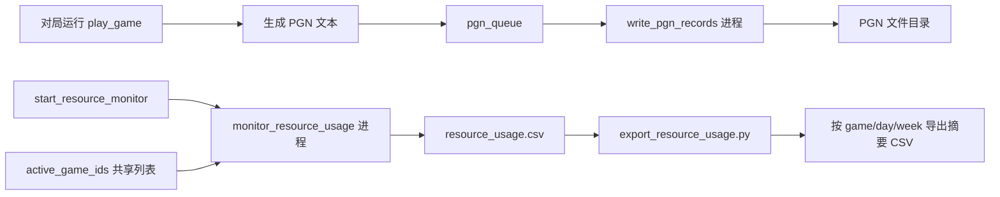
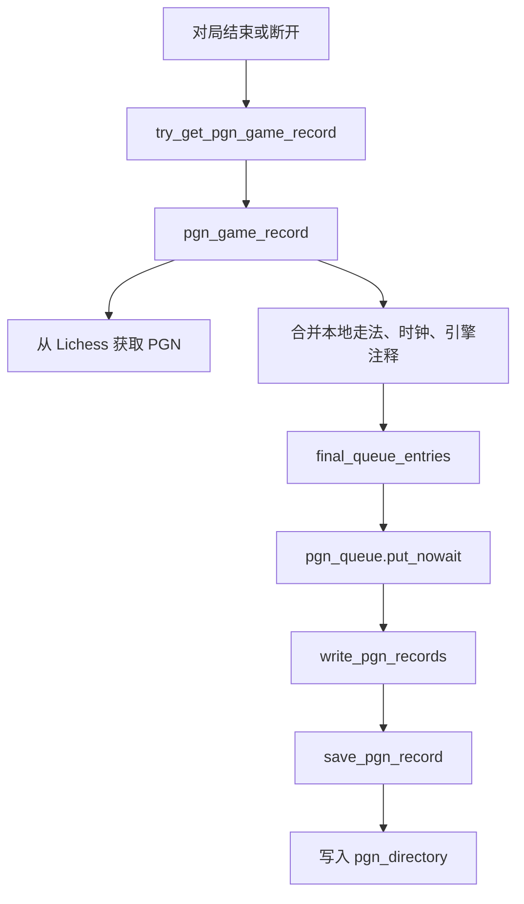
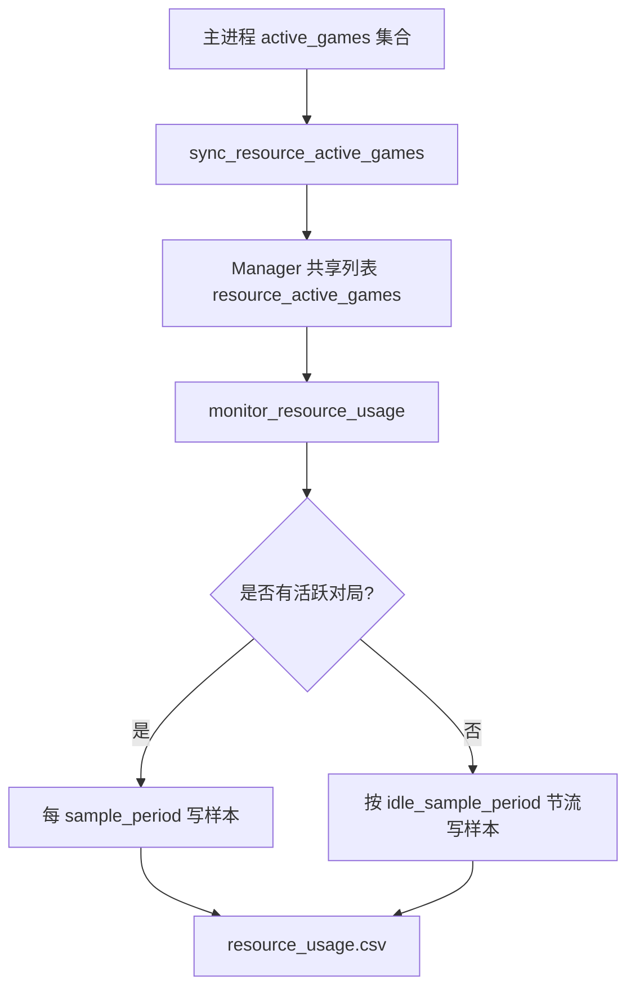

本页位于“扩展使用”章节的当前位置：[保存 PGN、采集资源数据与导出报告](15-bao-cun-pgn-cai-ji-zi-yuan-shu-ju-yu-dao-chu-bao-gao)。它只覆盖三个运行期留痕能力：把对局保存为 PGN、把 lichess-bot 主进程及其子进程的 CPU/RSS 采样写入 CSV、以及把资源采样汇总导出为按对局、日期或周分组的报告。PGN 保存由 `pgn_directory` 与 `pgn_file_grouping` 控制；资源监控由 `resource_monitor` 配置块控制；报告导出由 `scripts/export_resource_usage.py` 调用 `lib.resource_monitor` 中的读取、汇总与写出函数完成。Sources: [config.yml.default](config.yml.default#L224-L234), [lichess_bot.py](lib/lichess_bot.py#L340-L350), [export_resource_usage.py](scripts/export_resource_usage.py#L14-L30)

## 架构假设与代码验证结论

从第一原则看，本页涉及的是**运行结果持久化**而不是下棋决策本身：PGN 记录依赖游戏结束或断开时的本地队列事件，资源数据依赖独立监控进程按时间采样，导出报告则是离线脚本读取 CSV 并生成摘要。代码中可以验证这三条链路彼此解耦：启动阶段创建 `pgn_queue` 与 `pgn_listener` 进程，同时按配置尝试启动 `resource_monitor_process`；主流程结束时分别终止 PGN 监听进程与资源监控进程。Sources: [lichess_bot.py](lib/lichess_bot.py#L340-L381)



上图表达的是本页三类产物的边界：PGN 文件来自 `pgn_queue` 的异步写入；资源采样来自独立 `multiprocessing.Process`；导出报告不参与在线对局，而是读取已有 CSV 后汇总输出。Sources: [lichess_bot.py](lib/lichess_bot.py#L205-L220), [resource_monitor.py](lib/resource_monitor.py#L149-L175), [export_resource_usage.py](scripts/export_resource_usage.py#L25-L30)

## 相关文件结构

本功能涉及的文件很少，核心路径如下；其中 `config.yml.default` 给出可配置项，`lib/lichess_bot.py` 负责 PGN 生成和写入调度，`lib/resource_monitor.py` 负责资源采样与摘要计算，`scripts/export_resource_usage.py` 是命令行导出入口，`test_bot/test_resource_monitor.py` 验证资源监控的进程树选择、分组摘要与空闲采样节流行为。Sources: [config.yml.default](config.yml.default#L224-L234), [lichess_bot.py](lib/lichess_bot.py#L1138-L1313), [resource_monitor.py](lib/resource_monitor.py#L1-L261), [export_resource_usage.py](scripts/export_resource_usage.py#L1-L35), [test_resource_monitor.py](test_bot/test_resource_monitor.py#L1-L80)

```text
.
├── config.yml.default
├── lib
│   ├── lichess_bot.py          # PGN 队列、PGN 生成、PGN 文件路径与写入
│   └── resource_monitor.py     # 资源采样、CSV 读取、摘要汇总、CSV 输出
├── scripts
│   └── export_resource_usage.py # 资源报告导出 CLI
└── test_bot
    └── test_resource_monitor.py # 资源监控行为测试
```

## 第一步：启用 PGN 保存

要保存 PGN，在配置文件中启用 `pgn_directory`，并选择 `pgn_file_grouping`。默认配置示例中这两个字段处于注释状态；`pgn_directory` 表示保存 PGN 记录的目录，`pgn_file_grouping` 支持 `game`、`opponent`、`all` 三种取值，其中默认语义是每盘棋写入独立文件。Sources: [config.yml.default](config.yml.default#L224-L228)

| 配置项 | 作用 | 允许值或默认值 | 文件命名行为 |
|---|---|---:|---|
| `pgn_directory` | PGN 文件输出目录 | 未配置时默认为 `None` | 未配置则不写 PGN |
| `pgn_file_grouping: "game"` | 每盘棋单独写文件 | 默认值 | `{White name} vs {Black name} - {lichess game ID}.pgn` |
| `pgn_file_grouping: "opponent"` | 按对手聚合 | `opponent` | `{Bot name} games vs. {Opponent name}.pgn` |
| `pgn_file_grouping: "all"` | 所有对局写入一个文件 | `all` | `{Bot name} games.pgn` |

这些配置项的默认值与合法性在配置加载阶段被补齐和校验：`pgn_directory` 默认是 `None`，`pgn_file_grouping` 默认是 `"game"`，合法值被限制为 `["game", "opponent", "all"]`。如果在 Docker 环境中配置了 PGN 目录，配置校验逻辑会警告用户确保该目录挂载为 volume，以避免文件只保存在容器内部文件系统中。Sources: [config.py](lib/config.py#L150-L155), [config.py](lib/config.py#L426-L438)

## PGN 写入流程

PGN 写入不是在主循环中直接落盘，而是由独立监听进程消费 `pgn_queue`。启动时，程序创建 `manager.Queue()` 作为 PGN 队列，并启动 `write_pgn_records` 进程；监听进程从队列读取事件，调用 `save_pgn_record`，写入失败时记录异常并继续循环。Sources: [lichess_bot.py](lib/lichess_bot.py#L205-L220), [lichess_bot.py](lib/lichess_bot.py#L340-L345)



对局工作线程在离开游戏循环后调用 `try_get_pgn_game_record`，再通过 `final_queue_entries` 把 `{"id", "pgn", "complete"}` 放入 PGN 队列；若游戏线程发生错误，错误回调也会从 Lichess 导出 PGN 并把记录放入同一个队列。Sources: [lichess_bot.py](lib/lichess_bot.py#L666-L675), [lichess_bot.py](lib/lichess_bot.py#L918-L920), [lichess_bot.py](lib/lichess_bot.py#L1069-L1085)

## PGN 内容如何生成

`pgn_game_record` 首先检查 `config.pgn_directory`，未配置时直接返回空字符串；配置存在时，它通过 `li.get_game_pgn(game.id)` 获取 Lichess 侧 PGN，再尝试读取之前以单局文件名保存的 PGN，以保留已有的引擎评估信息，然后用 Lichess PGN 头更新本地记录。Sources: [lichess_bot.py](lib/lichess_bot.py#L1156-L1185), [lichess.py](lib/lichess.py#L456-L461)

PGN 主变例会根据当前棋盘 `board.move_stack` 逐步补齐；如果 Lichess PGN 节点中有时钟或注释，本地节点会同步时钟并合并注释；随后从引擎封装读取对应局面的注释信息，在节点上写入 PV 变化线与评估值、深度，最后使用 `chess.pgn.StringExporter()` 输出文本。Sources: [lichess_bot.py](lib/lichess_bot.py#L1188-L1209)

PGN 头信息由 `fill_missing_pgn_headers` 补齐：如果 Lichess PGN 缺少某个头、值以 `?` 开头，或 `Result` 仍为 `*`，就使用本地 `get_headers(game)` 的值。可补齐的字段包括 `Event`、`Site`、`Date`、`White`、`Black`、`Result`、玩家 Elo/Title、非通信棋的 `TimeControl`、`UTCDate`、`UTCTime`、`Variant`，以及非标准初始局面所需的 `Setup` 与 `FEN`。Sources: [lichess_bot.py](lib/lichess_bot.py#L1233-L1283)

## PGN 文件名与聚合策略

PGN 路径由 `get_game_file_path` 统一生成。为了避免非法文件名字符，路径生成函数会移除 `< > : " / \ | ? *`；当分组方式为 `game`、对局未结束，或显式 `force_single=True` 时，文件名固定为单局格式；当分组方式为 `opponent` 时，文件名按机器人与对手聚合；否则按机器人所有对局聚合到一个文件。Sources: [lichess_bot.py](lib/lichess_bot.py#L1212-L1230)

| 场景 | 写入模式 | 触发条件 | 结果 |
|---|---|---|---|
| 单局文件 | `w` | `game_path == single_game_path` | 覆盖同一局的单局 PGN |
| 聚合文件 | `a` | `game_path != single_game_path` | 追加到对手聚合或全局聚合文件 |
| 聚合后清理临时单局文件 | 删除单局文件 | 聚合文件写入后且单局文件存在 | 移除同一局的单独 PGN |

`save_pgn_record` 会读取 PGN 头以取得白方、黑方和完成状态；如果 `pgn_directory` 未配置或 PGN 头读取失败则直接返回。写入前会创建目标目录，随后根据单局路径和聚合路径是否相同决定使用覆盖模式还是追加模式；当最终写入的是聚合文件时，如果此前存在单局文件，会删除该单局文件。Sources: [lichess_bot.py](lib/lichess_bot.py#L1286-L1313)

## 第二步：启用资源采样

资源监控配置位于 `resource_monitor` 块。`enabled` 决定是否启动监控进程，`directory` 是保存 `resource_usage.csv` 的目录，`sample_period` 是活跃采样间隔秒数，`idle_sample_period` 是没有活跃对局时的采样间隔秒数。Sources: [config.yml.default](config.yml.default#L230-L234)

```yaml
resource_monitor:
  enabled: true
  directory: "resource_records"
  sample_period: 5
  idle_sample_period: 5
```

配置加载会为资源监控补齐默认值：`enabled` 默认为 `False`，`directory` 默认为 `"resource_records"`，`sample_period` 默认为 `5`，`idle_sample_period` 默认等于 `sample_period`。配置校验要求 `sample_period` 与 `idle_sample_period` 都必须大于 0。Sources: [config.py](lib/config.py#L152-L155), [config.py](lib/config.py#L440-L443)

## 资源采样的数据模型

资源监控采样一行 CSV 时会记录固定字段：时间戳、根进程 PID、进程数量、进程 PID 列表、活跃游戏 ID、CPU 百分比、RSS 字节数，以及本次样本代表的时间间隔秒数。对应字段定义在 `CSV_FIELDS`，单条样本由 `ResourceSample` 数据类表示。Sources: [resource_monitor.py](lib/resource_monitor.py#L19-L28), [resource_monitor.py](lib/resource_monitor.py#L55-L67)

| 字段 | 含义 | 来源 |
|---|---|---|
| `timestamp` | 样本采集时间，使用 UTC 时间戳输出 | `sample_process_tree` |
| `root_pid` | lichess-bot 根进程 PID | `start_resource_monitor` 调用参数 |
| `pid_count` | 根进程及后代进程数量 | `process_tree` 结果 |
| `pids` | 被纳入统计的 PID 列表，用 `;` 拼接 | `append_sample` |
| `active_game_ids` | 当前活跃对局 ID，用 `;` 拼接 | 共享列表传入 |
| `cpu_percent` | 被选中进程 CPU 百分比之和 | `sample_process_tree` |
| `rss_bytes` | 被选中进程 RSS 字节数之和 | `sample_process_tree` |
| `interval_seconds` | 该样本代表的采样间隔 | 活跃或空闲间隔 |

进程树选择逻辑基于 `ps -axo pid=,ppid=,pcpu=,rss=,comm=` 输出：先解析每个进程的 PID、PPID、CPU、RSS 和命令名，再从根 PID 出发递归选择已知后代，并可排除指定 PID；采样时会把 CPU 百分比与 RSS 分别求和。测试用例验证了根进程、子进程与孙进程会被纳入统计，而无关进程不会被纳入。Sources: [resource_monitor.py](lib/resource_monitor.py#L69-L120), [test_resource_monitor.py](test_bot/test_resource_monitor.py#L12-L27)

## 活跃对局与空闲采样

主流程创建 `resource_active_games` 共享列表，并把当前进程 PID、活跃对局列表和资源监控配置传给 `start_resource_monitor`。如果资源监控未启用，`start_resource_monitor` 返回 `None`；启用时，它启动一个 `multiprocessing.Process` 运行 `monitor_resource_usage`。Sources: [lichess_bot.py](lib/lichess_bot.py#L347-L350), [resource_monitor.py](lib/resource_monitor.py#L168-L175)



监控循环每次读取共享的活跃对局列表；如果存在活跃对局，则每次循环都允许写样本；如果没有活跃对局，则只有距离上一次空闲样本达到 `idle_sample_period` 时才写入，从而避免空闲期间无限快速增长。测试用例验证了“活跃对局总是采样”和“空闲采样按间隔节流”这两个行为。Sources: [resource_monitor.py](lib/resource_monitor.py#L143-L165), [test_resource_monitor.py](test_bot/test_resource_monitor.py#L71-L80)

## 第三步：导出资源报告

资源报告导出通过 `scripts/export_resource_usage.py` 完成。该脚本接受三个参数：`--input` 指向单个 CSV 文件或包含 CSV 文件的目录，默认是 `resource_records`；`--group` 支持 `game`、`day`、`week`，默认是 `day`；`--output` 指定输出 CSV 路径，未指定时输出到标准输出。Sources: [export_resource_usage.py](scripts/export_resource_usage.py#L14-L22)

```bash
python scripts/export_resource_usage.py --input resource_records --group day --output resource_summary_day.csv
python scripts/export_resource_usage.py --input resource_records/resource_usage.csv --group game --output resource_summary_game.csv
python scripts/export_resource_usage.py --input resource_records --group week
```

导出入口的执行逻辑很直接：解析参数后调用 `read_resource_samples(Path(args.input))` 读取样本，再调用 `summarize_resource_samples(samples, args.group)` 汇总，最后调用 `write_summary_csv` 写入文件或标准输出。Sources: [export_resource_usage.py](scripts/export_resource_usage.py#L25-L30)

## 资源报告的分组与指标

读取输入时，如果 `--input` 是文件，就只读取该文件；如果是目录，就读取目录下按名称排序的 `*.csv` 文件。每一行 CSV 会被解析成 `ResourceSample`，其中 `active_game_ids` 和 `pids` 都从分号分隔文本还原为元组。Sources: [resource_monitor.py](lib/resource_monitor.py#L178-L205)

| `--group` | 分组键 | 空闲样本行为 |
|---|---|---|
| `game` | 每个活跃游戏 ID 独立成组 | 没有活跃游戏 ID 的样本归入 `idle` |
| `day` | `YYYY-MM-DD` | 所有样本按日期聚合 |
| `week` | `YYYY-WNN` ISO 周 | 所有样本按 ISO 年周聚合 |

分组键由 `summary_keys` 生成：`game` 模式返回样本中的活跃对局 ID，若为空则返回 `("idle",)`；`day` 模式使用样本日期；`week` 模式使用 ISO 年周；其他分组值会抛出 `ValueError`。Sources: [resource_monitor.py](lib/resource_monitor.py#L208-L217)

摘要输出字段由 `SUMMARY_FIELDS` 定义，包括分组名、样本数、开始与结束时间、活跃秒数、CPU 秒数、平均 CPU 百分比、平均 RSS MB 与峰值 RSS MB。`summarize_resource_samples` 使用 `interval_seconds` 对 CPU 百分比和 RSS 做加权平均，并用 `cpu_percent / 100 * interval_seconds` 计算 CPU 秒数。Sources: [resource_monitor.py](lib/resource_monitor.py#L31-L41), [resource_monitor.py](lib/resource_monitor.py#L220-L246)

测试用例验证了导出摘要的关键数学行为：同一对局两条样本可汇总为 `cpu_seconds == 7.5`、`avg_cpu_percent == 75`、`avg_rss_mb == 150`，无活跃对局的样本会进入 `idle` 分组，按日分组会得到 `2026-04-17` 与 `2026-04-18`，按周分组会得到形如 `2026-W16` 的键。Sources: [test_resource_monitor.py](test_bot/test_resource_monitor.py#L29-L69)

## 配置前后对照

如果只运行机器人而不需要留痕，可以保持默认状态：PGN 保存不启用，资源监控关闭。默认配置文件中 `pgn_directory` 与 `pgn_file_grouping` 是注释示例，而 `resource_monitor.enabled` 为 `false`。Sources: [config.yml.default](config.yml.default#L224-L234)

| 目标 | 修改前 | 修改后 |
|---|---|---|
| 保存每盘 PGN | `# pgn_directory: "game_records"` | `pgn_directory: "game_records"` |
| 每盘棋单独成文件 | `# pgn_file_grouping: "game"` | `pgn_file_grouping: "game"` |
| 按对手聚合 PGN | `# pgn_file_grouping: "game"` | `pgn_file_grouping: "opponent"` |
| 全部 PGN 写入一个文件 | `# pgn_file_grouping: "game"` | `pgn_file_grouping: "all"` |
| 启用资源采样 | `enabled: false` | `enabled: true` |
| 调整采样目录 | `directory: "resource_records"` | `directory: "resource_records"` 或自定义目录 |
| 调整采样间隔 | `sample_period: 5` | 大于 0 的秒数 |
| 调整空闲采样间隔 | `idle_sample_period: 5` | 大于 0 的秒数 |

配置校验要求 `pgn_file_grouping` 只能是 `game`、`opponent` 或 `all`，并要求资源监控的两个采样周期都大于 0；因此，上表中资源采样间隔不能配置为 0 或负数。Sources: [config.py](lib/config.py#L434-L443)

## 常见问题排查

| 现象 | 可验证原因 | 处理方式 |
|---|---|---|
| 没有 PGN 文件 | `config.pgn_directory` 未配置时 `pgn_game_record` 返回空字符串，`save_pgn_record` 也会直接返回 | 配置 `pgn_directory` |
| PGN 分组配置报错 | `pgn_file_grouping` 不在 `["game", "opponent", "all"]` 内 | 改为三者之一 |
| Docker 中找不到 PGN 文件 | 配置校验会提示 PGN 目录需要挂载 volume | 将 PGN 目录映射到宿主机 |
| 资源 CSV 没有生成 | `resource_monitor.enabled` 为 `False` 时不会启动监控进程 | 设置 `resource_monitor.enabled: true` |
| 资源监控配置校验失败 | `sample_period` 或 `idle_sample_period` 不大于 0 | 改为正数 |
| 导出脚本没有写文件 | 未传 `--output` 时写到标准输出 | 添加 `--output 路径` |

这些排查项均来自代码中的显式分支：PGN 保存依赖 `pgn_directory` 和有效 PGN 头；PGN 分组选项会被配置校验限制；Docker 下会给出目录挂载警告；资源监控只有在启用时才创建进程；导出脚本的 `--output` 可选，未提供时 `write_summary_csv` 写到 `sys.stdout`。Sources: [lichess_bot.py](lib/lichess_bot.py#L1167-L1168), [lichess_bot.py](lib/lichess_bot.py#L1294-L1297), [config.py](lib/config.py#L426-L443), [resource_monitor.py](lib/resource_monitor.py#L168-L175), [export_resource_usage.py](scripts/export_resource_usage.py#L19-L30), [resource_monitor.py](lib/resource_monitor.py#L249-L260)

## 推荐阅读顺序

完成本页配置后，如果你希望理解这些文件如何嵌入运行期控制流，下一步阅读 [主循环、事件流与多进程任务协作](17-zhu-xun-huan-shi-jian-liu-yu-duo-jin-cheng-ren-wu-xie-zuo)；如果你要进一步解释资源数据与容量规划之间的关系，继续阅读 [资源监控、性能调优与并发容量规划](32-zi-yuan-jian-kong-xing-neng-diao-you-yu-bing-fa-rong-liang-gui-hua)；如果你还没有配置基础字段，则返回 [配置文件结构与必填字段](8-pei-zhi-wen-jian-jie-gou-yu-bi-tian-zi-duan)。Sources: [lichess_bot.py](lib/lichess_bot.py#L304-L381), [resource_monitor.py](lib/resource_monitor.py#L149-L175), [config.py](lib/config.py#L140-L155)