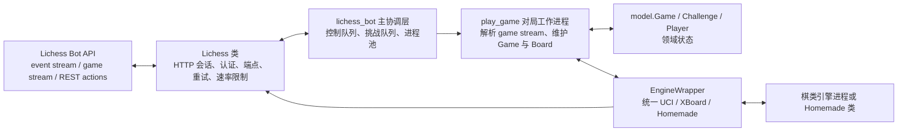
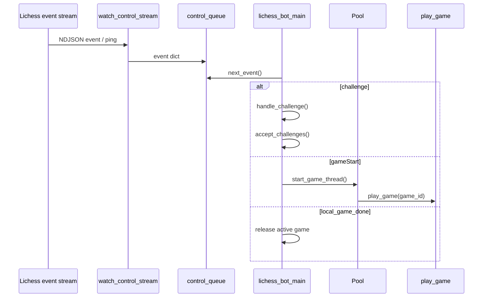
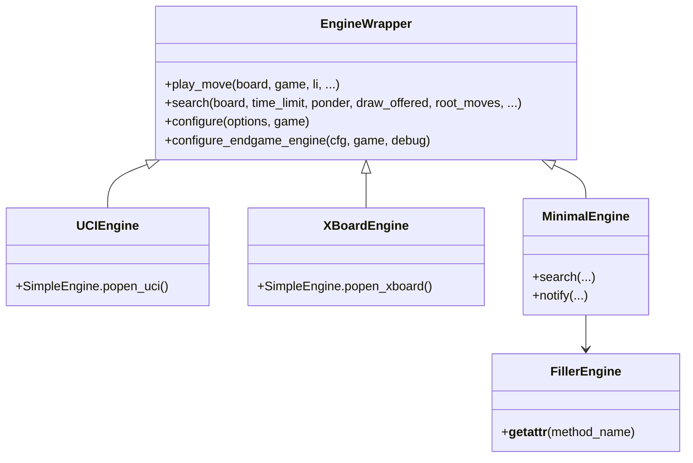
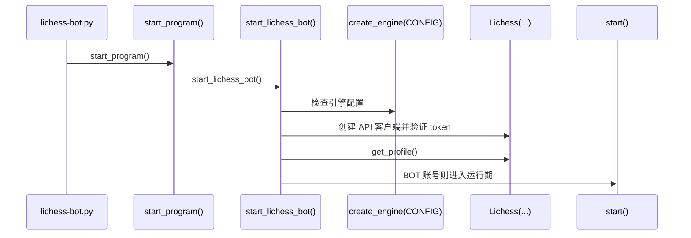

lichess-bot 的核心架构可以从第一性原理理解为一个**协议桥接层**：一侧通过 `lib/lichess.py` 把 Lichess Bot API、事件流、对局流、走子、聊天、挑战处理等 HTTP/流式接口封装成 Python 方法；另一侧通过 `lib/engine_wrapper.py` 把 UCI、XBoard 与 Homemade 引擎统一成 `EngineWrapper` 抽象；中间由 `lib/lichess_bot.py` 的主协调逻辑把平台事件转换为棋盘状态、引擎搜索请求与平台动作。程序入口非常薄，只调用 `start_program()`，真正的架构边界集中在 `lib/lichess_bot.py`、`lib/lichess.py`、`lib/engine_wrapper.py` 与 `lib/model.py`。Sources: [lichess-bot.py](lichess-bot.py#L1-L5), [lichess_bot.py](lib/lichess_bot.py#L1-L34), [lichess.py](lib/lichess.py#L127-L154), [engine_wrapper.py](lib/engine_wrapper.py#L93-L113)

本文位于“深入解析 / 系统架构”中的[整体架构：Lichess API 与棋类引擎之间的桥接层](16-zheng-ti-jia-gou-lichess-api-yu-qi-lei-yin-qing-zhi-jian-de-qiao-jie-ceng)，只解释整体桥接结构：平台 API 如何进入程序、事件如何被调度到对局工作进程、对局状态如何被建模、引擎如何产生走法，以及走法如何回写到 Lichess。主循环细节、断线看门狗、游戏生命周期、引擎时间管理与外部走法来源在目录中有独立页面，本文只在架构层面标出它们的位置。Sources: [lichess_bot.py](lib/lichess_bot.py#L304-L365), [lichess_bot.py](lib/lichess_bot.py#L395-L446), [lichess_bot.py](lib/lichess_bot.py#L759-L919)

## 架构假设与代码验证结论

架构假设是：lichess-bot 不是“引擎插件”，也不是“纯 API 客户端”，而是一个**有状态的事件驱动适配器**。代码验证支持这个判断：`Lichess` 类保存认证头、基础 URL、请求会话、重试与速率限制状态；`start()` 创建控制流、通信队列、PGN 写入、日志监听、资源监控等进程级组件；`play_game()` 为每盘棋打开 game stream，把 Lichess 的 `gameFull/gameState/chatLine/ping` 数据转换为 `model.Game`、`chess.Board` 与引擎调用；`EngineWrapper.play_move()` 再把搜索结果或外部走法转换为 `li.make_move()`、`li.resign()` 等平台动作。Sources: [lichess.py](lib/lichess.py#L131-L169), [lichess_bot.py](lib/lichess_bot.py#L317-L352), [lichess_bot.py](lib/lichess_bot.py#L795-L819), [engine_wrapper.py](lib/engine_wrapper.py#L170-L250)



上图展示的是**桥接层的双向数据流**：从 Lichess 进入的是事件与状态，从引擎返回的是走法与对局意图；中间的协调层不直接“下棋”，而是把账号级事件分配给对局工作进程，再由对局工作进程把棋盘状态交给统一引擎封装。该图中的每个节点都对应本地代码中的明确模块：API 封装在 `lib/lichess.py`，主协调在 `lib/lichess_bot.py`，领域模型在 `lib/model.py`，引擎适配在 `lib/engine_wrapper.py`。Sources: [lichess.py](lib/lichess.py#L21-L45), [lichess_bot.py](lib/lichess_bot.py#L128-L157), [lichess_bot.py](lib/lichess_bot.py#L456-L523), [model.py](lib/model.py#L195-L224), [engine_wrapper.py](lib/engine_wrapper.py#L35-L65)

## 模块职责边界

整体架构最重要的边界是**平台通信、任务协调、领域建模、引擎通信**四层分离。`lib/lichess.py` 只负责把命名端点映射到 HTTP 请求与平台动作；`lib/lichess_bot.py` 负责启动、队列、进程池、事件分发与对局工作；`lib/model.py` 把 Lichess 的 JSON 数据压缩成 Challenge、Game、Player 等可操作对象；`lib/engine_wrapper.py` 则隐藏 UCI、XBoard、Homemade 的差异，把“给定棋盘产生走法”统一为 `play_move()` 与 `search()` 流程。Sources: [lichess.py](lib/lichess.py#L21-L45), [lichess.py](lib/lichess.py#L203-L315), [lichess_bot.py](lib/lichess_bot.py#L395-L446), [model.py](lib/model.py#L22-L42), [model.py](lib/model.py#L195-L224), [engine_wrapper.py](lib/engine_wrapper.py#L93-L127)

| 层级 | 代表文件 | 主要职责 | 架构含义 |
|---|---|---|---|
| 入口层 | `lichess-bot.py` | 调用 `start_program()` | 保持入口极薄，把生命周期交给库模块 |
| 平台 API 层 | `lib/lichess.py` | 封装端点、GET/POST、stream、走子、聊天、挑战 | 将 Lichess HTTP/流接口变成方法调用 |
| 协调层 | `lib/lichess_bot.py` | 创建进程、队列、主循环、对局工作进程 | 将账号事件路由到并发对局 |
| 领域模型层 | `lib/model.py` | Challenge、Game、Player 状态对象 | 将平台 JSON 转换为内部语义对象 |
| 引擎适配层 | `lib/engine_wrapper.py` | 创建 UCI/XBoard/Homemade，引擎搜索，提交走法 | 将不同引擎协议统一为走法生成接口 |

Sources: [lichess-bot.py](lichess-bot.py#L1-L5), [lichess.py](lib/lichess.py#L127-L154), [lichess_bot.py](lib/lichess_bot.py#L304-L365), [model.py](lib/model.py#L22-L42), [model.py](lib/model.py#L195-L224), [engine_wrapper.py](lib/engine_wrapper.py#L35-L65)

## Lichess API 侧：命名端点与统一请求封装

`Lichess` 类通过 `ENDPOINTS` 字典集中声明平台端点，包括账号信息、正在进行的对局、账号事件流、游戏事件流、走子、悔棋、聊天、认输、挑战接受与拒绝、PGN 导出等。构造函数建立带 Bearer Token 的 `requests.Session`，关闭环境代理信任，设置 User-Agent，并在启动时验证 OAuth token 是否包含 `bot:play` 权限；因此 API 层不仅是请求工具，也是启动阶段的平台权限守门员。Sources: [lichess.py](lib/lichess.py#L21-L45), [lichess.py](lib/lichess.py#L131-L169), [lichess.py](lib/lichess.py#L170-L193)

`api_get()` 与 `api_post()` 是 API 层的两个主干方法：它们根据端点名查找路径模板，拼接 `baseUrl`，执行请求，处理 429 速率限制，并通过 `backoff` 对网络类异常与 HTTP 异常进行重试。更高层的方法如 `get_event_stream()`、`get_game_stream()`、`make_move()`、`chat()`、`accept_challenge()`、`decline_challenge()` 只是这些通用请求方法之上的语义包装，使协调层不需要直接拼 URL 或处理 HTTP 细节。Sources: [lichess.py](lib/lichess.py#L195-L227), [lichess.py](lib/lichess.py#L279-L315), [lichess.py](lib/lichess.py#L317-L362), [lichess.py](lib/lichess.py#L368-L428)

| API 方法 | 封装的平台行为 | 被桥接层如何使用 |
|---|---|---|
| `get_event_stream()` | 获取账号级事件流 | 控制流进程读取 challenge、gameStart、ping 等事件 |
| `get_game_stream(game_id)` | 获取单盘棋事件流 | 对局工作进程读取初始状态、走子更新、聊天 |
| `make_move(game_id, move)` | 向 Bot API 提交走法 | `EngineWrapper.play_move()` 在得到最佳走法后调用 |
| `accept_challenge(challenge_id)` | 接受挑战 | 主循环在并发容量允许时从挑战队列取出并接受 |
| `decline_challenge(challenge_id, reason)` | 拒绝挑战 | 挑战不满足规则时由挑战处理逻辑调用 |
| `chat(game_id, room, text)` | 发送聊天消息 | 对局会话逻辑通过 Conversation 间接使用 |

Sources: [lichess.py](lib/lichess.py#L368-L428), [lichess_bot.py](lib/lichess_bot.py#L128-L150), [lichess_bot.py](lib/lichess_bot.py#L604-L620), [engine_wrapper.py](lib/engine_wrapper.py#L245-L250)

## 协调层：账号事件到对局任务的转换

`start()` 是运行期组件装配点：它创建 `multiprocessing.Manager()`，再建立挑战队列、控制队列、通信队列、日志队列、PGN 队列，并启动控制流监听进程、控制流 watchdog 进程、通信棋检查进程、日志监听进程、PGN 写入进程与资源监控进程。随后它把这些共享对象传入 `lichess_bot_main()`，主循环由此获得“账号事件输入、任务队列、并发工作池、辅助监听器”的完整运行环境。Sources: [lichess_bot.py](lib/lichess_bot.py#L304-L365), [lichess_bot.py](lib/lichess_bot.py#L367-L381)

```mermaid
flowchart TD
    Start[start()]
    Manager[multiprocessing.Manager]
    ControlStream[控制流监听进程<br/>watch_control_stream]
    Watchdog[watchdog_tick 进程]
    CorrPing[correspondence_ping 进程]
    LogProc[日志监听进程]
    PGNProc[PGN 写入进程]
    Resource[资源监控进程]
    Main[lichess_bot_main]
    Pool[进程池 Pool<br/>max_games + 1]
    Game[play_game worker]

    Start --> Manager
    Start --> ControlStream
    Start --> Watchdog
    Start --> CorrPing
    Start --> LogProc
    Start --> PGNProc
    Start --> Resource
    Start --> Main
    Main --> Pool
    Pool --> Game
```

这个装配结构说明桥接层采用**账号级主循环 + 对局级工作进程**的并发模型。账号级主循环处理挑战、配对、竞技场、通信棋调度与在线状态检查；单盘棋被放入进程池异步运行，由 `start_game_thread()` 调用 `pool.apply_async(play_game, ...)` 启动。这样，账号级事件流不会因为某一盘棋的引擎搜索或网络重连而直接阻塞所有控制事件处理。Sources: [lichess_bot.py](lib/lichess_bot.py#L456-L523), [lichess_bot.py](lib/lichess_bot.py#L658-L679), [lichess_bot.py](lib/lichess_bot.py#L681-L720)

## 事件流：从平台消息到内部队列

账号级事件流由 `watch_control_stream()` 负责读取：它打开 `li.get_event_stream()`，逐行解析 Lichess 返回的 NDJSON；有内容的行会被 `json.loads()` 后放入 `control_queue`，空行则被转换为 `{"type": "ping"}`。如果流断开或发生网络异常，该进程记录警告、短暂等待并重新连接；退出时会放入 `{"type": "terminated"}`，让主循环知道控制流结束。Sources: [lichess_bot.py](lib/lichess_bot.py#L128-L150), [lichess.py](lib/lichess.py#L410-L416)

主循环通过 `next_event(control_queue)` 取事件，并依据 `event["type"]` 进行分派：`challenge` 进入挑战处理，`gameStart` 进入对局启动逻辑，`local_game_done` 释放活跃对局记录，`challengeDeclined` 与 `challengeCanceled` 通知主动配对管理器。每轮事件处理后，主循环还会执行通信棋检查、接受排队挑战、竞技场 tick、主动配对、在线状态检查、控制流保活检查与资源状态同步；这些都是围绕“把平台事件稳定送到对局工作进程”的外围职责。Sources: [lichess_bot.py](lib/lichess_bot.py#L456-L523), [lichess_bot.py](lib/lichess_bot.py#L542-L560)



这段事件流是桥接层的**第一条转换链**：Lichess 的账号级事件不是直接调用引擎，而是先进入控制队列，由主循环按照容量、挑战规则和对局状态决定是否启动或排队对局。挑战对象会被转换为 `model.Challenge`，并通过 `is_supported()` 根据变体、时限、模式、评级、黑名单、并发对手数等条件给出接受或拒绝结果。Sources: [lichess_bot.py](lib/lichess_bot.py#L730-L757), [model.py](lib/model.py#L22-L42), [model.py](lib/model.py#L128-L162)

## 对局工作进程：单盘棋的桥接核心

`play_game()` 是单盘棋的桥接核心。它先打开 `li.get_game_stream(game_id)`，读取第一条完整状态并构造 `model.Game`；随后用 `engine_wrapper.create_engine(config, game)` 创建对应引擎，并构造 `Conversation` 处理对局聊天。进入循环后，它持续读取 game stream，把 `chatLine` 交给聊天逻辑，把 `gameState` 写回 `game.state`，再根据当前状态建立 `chess.Board`，判断是否轮到引擎行棋。Sources: [lichess_bot.py](lib/lichess_bot.py#L759-L823), [lichess_bot.py](lib/lichess_bot.py#L846-L868)

当判断需要引擎走棋时，`play_game()` 记录设置计时器、打印手数，并调用 `engine.play_move(board, game, li, ...)`。这里的关键是参数同时携带三类上下文：`board` 是 python-chess 的棋盘状态，`game` 是 Lichess 对局元数据和时钟状态，`li` 是回写平台动作的 API 客户端。换言之，单盘棋工作进程并不只是“读流”，它是把平台状态、领域模型、棋盘对象与引擎封装汇聚到一起的局部控制器。Sources: [lichess_bot.py](lib/lichess_bot.py#L869-L885), [engine_wrapper.py](lib/engine_wrapper.py#L170-L194)

对局循环还处理游戏结束、悔棋、PGN 获取与最终队列通知：游戏结束时会报告结果、通知引擎结果并发送告别消息；悔棋请求会根据配置调用 `li.accept_takeback()`；循环结束后会获取 PGN 记录并通过队列交给外部写入流程。虽然这些交互不是本文的重点，但它们表明同一个桥接点不仅传递走法，也传递对局状态、聊天副作用与结束事件。Sources: [lichess_bot.py](lib/lichess_bot.py#L886-L919), [lichess.py](lib/lichess.py#L378-L404), [model.py](lib/model.py#L282-L302)

## 领域模型：把平台 JSON 变成可计算状态

`model.Game` 将 Lichess game stream 的初始状态压缩为内部对局对象：它保存 `id`、`speed`、时钟初始值与增量、棋种、模式、白方/黑方玩家、初始 FEN、当前 `state`、我方颜色、对手、基础 URL、开局时间以及 abort/terminate/disconnect 三类计时器。这个对象是平台数据与引擎决策之间的中间语义层，因为引擎调用需要知道当前棋盘、我方颜色、剩余时间与游戏是否已结束。Sources: [model.py](lib/model.py#L195-L224), [model.py](lib/model.py#L226-L280)

`model.Challenge` 则负责把挑战 JSON 变成规则判断对象：它保存挑战 ID、rated 状态、variant、perf、speed、时控字段、挑战者、目标用户、来源、初始 FEN、颜色与完整 time control。它的 `is_supported()` 汇总多个规则判断，并最终返回是否接受以及拒绝原因；因此挑战过滤不散落在主循环里，而是集中在领域模型中。Sources: [model.py](lib/model.py#L22-L42), [model.py](lib/model.py#L43-L87), [model.py](lib/model.py#L128-L162)

| 模型 | 输入来源 | 关键字段 | 在桥接层中的作用 |
|---|---|---|---|
| `Challenge` | 账号事件流中的 `challenge` | 变体、时控、模式、挑战者、颜色 | 决定是否入挑战队列或拒绝 |
| `Game` | 对局流初始 `gameFull` | 对局 ID、颜色、时钟、玩家、state、计时器 | 为棋盘构造、引擎走法与平台动作提供上下文 |
| `Player` | challenge/game 中的玩家 JSON | title、rating、provisional、aiLevel、name | 区分 BOT/AI/普通玩家并用于日志与规则判断 |

Sources: [model.py](lib/model.py#L22-L42), [model.py](lib/model.py#L195-L224), [model.py](lib/model.py#L313-L330)

## 引擎侧：统一封装 UCI、XBoard 与 Homemade

`create_engine()` 根据配置中的 `cfg.protocol` 选择 `UCIEngine`、`XBoardEngine` 或 Homemade 引擎类，并通过 `engine_commands()` 构造启动命令。它会移除 python-chess 管理的选项，实例化具体引擎，配置可选残局引擎，然后返回一个统一的 `EngineWrapper` 实例。由此，对局工作进程只需要调用 `engine.play_move()`，不需要关心底层引擎协议差异。Sources: [engine_wrapper.py](lib/engine_wrapper.py#L35-L65), [engine_wrapper.py](lib/engine_wrapper.py#L68-L87), [engine_wrapper.py](lib/engine_wrapper.py#L129-L155)

UCI 与 XBoard 引擎都通过 `chess.engine.SimpleEngine` 启动：`UCIEngine` 调用 `popen_uci()`，`XBoardEngine` 调用 `popen_xboard()`，并在 XBoard 场景下根据引擎声明的 `egt` features 注入对应残局表路径。Homemade 引擎则继承 `MinimalEngine`，使用 `FillerEngine` 提供兼容的 `self.engine` 属性，最低要求是实现 `search()` 返回 `chess.engine.PlayResult`。Sources: [engine_wrapper.py](lib/engine_wrapper.py#L612-L633), [engine_wrapper.py](lib/engine_wrapper.py#L635-L665), [engine_wrapper.py](lib/engine_wrapper.py#L668-L724), [engine_wrapper.py](lib/engine_wrapper.py#L725-L749)



这个类关系体现了桥接层的**协议归一化策略**：所有引擎类型最终都被投射到 `EngineWrapper` 的行为表面，而不是让对局代码分支处理 UCI、XBoard、Homemade。这样平台侧只认 `EngineWrapper.play_move()`，引擎侧只需满足 python-chess 或 Homemade 的搜索接口。Sources: [engine_wrapper.py](lib/engine_wrapper.py#L93-L127), [engine_wrapper.py](lib/engine_wrapper.py#L170-L250), [engine_wrapper.py](lib/engine_wrapper.py#L320-L351)

## 走法生成与回写：桥接层的闭环

`EngineWrapper.play_move()` 是桥接层从“棋盘状态”到“平台动作”的闭环。它依次尝试本地 Polyglot 开局库、残局表、在线走法来源；如果没有得到可直接使用的走法，则计算搜索时间限制并调用 `search()`。搜索完成后，它会记录注释与统计，如果结果标记为认输则调用 `li.resign(game.id)`，否则调用 `li.make_move(game.id, best_move)` 把走法提交给 Lichess。Sources: [engine_wrapper.py](lib/engine_wrapper.py#L196-L250)

`search()` 本身把时间限制补充为引擎可理解的 `chess.engine.Limit`，选择普通引擎或残局专用引擎，然后调用 `active_engine.play()`。返回结果会被记录，并交给 `offer_draw_or_resign()` 判断是否附带求和或认输意图。由此可见，桥接层不是简单地把引擎 bestmove 原样上传，而是在上传前融合了时间管理、外部走法来源、残局引擎选择、求和/认输策略与非法走法保护。Sources: [engine_wrapper.py](lib/engine_wrapper.py#L220-L238), [engine_wrapper.py](lib/engine_wrapper.py#L263-L292), [engine_wrapper.py](lib/engine_wrapper.py#L308-L351)

```mermaid
flowchart TD
    State[gameState 更新]
    Board[setup_board(game)<br/>得到 chess.Board]
    NeedMove{是否轮到引擎走?}
    PlayMove[EngineWrapper.play_move]
    External[开局库 / 残局表 / 在线走法]
    Search[engine.search / active_engine.play]
    Result[PlayResult]
    Action{结果类型}
    Move[li.make_move]
    Resign[li.resign]

    State --> Board --> NeedMove
    NeedMove -- 是 --> PlayMove
    PlayMove --> External
    External --> Search
    Search --> Result
    Result --> Action
    Action -- 普通走法 --> Move
    Action -- 认输 --> Resign
```

这条闭环解释了“桥接层”的本质：Lichess 的 `gameState` 被转换为 `chess.Board`，棋盘被转换为引擎搜索请求，引擎结果被转换为 Bot API 的 move/resign 请求。所有转换都发生在 `play_game()` 与 `EngineWrapper.play_move()` 之间，二者共同构成平台与引擎之间的最小稳定接口。Sources: [lichess_bot.py](lib/lichess_bot.py#L860-L885), [engine_wrapper.py](lib/engine_wrapper.py#L170-L250), [lichess.py](lib/lichess.py#L368-L376), [lichess.py](lib/lichess.py#L447-L449)

## 启动序列：从配置验证到正式连接

程序启动由 `start_program()` 设置 multiprocessing 的 `spawn` 启动方式，并在需要重启时循环调用 `start_lichess_bot()`；网络异常会使 `stop.restart` 置为 `True`，从而触发重启周期。`start_lichess_bot()` 在进入正式运行前会加载配置、记录配置、创建一次引擎验证配置正确性、创建 `Lichess` 客户端、获取用户 profile，并确认账号是 BOT 后调用 `start()`。Sources: [lichess_bot.py](lib/lichess_bot.py#L1350-L1381), [lichess_bot.py](lib/lichess_bot.py#L1417-L1435)



启动序列的架构意义在于：系统在连接主事件流之前先验证两端前提——引擎端能被创建，平台端 token 可用且包含 `bot:play` 权限，账号端确认为 BOT。只有当这三个条件满足时，桥接层才进入并发运行期。Sources: [lichess_bot.py](lib/lichess_bot.py#L1355-L1379), [lichess.py](lib/lichess.py#L156-L169), [engine_wrapper.py](lib/engine_wrapper.py#L35-L65)

## 架构模式对比

lichess-bot 的整体结构可以归纳为**事件驱动 + 适配器 + 工作进程池**组合。事件驱动用于接收账号级流与对局级流；适配器用于把平台 API 与引擎协议都变成 Python 方法；工作进程池用于让多盘棋在并发容量限制内独立运行。这个组合让平台输入、状态建模、引擎搜索、平台输出形成可维护的分层，而不是把所有逻辑写在单个循环中。Sources: [lichess_bot.py](lib/lichess_bot.py#L128-L157), [lichess_bot.py](lib/lichess_bot.py#L456-L523), [lichess_bot.py](lib/lichess_bot.py#L658-L679), [engine_wrapper.py](lib/engine_wrapper.py#L612-L749)

| 架构模式 | 在代码中的体现 | 解决的问题 | 代价 |
|---|---|---|---|
| 事件驱动 | `watch_control_stream()` 将 stream 行放入 `control_queue` | 将 Lichess 推送事件转为内部可调度事件 | 需要处理断线、ping、terminated |
| 适配器 | `Lichess` 类与 `EngineWrapper` 类 | 隔离 HTTP API 与引擎协议差异 | 适配层需要维护端点与协议细节 |
| 领域模型 | `Challenge`、`Game`、`Player` | 避免业务规则直接操作原始 JSON | 模型需要跟随平台数据结构变化 |
| 工作进程池 | `Pool(max_games + 1)` 与 `play_game()` | 多盘棋并发运行，账号主循环保持响应 | 需要队列、日志、PGN、资源状态同步 |
| 统一搜索接口 | `play_move()` 与 `search()` | UCI/XBoard/Homemade 共享走法流程 | 特殊引擎能力需要通过封装层表达 |

Sources: [lichess_bot.py](lib/lichess_bot.py#L128-L150), [lichess_bot.py](lib/lichess_bot.py#L456-L523), [lichess_bot.py](lib/lichess_bot.py#L658-L679), [model.py](lib/model.py#L22-L42), [model.py](lib/model.py#L195-L224), [engine_wrapper.py](lib/engine_wrapper.py#L170-L250)

## 阅读路径建议

如果你要继续理解系统架构，下一步应阅读[主循环、事件流与多进程任务协作](17-zhu-xun-huan-shi-jian-liu-yu-duo-jin-cheng-ren-wu-xie-zuo)，因为本文只建立桥接层的总体结构，而主循环页面可以进一步展开 `control_queue`、`Pool`、通信棋队列和各种 tick 的协作方式。随后阅读[游戏生命周期：从挑战到对局结束](18-you-xi-sheng-ming-zhou-qi-cong-tiao-zhan-dao-dui-ju-jie-shu)，可以把本文中的 `challenge → gameStart → play_game → final_queue_entries` 路径补全为完整生命周期。Sources: [lichess_bot.py](lib/lichess_bot.py#L395-L523), [lichess_bot.py](lib/lichess_bot.py#L681-L720), [lichess_bot.py](lib/lichess_bot.py#L759-L919)

如果你的关注点转向引擎侧，请继续阅读[统一引擎封装：UCI、XBoard 与 Homemade](24-tong-yin-qing-feng-zhuang-uci-xboard-yu-homemade)与[时间管理、Ponder、搜索参数与走法生成](25-shi-jian-guan-li-ponder-sou-suo-can-shu-yu-zou-fa-sheng-cheng)；如果你的关注点转向平台侧，请阅读[Lichess Bot API 封装与请求重试策略](28-lichess-bot-api-feng-zhuang-yu-qing-qiu-zhong-shi-ce-lue)。这些页面分别沿着本文的两条边界继续下钻：一边是引擎协议，另一边是 Lichess API。Sources: [engine_wrapper.py](lib/engine_wrapper.py#L35-L65), [engine_wrapper.py](lib/engine_wrapper.py#L170-L250), [engine_wrapper.py](lib/engine_wrapper.py#L320-L351), [lichess.py](lib/lichess.py#L195-L315)