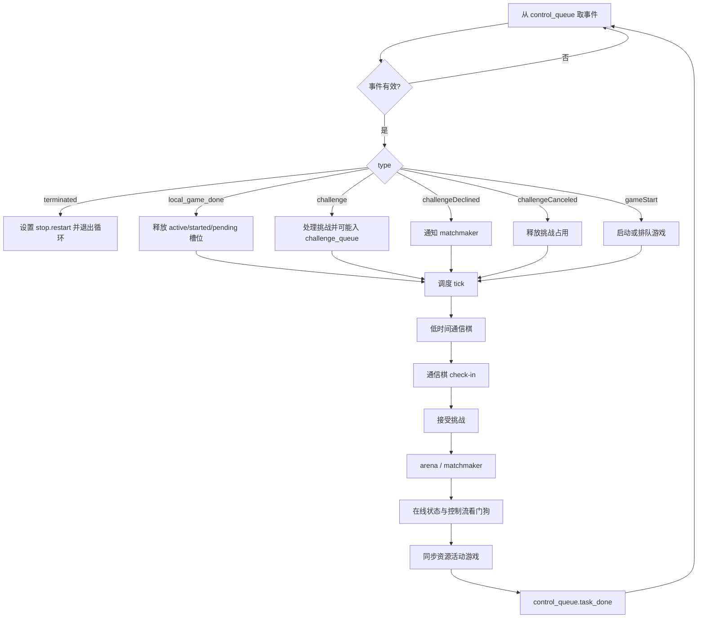

本页位于“深入解析 / 系统架构”中的 **[主循环、事件流与多进程任务协作](17-zhu-xun-huan-shi-jian-liu-yu-duo-jin-cheng-ren-wu-xie-zuo)**，聚焦 lichess-bot 在启动后如何把 Lichess 账号级事件流、本地定时事件、游戏工作进程、日志写入、PGN 写入与资源监控组织成一个可持续运行的主循环；不展开挑战规则、游戏内部走法策略或 API 重试细节，那些主题分别属于 [挑战接收规则：变体、时限、评级与并发](9-tiao-zhan-jie-shou-gui-ze-bian-ti-shi-xian-ping-ji-yu-bing-fa)、[游戏生命周期：从挑战到对局结束](18-you-xi-sheng-ming-zhou-qi-cong-tiao-zhan-dao-dui-ju-jie-shu) 与 [Lichess Bot API 封装与请求重试策略](28-lichess-bot-api-feng-zhuang-yu-qing-qiu-zhong-shi-ce-lue)。Sources: [lichess-bot.py](lichess-bot.py#L1-L6), [lichess_bot.py](lib/lichess_bot.py#L304-L365)

## 架构假设与验证结论

从第一性原理看，这个程序需要同时处理三类节奏不同的工作：账号级事件流是长连接输入，单局对弈是可能阻塞且耗时的工作，日志、PGN 与资源采样是跨进程副作用；代码中的实际模式是 **单一主循环调度 + 多个后台进程生产事件或消费副作用 + 进程池执行对局**。启动入口 `lichess-bot.py` 只调用 `start_program()`，随后 `start_program()` 设置 multiprocessing 的 `"spawn"` 启动方式，并在需要重启时循环调用 `start_lichess_bot()`；真正的运行拓扑在 `start()` 中建立。Sources: [lichess-bot.py](lichess-bot.py#L1-L6), [lichess_bot.py](lib/lichess_bot.py#L1417-L1435), [lichess_bot.py](lib/lichess_bot.py#L304-L365)

下面的关系图描述的是 `start()` 创建的运行时结构：主进程拥有 `lichess_bot_main()` 主循环；控制流监听进程、看门狗进程与通信棋检查进程向 `control_queue` 写入事件；对局通过 `multiprocessing.pool.Pool` 异步执行 `play_game()`；日志与 PGN 通过独立队列交给专门监听进程处理。Sources: [lichess_bot.py](lib/lichess_bot.py#L318-L352), [lichess_bot.py](lib/lichess_bot.py#L456-L525), [lichess_bot.py](lib/lichess_bot.py#L658-L678)

```mermaid
flowchart LR
    Lichess[Lichess 账号事件流] --> CS[control stream 进程<br/>watch_control_stream]
    CS --> CQ[(control_queue)]

    WD[watchdog 进程<br/>do_control_stream_watchdog_tick] --> CQ
    CP[correspondence pinger 进程<br/>do_correspondence_ping] --> CQ

    CQ --> Main[主进程<br/>lichess_bot_main]

    Main --> Pool[进程池<br/>Pool(max_games + 1)]
    Pool --> G1[play_game worker]
    Pool --> G2[play_game worker]

    G1 --> CQ
    G2 --> CQ
    G1 --> PGNQ[(pgn_queue)]
    G2 --> PGNQ[(pgn_queue)]
    G1 --> LogQ[(logging_queue)]
    G2 --> LogQ[(logging_queue)]

    LogQ --> LL[logging listener 进程]
    PGNQ --> PL[PGN writer 进程]

    Main --> RAG[(resource_active_games)]
    RAG --> RM[resource monitor 进程]
```

## 启动阶段：从入口到运行时拓扑

启动路径非常短：顶层脚本只导入并调用 `start_program()`；`start_program()` 首先把 multiprocessing start method 设为 `"spawn"`，然后以 `should_restart()` 为条件进入重启循环，每次运行前调用 `disable_restart()`，如果捕获 `RequestException` 则设置 `stop.restart = True` 并记录“因网络错误重启”。当收到终止或强制退出标记时，循环结束。Sources: [lichess-bot.py](lichess-bot.py#L1-L6), [lichess_bot.py](lib/lichess_bot.py#L93-L100), [lichess_bot.py](lib/lichess_bot.py#L1417-L1435)

`start_lichess_bot()` 负责命令行参数、日志初始化、配置加载、引擎配置检查、Python 版本检查、Lichess 客户端创建与用户资料获取；只有当账号是 BOT，或通过 `-u` 成功升级为 BOT 后，才调用 `start()` 进入运行期。这意味着主循环开始前已经完成配置与身份前置校验。Sources: [lichess_bot.py](lib/lichess_bot.py#L1341-L1381)

`start()` 是多进程协作的装配点：它创建 `multiprocessing.Manager()`，再基于 manager 创建共享的 `challenge_queue`、`control_queue`、`correspondence_queue`、`logging_queue`、`pgn_queue` 与 `resource_active_games`；随后启动控制流监听进程、控制流看门狗进程、通信棋定时 ping 进程、日志监听进程、PGN 写入进程与可选资源监控进程，最后调用 `lichess_bot_main()`。Sources: [lichess_bot.py](lib/lichess_bot.py#L317-L365)

`start()` 还定义了退出清理顺序：无论主循环如何结束，`finally` 块都会终止并 join 控制流监听、看门狗、通信棋 pinger、日志监听、PGN 监听与资源监控进程；在重新配置主进程日志前，它还 `sleep(1.0)` 以允许日志队列中的最终消息被处理。Sources: [lichess_bot.py](lib/lichess_bot.py#L366-L381)

## 运行时组件职责表

下表按“事件生产、事件消费、任务执行、副作用隔离”划分运行时组件；这里的关键点是，主循环不直接长期阻塞在 Lichess 流或单局引擎搜索中，而是通过队列与进程池维持调度权。Sources: [lichess_bot.py](lib/lichess_bot.py#L128-L157), [lichess_bot.py](lib/lichess_bot.py#L193-L220), [lichess_bot.py](lib/lichess_bot.py#L267-L301), [lichess_bot.py](lib/lichess_bot.py#L456-L525)

| 组件 | 创建位置 | 主要输入 | 主要输出 | 职责边界 |
|---|---|---|---|---|
| `watch_control_stream` 进程 | `spawn_control_stream()` / `start()` | Lichess account event stream | `control_queue` | 把账号级事件与空行 ping 转换成本地事件 |
| `do_control_stream_watchdog_tick` 进程 | `start()` | 固定周期 | `control_queue` | 定期唤醒主循环检查控制流是否静默 |
| `do_correspondence_ping` 进程 | `start()` | `correspondence.checkin_period` | `control_queue` | 定期触发通信棋队列检查 |
| `lichess_bot_main` 主循环 | `start()` | `control_queue` | 进程池任务、挑战接受、状态同步 | 串行化账号级调度决策 |
| `Pool(max_games + 1)` | `lichess_bot_main()` | `start_game_thread()` | `play_game()` worker | 异步执行单局对弈 |
| `logging_listener_proc` 进程 | `start()` | `logging_queue` | logger handlers | 汇总子进程日志 |
| `write_pgn_records` 进程 | `start()` | `pgn_queue` | PGN 文件写入 | 延后处理对局记录落盘 |
| `resource_monitor` 进程 | `start()` | 主进程 PID、活动游戏列表 | 资源监控副作用 | 跟踪运行资源状态 |

## 控制事件流：账号流如何进入主循环

账号级事件流由 `watch_control_stream()` 在独立进程中读取：它调用 `li.get_event_stream()`，遍历 `response.iter_lines()`，非空行被 JSON 解析后放入 `control_queue`，空行则转换为 `{"type": "ping"}`；如果遇到 HTTP、读取超时、远端断开、chunked 编码或 requests 连接错误，并且程序未终止，它会记录断线并在 1 秒后重连。Sources: [lichess_bot.py](lib/lichess_bot.py#L128-L150)

控制流进程由 `spawn_control_stream()` 创建并启动；`ControlStreamState` 保存当前进程对象和最近活动计时器，`restart_control_stream()` 会在进程存活时先 terminate，再 join，随后重新 spawn 并重置计时器。这为主循环后续的静默检测提供了可替换的 watcher 状态。Sources: [lichess_bot.py](lib/lichess_bot.py#L80-L86), [lichess_bot.py](lib/lichess_bot.py#L153-L178)

并非所有进入 `control_queue` 的事件都来自 Lichess 控制流。`is_control_stream_event()` 明确把 `local_game_done`、`correspondence_ping` 与 `watchdog_tick` 排除在控制流事件之外；因此主循环只用真实账号流事件刷新 `last_activity`，避免本地定时事件掩盖控制流静默。Sources: [lichess_bot.py](lib/lichess_bot.py#L181-L190), [lichess_bot.py](lib/lichess_bot.py#L467-L469)

## 主循环：一个事件驱动的串行调度器

`lichess_bot_main()` 初始化并发上限 `max_games = config.challenge.concurrency`，读取当前 ongoing games，剪裁悔棋记录，把启动时的通信棋与非通信棋分开：通信棋进入 `startup_correspondence_games`，非通信棋进入 `active_games`；同时维护 `started_games` 与 `pending_games`，并把 `active_games` 同步给资源监控共享列表。Sources: [lichess_bot.py](lib/lichess_bot.py#L421-L436), [lichess_bot.py](lib/lichess_bot.py#L947-L961), [lichess_bot.py](lib/lichess_bot.py#L528-L530)

主循环用 `with multiprocessing.pool.Pool(max_games + 1) as pool` 创建对局任务池，然后在未终止、未完成 one-game、未要求重启时反复调用 `next_event(control_queue)`；`next_event()` 会阻塞获取队列事件，过滤 `None` 与缺少 `type` 的对象，并对非 ping 事件输出 debug 日志。Sources: [lichess_bot.py](lib/lichess_bot.py#L456-L460), [lichess_bot.py](lib/lichess_bot.py#L542-L560)

事件分派的核心是一个显式条件链：`terminated` 会触发 `stop.restart = True` 并 break；`local_game_done` 会从 `active_games`、`started_games` 与 `pending_games` 移除游戏并通知 matchmaker；`challenge` 进入挑战处理；`challengeDeclined` 与 `challengeCanceled` 更新 matchmaker 或释放活动槽位；`gameStart` 则进入游戏启动逻辑。Sources: [lichess_bot.py](lib/lichess_bot.py#L462-L505)

每处理一个有效事件后，主循环都会执行一组“调度 tick”：优先启动低剩余时间通信棋，检查通信棋队列，接受排队挑战，推进 arena manager，推进 matchmaker，检查在线状态，检查控制流静默，并同步资源监控活动游戏列表；最后调用 `control_queue.task_done()`。Sources: [lichess_bot.py](lib/lichess_bot.py#L506-L523)

下面的流程图展示的是主循环的单次事件处理周期：它并不是为每种后台任务创建独立复杂状态机，而是把后台信号统一收敛成队列事件，再由主循环在一个串行位置更新全局调度状态。Sources: [lichess_bot.py](lib/lichess_bot.py#L456-L525)



## 多进程任务协作：进程池如何承载单局游戏

单局游戏不是由主循环直接运行，而是由 `start_game_thread()` 把 `game_id` 加入 `active_games` 与 `started_games`，记录进程占用日志，把 `game_id` 写入 `play_game_args`，然后通过 `pool.apply_async(play_game, kwds=play_game_args, error_callback=game_error_handler)` 异步提交。Sources: [lichess_bot.py](lib/lichess_bot.py#L658-L678)

`play_game()` worker 启动后首先把日志改接到 `logging_queue`，随后打开指定游戏的 Lichess game stream，读取初始 `gameFull` 状态，构建 `model.Game`，并在 `engine_wrapper.create_engine(config, game)` 上下文中运行单局事件循环；也就是说，游戏流与引擎生命周期都被隔离在进程池 worker 内。Sources: [lichess_bot.py](lib/lichess_bot.py#L760-L823)

游戏 worker 在内部循环中处理 `chatLine`、`gameState` 与 ping：聊天交给 `Conversation.react()`，`gameState` 会更新棋局状态、重建棋盘、判断是否轮到引擎走棋，必要时调用 `engine.play_move()`；如果游戏结束则记录结果并发送告别消息；如果 ping 时满足退出条件，则结束单局循环。Sources: [lichess_bot.py](lib/lichess_bot.py#L846-L904)

worker 结束时不会直接修改主循环的 `active_games` 集合，而是通过 `final_queue_entries()` 向 `control_queue` 写入 `{"type": "local_game_done", "game": {"id": game.id}}`，并向 `pgn_queue` 写入包含 PGN 文本与是否完成的事件；如果这是未结束的通信棋，还会把游戏 ID 放回 `correspondence_queue` 供后续恢复。Sources: [lichess_bot.py](lib/lichess_bot.py#L1069-L1085), [lichess_bot.py](lib/lichess_bot.py#L918-L923)

如果 `play_game()` 异步任务异常，`start_game_thread()` 内部的 `game_error_handler()` 会记录异常，向 `control_queue` 补发 `local_game_done`，并向 `pgn_queue` 写入从 Lichess 获取的 PGN 与当前是否仍活动的状态；这保证主循环可以释放并发槽位。Sources: [lichess_bot.py](lib/lichess_bot.py#L666-L678), [lichess_bot.py](lib/lichess_bot.py#L650-L655)

## 去重与并发槽位：active、started、pending 的分工

主循环维护三个集合来避免重复启动与错误占位：`active_games` 表示当前占用并发容量的游戏或已接受挑战，`started_games` 表示已经提交给进程池的 worker，`pending_games` 表示已经被延后但尚未启动的通信棋。`local_game_done` 与 `challengeCanceled` 都会从这些集合中移除对应 ID。Sources: [lichess_bot.py](lib/lichess_bot.py#L430-L435), [lichess_bot.py](lib/lichess_bot.py#L470-L492)

`start_game()` 在处理 `gameStart` 时首先检查 `game_id in started_games or game_id in pending_games`，命中则记录“忽略重复 gameStart”并返回；测试用例覆盖了已经 active 且 started 的重复启动、新游戏启动、已 reserved 但未 started 的首次启动、以及通信棋 pending 队列去重。Sources: [lichess_bot.py](lib/lichess_bot.py#L681-L719), [test_main_loop.py](test_bot/test_main_loop.py#L7-L64), [test_main_loop.py](test_bot/test_main_loop.py#L86-L104)

当启动时已有通信棋时，`start_game()` 会把游戏加入 `pending_games`；如果 `enough_time_to_queue()` 判断可以等待，则写入 `correspondence_queue`，否则写入 `low_time_games` 以便尽快启动；非启动期通信棋或普通游戏则直接调用 `start_game_thread()`。Sources: [lichess_bot.py](lib/lichess_bot.py#L704-L727)

低时间通信棋由 `start_low_time_games()` 处理：它按 `secondsLeft` 从小到大排序，只要 `active_games` 未达到 `max_games` 就弹出并启动，同时从 `pending_games` 移除；对应测试验证 worker 启动后 pending 状态会被清除。Sources: [lichess_bot.py](lib/lichess_bot.py#L594-L601), [test_main_loop.py](test_bot/test_main_loop.py#L107-L117)

## 通信棋协作：定时 ping、队列与容量让渡

通信棋检查由独立进程 `do_correspondence_ping()` 周期性产生 `{"type": "correspondence_ping"}`，周期来自 `config.correspondence.checkin_period`；该事件进入主循环后不会立即无条件启动所有通信棋，而是由 `check_in_on_correspondence_games()` 根据队列大小、挑战队列与并发容量逐步调度。Sources: [lichess_bot.py](lib/lichess_bot.py#L193-L202), [lichess_bot.py](lib/lichess_bot.py#L326-L330), [lichess_bot.py](lib/lichess_bot.py#L566-L592)

`check_in_on_correspondence_games()` 的策略是：收到 `correspondence_ping` 时记录当前 `correspondence_queue.qsize()`；如果事件不是 `local_game_done` 也不是 `correspondence_ping`，则直接返回；如果还有挑战队列，则不启动通信棋；否则在 `len(active_games) < max_games` 且仍有待启动通信棋数量时，从队列取出 game_id、清除 pending、提交 worker。Sources: [lichess_bot.py](lib/lichess_bot.py#L578-L592)

这个设计体现了一个明确优先级：普通挑战与实时容量优先，通信棋通过周期性检查和 `local_game_done` 后的容量释放被恢复。测试覆盖了通信棋 queued 后不重复启动，以及 check-in 启动 worker 后移除 pending。Sources: [lichess_bot.py](lib/lichess_bot.py#L583-L592), [test_main_loop.py](test_bot/test_main_loop.py#L86-L104), [test_main_loop.py](test_bot/test_main_loop.py#L120-L140)

## 控制流看门狗：本地 tick 如何避免静默假死

控制流看门狗由 `do_control_stream_watchdog_tick()` 实现，它每隔 `CONTROL_STREAM_WATCHDOG_PERIOD` 秒向 `control_queue` 写入 `{"type": "watchdog_tick"}`；该周期常量为 5 秒，静默超时常量为 5 分钟。Sources: [lichess_bot.py](lib/lichess_bot.py#L75-L78), [lichess_bot.py](lib/lichess_bot.py#L181-L185)

主循环每轮都会调用 `ensure_control_stream_live()`；该函数如果 `last_activity` 未过期就返回，否则计算静默秒数、记录警告并调用 `restart_control_stream()` 替换 watcher 进程。由于 `watchdog_tick` 被 `is_control_stream_event()` 排除，它只负责唤醒检查，不会刷新真实控制流活动时间。Sources: [lichess_bot.py](lib/lichess_bot.py#L170-L178), [lichess_bot.py](lib/lichess_bot.py#L188-L190), [lichess_bot.py](lib/lichess_bot.py#L517-L520)

## 日志与 PGN：副作用从 worker 中抽离

日志采用队列汇聚：`logging_listener_proc()` 在独立进程中配置真实 handler，然后循环从 `logging_queue` 取 `LogRecord` 并调用 `logger.handle(task)`；worker 侧调用 `thread_logging_configurer()` 清空 root handlers，安装 `logging.handlers.QueueHandler(queue)`，从而把子进程日志送回主日志监听进程。Sources: [lichess_bot.py](lib/lichess_bot.py#L267-L301), [lichess_bot.py](lib/lichess_bot.py#L332-L338), [lichess_bot.py](lib/lichess_bot.py#L783-L784)

PGN 写入也通过队列隔离：`write_pgn_records()` 持续从 `pgn_queue` 获取事件，调用 `save_pgn_record()`，并在处理后 `task_done()`；`save_pgn_record()` 根据 PGN header、配置目录与分组规则创建目录并写入或追加 PGN 文件。Sources: [lichess_bot.py](lib/lichess_bot.py#L205-L220), [lichess_bot.py](lib/lichess_bot.py#L340-L345), [lichess_bot.py](lib/lichess_bot.py#L1286-L1313)

## 资源监控：主循环同步活动游戏视图

资源监控进程由 `resource_monitor.start_resource_monitor(os.getpid(), resource_active_games, config.resource_monitor)` 创建，主循环通过 `sync_resource_active_games()` 把当前 `active_games` 排序后写入共享 list；同步发生在启动初始化和每次事件处理后的调度 tick 末尾。Sources: [lichess_bot.py](lib/lichess_bot.py#L347-L350), [lichess_bot.py](lib/lichess_bot.py#L435-L436), [lichess_bot.py](lib/lichess_bot.py#L520-L530)

这个共享列表不是调度真相源，调度真相仍是主循环内的 `active_games`、`started_games` 与 `pending_games`；资源监控只是读取主循环发布的活动游戏快照。Sources: [lichess_bot.py](lib/lichess_bot.py#L430-L436), [lichess_bot.py](lib/lichess_bot.py#L528-L530)

## 退出与重启：主循环、进程池与外层 supervisor 的边界

主循环结束后调用 `close_pool(pool, active_games, config)`；如果 `config.quit_after_all_games_finish` 为真，它会在仍有 active game 时记录等待信息，然后 `pool.close()` 并 `pool.join()`，否则函数不主动等待进程池中所有游戏完成。Sources: [lichess_bot.py](lib/lichess_bot.py#L525-L539)

信号处理通过全局 `stop` 状态控制：第一次 SIGINT 设置 `stop.terminated = True`，第二次 SIGINT 设置 `stop.force_quit = True`；如果配置了 `quit_after_all_games_finish`，主循环启动时还会提示退出时等待运行中游戏完成以及二次 Ctrl-C 可立即退出。Sources: [lichess_bot.py](lib/lichess_bot.py#L103-L113), [lichess_bot.py](lib/lichess_bot.py#L452-L455)

外层 `start_program()` 是重启 supervisor：当 `watch_control_stream()` 放入 `terminated` 事件时，主循环设置 `stop.restart = True`；当 `start_lichess_bot()` 因 requests 异常退出时，外层也会设置重启，并在仍需重启时等待 10 秒。Sources: [lichess_bot.py](lib/lichess_bot.py#L150-L157), [lichess_bot.py](lib/lichess_bot.py#L462-L465), [lichess_bot.py](lib/lichess_bot.py#L1417-L1432)

## 模式对照：为什么这里是“事件汇聚”而不是“到处回调”

下面的表格总结了该页涉及的核心并发模式。对中级开发者最重要的判断是：主循环持有账号级调度状态，后台进程只生产事件、执行单局或消费副作用；跨进程状态变化尽量通过队列回流到主循环。Sources: [lichess_bot.py](lib/lichess_bot.py#L456-L525), [lichess_bot.py](lib/lichess_bot.py#L658-L678), [lichess_bot.py](lib/lichess_bot.py#L1069-L1085)

| 模式 | 在代码中的体现 | 解决的问题 | 需要注意的边界 |
|---|---|---|---|
| 事件汇聚 | `control_queue` + `next_event()` | 把 Lichess 流、本地 ping、worker 完成事件统一串行处理 | 本地 tick 不等于真实控制流活动 |
| worker 隔离 | `Pool.apply_async(play_game)` | 避免单局游戏阻塞账号级事件处理 | worker 完成必须回写 `local_game_done` |
| 容量令牌 | `active_games` + `max_games` | 控制并发游戏数 | 已接受挑战也会先占用 active slot |
| 启动去重 | `started_games` + `pending_games` | 避免重复 `gameStart` 产生多个 worker | reserved 但未 started 的首次事件仍可启动 |
| 副作用队列 | `logging_queue` / `pgn_queue` | 避免多个进程直接争用日志与文件写入 | listener 由 `start()` 统一生命周期管理 |
| 静默恢复 | `ControlStreamState` + watchdog tick | 控制流长连接静默时重启 watcher | `watchdog_tick` 不刷新 `last_activity` |

## 阅读建议

如果你想理解一个 `gameStart` 之后单局内部如何从 `gameFull`、`gameState` 到结束事件，请继续阅读 [游戏生命周期：从挑战到对局结束](18-you-xi-sheng-ming-zhou-qi-cong-tiao-zhan-dao-dui-ju-jie-shu)；如果你更关心控制流断线、watchdog 与优雅退出的细节，请阅读 [控制流看门狗、断线重连与优雅退出](19-kong-zhi-liu-kan-men-gou-duan-xian-zhong-lian-yu-you-ya-tui-chu)。Sources: [lichess_bot.py](lib/lichess_bot.py#L760-L923), [lichess_bot.py](lib/lichess_bot.py#L170-L185), [lichess_bot.py](lib/lichess_bot.py#L366-L381)

如果你正在调整并发容量、通信棋恢复频率或生产环境进程管理，应在理解本页的主循环调度边界后，再阅读 [资源监控、性能调优与并发容量规划](32-zi-yuan-jian-kong-xing-neng-diao-you-yu-bing-fa-rong-liang-gui-hua) 与 [生产部署：多机器人、后台运行与日志管理](31-sheng-chan-bu-shu-duo-ji-qi-ren-hou-tai-yun-xing-yu-ri-zhi-guan-li)。Sources: [lichess_bot.py](lib/lichess_bot.py#L421-L436), [lichess_bot.py](lib/lichess_bot.py#L347-L350), [lichess_bot.py](lib/lichess_bot.py#L604-L617)