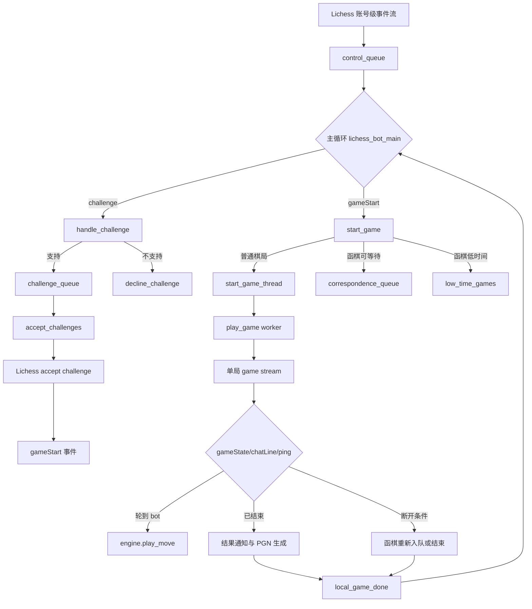
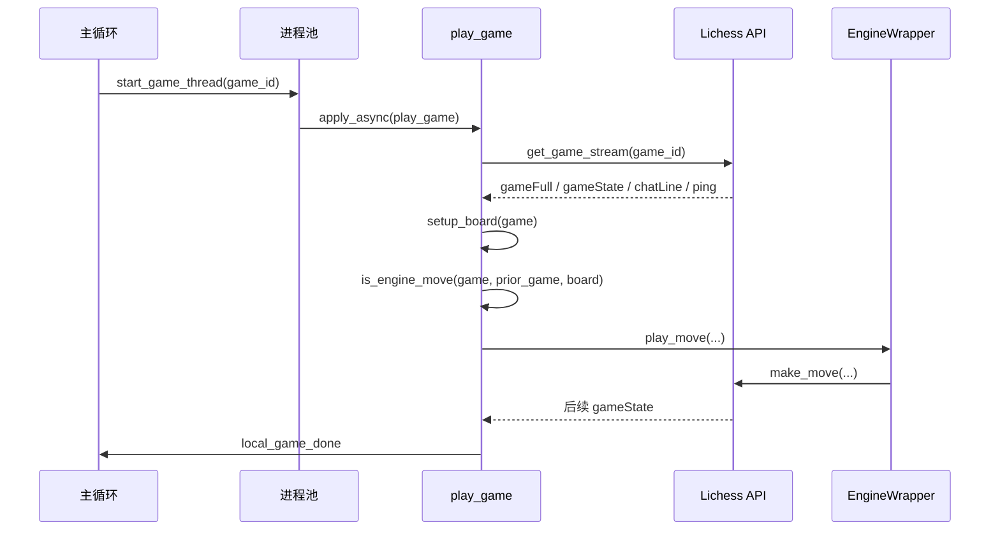

本页解释 lichess-bot 中一盘棋从 **账号级事件流中的 challenge 事件**，经过挑战筛选、排队、接受、gameStart 启动、单局流处理、引擎出招，到最终记录结果并释放并发槽位的完整生命周期。边界上，本页只描述“单盘游戏如何进入、运行、退出生命周期”；控制流看门狗、通用 API 重试、聊天策略、PGN 运维细节和引擎内部搜索策略只在它们影响生命周期节点时被提及。Sources: [lichess_bot.py](lib/lichess_bot.py#L395-L525), [lichess_bot.py](lib/lichess_bot.py#L761-L925)

## 生命周期总览：两个流、两个队列、一组状态集

lichess-bot 的游戏生命周期由 **账号级控制流** 与 **单局游戏流** 分层驱动：账号级流产生 `challenge`、`gameStart`、`challengeCanceled` 等事件并进入主循环；单局游戏流在独立 worker 中读取 `gameFull` / `gameState` / `chatLine` 更新。主循环维护 `challenge_queue`、`correspondence_queue`、`active_games`、`started_games`、`pending_games`，用这些结构把“是否可接挑战”“是否已占用并发”“是否已启动 worker”“函棋是否暂缓”区分开。Sources: [lichess_bot.py](lib/lichess_bot.py#L421-L436), [lichess_bot.py](lib/lichess_bot.py#L443-L456), [lichess_bot.py](lib/lichess_bot.py#L470-L521)

上图中的关键模式是 **主循环只负责调度，单局 worker 负责对局推进**。`watch_control_stream` 把 Lichess 账号事件写入 `control_queue`，主循环从 `next_event` 取事件并根据类型分派；真正对弈由 `start_game_thread` 通过进程池异步调用 `play_game` 完成，worker 完成后再向 `control_queue` 投递 `local_game_done`，由主循环释放 `active_games`、`started_games`、`pending_games`。Sources: [lichess_bot.py](lib/lichess_bot.py#L128-L150), [lichess_bot.py](lib/lichess_bot.py#L542-L560), [lichess_bot.py](lib/lichess_bot.py#L658-L679), [lichess_bot.py](lib/lichess_bot.py#L470-L476)

## 生命周期状态与责任边界

| 阶段 | 触发事件或条件 | 主要函数 | 状态结构 | 生命周期含义 |
|---|---|---|---|---|
| 收到挑战 | `event["type"] == "challenge"` | `handle_challenge` | `challenge_queue` | 把外部挑战转换为领域对象并决定排队或拒绝 |
| 接受挑战 | 有空闲并发槽且队列非空 | `accept_challenges` | `active_games` | 调用 Lichess 接受挑战，并预占用并发槽 |
| 启动对局 | `event["type"] == "gameStart"` | `start_game` / `start_game_thread` | `started_games`、`pending_games` | 决定立即启动 worker，还是函棋排队等待 |
| 推进对局 | 单局流出现 `gameState` | `play_game` | `Game.state`、`prior_game` | 更新棋盘，判断是否轮到 bot，并调用引擎出招 |
| 退出对局 | 游戏结束、函棋断开、超时/流结束 | `should_exit_game` / `final_queue_entries` | `correspondence_queue`、`pgn_queue` | 结束 worker、保存记录、通知主循环释放槽位 |

这张表体现了代码中的 **生命周期守恒关系**：主循环中的 `active_games` 代表占用的并发资源，`started_games` 代表已经有 worker 处理的棋局，`pending_games` 代表已经被主循环识别但尚未真正启动的棋局；当收到 `local_game_done` 时，三个集合都会尝试移除对应 game id，从而让新的挑战、函棋或主动配对有机会进入。Sources: [lichess_bot.py](lib/lichess_bot.py#L470-L476), [lichess_bot.py](lib/lichess_bot.py#L604-L619), [lichess_bot.py](lib/lichess_bot.py#L681-L720)

## 挑战进入：从 challenge 事件到接收或拒绝

挑战进入生命周期的第一步是 `handle_challenge`。它用账号事件中的 `event["challenge"]` 构造 `model.Challenge`，如果挑战来自自己则直接返回；否则会读取当前进行中的对局，统计每个对手的并发参与数，再叠加已排队挑战中的对手，用于后续限制同一对手的同时游戏数量。Sources: [lichess_bot.py](lib/lichess_bot.py#L730-L741), [model.py](lib/model.py#L22-L42)

`Challenge.is_supported` 是挑战准入的集中判断点。它按顺序检查 bot/人类限制、时间控制、变体、rated/casual 模式、评分范围、本地 block list、在线 block list、允许名单、近期 bot 对局频率、同一对手并发上限，以及 `extra_game_handlers.is_supported_extra` 扩展条件；一旦某项失败，就返回 Lichess decline reason，例如 `timeControl`、`variant`、`later` 或 `generic`。Sources: [model.py](lib/model.py#L128-L162)

如果挑战被支持，`handle_challenge` 会把 `Challenge` 放入 `challenge_queue` 并调用 `sort_challenges`；如果配置了近期 bot 挑战窗口，还会为该对手记录一个 `Timer`，用于限制短时间内反复与同一 bot 对局。若挑战不被支持，代码调用 `li.decline_challenge(chlng.id, reason=decline_reason)`，Lichess API 封装会向 `/api/challenge/{}/decline` POST 表单化的拒绝原因，并且 suppress 异常。Sources: [lichess_bot.py](lib/lichess_bot.py#L742-L756), [lichess_bot.py](lib/lichess_bot.py#L634-L647), [lichess.py](lib/lichess.py#L422-L428)

## 挑战队列：排序、并发槽与接受动作

挑战不是在 `handle_challenge` 中立即接受，而是进入 `challenge_queue`，由主循环每轮调用 `accept_challenges` 统一处理。`accept_challenges` 的循环条件是 `len(active_games) < max_games and challenge_queue`，其中 `max_games` 来自 `config.challenge.concurrency`；这意味着并发容量是挑战进入游戏阶段的硬门槛。Sources: [lichess_bot.py](lib/lichess_bot.py#L421-L421), [lichess_bot.py](lib/lichess_bot.py#L516-L516), [lichess_bot.py](lib/lichess_bot.py#L604-L607)

队列顺序由 `sort_challenges` 决定：如果 `sort_by == "best"`，挑战会按 `Challenge.score()` 降序排序；如果设置了 `preference`，还会按对手是否为 bot 重新排序，以优先人类或 bot。`Challenge.score()` 本身由对手 rating、rated bonus、头衔 bonus 组成，因此“best”排序并不是单纯到达时间排序。Sources: [lichess_bot.py](lib/lichess_bot.py#L634-L647), [model.py](lib/model.py#L164-L170)

接受挑战时，`accept_challenges` 会跳过 `from_self` 的挑战，然后调用 `li.accept_challenge(chlng.id)`；成功后立刻把 challenge id 加入 `active_games` 并记录“Queued”。这个提前占槽设计使机器人在等待后续 `gameStart` 事件期间不会继续超额接受其他挑战。Sources: [lichess_bot.py](lib/lichess_bot.py#L604-L617), [lichess.py](lib/lichess.py#L418-L420)

## gameStart：普通棋局立即启动，函棋按时间分流

`gameStart` 事件进入主循环后调用 `start_game`。函数首先取出 `event["game"]["id"]`，如果该 id 已在 `started_games` 或 `pending_games` 中，就记录并忽略重复事件；这避免同一个游戏被多个 worker 重复处理。Sources: [lichess_bot.py](lib/lichess_bot.py#L493-L504), [lichess_bot.py](lib/lichess_bot.py#L681-L707)

普通棋局会直接进入 `start_game_thread`，该函数把 game id 加入 `active_games` 与 `started_games`，然后通过 `pool.apply_async(play_game, kwds=play_game_args, error_callback=game_error_handler)` 异步运行单局 worker。若 worker 出错，错误回调会投递 `local_game_done` 并尝试把 Lichess 导出的 PGN 放入 `pgn_queue`。Sources: [lichess_bot.py](lib/lichess_bot.py#L658-L679)

函棋有额外分流逻辑：启动时已有的 correspondence games 会进入 `startup_correspondence_games`；如果 `enough_time_to_queue` 判定“不是我方回合”或剩余秒数大于 `(checkin_period + move_time) * 10`，就放入 `correspondence_queue` 等待周期性 check-in；否则加入 `low_time_games`，表示需要尽快启动。Sources: [lichess_bot.py](lib/lichess_bot.py#L425-L436), [lichess_bot.py](lib/lichess_bot.py#L709-L727)

## 单局 worker：打开游戏流并建立 Game 领域对象

`play_game` 是单局生命周期的执行核心。它首先配置子进程日志，然后通过 `li.get_game_stream(game_id)` 打开 Lichess bot game stream，并读取第一条完整状态作为 `initial_state`；`stream_state` 会把 `gameFull` 的 `state` 字段提取为统一的游戏状态结构。Sources: [lichess_bot.py](lib/lichess_bot.py#L761-L811), [lichess.py](lib/lichess.py#L414-L416)

`model.Game` 用初始状态固定一盘棋的领域身份：id、速度、clock initial/increment、perf、variant、rated/casual、白黑玩家、initial FEN、当前 state、bot 所执颜色、对手对象、Lichess URL、开局时间，以及 abort/terminate/disconnect 三个计时器。这个对象是后续“是否轮到我方”“是否可 abort”“剩余时间”“结果是什么”等判断的共同数据源。Sources: [model.py](lib/model.py#L195-L224), [model.py](lib/model.py#L226-L243)

在创建 `Game` 后，`play_game` 通过 `engine_wrapper.create_engine(config, game)` 创建引擎上下文，调用 `engine.get_opponent_info(game)`，再创建 `Conversation`。随后它初始化函棋判断、ponder 能力、move overhead、rate limiting delay、takeback 记录、问候语关键字映射、初始棋盘、`prior_game` 和由初始状态加后续流组成的 `game_stream`。Sources: [lichess_bot.py](lib/lichess_bot.py#L813-L850)

## 单局循环：从 gameState 到引擎走子

单局主循环在 `stay_in_game` 为真、没有强制退出，并且普通退出策略允许继续时运行。每轮调用 `next_update(game_stream)` 读取一条流更新；空行被视为 `ping`，非空 JSON 会进入 `chatLine`、`gameState` 或 ping/退出判断分支。Sources: [lichess_bot.py](lib/lichess_bot.py#L852-L865), [lichess_bot.py](lib/lichess_bot.py#L998-L1004)

收到 `gameState` 后，代码把 `game.state` 更新为最新状态，并调用 `setup_board(game)` 从 variant、initial FEN 和 `state["moves"]` 重建 python-chess 棋盘。Chess960、From Position 和普通变体分别走不同初始化路径，之后逐个 `push_uci` 已有走法；非法走法会被记录并忽略。Sources: [lichess_bot.py](lib/lichess_bot.py#L864-L867), [lichess_bot.py](lib/lichess_bot.py#L1007-L1025)

是否该引擎出招由两个条件共同决定：`game_changed(game, prior_game)` 确认走法字符串相对上一状态发生变化，`bot_to_move(game, board)` 确认棋盘轮到 bot 所执颜色。这样可以避免在 draw offer、takeback offer 等非走法状态变化时重复让引擎走子。Sources: [lichess_bot.py](lib/lichess_bot.py#L1028-L1041), [lichess_bot.py](lib/lichess_bot.py#L1088-L1095)

一旦判定轮到 bot，worker 会设置函棋 disconnect 时间、发送问候、打印回合号、启动 setup timer，然后调用 `engine.play_move`，传入棋盘、Game、Lichess API、计时器、move overhead、ponder 能力、是否函棋、函棋 move_time、引擎配置和 fake think time。走子后还会按 `rate_limiting_delay` sleep，以控制提交走法的节奏。Sources: [lichess_bot.py](lib/lichess_bot.py#L869-L885)

该交互图强调单局 worker 是 **流式状态机**：它不从主循环轮询棋盘，而是直接消费 Lichess game stream；出招动作通过引擎封装完成，最终由 Lichess API 的 `make_move` 将 UCI move POST 到 `/api/bot/game/{}/move/{}`，并携带是否提议求和的参数。Sources: [lichess_bot.py](lib/lichess_bot.py#L860-L885), [lichess.py](lib/lichess.py#L368-L376)

## 游戏中断、abort 与函棋断开

`Game.ping` 是单局循环里的计时器刷新点。每次处理 `gameState` 后，代码从更新中读取当前执棋方对应的时间与增量，计算 `terminate_time = wbtime + wbinc + 60 秒`，再调用 `game.ping(abort_time, terminate_time, disconnect_time)`；如果棋局仍可 abort，它会刷新 abort timer，同时总是刷新 terminate 与 disconnect timer。Sources: [lichess_bot.py](lib/lichess_bot.py#L898-L902), [model.py](lib/model.py#L251-L262)

退出判断集中在 `should_exit_game`。对于函棋，如果当前不是引擎该走且 disconnect timer 过期，worker 会退出但不视为游戏结束；如果 abort timer 过期，则记录“lack of activity”并调用 `li.abort(game.id)`；如果 terminate timer 过期，则记录终止信息，且在仍可 abort 时调用 abort。Sources: [lichess_bot.py](lib/lichess_bot.py#L1050-L1066), [model.py](lib/model.py#L264-L274), [lichess.py](lib/lichess.py#L406-L408)

流异常也被纳入生命周期。`play_game` 捕获 HTTP、读取超时、远端断开、chunked encoding、requests connection 和 `StopIteration`；随后通过 `game_is_active` 查询当前游戏是否仍在 Lichess 进行中，若还需要继续则关闭旧 response、清空 `game_stream` 并在下一轮重新打开游戏流。Sources: [lichess_bot.py](lib/lichess_bot.py#L905-L917), [lichess_bot.py](lib/lichess_bot.py#L650-L655), [lichess.py](lib/lichess.py#L436-L445)

## 游戏结束：结果识别、告别、PGN 与释放资源

当 `is_game_over(game)` 返回真，即 `game.state["status"] != "started"`，worker 会进入结束分支：调用 `tell_user_game_result` 记录胜负、和棋、超时、认输、abort 等原因；调用 `engine.send_game_result(game, board)` 通知引擎；然后向玩家和观众房间发送 goodbye 文本。Sources: [lichess_bot.py](lib/lichess_bot.py#L886-L890), [lichess_bot.py](lib/lichess_bot.py#L1044-L1047), [lichess_bot.py](lib/lichess_bot.py#L1098-L1135)

结果字符串由 `Game.result()` 根据 `winner` 和 `status` 转换为 PGN Result：白胜为 `1-0`，黑胜为 `0-1`，和棋或无胜者超时为 `1/2-1/2`，其余未完成为 `*`。这使 PGN 生成可以在 Lichess 导出记录缺少或不完整时使用本地状态补齐。Sources: [model.py](lib/model.py#L282-L302), [lichess_bot.py](lib/lichess_bot.py#L1233-L1283)

worker 退出主循环后调用 `try_get_pgn_game_record`。如果配置了 PGN 目录，`pgn_game_record` 会读取 Lichess 导出的 PGN，尝试合并之前写入的同局 PGN 以保留引擎评价，再用当前棋盘走法、Lichess 时钟注释和引擎 commentary 生成最终文本；若出现异常则返回空字符串。Sources: [lichess_bot.py](lib/lichess_bot.py#L918-L920), [lichess_bot.py](lib/lichess_bot.py#L1138-L1153), [lichess_bot.py](lib/lichess_bot.py#L1156-L1209)

最后，`final_queue_entries` 负责把单局生命周期交还给主循环。如果是未结束的函棋，它记录断开并把 game id 重新放入 `correspondence_queue`；否则记录 Game over。无论哪种情况，它都会投递 `local_game_done` 到 `control_queue`，并向 `pgn_queue` 写入 game id、PGN 文本与 `complete` 标志。Sources: [lichess_bot.py](lib/lichess_bot.py#L1069-L1085)

主循环收到 `local_game_done` 后，从 `active_games`、`started_games`、`pending_games` 中移除该 game id，调用 `matchmaker.game_done()`，记录释放的进程数，并在 `one_game` 测试模式下标记已完成。至此，一盘棋的生命周期闭环完成，并发槽位重新可用于后续挑战、函棋恢复或其他调度入口。Sources: [lichess_bot.py](lib/lichess_bot.py#L470-L476), [lichess_bot.py](lib/lichess_bot.py#L506-L521)

## 生命周期中的关键设计取舍

| 设计点 | 代码表现 | 直接收益 | 代价或约束 |
|---|---|---|---|
| 主循环与单局 worker 分离 | `lichess_bot_main` 调度，`play_game` 对弈 | 多局并发时主循环不被单局流阻塞 | 需要通过 `local_game_done` 回传状态 |
| 接受挑战时提前占槽 | `accept_challenges` 成功后 `active_games.add(chlng.id)` | 避免等待 `gameStart` 期间超额接受 | challenge id 与 game id 生命周期需要后续事件校正 |
| `started_games` / `pending_games` 去重 | `start_game` 忽略重复 gameStart | 防止重复 worker | 需要在完成时同时清理多个集合 |
| 函棋可断开再排队 | 未结束函棋回到 `correspondence_queue` | worker 不长期占用慢速游戏 | 需要 check-in 和低时间优先级逻辑 |
| 走法变化检测 | `game_changed` + `bot_to_move` | 避免非走法状态触发重复出招 | 依赖 `state["moves"]` 的字符串差异 |

这些取舍共同形成一个 **事件驱动、资源有界、可恢复** 的生命周期模型：账号级事件决定“哪些游戏应该存在”，单局流决定“这盘游戏下一步做什么”，队列与集合决定“何时占用或释放资源”。Sources: [lichess_bot.py](lib/lichess_bot.py#L456-L525), [lichess_bot.py](lib/lichess_bot.py#L658-L720), [lichess_bot.py](lib/lichess_bot.py#L1069-L1085)

## 与相邻页面的阅读路径

如果你想继续理解主循环为什么能长期运行、断线如何重连、控制流为何需要看门狗，请阅读 [控制流看门狗、断线重连与优雅退出](19-kong-zhi-liu-kan-men-gou-duan-xian-zhong-lian-yu-you-ya-tui-chu)。如果你希望把本页中的 `Challenge`、`Game`、`Player` 对象拆开看字段与约束，请阅读 [挑战、玩家与对局状态建模](20-tiao-zhan-wan-jia-yu-dui-ju-zhuang-tai-jian-mo)。如果你的关注点是并发调度和事件流整体结构，请回到 [主循环、事件流与多进程任务协作](17-zhu-xun-huan-shi-jian-liu-yu-duo-jin-cheng-ren-wu-xie-zuo)。Sources: [lichess_bot.py](lib/lichess_bot.py#L395-L525), [model.py](lib/model.py#L22-L42), [model.py](lib/model.py#L195-L224)