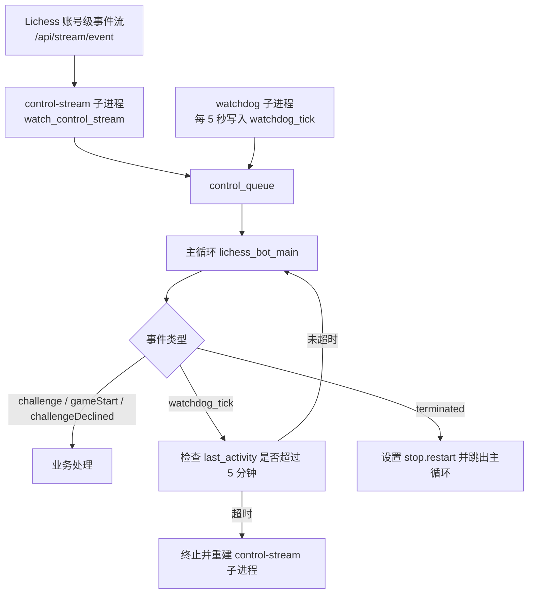
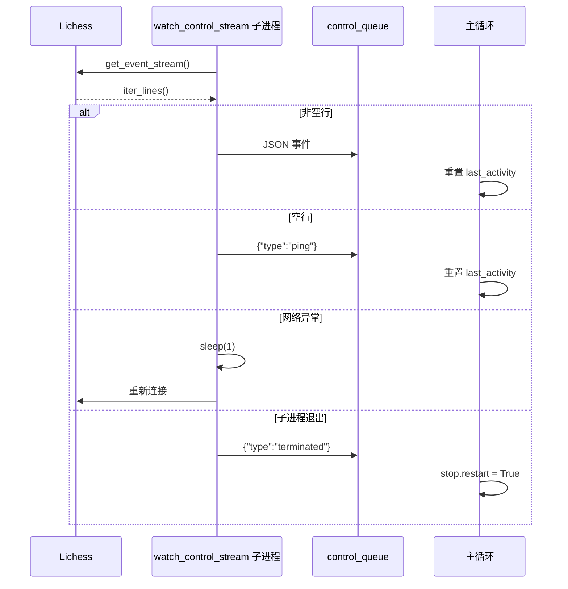
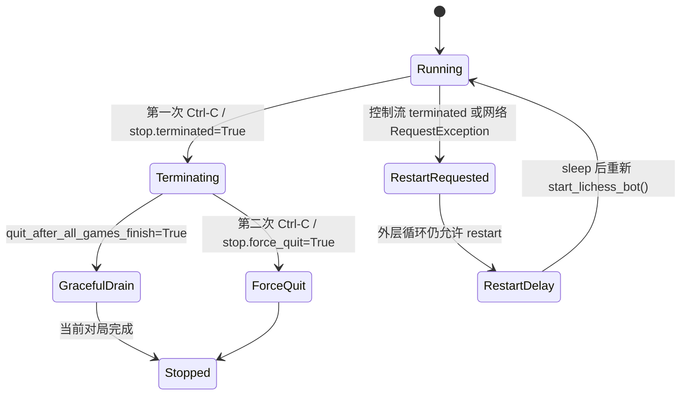

本页位于“深入解析 / 系统架构”中的 **[控制流看门狗、断线重连与优雅退出](19-kong-zhi-liu-kan-men-gou-duan-xian-zhong-lian-yu-you-ya-tui-chu)**，聚焦 lichess-bot 在长连接失效、网络抖动、对局流中断、用户终止信号与进程重启之间的控制流边界。本文不展开挑战规则、对局生命周期或引擎走法生成，而只解释三类可靠性机制：**账号级控制流看门狗**、**账号流与对局流的断线重连**、以及 **SIGINT 驱动的优雅退出与外层重启循环**。Sources: [lib/lichess_bot.py](lib/lichess_bot.py#L75-L113), [lib/lichess_bot.py](lib/lichess_bot.py#L304-L381), [lib/lichess_bot.py](lib/lichess_bot.py#L1417-L1435)

## 架构假设与验证结论

从第一性原理看，这个机器人必须同时满足两个约束：账号级事件流必须持续接收挑战与 `gameStart`，但任何单个流的挂死都不能阻塞主循环；同时，用户按下 Ctrl-C 后应停止新工作，并在需要时等待当前对局收束。代码验证显示，项目采用了 **“独立流进程 + 主循环队列 + 定时 watchdog tick + 全局 stop 状态”** 的组合：账号级流由独立 `multiprocessing.Process` 运行，事件写入 `control_queue`；主循环消费队列并维护 `ControlStreamState.last_activity`；看门狗进程周期性向同一队列写入 `watchdog_tick`，迫使主循环检查控制流是否沉默过久。Sources: [lib/lichess_bot.py](lib/lichess_bot.py#L76-L86), [lib/lichess_bot.py](lib/lichess_bot.py#L128-L190), [lib/lichess_bot.py](lib/lichess_bot.py#L317-L329), [lib/lichess_bot.py](lib/lichess_bot.py#L456-L520)

上图的关键点是：`watchdog_tick` 本身不代表 Lichess 事件，因此不会刷新账号流活跃时间；只有不属于 `local_game_done`、`correspondence_ping`、`watchdog_tick` 的事件才被视为控制流事件并重置 `last_activity`。这避免了 watchdog 自己制造“活跃假象”，使 5 分钟沉默阈值真正衡量 Lichess 账号流是否还在产生 ping 或业务事件。Sources: [lib/lichess_bot.py](lib/lichess_bot.py#L181-L190), [lib/lichess_bot.py](lib/lichess_bot.py#L467-L469), [lib/timer.py](lib/timer.py#L60-L99)

## 控制流看门狗：从“连接还活着”到“主循环能观测到活跃”

控制流看门狗由两个常量定义节奏：`CONTROL_STREAM_WATCHDOG_PERIOD = seconds(5)` 表示每 5 秒唤醒主循环一次，`CONTROL_STREAM_STALL_TIMEOUT = minutes(5)` 表示账号级控制流超过 5 分钟没有真实流事件时被判定为停滞。`ControlStreamState` 只保存两个事实：当前流进程对象，以及上一次真实控制流事件到达后的计时器。Sources: [lib/lichess_bot.py](lib/lichess_bot.py#L75-L86), [lib/timer.py](lib/timer.py#L22-L44), [lib/timer.py](lib/timer.py#L74-L99)

`do_control_stream_watchdog_tick()` 并不直接重启进程，而是在 `stop.terminated` 为假时周期性向 `control_queue` 写入 `{"type": "watchdog_tick"}`。这种设计把重启决策集中在主循环中，避免多个进程同时修改 `ControlStreamState`，并让重启与正常事件处理共享同一个顺序化入口。Sources: [lib/lichess_bot.py](lib/lichess_bot.py#L181-L186), [lib/lichess_bot.py](lib/lichess_bot.py#L456-L520)

`ensure_control_stream_live()` 是实际的判定函数：如果 `last_activity.is_expired()` 为假，它立即返回；如果已过期，则记录控制流空闲秒数，并调用 `restart_control_stream()`。重启函数会先在旧进程仍存活时调用 `terminate()`，随后 `join()` 等待回收，再通过 `spawn_control_stream()` 创建新进程，并重置 `last_activity`。Sources: [lib/lichess_bot.py](lib/lichess_bot.py#L153-L178), [lib/timer.py](lib/timer.py#L84-L98)

| 机制 | 触发者 | 写入或检查对象 | 作用 | 不刷新 `last_activity` 的原因 |
|---|---|---|---|---|
| Lichess 账号流事件 | `watch_control_stream()` | `control_queue` | 传递挑战、对局开始等真实账号事件 | 不适用，它会刷新 |
| 空行 ping | `watch_control_stream()` | `{"type": "ping"}` | 把流心跳转化为可观测事件 | 属于真实账号流事件，因此会刷新 |
| watchdog tick | `do_control_stream_watchdog_tick()` | `{"type": "watchdog_tick"}` | 唤醒主循环执行停滞检查 | 它是本地事件，不证明远端流活跃 |
| 本地对局完成 | `final_queue_entries()` / 错误回调 | `{"type": "local_game_done"}` | 释放主循环中的活跃对局槽位 | 它来自本地工作进程，不证明账号流活跃 |

Sources: [lib/lichess_bot.py](lib/lichess_bot.py#L128-L150), [lib/lichess_bot.py](lib/lichess_bot.py#L181-L190), [lib/lichess_bot.py](lib/lichess_bot.py#L666-L678), [lib/lichess_bot.py](lib/lichess_bot.py#L1069-L1085)

测试覆盖验证了这个意图：短暂的 60 秒静默不会触发重启；过期计时器会导致旧进程被 `terminate()` 与 `join()`，并替换为新进程；最近活跃的控制流不会被误杀。这些测试将“沉默超过阈值才重启”固化为行为契约。Sources: [test_bot/test_control_stream.py](test_bot/test_control_stream.py#L97-L158)

## 账号级事件流的断线重连

账号级事件流由 `watch_control_stream()` 负责，它在 `stop.terminated` 为假时循环打开 `li.get_event_stream()`，并对 `response.iter_lines()` 逐行处理：非空行解码为 JSON 事件后放入 `control_queue`，空行则作为 `{"type": "ping"}` 放入队列。Lichess API 封装中，`get_event_stream()` 对应 `stream_event` 端点，并以 `stream=True` 和 15 秒 timeout 发起请求。Sources: [lib/lichess_bot.py](lib/lichess_bot.py#L128-L150), [lib/lichess.py](lib/lichess.py#L21-L26), [lib/lichess.py](lib/lichess.py#L410-L416)

当账号级流遇到 `HTTPError`、`ReadTimeout`、`RemoteDisconnected`、`ChunkedEncodingError` 或 requests 的连接错误时，如果不是因为终止流程导致的断开，就记录 “Control stream disconnected. Reconnecting.”，休眠 1 秒后继续外层循环；其他未知异常也会记录 traceback 并在 1 秒后重试。也就是说，账号流的瞬时网络错误不会直接杀死机器人，而是局部重连。Sources: [lib/lichess_bot.py](lib/lichess_bot.py#L128-L149), [lib/lichess_bot.py](lib/lichess_bot.py#L35-L41)

账号流退出时会向控制队列写入 `{"type": "terminated"}`；主循环收到该事件后设置 `stop.restart = True`，标记队列任务完成，并跳出主循环。这一路径把“流进程自然结束”升级为“主程序需要外层重启”的信号，而不是静默退出。Sources: [lib/lichess_bot.py](lib/lichess_bot.py#L150-L157), [lib/lichess_bot.py](lib/lichess_bot.py#L456-L466)

测试 `test_watch_control_stream__reconnects_after_transient_error` 构造了第一次 `get_event_stream()` 抛出连接错误、第二次返回 challenge 事件的场景，并断言事件最终进入队列且调用次数为 2。这证明瞬时账号流错误被设计为“重连并继续”，而非立即进入全局退出。Sources: [test_bot/test_control_stream.py](test_bot/test_control_stream.py#L11-L45), [test_bot/test_control_stream.py](test_bot/test_control_stream.py#L78-L95)

## 对局级事件流的断线重连

对局级流的生命周期在 `play_game()` 内部管理。`open_game_stream()` 调用 `li.get_game_stream(game_id)`，读取第一条完整状态作为 `initial_state`；如果初始化阶段抛出异常，会先关闭 response 再重新抛出，避免泄漏打开的 HTTP 响应对象。`get_game_stream()` 对应 `/api/bot/game/stream/{}`，同样使用 `stream=True` 与 15 秒 timeout。Sources: [lib/lichess_bot.py](lib/lichess_bot.py#L786-L805), [lib/lichess.py](lib/lichess.py#L21-L27), [lib/lichess.py](lib/lichess.py#L414-L416)

在对局主循环中，`game_stream` 可能来自初始状态与后续 `lines` 的 `itertools.chain`。如果此前断线把 `game_stream` 置为 `None`，循环会重新调用 `open_game_stream()`，用重连后的状态刷新 `game.state`，再把该状态作为第一条事件重新喂给同一处理逻辑。这使重连后的状态恢复路径与正常事件处理路径保持一致。Sources: [lib/lichess_bot.py](lib/lichess_bot.py#L846-L860)

对局流捕获的异常集合包括 HTTP、读超时、远端断开、分块编码错误、requests 连接错误以及 `StopIteration`。捕获后，代码通过 `move_attempted or game_is_active(li, game.id)` 判断是否仍需要流：如果刚尝试过走子，或 Lichess 仍认为对局进行中，就关闭旧响应、清空 `response` 与 `game_stream`，并在下一轮重连；如果对局不再活跃，则退出该对局循环。Sources: [lib/lichess_bot.py](lib/lichess_bot.py#L852-L918), [lib/lichess_bot.py](lib/lichess_bot.py#L650-L655)

这种判断避免了两个边界错误：第一，走子后立即断线时不能因为本地状态未更新就退出，否则可能漏掉对局后续状态；第二，如果 Lichess 已不再返回该对局为进行中，则没有必要无限重连一个已经结束或不可用的流。`game_is_active()` 在无法获取进行中列表时返回 `True`，这让未知网络状态偏向保守重连。Sources: [lib/lichess_bot.py](lib/lichess_bot.py#L650-L655), [lib/lichess_bot.py](lib/lichess_bot.py#L905-L917)

## 对局内退出条件：abort、terminate 与 correspondence disconnect

对局级退出不只依赖网络异常，还由 `Game` 模型中的三个计时器驱动：`abort_time`、`terminate_time` 和 `disconnect_time`。`Game.__init__()` 初始化这些计时器；`Game.ping()` 在每次有效 `gameState` 后更新它们，其中可 abort 的开局阶段会刷新 abort 计时器，普通终止和断开计时器则按传入时间重置。Sources: [lib/model.py](lib/model.py#L198-L225), [lib/model.py](lib/model.py#L245-L274)

`play_game()` 在收到 `gameState` 后，根据当前棋钟计算 `terminate_time = wbtime + wbinc + 60 秒`，并调用 `game.ping(abort_time, terminate_time, disconnect_time)`。对于 correspondence 对局，若已经完成己方应走的响应，`disconnect_time` 会使用配置中的 correspondence disconnect 时间；否则初始为 0 秒。这部分控制的是“何时从一个未结束的 correspondence 对局断开并稍后恢复”，不是账号级控制流重连。Sources: [lib/lichess_bot.py](lib/lichess_bot.py#L826-L850), [lib/lichess_bot.py](lib/lichess_bot.py#L898-L902)

`should_exit_game()` 汇总了三个退出判定：correspondence 对局在不是引擎走子且 `should_disconnect_now()` 时返回退出；若对局仍可 abort 且 abort 计时器过期，则调用 `li.abort(game.id)` 后退出；若 terminate 计时器过期，则记录终止日志，且在仍可 abort 时调用 abort，然后退出。Sources: [lib/lichess_bot.py](lib/lichess_bot.py#L1050-L1067), [lib/model.py](lib/model.py#L264-L274), [lib/lichess.py](lib/lichess.py#L406-L408)

当对局循环结束后，`final_queue_entries()` 决定如何通知主循环：未结束的 correspondence 对局会被重新放入 `correspondence_queue`，并记录“Disconnecting”；其他情况记录“Game over”。无论哪种情况，都会向 `control_queue` 写入 `local_game_done`，并把 PGN 记录写入 `pgn_queue`，使主循环释放活跃对局槽位。Sources: [lib/lichess_bot.py](lib/lichess_bot.py#L918-L923), [lib/lichess_bot.py](lib/lichess_bot.py#L1069-L1085)

## 优雅退出：SIGINT 到 stop 状态

退出控制的全局状态定义在 `lib.lichess.Stop`：`terminated` 表示收到终止请求，`force_quit` 表示强制退出，`restart` 表示外层是否应再次启动程序。`lib.lichess_bot` 从 `lib.lichess` 导入同一个 `stop` 实例，因此主循环、流进程和启动循环共享这一组布尔语义。Sources: [lib/lichess.py](lib/lichess.py#L53-L63), [lib/lichess_bot.py](lib/lichess_bot.py#L32-L33)

SIGINT 处理器实现了两阶段退出：第一次 Ctrl-C 在 `stop.terminated` 仍为假时记录日志并设置 `stop.terminated = True`；第二次 Ctrl-C 则设置 `stop.force_quit = True`。这与主循环中的提示一致：当配置要求等待所有运行中对局完成时，日志会提示用户第二次 Ctrl-C 可立即退出。Sources: [lib/lichess_bot.py](lib/lichess_bot.py#L103-L113), [lib/lichess_bot.py](lib/lichess_bot.py#L452-L455)

主循环的 while 条件会在 `stop.terminated`、单局测试完成或 `stop.restart` 任一成立时停止接收新事件。对局循环的条件更细：它允许在 `quit_after_all_games_finish` 为真时，即使 `stop.terminated` 已设置，也继续运行当前对局；但只要 `stop.force_quit` 为真，就不会继续留在对局循环。Sources: [lib/lichess_bot.py](lib/lichess_bot.py#L456-L458), [lib/lichess_bot.py](lib/lichess_bot.py#L850-L852)

这个状态图只描述代码中可验证的退出路径：`terminated` 控制“停止新主循环工作”，`force_quit` 控制“立即打断继续等待”，`restart` 控制“外层是否再次启动”。三者不是同义词，因此阅读或修改退出逻辑时应避免把它们压缩成单个 flag。Sources: [lib/lichess.py](lib/lichess.py#L53-L63), [lib/lichess_bot.py](lib/lichess_bot.py#L93-L113), [lib/lichess_bot.py](lib/lichess_bot.py#L1417-L1435)

## 资源回收：finally 块中的进程收束

`start()` 在进入 `lichess_bot_main()` 前创建多个长期进程：账号流进程、control-stream watchdog、correspondence pinger、logging listener、PGN listener，以及可选的 resource monitor。所有这些进程都在 `try/finally` 的 `finally` 块中被终止与 join，确保主循环因退出、重启或异常离开时不会遗留后台进程。Sources: [lib/lichess_bot.py](lib/lichess_bot.py#L317-L352), [lib/lichess_bot.py](lib/lichess_bot.py#L354-L381)

回收顺序也体现了控制流边界：先终止账号流与 watchdog，停止继续产生控制事件；再终止 correspondence pinger；随后睡眠 1 秒让日志队列中的最终消息被 logging listener 处理；恢复本进程 logging 配置后终止 logging listener；最后终止 PGN listener 和 resource monitor。Sources: [lib/lichess_bot.py](lib/lichess_bot.py#L366-L381), [lib/lichess_bot.py](lib/lichess_bot.py#L223-L264), [lib/lichess_bot.py](lib/lichess_bot.py#L267-L292)

## 外层重启循环：局部重连失败后的进程级恢复

程序入口 `lichess-bot.py` 只调用 `start_program()`；`start_program()` 设置 multiprocessing start method 为 `"spawn"`，然后在 `while should_restart()` 中运行 `start_lichess_bot()`。每轮开始会调用 `disable_restart()` 将 `stop.restart` 置为假，避免无条件循环；只有后续逻辑显式设置 restart，外层才会再次启动。Sources: [lichess-bot.py](lichess-bot.py#L1-L6), [lib/lichess_bot.py](lib/lichess_bot.py#L93-L100), [lib/lichess_bot.py](lib/lichess_bot.py#L1417-L1425)

如果 `start_lichess_bot()` 抛出 requests 的 `RequestException`，外层捕获后设置 `stop.restart = True` 并记录“due to a network error”。如果此时用户已经请求终止或强制退出，则记录“Termination requested - stopping restart cycle”并跳出；否则在需要重启时 sleep 10 秒再进入下一轮。Sources: [lib/lichess_bot.py](lib/lichess_bot.py#L35-L36), [lib/lichess_bot.py](lib/lichess_bot.py#L1417-L1432)

`Lichess.api_get()` 与 `api_post()` 自身也有 backoff：对远端断开、requests 连接错误、HTTPError、ReadTimeout 使用常量间隔重试，最大 60 秒；`giveup=is_final` 会在 HTTP 状态码小于 500 或 `stop.force_quit` 时停止重试。这说明恢复层级是分层的：单个 API 调用先短期重试，流循环再局部重连，最后才由外层启动循环进行进程级重启。Sources: [lib/lichess.py](lib/lichess.py#L110-L124), [lib/lichess.py](lib/lichess.py#L195-L227), [lib/lichess.py](lib/lichess.py#L271-L315)

## 机制对比：三层恢复边界

| 层级 | 代表代码 | 典型触发 | 恢复动作 | 退出边界 |
|---|---|---|---|---|
| API 调用重试 | `api_get()` / `api_post()` backoff | 单次 GET/POST 的连接、HTTP 或读超时错误 | 60 秒内常量间隔重试 | `is_final()` 或 `force_quit` |
| 流级重连 | `watch_control_stream()` / `play_game()` | 长连接断开、`StopIteration`、分块编码错误 | 关闭旧响应并重新打开 stream | 对局不活跃或 stop 状态 |
| 进程级重启 | `ensure_control_stream_live()` / `start_program()` | 控制流沉默超时、terminated 事件、顶层 RequestException | 替换子进程或重启整个 bot | `terminated` 或 `force_quit` |

Sources: [lib/lichess.py](lib/lichess.py#L195-L227), [lib/lichess_bot.py](lib/lichess_bot.py#L128-L178), [lib/lichess_bot.py](lib/lichess_bot.py#L852-L918), [lib/lichess_bot.py](lib/lichess_bot.py#L1417-L1435)

这个分层结构的工程价值在于：可恢复的小故障留在局部处理，避免破坏正在进行的其他对局；账号级流的“沉默挂死”由 watchdog 识别并替换子进程；只有跨越局部边界的网络异常或明确的 terminated 信号才进入外层 restart。Sources: [lib/lichess_bot.py](lib/lichess_bot.py#L160-L178), [lib/lichess_bot.py](lib/lichess_bot.py#L456-L520), [lib/lichess_bot.py](lib/lichess_bot.py#L1417-L1435)

## 阅读路径建议

如果你需要把本文放回整体架构中理解，建议先阅读 [主循环、事件流与多进程任务协作](17-zhu-xun-huan-shi-jian-liu-yu-duo-jin-cheng-ren-wu-xie-zuo)，再结合 [游戏生命周期：从挑战到对局结束](18-you-xi-sheng-ming-zhou-qi-cong-tiao-zhan-dao-dui-ju-jie-shu) 理解 `local_game_done` 与对局 worker 的关系；若关注 HTTP 层面的重试、限速与 API 封装，则继续阅读 [Lichess Bot API 封装与请求重试策略](28-lichess-bot-api-feng-zhuang-yu-qing-qiu-zhong-shi-ce-lue) 和 [速率限制识别、退避策略与挑战冷却](30-su-lu-xian-zhi-shi-bie-tui-bi-ce-lue-yu-tiao-zhan-leng-que)。Sources: [lib/lichess_bot.py](lib/lichess_bot.py#L395-L520), [lib/lichess_bot.py](lib/lichess_bot.py#L658-L719), [lib/lichess.py](lib/lichess.py#L195-L227), [lib/lichess.py](lib/lichess.py#L317-L360)