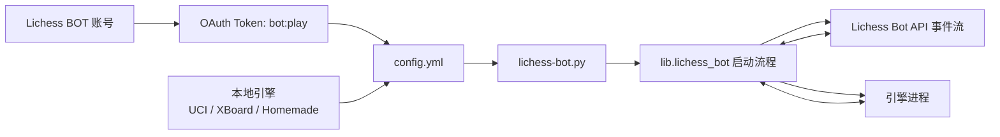
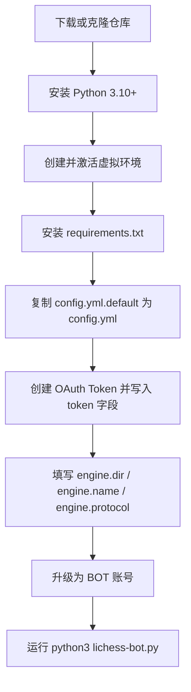

本页位于「快速开始」章节中的 **[快速开始](2-kuai-su-kai-shi)**，目标是让初次接触 lichess-bot 的开发者先建立整体路线图：它是连接 Lichess Bot API 与本地国际象棋引擎的桥接程序，支持 UCI、XBoard 与 Homemade 引擎，可在 Python 3.10+、Windows、Linux、macOS 与 Docker 环境运行；具体安装、Token、引擎、配置与启动细节会在后续页面逐步展开。Sources: [README.md](README.md#L18-L25), [README.md](README.md#L27-L42)

## 架构假设：它本质上是「Lichess 与引擎之间的桥」

从第一性原理看，lichess-bot 的最小可运行闭环只有四个部分：一个 Lichess BOT 账号、一个带 `bot:play` 权限的 OAuth Token、一个可执行的棋类引擎，以及一份把两者连接起来的 `config.yml`；程序入口 `lichess-bot.py` 只负责调用 `lib.lichess_bot.start_program()`，真正的启动流程会读取配置、检查引擎、创建 Lichess 客户端、确认账号是否为 BOT，然后进入等待挑战与处理对局的运行状态。Sources: [lichess-bot.py](lichess-bot.py#L1-L6), [lib/lichess_bot.py](lib/lichess_bot.py#L1341-L1381)



这个图只表达快速开始所需的最小架构：`config.yml.default` 中已经给出 `token`、`url` 与 `engine` 基础字段模板，其中引擎目录默认指向 `./engines/`，引擎名称通过 `engine.name` 指定，协议通过 `engine.protocol` 在 `"uci"`、`"xboard"`、`"homemade"` 中选择。Sources: [config.yml.default](config.yml.default#L1-L14)

## 推荐阅读路径

如果你是第一次部署，建议按目录顺序阅读：先看本页建立全局地图，然后进入 [创建 Lichess BOT 账号与 OAuth Token](3-chuang-jian-lichess-bot-zhang-hao-yu-oauth-token)，接着阅读 [安装 Python 环境并运行测试](4-an-zhuang-python-huan-jing-bing-yun-xing-ce-shi)、[配置并验证国际象棋引擎](5-pei-zhi-bing-yan-zheng-guo-ji-xiang-qi-yin-qing)、[启动机器人并观察运行日志](6-qi-dong-ji-qi-ren-bing-guan-cha-yun-xing-ri-zhi)；如果你准备容器化部署，再跳到 [使用 Docker 运行机器人](7-shi-yong-docker-yun-xing-ji-qi-ren)。Sources: [README.md](README.md#L44-L50), [wiki/How-to-Install.md](wiki/How-to-Install.md#L16-L17)

| 阶段 | 你要完成什么 | 下一页 |
|---|---|---|
| 账号准备 | 创建专用 Lichess 账号与 OAuth Token | [创建 Lichess BOT 账号与 OAuth Token](3-chuang-jian-lichess-bot-zhang-hao-yu-oauth-token) |
| 本地环境 | 安装 Python 依赖并准备运行目录 | [安装 Python 环境并运行测试](4-an-zhuang-python-huan-jing-bing-yun-xing-ce-shi) |
| 引擎接入 | 指定引擎目录、可执行文件名与协议 | [配置并验证国际象棋引擎](5-pei-zhi-bing-yan-zheng-guo-ji-xiang-qi-yin-qing) |
| 首次运行 | 启动程序、观察日志、确认连通性 | [启动机器人并观察运行日志](6-qi-dong-ji-qi-ren-bing-guan-cha-yun-xing-ri-zhi) |
| 容器路线 | 使用官方镜像与挂载配置目录运行 | [使用 Docker 运行机器人](7-shi-yong-docker-yun-xing-ji-qi-ren) |

官方 README 将快速流程概括为安装、创建 OAuth Token、设置引擎、配置 lichess-bot、升级 BOT 账号、运行 lichess-bot；本中文目录把这些动作拆成更适合初学者逐页完成的路线。Sources: [README.md](README.md#L44-L50)

## 最小项目结构

初学者只需要先认识几个关键位置：根目录下的 `lichess-bot.py` 是启动入口，`config.yml.default` 是配置模板，`engines/` 是默认引擎放置目录，`lib/` 包含机器人主逻辑与 Lichess、引擎、配置等模块，`wiki/` 保存原始英文使用文档，`docs/DEPLOYMENT.md` 记录此分支的部署说明。Sources: [lichess-bot.py](lichess-bot.py#L1-L6), [config.yml.default](config.yml.default#L1-L14), [docs/DEPLOYMENT.md](docs/DEPLOYMENT.md#L1-L6)

```text
lichess-bot/
├── lichess-bot.py          # 程序入口：调用 start_program()
├── config.yml.default      # 配置模板：复制为 config.yml 后修改
├── engines/                # 默认引擎目录
├── lib/                    # 主程序、配置、Lichess API、引擎封装等代码
├── wiki/                   # 原始英文安装与使用文档
└── docs/DEPLOYMENT.md      # 此分支的部署说明
```

`config.yml` 不应提交到版本库：仓库的 `.gitignore` 忽略了 `*.yml`、`/engines/*`、自动日志目录、资源记录目录、运行状态目录、PGN、日志与文本文件；这对 Token 保护和本地引擎文件隔离尤其重要。Sources: [.gitignore](.gitignore#L1-L14)

## 五分钟理解首次启动流程

首次启动不是从“写代码”开始，而是从“把配置补齐”开始：Linux 安装流程要求 Python 3.10 或更新版本，进入 `lichess-bot` 目录后创建并激活虚拟环境，再安装 `requirements.txt`，最后把 `config.yml.default` 复制为 `config.yml`；macOS 与 Windows 也遵循同样的核心模式，只是虚拟环境激活命令不同。Sources: [wiki/How-to-Install.md](wiki/How-to-Install.md#L1-L15), [wiki/How-to-Install.md](wiki/How-to-Install.md#L18-L30), [wiki/How-to-Install.md](wiki/How-to-Install.md#L34-L54)



这个流程图对应的是“首次部署”的最短路径：安装页面要求复制默认配置，Token 页面要求把生成的 Token 写入 `config.yml` 的 `token` 字段或环境变量 `$LICHESS_BOT_TOKEN`，引擎页面要求填写 `engine.dir` 与 `engine.name`，BOT 升级页面要求运行 `python3 lichess-bot.py -u`，运行页面要求激活虚拟环境后执行 `python3 lichess-bot.py`。Sources: [wiki/How-to-Install.md](wiki/How-to-Install.md#L7-L15), [wiki/How-to-create-a-Lichess-OAuth-token.md](wiki/How-to-create-a-Lichess-OAuth-token.md#L1-L8), [wiki/Setup-the-engine.md](wiki/Setup-the-engine.md#L1-L11), [wiki/Upgrade-to-a-BOT-account.md](wiki/Upgrade-to-a-BOT-account.md#L1-L7), [wiki/How-to-Run-lichess‐bot.md](wiki/How-to-Run-lichess‐bot.md#L1-L6)

## 你必须先填的配置

`config.yml.default` 的前几行已经展示最小必填思路：`token` 是 Lichess OAuth2 Token，`url` 默认是 `https://lichess.org/`，`engine.dir` 是引擎所在目录，`engine.name` 是引擎可执行文件名，`engine.protocol` 指定引擎协议；如果引擎需要从特定目录读取文件，可以使用 `engine.working_dir`，否则默认使用当前目录。Sources: [config.yml.default](config.yml.default#L1-L14), [wiki/Setup-the-engine.md](wiki/Setup-the-engine.md#L3-L10)

| 配置项 | 初学者理解 | 示例或默认值 |
|---|---|---|
| `token` | Lichess 账号生成的 OAuth2 Token | `"xxxxxxxxxxxxxxxxxxxxxx"` |
| `url` | Lichess 基础地址 | `"https://lichess.org/"` |
| `engine.dir` | 引擎文件所在目录 | `"./engines/"` |
| `engine.name` | 要启动的引擎程序名 | `"engine_name"` |
| `engine.protocol` | 引擎通信协议 | `"uci"`、`"xboard"` 或 `"homemade"` |
| `engine.working_dir` | 引擎读写文件的工作目录 | 空字符串表示使用当前目录 |

配置引擎时可以把引擎复制到仓库内的 `engines` 文件夹，因为这是默认配置模板使用的位置；如果使用 Windows，引擎名称可能需要带 `.exe` 后缀。Sources: [wiki/Setup-the-engine.md](wiki/Setup-the-engine.md#L3-L11)

## 启动时程序会检查什么

运行 `python3 lichess-bot.py` 后，启动流程会加载配置文件，记录配置，打印 “Checking engine configuration ...”，创建引擎实例进行配置检查，成功后打印 “Engine configuration OK”；随后程序会检查 Python 版本，创建 Lichess 客户端，读取用户资料，打印欢迎信息，并在账号已经是 BOT 时进入主运行循环。Sources: [lib/lichess_bot.py](lib/lichess_bot.py#L1351-L1379)

主运行循环启动后会连接到配置中的 Lichess 地址并等待挑战，同时创建控制流监听、看门狗、通信队列、日志监听、PGN 写入监听与资源监控相关进程；这些内部细节不需要你在快速开始阶段修改，但它解释了为什么启动成功后终端会持续运行而不是立即退出。Sources: [lib/lichess_bot.py](lib/lichess_bot.py#L304-L360)

## 本地运行与 Docker 运行怎么选

如果你刚开始调试，优先选择本地 Python 运行，因为安装页面直接给出虚拟环境与依赖安装流程，运行页面也直接使用 `python3 lichess-bot.py`；如果你已经有 Docker 主机，也可以使用官方镜像，但需要准备一个包含 `config.yml`、引擎程序或 `homemade.py` 以及相关文件的目录，并把它挂载到容器中。Sources: [wiki/How-to-Install.md](wiki/How-to-Install.md#L1-L15), [wiki/How-to-Run-lichess‐bot.md](wiki/How-to-Run-lichess‐bot.md#L1-L6), [wiki/How-to-use-the-Docker-image.md](wiki/How-to-use-the-Docker-image.md#L10-L24)

| 运行方式 | 适合场景 | 启动入口 | 注意事项 |
|---|---|---|---|
| 本地 Python | 初学、调试配置、观察日志 | `python3 lichess-bot.py` | 需要先激活虚拟环境 |
| Docker | 已有容器环境、希望隔离运行目录 | `docker run -d -v ... lichessbotdevs/lichess-bot` | 配置文件必须命名为 `config.yml`，路径建议使用绝对路径 |
| Docker 镜像变体 | 需要更小镜像或默认 Python 镜像 | `lichess-bot:<version>` 或 `lichess-bot:<version>-alpine` | Alpine 变体体积更小，但基于 musl libc |

Docker 文档明确指出配置文件必须命名为 `config.yml`，示例运行命令会把宿主机目录挂载到 `/lichess-bot/config`，并提醒 `dir` 与 `working_dir` 要使用容器内可见的路径；容器默认使用 Docker 标准日志系统，并以 `--disable_auto_logging` 启动。Sources: [wiki/How-to-use-the-Docker-image.md](wiki/How-to-use-the-Docker-image.md#L10-L33), [wiki/How-to-use-the-Docker-image.md](wiki/How-to-use-the-Docker-image.md#L39-L55)

## 常用启动参数速览

快速开始阶段最常用的命令只有三个：普通启动、详细日志启动、指定配置文件启动；如果你还没有升级 BOT 账号，需要先用 `-u` 执行不可逆的账号升级动作。Sources: [wiki/Upgrade-to-a-BOT-account.md](wiki/Upgrade-to-a-BOT-account.md#L1-L5), [wiki/How-to-Run-lichess‐bot.md](wiki/How-to-Run-lichess‐bot.md#L1-L26)

| 命令 | 用途 |
|---|---|
| `python3 lichess-bot.py` | 使用默认 `./config.yml` 启动机器人 |
| `python3 lichess-bot.py -v` | 输出更多信息，包括引擎思考输出与调试信息 |
| `python3 lichess-bot.py --logfile log.txt` | 把输出记录到指定日志文件 |
| `python3 lichess-bot.py --config config2.yml` | 使用非默认配置文件启动 |
| `python3 lichess-bot.py --disable_auto_logging` | 禁用自动日志 |
| `python3 lichess-bot.py -u` | 将当前账号升级为 BOT 账号 |

这些参数也由程序入口的参数解析器定义：`-u` 用于升级 BOT 账号，`-v` 用于更详细输出，`--config` 用于指定配置文件，`-l/--logfile` 用于记录控制台输出，`--disable_auto_logging` 用于关闭自动日志。Sources: [lib/lichess_bot.py](lib/lichess_bot.py#L1341-L1349)

## 第一次成功运行时应该看到什么

一次正常启动会先显示 lichess-bot 的简介与版本信息，然后执行引擎配置检查；如果引擎可启动且配置有效，会出现 “Engine configuration OK”，之后程序会通过 Token 获取 Lichess 用户资料并打印 “Welcome <username>!”；如果该账号已经是 BOT，程序会继续进入等待挑战状态。Sources: [lib/lichess_bot.py](lib/lichess_bot.py#L1316-L1324), [lib/lichess_bot.py](lib/lichess_bot.py#L1351-L1379)

此分支的部署说明还给出一组期望启动日志：`Checking engine configuration ...`、`Engine configuration OK`、`Welcome <bot username>!`、`You're now connected to https://lichess.org/ and awaiting challenges.`；如果 Token 检查失败，应确认 Token 属于该 BOT 账号并包含 `bot:play` 权限。Sources: [docs/DEPLOYMENT.md](docs/DEPLOYMENT.md#L139-L155)

## 快速排错表

如果程序无法启动，先不要修改复杂选项，而是按“环境、Token、引擎、账号状态、路径”顺序排查；这与启动流程一致，因为程序会先加载配置并检查引擎，然后才连接 Lichess 与判断账号是否为 BOT。Sources: [lib/lichess_bot.py](lib/lichess_bot.py#L1355-L1381)

| 现象 | 优先检查 | 对应下一步 |
|---|---|---|
| Python 版本相关错误 | 是否使用 Python 3.10 或更新版本 | [安装 Python 环境并运行测试](4-an-zhuang-python-huan-jing-bing-yun-xing-ce-shi) |
| Token 无效或无法登录 | Token 是否保存、是否包含 `bot:play`、是否属于正确账号 | [创建 Lichess BOT 账号与 OAuth Token](3-chuang-jian-lichess-bot-zhang-hao-yu-oauth-token) |
| 引擎检查失败 | `engine.dir`、`engine.name`、协议与工作目录是否正确 | [配置并验证国际象棋引擎](5-pei-zhi-bing-yan-zheng-guo-ji-xiang-qi-yin-qing) |
| 提示不是 BOT 账号 | 是否已执行 `python3 lichess-bot.py -u` | [启动机器人并观察运行日志](6-qi-dong-ji-qi-ren-bing-guan-cha-yun-xing-ri-zhi) |
| Docker 中找不到引擎 | `dir` 与 `working_dir` 是否是容器内路径 | [使用 Docker 运行机器人](7-shi-yong-docker-yun-xing-ji-qi-ren) |

Python 安装页面明确要求 Python 3.10 或更新版本；Token 页面说明 Token 创建后不会再次显示，需保存到 `config.yml` 或环境变量；引擎页面说明 `working_dir` 会影响引擎查找文件的相对路径；Docker 页面提醒容器内路径应从 `/lichess-bot/config/` 开始。Sources: [wiki/How-to-Install.md](wiki/How-to-Install.md#L1-L15), [wiki/How-to-create-a-Lichess-OAuth-token.md](wiki/How-to-create-a-Lichess-OAuth-token.md#L4-L6), [wiki/Setup-the-engine.md](wiki/Setup-the-engine.md#L3-L10), [wiki/How-to-use-the-Docker-image.md](wiki/How-to-use-the-Docker-image.md#L29-L33)

## 下一步

现在你已经知道 lichess-bot 的最小构成、目录位置、配置入口与启动行为；下一步请进入 [创建 Lichess BOT 账号与 OAuth Token](3-chuang-jian-lichess-bot-zhang-hao-yu-oauth-token)，然后按顺序完成 [安装 Python 环境并运行测试](4-an-zhuang-python-huan-jing-bing-yun-xing-ce-shi)、[配置并验证国际象棋引擎](5-pei-zhi-bing-yan-zheng-guo-ji-xiang-qi-yin-qing)、[启动机器人并观察运行日志](6-qi-dong-ji-qi-ren-bing-guan-cha-yun-xing-ri-zhi)。Sources: [README.md](README.md#L44-L50)