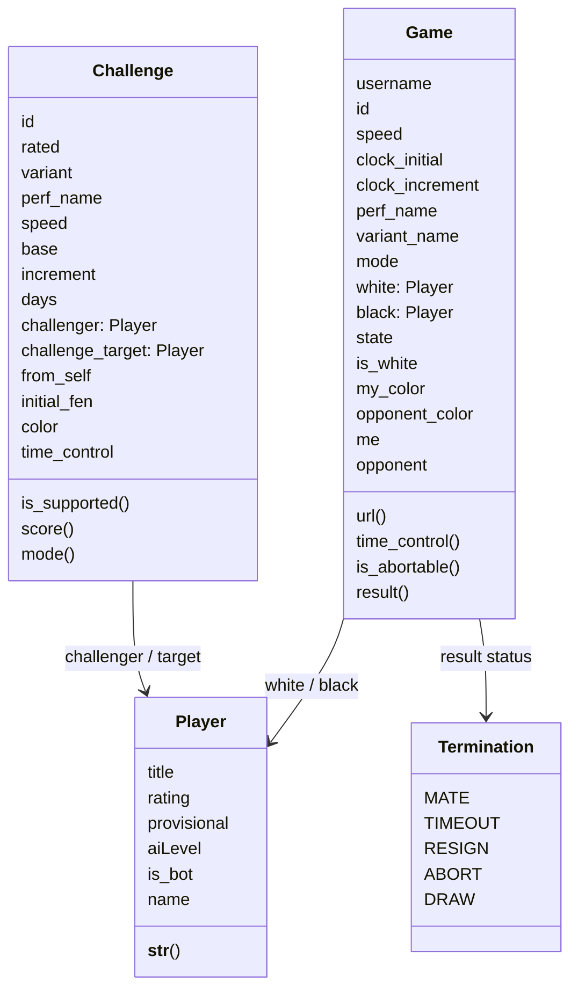
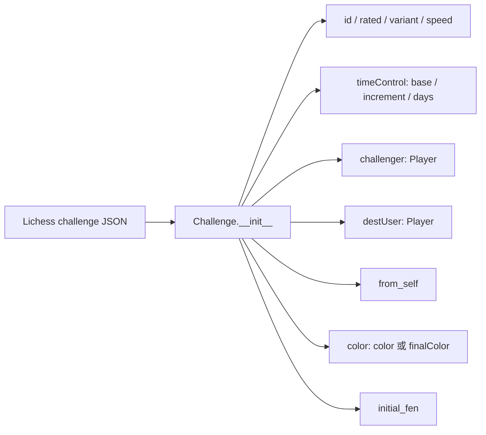
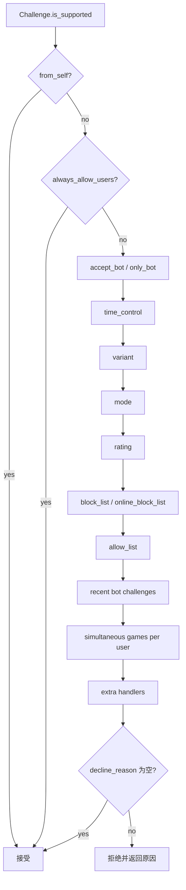
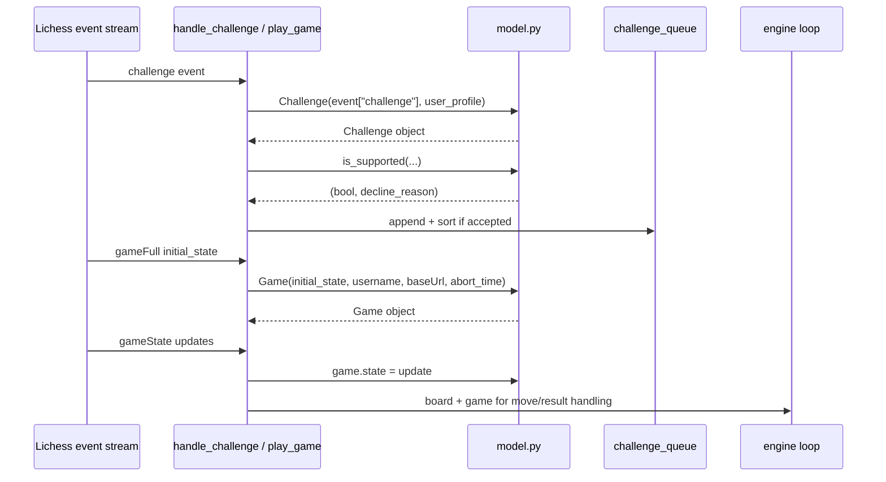

本页解释 lichess-bot 如何把 Lichess API 的挑战、玩家与对局事件转换为本地领域对象，并说明这些对象如何支撑挑战筛选、颜色判定、棋局状态读取、结果推导与后续引擎交互；范围限定在 `Challenge`、`Player`、`Game`、`Termination` 以及它们依赖的 TypedDict 数据形状，不展开配置加载、时间管理或引擎搜索细节。Sources: [model.py](lib/model.py#L22-L335), [lichess_types.py](lib/lichess_types.py#L124-L254)

## 架构假设与验证结论

从第一性原理看，机器人需要在两个外部协议之间建立稳定边界：Lichess 通过 JSON 事件流表达挑战与对局状态，而本地逻辑需要可读、可比较、可筛选的对象；代码验证显示，这个边界集中在 `lib/model.py`，其中 `Challenge` 封装挑战元数据和接收条件，`Player` 统一真人、BOT 与 AI 对手表示，`Game` 封装完整对局初始状态与持续更新的 `state`，`Termination` 则把 Lichess 的结束状态字符串集中为枚举常量。Sources: [model.py](lib/model.py#L22-L335)



这个模型层不是被动 DTO：`Challenge` 在构造时已经解析时间控制、颜色、挑战来源和初始局面；`Game` 在构造时立即建立我方颜色、对手、URL 基础、初始时钟和多个生命周期计时器；`Player` 在构造时把 `title == "BOT"` 与 `aiLevel` 归一为 `is_bot`，使调用侧无需反复理解 Lichess 原始字段。Sources: [model.py](lib/model.py#L25-L42), [model.py](lib/model.py#L198-L224), [model.py](lib/model.py#L316-L324)

## API 数据形状：TypedDict 是模型入口契约

`lib/lichess_types.py` 为模型入口定义了结构约束：`PlayerType` 包含头衔、评级、是否 provisional、AI 等级、用户名等字段；`ChallengeType` 包含挑战 ID、颜色、评级模式、速度、时间控制、变体、挑战者、目标用户、最终颜色和初始 FEN；`GameEventType` 与 `GameStateType` 则分别描述完整对局事件和流式局面状态。Sources: [lichess_types.py](lib/lichess_types.py#L124-L198), [lichess_types.py](lib/lichess_types.py#L210-L254)

| 类型 | 主要字段 | 被本页模型使用的位置 | 建模意义 |
|---|---|---|---|
| `PlayerType` | `title`、`rating`、`provisional`、`aiLevel`、`name` | `Player.__init__` | 统一真人、BOT、AI 对手的显示与判断 |
| `ChallengeType` | `id`、`rated`、`variant`、`perf`、`speed`、`timeControl`、`challenger`、`destUser`、`color`、`finalColor`、`initialFen` | `Challenge.__init__` | 将挑战事件转换为可筛选对象 |
| `TimeControlType` | `increment`、`limit`、`daysPerTurn`、`initial` | `Challenge.__init__`、`Game.__init__` | 区分普通时钟、通信棋和无限时限 |
| `GameEventType` | `id`、`rated`、`variant`、`speed`、`perf`、`createdAt`、`white`、`black`、`state`、`clock` | `Game.__init__` | 建立完整对局上下文 |
| `GameStateType` | `moves`、`wtime`、`btime`、`winc`、`binc`、`status`、`winner`、求和/悔棋字段 | `Game.state` 及调用侧 | 表示随事件流变化的当前棋局状态 |

Sources: [lichess_types.py](lib/lichess_types.py#L124-L254), [model.py](lib/model.py#L25-L42), [model.py](lib/model.py#L198-L224)

## Challenge：挑战对象的字段归一化

`Challenge.__init__` 从原始挑战事件中抽取 `id`、`rated`、`variant["key"]`、`perf["name"]`、`speed`，并从 `timeControl` 中读取 `increment`、`limit`、`daysPerTurn`；挑战者与目标用户都被包装为 `Player`，`from_self` 通过挑战者名称与当前 BOT 用户名比较得出，随机颜色会被解析为 Lichess 提供的 `finalColor`，初始 FEN 缺省为 `"startpos"`。Sources: [model.py](lib/model.py#L25-L42)



这种归一化直接体现在测试中：示例挑战的原始颜色是 `"random"`，`finalColor` 是 `"white"`，构造后的 `challenge_model.color` 被断言为 `"white"`；同一测试还验证了挑战 ID、评级模式、变体、速度与时间控制显示字段能够从原始事件稳定读取。Sources: [test_model.py](test_bot/test_model.py#L13-L61)

## Challenge：支持性判断的短路链

`Challenge.is_supported()` 是挑战接收判断的领域入口，它首先允许自己发出的挑战直接通过，然后检查 `always_allow_users` 中的可信用户并直接通过；普通挑战随后进入一条短路判断链，依次验证是否允许 BOT、是否只允许 BOT、时间控制、变体、评级/非评级模式、评级范围、静态黑名单、在线黑名单、允许名单、近期 BOT 对局次数、同一对手并发局数以及 `extra_game_handlers.is_supported_extra()`。Sources: [model.py](lib/model.py#L128-L162)



该判断链使用字符串形式的 Lichess 拒绝原因，例如时间控制不匹配返回 `"timeControl"`，变体不匹配返回 `"variant"`，模式不匹配时会根据当前挑战是 rated 还是 casual 返回相反模式的拒绝原因，过于频繁或并发过多则返回 `"later"`，其余若无更精确原因则多用 `"generic"`。Sources: [model.py](lib/model.py#L118-L158)

## Challenge：变体、Chess960 与初始局面

变体支持判断先检查 `challenge_cfg.variants` 是否包含挑战的 `variant`；如果初始 FEN 是 `"startpos"`，标准起始局面直接通过；如果是自定义初始 FEN，`is_chess_960()` 会用 `python-chess` 比较普通棋盘与 Chess960 棋盘的解释结果，若被识别为 Chess960，则要求配置中包含 `"chess960"`。Sources: [model.py](lib/model.py#L17-L19), [model.py](lib/model.py#L43-L54)

测试覆盖了标准初始局面与两个 Chess960 FEN：标准 FEN 预期 `False`，两个非标准车马象王后排列的 FEN 预期 `True`，从而验证 `is_chess_960()` 的判断意图是识别“从 FEN 看是否需要 Chess960 规则解释”。Sources: [test_model.py](test_bot/test_model.py#L206-L218)

## Challenge：时间控制的三分模型

挑战时间控制被划分为三类：当 `base` 与 `increment` 都存在时是普通时钟棋，判断增量和基础时间是否落在配置上下限内；当 `days` 存在时是通信棋，判断每步天数上下限；当两者都不存在时视为无限时限，仅当配置的最大天数为 `math.inf` 时通过。Sources: [model.py](lib/model.py#L56-L83)

| 时间控制形态 | 原始字段条件 | 判断依据 | 返回条件 |
|---|---|---|---|
| 普通时钟 | `limit` 与 `increment` 存在 | `min_increment/max_increment`、`min_base/max_base` | 增量与基础时间均在范围内 |
| 通信棋 | `daysPerTurn` 存在 | `min_days/max_days` | 每步天数在范围内 |
| 无限时限 | 无 `limit/increment/daysPerTurn` | `max_days` | 仅当 `max_days == math.inf` |

Sources: [model.py](lib/model.py#L56-L83)

对于 BOT 对手的 bullet 挑战，模型还包含一个特别规则：如果挑战者是 BOT、速度是 `"bullet"` 且配置要求 bullet 必须有增量，则最小增量会被提升到至少 1 秒；这条规则在挑战建模层完成，因此后续接收逻辑只需要消费布尔结果。Sources: [model.py](lib/model.py#L66-L77)

## Challenge：评级、名单与近期交互

评级过滤以挑战者 `rating` 为核心；如果挑战者没有评级，例如 AI 对手，评级检查直接通过；如果配置了 `rating_difference`，模型会读取当前 BOT 在对应 `perf_name.lower()` 下的评级，并用该差值收窄 `min_rating` 与 `max_rating`，最终要求挑战者评级落在收窄后的区间内。Sources: [model.py](lib/model.py#L89-L105)

测试验证了评级过滤的多个边界：默认配置接受 2000 分挑战者；当 `max_rating` 降到 1500 或 `min_rating` 升到 2500 时拒绝；当 BOT bullet 评级为 3000 且 `rating_difference` 为 500 时拒绝 2000 分挑战者，而差值放宽到 1500 时接受；AI 对手没有评级时，`is_supported_rating()` 返回 `True`。Sources: [test_model.py](test_bot/test_model.py#L70-L139)

近期 BOT 挑战建模通过 `recent_bot_challenges` 保存每个挑战者名称对应的 `Timer` 列表；每次判断会先过滤已经过期的计时器，然后在对手不是 BOT、最大近期挑战数未配置、或当前列表长度小于上限时通过。Sources: [model.py](lib/model.py#L107-L116)

`always_allow_users` 是一个显式绕过普通挑战过滤的可信名单：模型将配置中的名称与挑战者名称都做 `casefold()` 后比较，命中后直接接受；测试中 `Chesszyh` 即使低于 `min_rating` 也被接受，验证该名单优先级高于评级过滤。Sources: [model.py](lib/model.py#L136-L139), [test_model.py](test_bot/test_model.py#L141-L170)

## Challenge：排序评分与字符串表达

`Challenge.score()` 为挑战队列排序提供一个简单分值：以挑战者评级为基础，rated 挑战增加 200 分，有非 BOT 头衔的挑战者再增加 200 分；`mode()` 将 `rated` 布尔值转为 `"rated"` 或 `"casual"`，`__str__()` 则输出包含性能类别、模式、挑战者和挑战 ID 的可读描述。Sources: [model.py](lib/model.py#L164-L182)

这个分值只表达挑战对象的优先级倾向，不改变支持性判断本身；挑战是否进入队列由 `is_supported()` 决定，而排序发生在挑战被追加到 `challenge_queue` 之后。Sources: [model.py](lib/model.py#L128-L170), [lichess_bot.py](lib/lichess_bot.py#L744-L754)

## Player：统一真人、BOT 与 AI 对手

`Player` 是挑战和对局共享的玩家表示：构造时读取 `title`、`rating`、`provisional`、`aiLevel`，并把 `title == "BOT"` 或存在 `aiLevel` 的玩家都判定为 `is_bot`；如果是 AI，则名称规范化为 `"AI level {aiLevel}"`，否则使用原始 `name` 字段。Sources: [model.py](lib/model.py#L313-L324)

| 玩家类型 | 输入特征 | `is_bot` | `name` 规则 | 字符串表示 |
|---|---|---:|---|---|
| 普通用户 | 无 `BOT` 头衔、无 `aiLevel` | `False` | `player_info["name"]` 或空串 | `标题 名称 (评级)`，无标题时省略 |
| BOT 账号 | `title == "BOT"` | `True` | `player_info["name"]` 或空串 | 例如 `BOT b (3000)` |
| Lichess AI | 存在 `aiLevel` | `True` | `AI level {aiLevel}` | 直接返回 AI 名称 |

Sources: [model.py](lib/model.py#L316-L330), [test_model.py](test_bot/test_model.py#L198-L203)

`Player.__str__()` 会在 provisional 评级后追加问号，并在非 AI 情况下组合头衔、名称与评级；测试用 BOT 玩家验证了 `is_bot is True` 且字符串输出为 `"BOT b (3000)"`。Sources: [model.py](lib/model.py#L325-L334), [test_model.py](test_bot/test_model.py#L198-L203)

## Game：完整对局上下文的初始化

`Game.__init__` 从 `gameFull` 初始事件中读取对局 ID、速度、时钟、性能名称、变体名称、评级模式、白方、黑方、初始 FEN 和初始 `state`；同时根据当前 BOT 用户名与白方名称的大小写无关比较确定 `is_white`，再派生 `my_color`、`opponent_color`、`me` 与 `opponent`。Sources: [model.py](lib/model.py#L198-L224)

```mermaid
flowchart LR
    A[gameFull initial_state] --> B[Game.__init__]
    B --> C[white: Player]
    B --> D[black: Player]
    C --> E{white.name == username?}
    D --> E
    E -- yes --> F[my_color=white\nme=white\nopponent=black]
    E -- no --> G[my_color=black\nme=black\nopponent=white]
    B --> H[state = game_info['state']]
    B --> I[clock_initial / clock_increment]
    B --> J[abort / terminate / disconnect timers]
```

时钟初始化使用 `clock["initial"]` 和 `clock["increment"]`，缺失初始时间时使用十年毫秒值作为兜底；`createdAt` 被转换为 UTC 时间；同时创建 `abort_time`、`terminate_time` 与 `disconnect_time`，其中 `terminate_time` 初始值等于初始时间、增量、弃局等待时间和额外 60 秒之和。Sources: [model.py](lib/model.py#L203-L224)

测试中的 BOT 用户名为 `"b"`，黑方名称也是 `"b"`，因此构造后 `is_white` 为 `False`、`my_color` 为 `"black"`；同一测试验证了对局 ID、模式、URL、PGN event、时间控制字符串和可弃局状态。Sources: [test_model.py](test_bot/test_model.py#L173-L195)

## Game.state：流式状态的可变核心

`Game.state` 保存 Lichess 当前对局状态，初始来自完整 `gameFull` 事件的 `state` 字段；在对局循环中，如果收到 `gameState` 更新，代码会用 `game.state = upd` 替换当前状态，然后基于新状态重建棋盘、检查悔棋字段、判断是否轮到引擎走棋或是否对局结束。Sources: [model.py](lib/model.py#L213-L224), [lichess_bot.py](lib/lichess_bot.py#L807-L811), [lichess_bot.py](lib/lichess_bot.py#L860-L889)

`setup_board()` 根据 `game.variant_name` 和 `game.initial_fen` 创建对应棋盘，再把 `game.state["moves"]` 按空格拆分并逐个 `push_uci()` 到棋盘；因此模型中的 `state["moves"]` 是从 Lichess 流式状态恢复本地棋盘的权威移动序列。Sources: [lichess_bot.py](lib/lichess_bot.py#L1010-L1025)

是否轮到机器人走棋由 `bot_to_move()` 判断：它比较 `game.is_white` 与 `board.turn == chess.WHITE`；`is_engine_move()` 还要求当前状态相对上一状态发生变化，以避免因求和、悔棋等非走子事件重复触发引擎。Sources: [lichess_bot.py](lib/lichess_bot.py#L1028-L1041)

## Game：URL、PGN 事件与时间控制表达

`Game.url()` 返回带我方颜色后缀的对局 URL，`short_url()` 返回不带颜色的基础对局 URL；`pgn_event()` 对标准棋和 From Position 使用 `"模式 性能 game"`，其他变体使用 `"模式 变体 game"`；`time_control()` 将初始时间和增量格式化为 `"initial+increment"`。Sources: [model.py](lib/model.py#L226-L244)

| 方法 | 输出语义 | 示例测试结果 |
|---|---|---|
| `short_url()` | 基础对局链接 | `https://lichess.org/zzzzzzzz` |
| `url()` | 带 BOT 视角颜色的链接 | `https://lichess.org/zzzzzzzz/black` |
| `pgn_event()` | PGN Event 字段文本 | `Casual Bullet game` |
| `time_control()` | PGN 风格时限文本 | `90+1` |

Sources: [model.py](lib/model.py#L226-L244), [test_model.py](test_bot/test_model.py#L186-L195)

## Game：弃局、断开与终止判断

`Game.is_abortable()` 通过 `state["moves"]` 中是否包含空格判断是否双方都已经至少走过一步：代码注释说明走法由空格分隔，少于两个半回合时可弃局；`ping()` 根据 Lichess ping 更新弃局、终止与断开计时器，只有仍可弃局时才刷新 `abort_time`。Sources: [model.py](lib/model.py#L245-L263)

`should_abort_now()` 要求对局仍可弃局且 `abort_time` 过期；`should_terminate_now()` 与 `should_disconnect_now()` 分别检查对应计时器是否过期；调用侧 `should_exit_game()` 在通信棋可断开、缺乏活动需弃局、或终止计时器过期时决定退出当前对局处理。Sources: [model.py](lib/model.py#L264-L274), [lichess_bot.py](lib/lichess_bot.py#L1050-L1066)

## Game.result 与 Termination：结果建模

`Termination` 枚举集中定义了 Lichess 对局结束状态字符串，包括将死、超时、认输、弃局和和棋；`Game.result()` 读取 `state["winner"]` 与 `state["status"]`，白胜返回 `"1-0"`，黑胜返回 `"0-1"`，状态为 `DRAW` 或无胜者 `TIMEOUT` 时返回 `"1/2-1/2"`，其余未完成状态返回 `"*"`。Sources: [model.py](lib/model.py#L185-L193), [model.py](lib/model.py#L282-L302)

```mermaid
flowchart TD
    A[Game.result] --> B[winner = state.get('winner')]
    A --> C[termination = state.get('status')]
    B --> D{winner == white?}
    D -- yes --> R1["1-0"]
    D -- no --> E{winner == black?}
    E -- yes --> R2["0-1"]
    E -- no --> F{termination in DRAW/TIMEOUT?}
    F -- yes --> R3["1/2-1/2"]
    F -- no --> R4["*"]
```

引擎结果通知也复用 `Termination`：将死直接发送棋盘结果，认输会构造 `"White resigned"` 或 `"Black resigned"`，弃局发送 `"Game aborted"`，和棋根据棋盘是否可声明和棋决定说明文本，超时则区分有胜者的 `"Time forfeiture"` 与无胜者的 `"Time out with insufficient material"`。Sources: [engine_wrapper.py](lib/engine_wrapper.py#L576-L603)

## 模型交互路径：从挑战到对局状态

挑战入口 `handle_challenge()` 将事件中的 `challenge` 构造成 `model.Challenge`，跳过自己发出的挑战，统计当前活跃对局和挑战队列中的对手并发数，刷新在线黑名单，然后调用 `Challenge.is_supported()`；通过的挑战进入 `challenge_queue` 并排序，拒绝的挑战则把模型返回的 `decline_reason` 传给 Lichess API。Sources: [lichess_bot.py](lib/lichess_bot.py#L730-L757)

对局入口 `play_game()` 打开 Lichess game stream，读取第一条完整状态作为 `initial_state`，再构造 `model.Game(initial_state, user_profile["username"], li.baseUrl, abort_time)`；之后整个循环围绕 `game.state` 的更新、棋盘重建、走棋判断、结束判断与交互处理展开。Sources: [lichess_bot.py](lib/lichess_bot.py#L795-L819), [lichess_bot.py](lib/lichess_bot.py#L846-L889)



## 设计边界与阅读建议

本页关注的是领域对象如何吸收 API 字段并为上层流程提供稳定语义；如果你想理解这些对象如何在进程、事件流和队列中被调度，下一步阅读 [主循环、事件流与多进程任务协作](17-zhu-xun-huan-shi-jian-liu-yu-duo-jin-cheng-ren-wu-xie-zuo)；如果想沿着挑战进入对局再到结束的运行路径继续追踪，阅读 [游戏生命周期：从挑战到对局结束](18-you-xi-sheng-ming-zhou-qi-cong-tiao-zhan-dao-dui-ju-jie-shu)；如果关注时钟细节，阅读 [时钟、计时器与不同时间控制的处理](21-shi-zhong-ji-shi-qi-yu-bu-tong-shi-jian-kong-zhi-de-chu-li)。Sources: [model.py](lib/model.py#L22-L335), [lichess_bot.py](lib/lichess_bot.py#L730-L889)