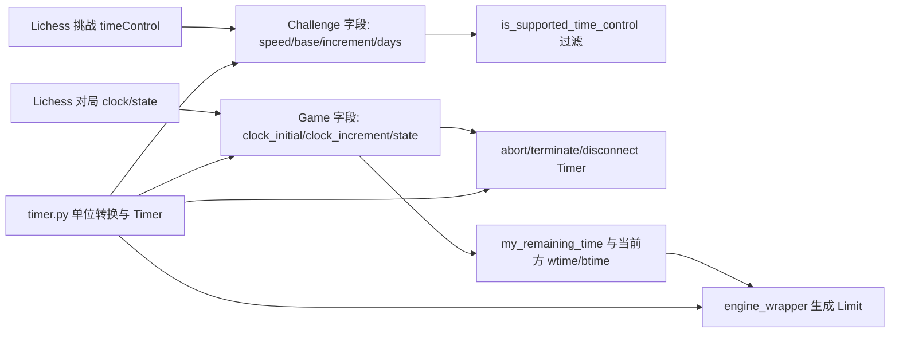
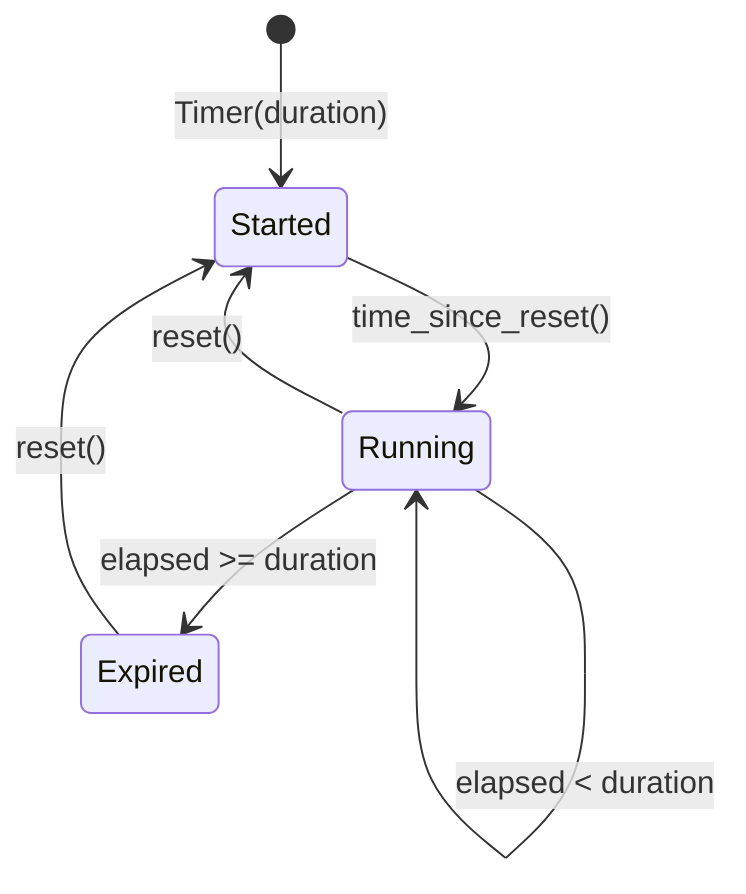
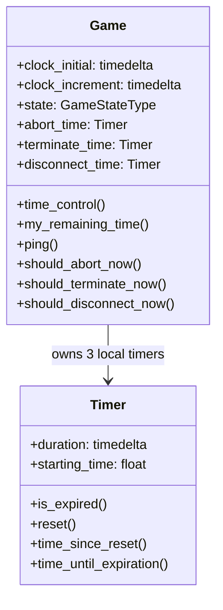

本页解释 lichess-bot 如何在领域模型中表示时间、如何用通用 `Timer` 管理超时，以及如何区分普通实时棋、通信棋和无时限挑战；范围限定在**时钟数据的建模、挑战时限过滤、对局内计时器刷新、以及传给引擎的时间限制计算**，不展开引擎协议细节或外部走法来源。Sources: [timer.py](lib/timer.py#L60-L99), [model.py](lib/model.py#L56-L84), [engine_wrapper.py](lib/engine_wrapper.py#L780-L795)

## 架构假设与验证结论

从第一性原理看，lichess-bot 的时间处理分成两层：第一层是**纯时间工具层**，把毫秒、秒、分钟等单位统一转换为 `datetime.timedelta` 并提供可复用倒计时；第二层是**领域时钟层**，把 Lichess 事件中的 `timeControl`、`clock`、`wtime/btime/winc/binc` 映射为挑战过滤、对局生命周期判断和引擎搜索限制。代码验证显示，`lib/timer.py` 只负责单位转换与通用计时，`lib/model.py` 负责挑战与对局时间字段建模，`lib/lichess_bot.py` 在游戏流中刷新生命周期计时器，`lib/engine_wrapper.py` 在走子前把当前棋钟转换为 `chess.engine.Limit`。Sources: [timer.py](lib/timer.py#L7-L35), [model.py](lib/model.py#L31-L41), [lichess_bot.py](lib/lichess_bot.py#L898-L901), [engine_wrapper.py](lib/engine_wrapper.py#L854-L864)



这张图的关键关系是：`Timer` 并不直接表示棋钟本身，而是表示“从某个本地时间点开始经过多久”以及“某个本地超时是否到期”；棋钟余额仍来自 Lichess 的 `game.state["wtime"]`、`game.state["btime"]` 等字段，并在走子时减去本地准备耗时和配置的通信开销后传给引擎。Sources: [timer.py](lib/timer.py#L74-L99), [engine_wrapper.py](lib/engine_wrapper.py#L854-L864), [lichess_bot.py](lib/lichess_bot.py#L872-L884)

## 时间单位工具：全部归一到 `timedelta`

`lib.timer` 将毫秒、秒、分钟、小时、天、年统一封装为 `datetime.timedelta`，并提供 `to_msec`、`to_seconds`、`msec_str`、`sec_str` 用于与 Lichess 的毫秒字段、配置文件的秒字段、日志输出和引擎 API 之间转换；测试覆盖了这些单位之间的互转，例如 `seconds(1)` 到毫秒是 `1000`，`years(1)` 被定义为 365 天。Sources: [timer.py](lib/timer.py#L7-L54), [test_timer.py](test_bot/test_timer.py#L7-L29)

| 工具函数 | 输入单位 | 输出/用途 | 典型使用位置 |
|---|---:|---|---|
| `msec()` | 毫秒 | `timedelta` | Lichess `clock.initial`、`state.wtime`、`state.btime` |
| `seconds()` | 秒 | `timedelta` | 配置项如 `abort_time`、通信棋 `move_time` |
| `to_msec()` | `timedelta` | 浮点毫秒 | 把内部时间用于比较或默认值 |
| `to_seconds()` | `timedelta` | 浮点秒 | 传入 `chess.engine.Limit` |
| `msec_str()` / `sec_str()` | `timedelta` | 四舍五入后的字符串 | 日志与 PGN 风格时间控制展示 |

表中的分工来自 `timer.py` 的单位函数定义，以及 `Game` 和 `engine_wrapper` 中对 `msec()`、`seconds()`、`to_seconds()`、`msec_str()`、`sec_str()` 的实际调用。Sources: [timer.py](lib/timer.py#L7-L35), [model.py](lib/model.py#L203-L206), [engine_wrapper.py](lib/engine_wrapper.py#L824-L838), [engine_wrapper.py](lib/engine_wrapper.py#L859-L864)

## `Timer`：本地倒计时与秒表，而不是服务器棋钟

`Timer` 的实现非常小：初始化时保存 `duration` 和 `perf_counter()`，`time_since_reset()` 返回从创建或重置以来经过的时间，`is_expired()` 判断经过时间是否大于等于持续时间，`time_until_expiration()` 返回非负剩余时间；这使它既能作为倒计时，也能作为秒表使用。Sources: [timer.py](lib/timer.py#L60-L99)

`Timer` 使用 `time.perf_counter()` 而不是从 Lichess 事件中读取服务器时间，因此它适合管理本地流程期限，例如“多久没有活动就 abort”、“多久后断开通信棋连接”、“多久后认为游戏应终止”，但不承担权威棋钟结算；测试通过手动回拨 `starting_time` 来模拟时间经过，验证了到期、重置和剩余时间归零行为。Sources: [timer.py](lib/timer.py#L81-L99), [test_timer.py](test_bot/test_timer.py#L43-L84)



这意味着阅读代码时应区分两类“时间”：**本地计时器时间**由 `Timer` 管理，用于控制机器人行为；**棋钟余额时间**由 Lichess 的 `wtime/btime` 事件字段提供，用于计算引擎搜索限制。Sources: [timer.py](lib/timer.py#L84-L99), [model.py](lib/model.py#L276-L280), [engine_wrapper.py](lib/engine_wrapper.py#L856-L864)

## 挑战阶段：按实时棋、通信棋、无时限棋分类过滤

挑战模型从 Lichess 的 `timeControl` 中提取 `increment`、`limit`、`daysPerTurn`，并同时保留 `speed` 和完整 `time_control` 字典；`increment` 与 `limit` 用于普通带钟对局，`daysPerTurn` 用于通信棋，字段缺失时进入无时限分支。Sources: [model.py](lib/model.py#L31-L41), [lichess_types.py](lib/lichess_types.py#L163-L172)

`Challenge.is_supported_time_control()` 首先检查挑战的 `speed` 是否在配置允许的 `time_controls` 中，然后对三类时间控制分别应用边界：普通实时棋要求 `min_increment <= increment <= max_increment` 且 `min_base <= base <= max_base`；通信棋要求 `min_days <= days <= max_days`；无时限棋只有在 `max_days == math.inf` 时才会被接受。Sources: [model.py](lib/model.py#L56-L84)

| Lichess 时间控制形态 | 识别条件 | 使用的配置边界 | 接受条件 |
|---|---|---|---|
| 实时棋 clock | `base is not None` 且 `increment is not None` | `min_base/max_base`、`min_increment/max_increment` | 基础时间与增量都在范围内 |
| 通信棋 correspondence | `days is not None` | `min_days/max_days` | 每步天数在范围内 |
| 无时限 unlimited | 既无 `base/increment` 也无 `days` | `max_days` | 仅当 `max_days` 为无穷大 |

这些边界的默认值由配置加载阶段填充：挑战增量默认范围是 `0..180` 秒，基础时间默认范围是 `0..inf` 秒，通信棋每步天数默认范围是 `1..inf`，并且配置校验会警告 `max_* < min_*` 会导致对应类型挑战无法被接受。Sources: [config.py](lib/config.py#L260-L270), [config.py](lib/config.py#L398-L403)

默认配置文件中的示例更保守：实时挑战的 `max_increment` 为 20 秒、`max_base` 为 1800 秒，`max_days` 为 14 天，并且 `time_controls` 默认列出 bullet、blitz、rapid、classical，通信棋条目被注释；这解释了为什么仅配置 `max_days` 不足以接受通信棋，还必须把 `correspondence` 加入允许的速度列表。Sources: [config.yml.default](config.yml.default#L163-L193), [model.py](lib/model.py#L66-L84)

## Bullet 对 BOT 的非零增量约束

挑战过滤还有一个特殊规则：当挑战者是 BOT、速度是 `bullet`、并且配置启用 `bullet_requires_increment` 时，最小增量会被提升到至少 1 秒；实现方式是先计算 `require_non_zero_increment`，再用 `max(increment_min, 1 if require_non_zero_increment else 0)` 覆盖实际下限。Sources: [model.py](lib/model.py#L69-L77)

这个规则只影响挑战接受阶段的时间控制判定，不改变对局开始后的棋钟数据；一旦对局进入 `Game`，实际 `clock.initial`、`clock.increment`、`state.wtime`、`state.btime` 仍由 Lichess 流事件提供。Sources: [model.py](lib/model.py#L74-L84), [model.py](lib/model.py#L203-L206), [model.py](lib/model.py#L276-L280)

## 对局初始化：从 `clock` 建立初始时钟与生命周期计时器

`Game.__init__()` 从游戏初始事件读取 `clock.initial` 和 `clock.increment`，将它们从毫秒转为 `timedelta`；如果 `clock` 或 `initial` 不存在，初始时钟会回退到“10 年”的毫秒值，这为无普通棋钟的场景提供了一个很大的默认时间。Sources: [model.py](lib/model.py#L198-L206)

同一初始化流程还会创建三个本地计时器：`abort_time` 用于开局无活动时可 abort 的窗口，`terminate_time` 初始设置为 `clock_initial + clock_increment + abort_time + 60 秒`，`disconnect_time` 初始为 0 秒；这些计时器控制机器人是否应 abort、终止跟踪或断开游戏流，而不是改变服务器棋钟。Sources: [model.py](lib/model.py#L220-L224), [model.py](lib/model.py#L264-L274)



对局的 PGN 风格时间控制字符串由 `Game.time_control()` 生成，格式是 `初始秒数+增量秒数`；测试中的 `clock.initial = 90000`、`clock.increment = 1000` 会输出 `90+1`，说明模型内部保存毫秒来源，但展示时转为秒。Sources: [model.py](lib/model.py#L241-L244), [test_model.py](test_bot/test_model.py#L173-L195)

## 游戏流中刷新 abort、terminate 与 disconnect

游戏主循环收到 `gameState` 后会更新 `game.state`，在需要引擎走子时创建 `setup_timer` 来记录从收到对手走法到准备调用引擎之间的本地耗时；走子结束后，代码读取当前轮到走棋一方的 `wtime/btime` 和 `winc/binc`，将 `terminate_time` 设置为“该方剩余时间 + 增量 + 60 秒”，然后调用 `game.ping()` 刷新三个本地计时器。Sources: [lichess_bot.py](lib/lichess_bot.py#L864-L884), [lichess_bot.py](lib/lichess_bot.py#L898-L901)

`Game.ping()` 的细节很重要：只有在 `is_abortable()` 为真时才重设 `abort_time`，而 `is_abortable()` 的判定是当前 moves 字符串中没有空格，也就是双方尚未各走至少一步；`terminate_time` 与 `disconnect_time` 则每次 ping 都会更新。Sources: [model.py](lib/model.py#L245-L262)

| 本地计时器 | 何时初始化/刷新 | 到期判断 | 语义 |
|---|---|---|---|
| `abort_time` | `Game.__init__()`；仅可 abort 时由 `ping()` 刷新 | `should_abort_now()` | 开局无活动且仍可 abort 时触发 |
| `terminate_time` | `Game.__init__()`；每个 `gameState` 后由 `ping()` 刷新 | `should_terminate_now()` | 认为游戏流无需继续等待的本地期限 |
| `disconnect_time` | `Game.__init__()`；每个 `gameState` 后由 `ping()` 刷新 | `should_disconnect_now()` | 通信棋等场景下主动断开连接的期限 |

这些计时器的行为由 `Game` 的 `ping()` 和 `should_*()` 方法直接定义，而配置文件提供了 `abort_time`、`correspondence.move_time`、`correspondence.disconnect_time` 等秒级参数。Sources: [model.py](lib/model.py#L251-L274), [config.yml.default](config.yml.default#L150-L160)

## 剩余时间：`my_remaining_time()` 只读取服务器状态

`Game.my_remaining_time()` 不使用本地 `Timer` 推算棋钟，而是读取 `state["wtime"]` 和 `state["btime"]`，把它们从毫秒转换为 `timedelta`，再根据机器人执白还是执黑返回对应一侧的剩余时间；这保证了对局状态以 Lichess 流事件为准。Sources: [model.py](lib/model.py#L214-L218), [model.py](lib/model.py#L276-L280)

这个设计也解释了为什么 `engine_wrapper` 在计算搜索限制时会从 `game.state` 读取 `wtime/btime/winc/binc`，而不是从 `Game.clock_initial` 或 `Timer` 递减得到当前余额；`clock_initial` 更适合描述对局初始时间控制，而当前可用时间来自每次 `gameState` 更新。Sources: [model.py](lib/model.py#L203-L206), [engine_wrapper.py](lib/engine_wrapper.py#L856-L864)

## 引擎时间限制：首步、通信棋、实时棋三条路径

`engine_wrapper` 的时间选择入口会先判断棋局步数：如果 `len(board.move_stack) < 2`，使用固定首步搜索时间并禁用 ponder；如果是通信棋，使用单步搜索时间；否则使用实时棋钟限制，并保留当前 ponder 可用性。Sources: [engine_wrapper.py](lib/engine_wrapper.py#L780-L795)

```mermaid
flowchart TD
    A[准备为当前局面走子] --> B{已至少两个半回合?}
    B -- 否 --> C[first_move_time: 固定 10 秒]
    B -- 是 --> D{是否通信棋?}
    D -- 是 --> E[single_move_time: min(配置 move_time, 当前方剩余-开销)]
    D -- 否 --> F[game_clock_time: 传入双方 clock 与 increment]
    C --> G[chess.engine.Limit]
    E --> G
    F --> G
```

首步路径 `first_move_time()` 固定使用 10 秒，并在注释中说明原因是 Lichess 首步有 30 秒限制；该路径返回 `chess.engine.Limit(time=10, clock_id="first move")`。Sources: [engine_wrapper.py](lib/engine_wrapper.py#L828-L838)

通信棋路径 `single_move_time()` 会把 `setup_timer.time_since_reset()` 与 `move_overhead` 相加为本地开销，然后用当前走子方的 `wtime/btime` 减去该开销，并将搜索时间限制为 `配置的 correspondence.move_time` 与“扣除开销后的棋钟余额”两者中的较小值，最低保留 1 毫秒。Sources: [engine_wrapper.py](lib/engine_wrapper.py#L808-L825), [config.yml.default](config.yml.default#L157-L160)

实时棋路径 `game_clock_time()` 同样扣除本地准备时间和通信开销，但它不是给单一 `movetime`，而是构造包含 `white_clock`、`black_clock`、`white_inc`、`black_inc` 的 `chess.engine.Limit`，让引擎依据双方当前棋钟和增量执行自身时间管理。Sources: [engine_wrapper.py](lib/engine_wrapper.py#L841-L864)

## `move_overhead` 与 `setup_timer`：防止本地耗时被误当作可搜索时间

`setup_timer` 在收到需要引擎走子的 `gameState` 后创建，随后传入 `engine.play_move()`；时间计算函数会读取它的 `time_since_reset()`，把“解析局面、问候、打印回合、准备调用引擎”等本地耗时纳入开销。Sources: [lichess_bot.py](lib/lichess_bot.py#L869-L884), [engine_wrapper.py](lib/engine_wrapper.py#L820-L823)

`move_overhead` 来自配置文件，默认示例为 2000 毫秒，并在注释中提示如果机器人经常超时可以增大；在实时棋和通信棋两条路径中，它都会与 `setup_timer` 的耗时相加后从当前方棋钟中扣除。Sources: [config.yml.default](config.yml.default#L150-L153), [engine_wrapper.py](lib/engine_wrapper.py#L854-L858), [engine_wrapper.py](lib/engine_wrapper.py#L820-L823)

## 类型约束：Lichess 时间字段的单位差异

类型定义明确把挑战 `timeControl` 建模为可选的 `increment`、`limit`、`daysPerTurn`、`initial` 等字段；游戏状态则包含 `wtime/btime/winc/binc`，这些字段在代码中按毫秒处理，而配置中的 `challenge.max_base`、`challenge.max_increment`、`correspondence.move_time` 等参数按秒或天表达。Sources: [lichess_types.py](lib/lichess_types.py#L163-L172), [lichess_types.py](lib/lichess_types.py#L210-L223), [config.yml.default](config.yml.default#L157-L175)

| 来源 | 字段 | 代码中的处理单位 | 说明 |
|---|---|---:|---|
| 挑战 `timeControl` | `limit` | 秒 | 与 `min_base/max_base` 比较 |
| 挑战 `timeControl` | `increment` | 秒 | 与 `min_increment/max_increment` 比较 |
| 挑战 `timeControl` | `daysPerTurn` | 天 | 与 `min_days/max_days` 比较 |
| 对局 `clock` | `initial` | 毫秒 | 转为 `clock_initial` |
| 对局 `clock` | `increment` | 毫秒 | 转为 `clock_increment` |
| 对局 `state` | `wtime/btime/winc/binc` | 毫秒 | 转为引擎秒级 Limit |

这些单位差异可以从 `Challenge` 直接比较秒级 `limit/increment`、`Game` 对 `clock.initial/clock.increment` 调用 `msec()`、以及 `engine_wrapper` 对 `state` 时钟字段调用 `msec()` 的实现中验证。Sources: [model.py](lib/model.py#L31-L41), [model.py](lib/model.py#L203-L206), [engine_wrapper.py](lib/engine_wrapper.py#L856-L864)

## 测试覆盖所证明的行为边界

`test_timer.py` 证明了时间转换、`Timer` 初始化、到期、重置和剩余时间归零等基础行为；这些测试没有依赖 Lichess API，因此可以作为理解本地计时器语义的最小证据。Sources: [test_timer.py](test_bot/test_timer.py#L7-L84)

`test_model.py` 证明了挑战时间控制过滤和对局时间控制展示：当挑战基础时间为 90 秒、增量为 1 秒且配置允许时会被接受；把 `min_base` 提高到 120 后会因 `timeControl` 被拒绝；游戏模型会把 `90000/1000` 毫秒的 `clock` 展示为 `90+1`。Sources: [test_model.py](test_bot/test_model.py#L13-L68), [test_model.py](test_bot/test_model.py#L173-L195)

## 开发者阅读路径

如果你接下来要理解“这些时间控制配置从哪里来、如何填默认值和校验”，请阅读[配置加载、默认值填充与校验机制](22-pei-zhi-jia-zai-mo-ren-zhi-tian-chong-yu-xiao-yan-ji-zhi)；如果你要继续追踪“时间限制如何影响搜索、Ponder 与走法生成”，请阅读[时间管理、Ponder、搜索参数与走法生成](25-shi-jian-guan-li-ponder-sou-suo-can-shu-yu-zou-fa-sheng-cheng)；如果你要把本页放回完整对局流程中理解，请阅读[游戏生命周期：从挑战到对局结束](18-you-xi-sheng-ming-zhou-qi-cong-tiao-zhan-dao-dui-ju-jie-shu)。Sources: [config.py](lib/config.py#L260-L282), [engine_wrapper.py](lib/engine_wrapper.py#L780-L864), [lichess_bot.py](lib/lichess_bot.py#L800-L920)