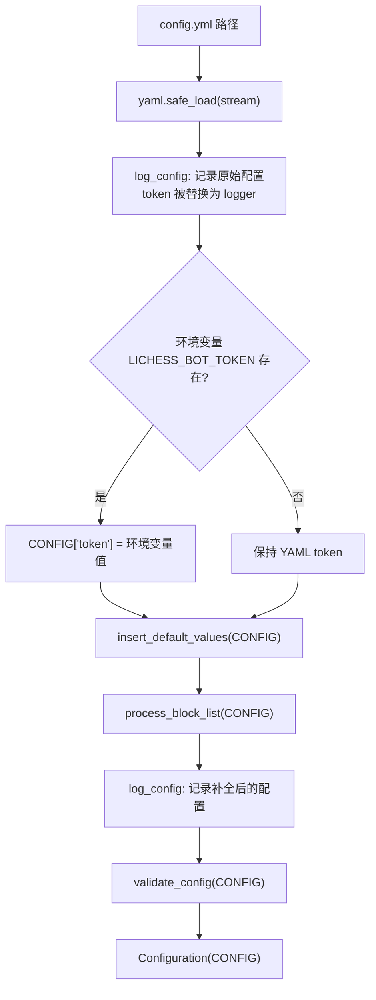
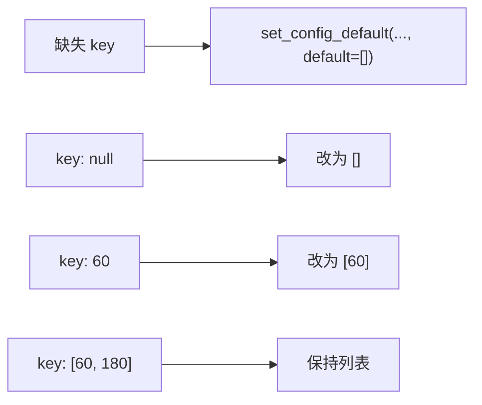
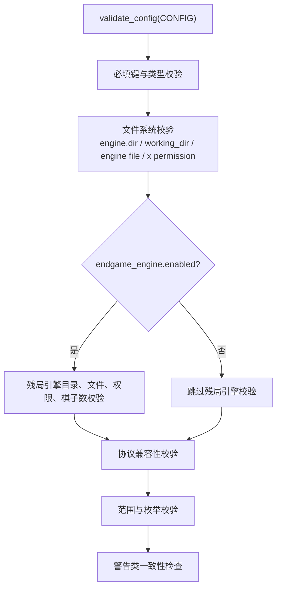
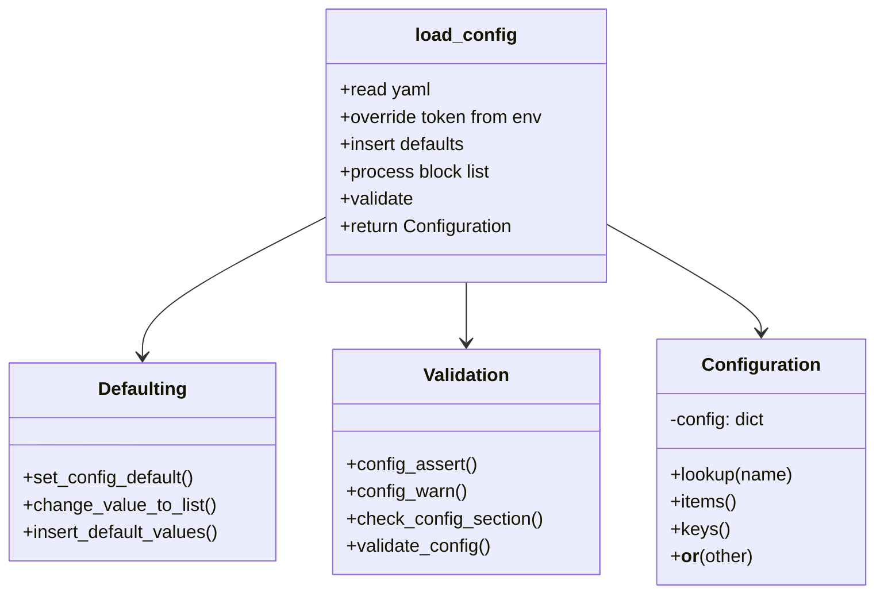

本页解释 lichess-bot 的配置处理链路：从 YAML 文件读取开始，经过 Token 环境变量覆盖、默认值填充、派生配置处理、日志输出与校验，最终返回可通过点号访问的 `Configuration` 对象。范围仅限配置加载、默认值填充与校验机制；挑战规则、引擎协议、在线走法等业务含义只在它们影响配置处理时被提及。Sources: [config.py](lib/config.py#L15-L64), [config.py](lib/config.py#L557-L581)

## 处理链路总览

配置入口是 `load_config(config_file)`：它使用 `yaml.safe_load()` 读取 YAML；读取失败时记录“config.yml 语法问题”日志并重新抛出异常；随后先记录原始配置，如果存在 `LICHESS_BOT_TOKEN` 环境变量则覆盖 `CONFIG["token"]`，再依次执行 `insert_default_values()`、`process_block_list()`、第二次 `log_config()`、`validate_config()`，最后把字典包装为 `Configuration` 返回。Sources: [config.py](lib/config.py#L557-L581)

这个流程的关键设计是**先补全、再校验**：许多校验逻辑直接访问已经存在的键，例如 `CONFIG["challenge"]["concurrency"]`、`CONFIG["resource_monitor"]["sample_period"]`、`CONFIG["arena"]["scan_period"]`；因此默认值填充阶段不仅提供默认行为，也建立后续校验可依赖的结构完整性。Sources: [config.py](lib/config.py#L260-L318), [config.py](lib/config.py#L391-L459)

## `Configuration`：字典到点号访问的轻量包装

`Configuration` 保存原始 `dict` 到 `self.config`，并通过 `__getattr__()` 调用 `lookup()`，从而支持 `config.key1.key2` 形式访问；当查到的值本身是 `dict` 时，`lookup()` 会再次包装为 `Configuration`，否则直接返回原值。这个包装层没有复制深层数据，主要职责是访问语法适配，而不是类型转换或校验。Sources: [config.py](lib/config.py#L15-L40)

`Configuration` 还暴露 `items()`、`keys()`、`__or__()`、`__bool__()`、`__getstate__()` 与 `__setstate__()`：这些方法让配置对象可迭代、可合并、可判空，并能在序列化场景中还原到底层字典。`__or__()` 返回一个新的 `Configuration(self.config | other_dict)`，表示合并是浅层字典合并。Sources: [config.py](lib/config.py#L41-L64)

| 能力 | 方法 | 行为 |
|---|---|---|
| 点号访问 | `__getattr__` / `lookup` | 字典子节点继续包装为 `Configuration` |
| 遍历 | `items` / `keys` | 转发到底层 `dict` |
| 合并 | `__or__` |  shallow merge 后返回新 `Configuration` |
| 布尔判断 | `__bool__` | 底层字典非空即为真 |
| 状态保存 | `__getstate__` / `__setstate__` | 直接读写底层字典 |

Sources: [config.py](lib/config.py#L22-L64)

## 默认值填充的基础原语

默认值填充由 `set_config_default()` 完成。它先沿着传入的 section 路径逐级 `setdefault(section, {})` 创建缺失的子字典；如果路径上已有值但不是字典，就抛出异常，避免把标量值当作配置分组继续写入。到达目标子配置后，如果 `force_empty_values=True`，则把 `None` 或空字符串 `""` 也视为缺失并替换为默认值；否则只在键不存在时调用 `setdefault(key, default)`。Sources: [config.py](lib/config.py#L98-L120)

`change_value_to_list()` 是兼容旧配置格式的转换器：它先确保目标键至少存在且默认是空列表，然后把 `None` 改成 `[]`，再把非列表的单个值包装成单元素列表。代码注释明确说明这是为了保持向后兼容，例如把 `60` 转为 `[60]`。Sources: [config.py](lib/config.py#L123-L138)

这两个原语组合出三种默认策略：**结构创建**用于确保嵌套段存在，**缺失补全**用于保留用户显式配置，**空值强制替换**用于把 YAML 中的空字段恢复为可执行默认值。它们是 `insert_default_values()` 中所有具体配置补全的共同基础。Sources: [config.py](lib/config.py#L98-L138), [config.py](lib/config.py#L140-L318)

## 默认值填充覆盖的配置域

`insert_default_values(CONFIG)` 是默认值集中注册表。它补全全局运行项，例如 `abort_time=20`、`move_overhead=1000`、`quit_after_all_games_finish=False`、`rate_limiting_delay=0`、`pgn_directory=None`，并用 `force_empty_values=True` 保证空的 `pgn_file_grouping` 会被设为 `"game"`。Sources: [config.py](lib/config.py#L140-L152)

资源监控配置在同一阶段补全：`resource_monitor.enabled` 默认 `False`，`directory` 默认 `"resource_records"`，`sample_period` 默认 `5`，`idle_sample_period` 默认继承当前 `sample_period`。测试用例验证了当用户把 `sample_period` 设为 `17` 且未设置 `idle_sample_period` 时，补全结果会把 `idle_sample_period` 设为 `17`。Sources: [config.py](lib/config.py#L152-L155), [test_config.py](test_bot/test_config.py#L66-L80)

竞技场配置被补全为禁用状态，并设置团队、密码、扫描周期、配对周期、错误等待、团队检查周期、时间控制边界、变体、rated/casual 模式、状态以及是否要求允许 bot 参赛等默认值；其中 `teams`、`variants`、`rated_modes`、`statuses` 会经过列表化处理。Sources: [config.py](lib/config.py#L156-L179)

引擎相关默认值包括解释器、解释器参数、工作目录、stderr 静默、残局专用引擎、认输与求和参数、在线走法源、本地 tablebase、Polyglot、浅层搜索保护与评级控制等嵌套配置。残局引擎默认继承主引擎的 `dir` 与 `name`，工作目录默认当前工作目录，多个选项如 `interpreter_options`、`shallow_search_guard.speeds`、`rating_control.admins` 会被列表化。Sources: [config.py](lib/config.py#L181-L259)

挑战、通信棋、主动配对与问候语配置也在这里补齐：挑战配置包含并发、排序、偏好、bot 接受策略、时间边界、名单、评级边界与单用户并发；通信棋配置包含检查周期、走棋时间与断开时间；主动配对配置包含挑战超时、名单、状态文件、过滤模式、时间控制列表、评级偏好、变体、模式与 overrides；问候语补齐 `hello`、`goodbye` 及观众版本。Sources: [config.py](lib/config.py#L260-L318)

| 配置域 | 默认值填充重点 | 特殊处理 |
|---|---|---|
| 全局运行 | 中止时间、走棋开销、PGN 保存分组、限速延迟 | `pgn_file_grouping` 空值强制为 `"game"` |
| 资源监控 | 是否启用、目录、采样周期、空闲采样周期 | `idle_sample_period` 默认继承 `sample_period` |
| Arena | 团队、周期、时间边界、变体、模式、状态 | 多个字段列表化 |
| Engine | 主引擎、残局引擎、在线走法、Polyglot、浅层保护 | 残局引擎默认继承主引擎路径信息 |
| Challenge | 并发、排序、偏好、时间与评级过滤、名单 | `always_allow_users` 列表化 |
| Matchmaking | 超时、名单、过滤、时间控制、overrides | `challenge_timeout` 至少为 `1`；时间字段列表化 |
| Greeting | 对局与观众问候/告别 | 空值强制为空字符串 |

Sources: [config.py](lib/config.py#L146-L318)

## 派生配置与日志输出

`process_block_list()` 只处理一个派生规则：如果 `matchmaking.include_challenge_block_list` 为真，就把 `challenge.block_list` 追加到 `matchmaking.block_list`。这一步发生在默认值填充之后，因此两个列表字段都已经存在；它发生在校验之前，因此校验看到的是派生后的最终配置。Sources: [config.py](lib/config.py#L320-L328), [config.py](lib/config.py#L576-L579)

`log_config()` 会复制配置字典，把 `logger_config["token"]` 替换为 `"logger"`，再用 `yaml.dump(..., sort_keys=False)` 输出配置内容并打印分隔线。`load_config()` 在补全前后各调用一次该函数，因此调试时可以比较原始配置与补全后的配置，同时不会把真实 Token 写入日志。Sources: [config.py](lib/config.py#L330-L340), [config.py](lib/config.py#L571-L579)

## 校验机制：断言与警告的分层

配置校验的两个基础函数是 `config_assert()` 与 `config_warn()`。前者在断言为假时抛出 `Exception`，用于阻止启动；后者在断言为假时写入 warning 日志但不中断流程。测试覆盖了 `config_assert(False, "some error")` 会抛出指定错误，也覆盖了 `config_warn(False, "...")` 会产生一条 WARNING 日志。Sources: [config.py](lib/config.py#L67-L77), [test_config.py](test_bot/test_config.py#L9-L33)

`check_config_section()` 用于必填段和类型校验。它可以检查顶层键，也可以检查指定 subsection 内的键；当键不存在时抛出“缺少 required section/subsection”的错误，当类型不匹配时根据期望类型给出字符串或字典格式的错误提示。`validate_config()` 首先用它要求 `token`、`url` 为字符串，`engine`、`challenge` 为字典，并要求 `engine.dir` 与 `engine.name` 为字符串。Sources: [config.py](lib/config.py#L79-L96), [config.py](lib/config.py#L343-L350)

文件系统校验集中在主引擎与可选残局引擎：主引擎目录必须存在，`working_dir` 为空或存在，主引擎文件必须存在且可执行；但当协议为 `"homemade"` 时，主引擎文件存在性与执行权限校验被豁免。残局引擎启用时，还要求其目录、工作目录、文件、执行权限有效，并要求 `max_pieces > 0`、`queenless_max_pieces >= 0`。Sources: [config.py](lib/config.py#L352-L381)

协议兼容性校验体现为 XBoard 限制：当 `engine.protocol == "xboard"` 时，`online_moves.online_egtb`、`lichess_bot_tbs.syzygy`、`lichess_bot_tbs.gaviota` 中启用且 `move_quality == "suggest"` 的组合会被拒绝，因为代码明确断言 XBoard 引擎不能和这些 `suggest` 配置一起使用。Sources: [config.py](lib/config.py#L383-L389)

## 范围、枚举与一致性校验

挑战配置既有硬校验也有软警告：`challenge.concurrency <= 0` 只记录警告；`challenge.sort_by` 必须是 `"best"` 或 `"first"`；`challenge.preference` 必须是 `"none"`、`"human"` 或 `"bot"`；当最大值小于最小值时，增量、基础时间、通信棋天数和评级范围会触发警告，因为它们会导致没有挑战被接受。Sources: [config.py](lib/config.py#L391-L409)

主动配对配置在启用时会额外检查评级上下界、评级差和每日对局节奏风险；无论是否启用，都会校验时间控制是否已设置：必须存在 `challenge_initial_time` 与 `challenge_increment` 的有效列表，或存在 `challenge_days` 的有效列表。`challenge_filter` 必须为空或属于 `FilterType` 成员值，`rating_preference` 必须是 `"none"`、`"high"` 或 `"low"`。Sources: [config.py](lib/config.py#L411-L424), [config.py](lib/config.py#L461-L479)

PGN 与资源监控校验关注运行安全：Docker 环境中设置 `pgn_directory` 会触发关于挂载卷的警告；`pgn_file_grouping` 必须是 `"game"`、`"opponent"` 或 `"all"`；`resource_monitor.sample_period` 和 `resource_monitor.idle_sample_period` 都必须大于 `0`。测试用例验证了 `idle_sample_period: 0` 会在校验阶段抛出包含 `idle_sample_period` 的异常。Sources: [config.py](lib/config.py#L426-L443), [test_config.py](test_bot/test_config.py#L82-L99)

Arena 校验要求扫描、配对、错误等待、团队检查周期和最大锦标赛数量均大于 `0`；时间边界倒置只产生警告；`statuses` 只能包含 `"created"`、`"started"`、`"finished"`，`rated_modes` 只能包含 `"rated"` 与 `"casual"`。Sources: [config.py](lib/config.py#L445-L459)

外部走法与开局库的选择项通过统一字典校验：Polyglot 的 `selection` 必须是 `"weighted_random"`、`"uniform_random"` 或 `"best_move"`；ChessDB 走法质量必须是 `"all"`、`"good"` 或 `"best"`；Lichess 云分析必须是 `"good"` 或 `"best"`；在线残局库必须是 `"best"` 或 `"suggest"`。测试用例验证了 Polyglot 针对对手类型的覆盖配置中，非法 `selection` 会被 `validate_config()` 拒绝。Sources: [config.py](lib/config.py#L481-L499), [test_config.py](test_bot/test_config.py#L36-L64)

Polyglot 还有额外嵌套校验：`normalization` 必须是 `"none"`、`"max"` 或 `"sum"`；`opponent_selection` 必须是字典；其键只能是 `"human"` 或 `"bot"`；每个覆盖值也必须是字典，并且其 `selection` 与 `normalization` 会分别回退到基础 Polyglot 配置后再校验。Sources: [config.py](lib/config.py#L500-L523)

浅层搜索保护要求 `speeds` 只能包含 `"ultraBullet"`、`"bullet"`、`"blitz"`、`"rapid"`、`"classical"`，并要求 `min_depth`、`extra_movetime_ms`、`min_clock_ms`、`min_ply` 非负；评级控制要求 `min_elo <= max_elo`；本地 tablebase 的 `move_quality` 必须是 `"best"` 或 `"suggest"`；Lichess Opening Explorer 的 `source` 必须是 `"lichess"`、`"masters"`、`"player"`，`sort` 必须是 `"winrate"` 或 `"games_played"`。Sources: [config.py](lib/config.py#L524-L554)

## 默认文件与运行时补全的关系

`config.yml.default` 是用户可复制修改的示例配置，它列出了大量显式默认与注释说明，例如顶层 `token`、`url`、`engine.dir`、`engine.name`、`engine.protocol`、`engine.ponder`、Polyglot、在线走法、本地 tablebase、UCI/XBoard 选项以及全局运行字段。运行时代码并不会读取 `config.yml.default` 作为默认源；实际默认值来自 `insert_default_values()`。Sources: [config.yml.default](config.yml.default#L1-L155), [config.py](lib/config.py#L140-L318)

因此，中间层开发者阅读配置行为时应优先看 `lib/config.py` 中的补全与校验逻辑，再用 `config.yml.default` 理解用户可见的配置形态。例如默认文件中 `resource_monitor.idle_sample_period` 写为 `5`，而运行时代码在缺失该字段时会用当前 `sample_period` 作为默认值，这一点由测试用例固定下来。Sources: [config.yml.default](config.yml.default#L230-L234), [config.py](lib/config.py#L152-L155), [test_config.py](test_bot/test_config.py#L66-L80)

## 实现模式总结

这套机制的核心模式可以概括为：**YAML 提供用户输入，`insert_default_values()` 建立完整结构，`process_block_list()` 处理派生关系，`validate_config()` 区分致命错误与风险警告，`Configuration` 提供访问适配**。这种顺序让后续模块拿到的是结构完整且经过校验的配置对象，而不是需要在各处重复处理缺失键的原始字典。Sources: [config.py](lib/config.py#L557-L581), [config.py](lib/config.py#L140-L318), [config.py](lib/config.py#L343-L554)

从维护角度看，新增配置项通常需要同时考虑四个位置：示例文件中是否公开给用户、`insert_default_values()` 是否补全、`validate_config()` 是否需要范围或枚举校验、测试是否覆盖边界行为。现有测试已经覆盖断言/警告、Polyglot 对手覆盖选择项、资源监控空闲采样默认继承与非法空闲采样周期。Sources: [config.yml.default](config.yml.default#L1-L316), [config.py](lib/config.py#L140-L318), [config.py](lib/config.py#L343-L554), [test_config.py](test_bot/test_config.py#L1-L99)

## 建议继续阅读

如果你想从用户视角理解哪些字段必须写、哪些字段可以依赖默认值，下一步阅读 [配置文件结构与必填字段](8-pei-zhi-wen-jian-jie-gou-yu-bi-tian-zi-duan)；如果你要理解配置值如何影响挑战过滤，阅读 [挑战接收规则：变体、时限、评级与并发](9-tiao-zhan-jie-shou-gui-ze-bian-ti-shi-xian-ping-ji-yu-bing-fa)；如果你要追踪配置对象如何被主循环消费，阅读 [主循环、事件流与多进程任务协作](17-zhu-xun-huan-shi-jian-liu-yu-duo-jin-cheng-ren-wu-xie-zuo)。Sources: [config.py](lib/config.py#L557-L581), [config.py](lib/config.py#L260-L318)