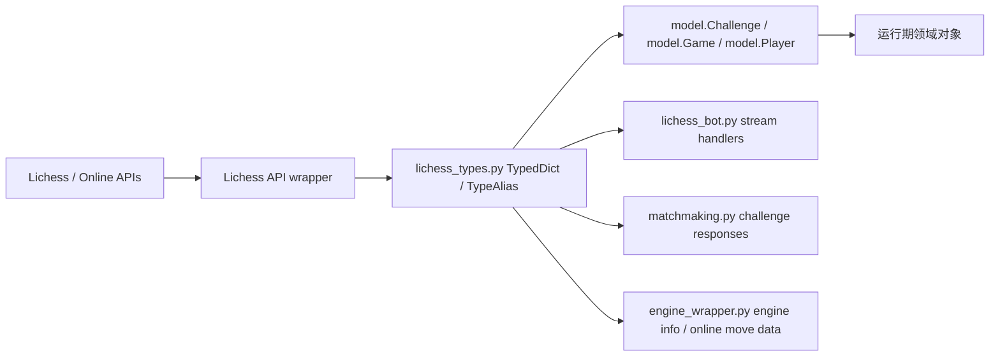
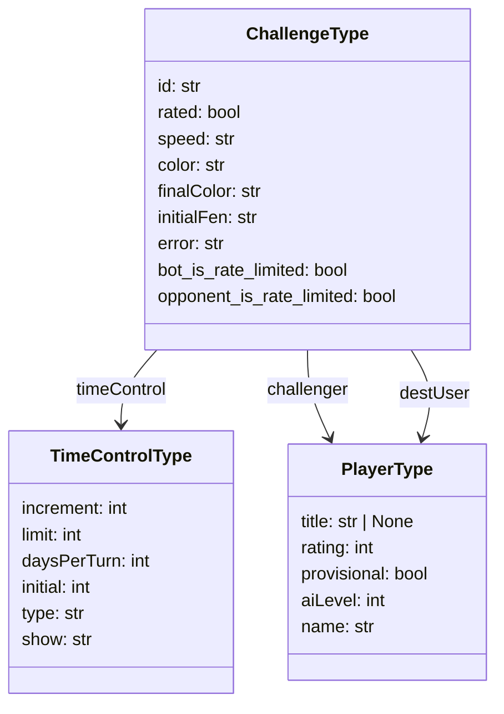
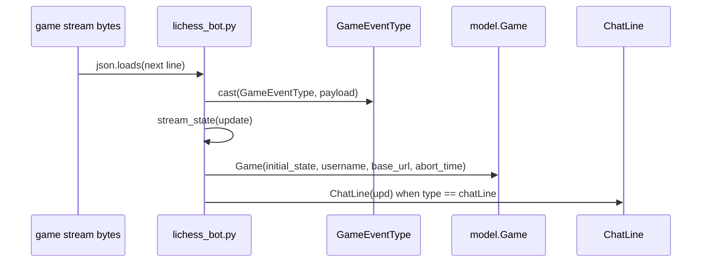

本页的架构假设是：`lib/lichess_types.py` 是 lichess-bot 对 **Lichess API、在线走法服务、引擎返回信息与进程间队列载荷** 的静态类型边界；运行期对象则在 `lib/model.py`、`lib/lichess.py`、`lib/lichess_bot.py` 等模块中通过索引、`get()` 与 `cast()` 消费这些结构。代码验证显示，该类型层主要由 `TypeAlias`、`TypedDict`、`Literal` 与少量 `Enum` 组成，并未实现运行期 schema 校验；因此它的核心价值是为高级开发者提供 API 载荷形状、字段可选性和跨模块契约的静态约束。Sources: [lichess_types.py](lib/lichess_types.py#L1-L24), [model.py](lib/model.py#L25-L42), [lichess.py](lib/lichess.py#L229-L242)

## 类型层的设计边界

`lichess_types.py` 将基础别名、Lichess 账户与对局结构、事件流结构、在线走法结构、Token 测试结构、backoff 回调结构集中定义在一个共享模块中。文件开头显式说明这些类型提示可被其他 Python 文件访问，并从 `typing` 引入 `Any`、`TypedDict`、`Literal`、`TypeAlias`，同时从 `chess.engine` 和 `chess` 引入引擎与棋盘相关类型；这说明类型层同时覆盖平台 API 与引擎 API 两侧的数据边界。Sources: [lichess_types.py](lib/lichess_types.py#L1-L21)



上图表达的是“静态契约在中心、运行期对象在边缘”的关系：`Lichess` 方法把 HTTP JSON 转换为带注解的返回类型，`model` 模块将 `ChallengeType`、`GameEventType`、`PlayerType` 读入领域对象，`lichess_bot.py` 将流式 JSON `cast` 为 `GameEventType`，`matchmaking.py` 根据 `ChallengeType` 中的错误与限速字段更新配对状态，`engine_wrapper.py` 则以 `InfoStrDict` 组织引擎分析信息。Sources: [lichess.py](lib/lichess.py#L229-L242), [model.py](lib/model.py#L25-L42), [lichess_bot.py](lib/lichess_bot.py#L795-L811), [matchmaking.py](lib/matchmaking.py#L122-L143), [engine_wrapper.py](lib/engine_wrapper.py#L418-L451)

## 基础别名：把跨模块原语收束成契约

基础 `TypeAlias` 定义了命令行参数、走法结果、队列元素、HTTP payload、引擎选项和 Homemade 引擎参数等共享形状。例如 `REQUESTS_PAYLOAD_TYPE` 被限制为 `dict[str, str | int | bool]`，与 `Lichess.challenge()` 的 `payload` 参数一致；`CONTROL_QUEUE_TYPE` 和 `PGN_QUEUE_TYPE` 则分别表达事件队列与 PGN 队列的元素类型。Sources: [lichess_types.py](lib/lichess_types.py#L12-L24), [lichess_types.py](lib/lichess_types.py#L259-L260), [lichess.py](lib/lichess.py#L521-L524)

| 类型别名 | 结构 | 主要语义 |
|---|---:|---|
| `COMMANDS_TYPE` | `list[str]` | 引擎启动或命令参数序列 |
| `MOVE` | `PlayResult \| list[Move]` | 引擎走法结果或候选走法列表 |
| `REQUESTS_PAYLOAD_TYPE` | `dict[str, str \| int \| bool]` | POST JSON payload 的受限值域 |
| `OPTIONS_TYPE` | `dict[str, str \| int \| bool \| None]` | 普通引擎选项 |
| `OPTIONS_GO_EGTB_TYPE` | `dict[str, str \| int \| bool \| None \| EGTPATH_TYPE \| GO_COMMANDS_TYPE]` | 含残局库路径与 go 命令的扩展选项 |
| `CONTROL_QUEUE_TYPE` | `Queue[EventType]` | 控制流事件队列 |
| `PGN_QUEUE_TYPE` | `Queue[EventType \| None]` | PGN 写入队列，允许终止哨兵 |

这些别名的设计不是为了替代领域对象，而是为了避免在 `Lichess`、引擎封装、主循环与测试替身之间重复书写复杂 union。尤其是 `REQUESTS_PAYLOAD_TYPE` 在真实 API 封装与测试替身中保持一致，说明它是主动挑战调用的共享边界。Sources: [lichess_types.py](lib/lichess_types.py#L12-L24), [lichess_types.py](lib/lichess_types.py#L259-L260), [lichess.py](lib/lichess.py#L521-L524), [lichess.py](test_bot/lichess.py#L244-L244)

## Lichess 用户与玩家结构

用户账户结构由 `PerfType`、`ProfileType`、`UserProfileType` 与 `PublicDataType` 分层描述。`PerfType` 表达某一棋种或速度下的局数、评级、偏差、是否 provisional 和 rating progress；`ProfileType` 表达用户资料页信息；`UserProfileType` 表达 `/api/account` 等认证上下文中的用户数据；`PublicDataType` 则扩展了公开资料中的 `disabled`、`tosViolation`、`streaming`、`playing` 等字段。Sources: [lichess_types.py](lib/lichess_types.py#L27-L74), [lichess_types.py](lib/lichess_types.py#L263-L288)

`PlayerType` 是挑战与对局载荷中嵌套玩家对象的共同形状，包含 `title`、`rating`、`provisional`、`aiLevel`、`id`、`username`、`name`、`online`。运行期 `Player` 模型只读取 `title`、`rating`、`provisional`、`aiLevel` 和 `name`，并用 `title == "BOT"` 或 `aiLevel is not None` 推导 `is_bot`；这意味着 `PlayerType` 比当前模型实际消费字段更宽，保留了来自 API 的额外信息。Sources: [lichess_types.py](lib/lichess_types.py#L124-L135), [model.py](lib/model.py#L313-L330)

| TypedDict | 字段可选性 | 典型消费者 | 关键字段 |
|---|---:|---|---|
| `PerfType` | `total=False` | 配对权重、评级过滤 | `games`, `rating`, `rd`, `prov`, `prog` |
| `ProfileType` | `total=False` | 用户资料载荷 | `country`, `bio`, `links`, federation ratings |
| `UserProfileType` | `total=False` | 机器人自身资料、在线机器人列表 | `id`, `username`, `perfs`, `title` |
| `PublicDataType` | `total=False` | 公开用户资料查询 | `disabled`, `tosViolation`, `playing`, `streaming` |
| `PlayerType` | `total=False` | `Challenge`、`Game`、`Player` | `title`, `rating`, `provisional`, `aiLevel`, `name` |

这些结构均使用 `total=False`，表示静态层允许字段缺失；但模型层对部分字段使用强索引，例如 `Challenge.__init__()` 直接读取 `challenge_info["id"]`、`["rated"]`、`["variant"]["key"]`、`["perf"]["name"]`、`["speed"]`、`["color"]` 与 `["timeControl"]`，而对 `timeControl` 内的 `increment`、`limit`、`daysPerTurn` 使用 `get()`。这形成了“顶层关键字段必须存在、部分子字段可选”的实际约束。Sources: [lichess_types.py](lib/lichess_types.py#L54-L74), [lichess_types.py](lib/lichess_types.py#L124-L135), [model.py](lib/model.py#L25-L42)

## 挑战载荷：ChallengeType 的静态形状与运行期要求

`ChallengeType` 描述来自 Lichess 挑战事件与主动挑战响应的混合形状，字段包括挑战标识、URL、颜色、方向、rated/speed/status、`timeControl`、`variant`、`challenger`、`destUser`、`perf`、兼容性、最终颜色、拒绝原因、初始 FEN、错误信息、限速对象以及 bot/opponent 限速状态。`TimeControlType` 同时覆盖普通时钟、通信棋与初始时间字段。Sources: [lichess_types.py](lib/lichess_types.py#L163-L199)



`Challenge` 领域对象将 `ChallengeType` 压缩为接受/拒绝决策所需的字段：`id`、`rated`、`variant.key`、`perf.name`、`speed`、时间控制、挑战者、目标用户、是否来自自身、初始 FEN、最终颜色和完整 `timeControl`。如果颜色是 `"random"`，模型读取 `finalColor` 作为实际颜色；如果没有 `initialFen`，默认 `"startpos"`。Sources: [model.py](lib/model.py#L25-L42)

主动挑战响应通过 `Lichess.handle_challenge()` 扩展同一个 `ChallengeType`：当响应被判定为 bot 或对手触发每日 bot-vs-bot 限速时，代码把 `bot_is_rate_limited`、`opponent_is_rate_limited` 与 `rate_limit_timeout` 写回 `challenge_response`。随后 `matchmaking.handle_challenge_error_response()` 读取这些字段，以决定全局冷却、对手过滤或普通错误过滤。Sources: [lichess.py](lib/lichess.py#L331-L344), [matchmaking.py](lib/matchmaking.py#L122-L143)

## 对局与事件流：GameType、GameStateType、GameEventType、EventType

`EventType` 是控制流事件的顶层结构，包含 `type`、`game`、`challenge` 与 `error`；它用于描述 Lichess 事件流中的挑战、游戏开始、错误等外层事件。`GameType` 描述账户正在进行对局列表中的条目，字段包括 `gameId`、`fullId`、`color`、`fen`、`opponent`、`perf`、`rated`、`secondsLeft`、`status`、`speed`、`variant`、`winner`、`pgn` 等。Sources: [lichess_types.py](lib/lichess_types.py#L137-L161), [lichess_types.py](lib/lichess_types.py#L201-L208)

`GameStateType` 是对局流中 `gameState` 更新的核心形状，包含走法字符串、双方剩余时间与增量、求和状态、终局状态和胜者；`GameEventType` 则同时覆盖 `gameFull` 初始完整状态、`gameState` 增量状态、聊天行、离线提示、claim win、takeback 等字段。因此它是一个宽联合式 `TypedDict`，由 `type` 字段在运行期区分具体事件语义。Sources: [lichess_types.py](lib/lichess_types.py#L210-L257)



游戏主循环打开对局流后，将第一行 JSON `cast(GameEventType)` 为 `initial_state`，如果事件类型是 `gameFull`，`stream_state()` 返回其中的 `state`；随后 `model.Game` 使用完整初始状态构建领域对象。循环中当 `u_type == "chatLine"` 时把同一个 `GameEventType` 交给 `ChatLine`，当 `u_type == "gameState"` 时把它赋给 `game.state` 并继续读取 `wtime`、`btime`、`winc`、`binc` 等计时字段。Sources: [lichess_bot.py](lib/lichess_bot.py#L795-L811), [lichess_bot.py](lib/lichess_bot.py#L860-L901), [conversation.py](lib/conversation.py#L17-L27)

`Game` 模型对 `GameEventType` 的初始完整状态有更严格的隐含要求：它直接索引 `id`、`variant.name`、`white`、`black`、`state`、`createdAt`，并从 `clock` 读取 `initial` 与 `increment`，在缺省时把初始时钟设为十年、增量设为 0。它还根据用户名判断 bot 颜色，并从 `state["moves"]`、`state["wtime"]`、`state["btime"]` 等字段执行对局控制逻辑。Sources: [model.py](lib/model.py#L198-L224), [model.py](lib/model.py#L245-L280)

## 引擎信息结构：InfoStrDict、InfoDictKeys、InfoDictValue

`InfoStrDict` 描述 python-chess 引擎返回信息的可读化前状态，字段包括 `score`、`pv`、`depth`、`seldepth`、`time`、`nodes`、`nps`、`tbhits`、`multipv`、`currmove`、`hashfull`、`cpuload`、`refutation`、`currline`、`wdl`、`string`、`ponderpv`、`Source`、`Pv`。`InfoDictKeys` 用 `Literal` 枚举这些键名，`InfoDictValue` 则枚举允许的值类型，包括 `PovScore`、`PovWdl`、`Move`、走法列表、数值、字符串和特定字典。Sources: [lichess_types.py](lib/lichess_types.py#L89-L121)

`EngineWrapper.add_comment()` 将 `move.info` 复制并 `cast(InfoStrDict)`，然后把 `pv`、`refutation`、`currmove` 转换成 SAN 或 variation SAN，再追加到 `move_commentary`。`get_stats()` 读取最后一条 `InfoStrDict`，把 `wdl`、`ponderpv`、`nps`、`score`、`time` 映射到可读字段名，并在没有 `Source` 时补为 `"Engine"`。Sources: [engine_wrapper.py](lib/engine_wrapper.py#L435-L451), [engine_wrapper.py](lib/engine_wrapper.py#L500-L535)

| 结构 | 约束方式 | 消费路径 | 作用 |
|---|---:|---|---|
| `InfoStrDict` | `TypedDict(total=False)` | `move_commentary` | 保存每步引擎分析信息 |
| `InfoDictKeys` | `Literal[...]` | `to_readable_value()` / `get_stats()` | 限定可读化字段键名 |
| `InfoDictValue` | union type alias | `to_readable_item()` | 限定字段值的静态范围 |
| `ReadableType` | callable 字典 | `to_readable_value()` | 把引擎原始值格式化为字符串 |

该设计让引擎信息的键和值在静态层保持可追踪，同时保留对 python-chess `move.info` 动态字典的兼容性。代码并不在写入 `move_commentary` 前验证每个键是否属于 `InfoDictKeys`，而是在可读化路径中通过 `cast()` 与字段存在性判断进行处理。Sources: [lichess_types.py](lib/lichess_types.py#L76-L87), [lichess_types.py](lib/lichess_types.py#L89-L121), [engine_wrapper.py](lib/engine_wrapper.py#L500-L535)

## 在线走法服务结构：ChessDB、Lichess Cloud、Explorer、EGTB 的统一外壳

在线走法类型覆盖多种来源：`ChessDBMoveType` 描述 chessdb 返回的 `uci`、`san`、`score`、`rank`、`note`、`winrate`；`LichessPvType` 描述云分析 PV；`LichessExplorerGameType` 描述 opening explorer 中的历史对局；`LichessEGTBMoveType` 描述 Lichess tablebase 中包含 DTZ、DTM、胜负类别和特殊终局标志的候选走法。Sources: [lichess_types.py](lib/lichess_types.py#L304-L350)

`OnlineMoveType` 将 chessdb、opening explorer 与 lichess EGTB 的候选走法字段并入一个统一移动结构，`OnlineType` 则将不同服务的顶层响应合并到一个宽 `TypedDict(total=False)` 中，包含 `moves: list[OnlineMoveType]`、tablebase 终局标志、explorer 的 `topGames` / `recentGames` / `opening`、cloud 的 `fen` / `knodes` / `depth` / `pvs`、chessdb 的 `status` / `score` / `pv` / `move` / `egtb` 等字段。Sources: [lichess_types.py](lib/lichess_types.py#L352-L435)

```mermaid
flowchart TD
    OnlineType --> ChessDB[chessdb fields: status, score, pv, pvSAN, move, egtb]
    OnlineType --> Cloud[Lichess cloud fields: fen, knodes, ply, depth, pvs]
    OnlineType --> Explorer[Explorer fields: white, black, draws, topGames, recentGames, opening]
    OnlineType --> EGTB[EGTB fields: dtz, precise_dtz, dtm, category, terminal flags]
    OnlineType --> Moves[moves: list[OnlineMoveType]]
```

`Lichess.online_book_get()` 返回 `OnlineType`，并根据 `authenticated` 参数在认证 session 与独立 session 之间选择；函数内部直接调用 `.json()` 并把结果标注为 `OnlineType`。这意味着在线走法响应的类型约束主要服务于后续静态阅读与调用约定，而非 HTTP 响应阶段的运行期校验。Sources: [lichess.py](lib/lichess.py#L530-L546), [lichess_types.py](lib/lichess_types.py#L389-L435)

## Token、backoff 与 API 返回类型

Token 测试响应由 `TokenTestType` 和 `TOKEN_TESTS_TYPE` 表示，其中单个 token 条目包含 `scopes`、`userId`、`expires`，整体响应是 `dict[str, TokenTestType]`。`Lichess.get_token_info()` 将 `api_post("token_test", data=token)` 的结果 `cast(TOKEN_TESTS_TYPE)`，再用提交的 token 作为 key 读取条目；如果 token-test 响应异常缺失，还会回退到 `/api/account` 并在 `title == "BOT"` 时构造包含 `scopes` 与 `userId` 的 `TokenTestType` 形状。Sources: [lichess_types.py](lib/lichess_types.py#L438-L446), [lichess.py](lib/lichess.py#L170-L193)

`BackoffDetails` 复刻了 backoff 回调中的 details 结构：基础 `_BackoffDetails` 包含 `target`、`args`、`kwargs`、`tries`、`elapsed`，扩展类型增加可选的 `wait` 与 `value`。`backoff_handler()` 读取 `args` 与 `kwargs`，在 token 测试时把 `kwargs["data"]` 替换为 `"<token redacted>"` 后写入 debug 日志。Sources: [lichess_types.py](lib/lichess_types.py#L449-L463), [lichess.py](lib/lichess.py#L116-L124)

API wrapper 的 JSON 返回类型是窄 union：`api_get_json()` 返回 `PublicDataType | UserProfileType | dict[str, list[GameType]] | list[dict[str, str]]`，`api_post()` 返回 `ChallengeType | TOKEN_TESTS_TYPE | None`。更具体的方法再使用 `cast()` 将通用返回缩窄，例如 `get_profile()` 缩窄为 `UserProfileType`，`get_ongoing_games()` 缩窄为 `dict[str, list[GameType]]` 后返回 `nowPlaying`，`challenge()` 缩窄为 `ChallengeType`。Sources: [lichess.py](lib/lichess.py#L229-L242), [lichess.py](lib/lichess.py#L279-L315), [lichess.py](lib/lichess.py#L430-L444), [lichess.py](lib/lichess.py#L521-L524)

## 字段可选性与运行期风险边界

多数 API `TypedDict` 使用 `total=False`，这与外部 API 字段可能缺失、事件类型互斥、测试 fixture 只构造必要字段的现实相匹配。测试中的 `ChallengeType`、`UserProfileType`、`GameEventType` fixture 只提供模型需要的字段，例如挑战测试只给出 `id`、`status`、`challenger`、`destUser`、`variant`、`rated`、`speed`、`timeControl`、`color`、`finalColor`、`perf`，对局测试只给出 `id`、`variant`、`speed`、`perf`、`rated`、`createdAt`、双方玩家、`clock` 和 `state`。Sources: [lichess_types.py](lib/lichess_types.py#L27-L74), [lichess_types.py](lib/lichess_types.py#L174-L199), [lichess_types.py](lib/lichess_types.py#L225-L257), [test_model.py](test_bot/test_model.py#L13-L39), [test_model.py](test_bot/test_model.py#L173-L196)

这种宽类型策略带来的约束是：**静态类型允许缺失，不代表运行期逻辑能容忍缺失**。例如 `ChatLine` 直接索引 `room`、`username`、`text`；`Game.my_remaining_time()` 直接索引 `state["wtime"]` 与 `state["btime"]`；挑战模型直接索引多个顶层字段。因此新增 API 消费路径时，应区分“TypedDict 中声明的字段”、“当前代码强依赖的字段”和“仅在特定事件类型出现的字段”。Sources: [conversation.py](lib/conversation.py#L17-L27), [model.py](lib/model.py#L276-L280), [model.py](lib/model.py#L25-L42)

| 场景 | 静态定义 | 运行期读取方式 | 实际约束 |
|---|---:|---|---|
| 挑战初始化 | `ChallengeType(total=False)` | 多个 `[]` 强索引 | 关键挑战字段必须存在 |
| 对局初始化 | `GameEventType(total=False)` | `id`、`variant`、`white`、`black`、`state` 强索引 | `gameFull` 初始状态必须完整 |
| 聊天消息 | `GameEventType(total=False)` | `room`、`username`、`text` 强索引 | 仅可传入 `chatLine` 载荷 |
| 在线走法 | `OnlineType(total=False)` | HTTP JSON 标注为 `OnlineType` | 后续消费者需按来源判断字段 |
| 引擎信息 | `InfoStrDict(total=False)` | 字段存在性检查 + `cast()` | 信息项按引擎返回动态出现 |

测试进一步确认了“按场景构造最小合法载荷”的使用方式：聊天测试将 `{"room": "player", "username": "Chesszyh", "text": "!rating 2500"}` 直接作为 `GameEventType` 传给 `ChatLine`；外部走法测试构造 `GameEventType` 的最小 `gameFull` 形状来创建 `Game`。这些 fixture 是理解字段实际必需性的有效证据。Sources: [test_conversation.py](test_bot/test_conversation.py#L74-L87), [test_external_moves.py](test_bot/test_external_moves.py#L82-L112)

## 维护准则：扩展 API 类型时保持契约清晰

扩展 `lichess_types.py` 时，优先判断新字段属于哪一类边界：Lichess 账户/公开资料、挑战、对局事件、在线走法、引擎信息、Token/backoff 或进程间队列。已有代码把这些边界分布为独立 `TypedDict` 与 `TypeAlias`，不要把领域模型计算结果混入 API 输入结构，除非现有代码已经这样做；例如 `ChallengeType` 中的 `bot_is_rate_limited`、`opponent_is_rate_limited`、`rate_limit_timeout` 是 `handle_challenge()` 对挑战响应的显式扩展字段。Sources: [lichess_types.py](lib/lichess_types.py#L174-L199), [lichess.py](lib/lichess.py#L331-L344)

新增 API wrapper 方法时，应遵循现有模式：底层 `api_get_json()` 或 `api_post()` 返回宽 union，具体业务方法使用 `cast()` 收窄到目标 `TypedDict`，然后领域模块再将其转换为运行期对象或决策输入。这样可以保持 `Lichess` 层负责 HTTP 与 JSON 边界，`model` 和 `matchmaking` 层负责语义解释。Sources: [lichess.py](lib/lichess.py#L229-L242), [lichess.py](lib/lichess.py#L279-L315), [lichess.py](lib/lichess.py#L430-L444), [model.py](lib/model.py#L25-L42), [matchmaking.py](lib/matchmaking.py#L122-L143)

如果新事件只在特定 `type` 下出现，应放入现有宽 `GameEventType` 或 `EventType`，并在消费端先判断 `type` 再强索引字段。当前主循环已经按 `chatLine`、`gameState`、`ping` 分支处理同一个 `GameEventType`，这是扩展流式事件时应保持的模式。Sources: [lichess_types.py](lib/lichess_types.py#L201-L208), [lichess_types.py](lib/lichess_types.py#L225-L257), [lichess_bot.py](lib/lichess_bot.py#L860-L904)

## 下一步阅读

若要理解这些类型如何被领域模型消费，下一步阅读 [挑战、玩家与对局状态建模](20-tiao-zhan-wan-jia-yu-dui-ju-zhuang-tai-jian-mo)；若要理解 `GameEventType` 在主循环中的事件更新路径，阅读 [主循环、事件流与多进程任务协作](17-zhu-xun-huan-shi-jian-liu-yu-duo-jin-cheng-ren-wu-xie-zuo)；若要理解 `ChallengeType` 的限速扩展字段如何影响主动配对，阅读 [速率限制识别、退避策略与挑战冷却](30-su-lu-xian-zhi-shi-bie-tui-bi-ce-lue-yu-tiao-zhan-leng-que)。Sources: [model.py](lib/model.py#L25-L42), [lichess_bot.py](lib/lichess_bot.py#L795-L904), [lichess.py](lib/lichess.py#L331-L344), [matchmaking.py](lib/matchmaking.py#L122-L143)