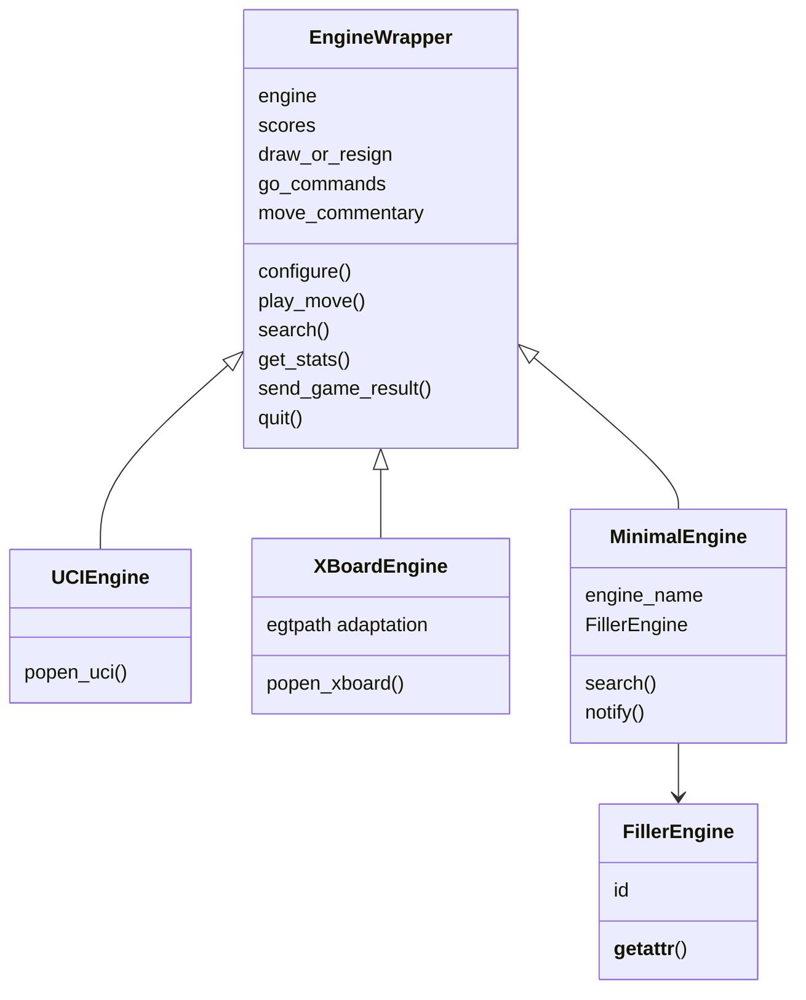

本页解释 lichess-bot 如何把三类不同形态的棋类引擎——外部 UCI 进程、外部 XBoard/CECP 进程、以及 Python 内部 Homemade 类——收敛到同一个 `EngineWrapper` 行为接口。架构假设是：**协议差异只应出现在创建与适配边界，走法搜索、统计记录、认输/求和、生命周期关闭等运行期行为应由统一封装层处理**；代码验证显示，`create_engine()` 按 `engine.protocol` 选择 `UCIEngine`、`XBoardEngine` 或 `get_homemade_engine()` 返回的 `MinimalEngine` 子类，然后把统一配置、对局对象与调试参数注入同一构造路径。Sources: [engine_wrapper.py](lib/engine_wrapper.py#L35-L65)

## 封装边界：一个工厂，三种引擎入口

`create_engine()` 是协议分派的入口：它先从 `engine_config.engine` 读取配置，调用 `engine_commands()` 生成启动命令，再依据 `protocol` 选择 `XBoardEngine`、`UCIEngine` 或 Homemade 类；如果协议不是 `xboard`、`uci`、`homemade` 三者之一，则直接抛出 `ValueError`。这种结构把“用户配置中的协议选择”限制在工厂层，避免后续对局逻辑反复判断协议类型。Sources: [engine_wrapper.py](lib/engine_wrapper.py#L35-L65)

```mermaid
flowchart TD
    A[engine_config.engine] --> B[engine_commands: 生成命令]
    A --> C{protocol}
    C -->|uci| D[UCIEngine]
    C -->|xboard| E[XBoardEngine]
    C -->|homemade| F[get_homemade_engine(name)]
    D --> G[EngineWrapper 统一运行接口]
    E --> G
    F --> H[MinimalEngine]
    H --> G
```

`engine_commands()` 负责把 `dir` 与 `name` 拼成绝对引擎路径，并可在命令前追加 `interpreter` 与 `interpreter_options`，也可把 `engine_options` 转换为 `--key=value` 或 `--key` 形式的命令行参数；因此，协议类接收到的 `commands` 已经是可直接传给 python-chess 进程启动函数的参数列表。Sources: [engine_wrapper.py](lib/engine_wrapper.py#L68-L79)

| 配置/输入 | 处理位置 | 作用于 | 统一封装含义 |
|---|---:|---|---|
| `engine.dir` + `engine.name` | `engine_commands()` | UCI/XBoard 外部进程；Homemade 只用于构造签名兼容 | 形成标准化 `commands` 参数 |
| `interpreter` / `interpreter_options` | `engine_commands()` | 需要解释器启动的引擎 | 支持 `java -jar`、脚本解释器等前缀 |
| `engine_options` | `engine_commands()` | 外部进程命令行 | 转为 `--参数` 风格 |
| `protocol` | `create_engine()` | 工厂分派 | 决定实例化 UCI、XBoard 或 Homemade |
| `silence_stderr` | `create_engine()` | 子进程 stderr | 可将嘈杂引擎 stderr 指向 `subprocess.DEVNULL` |

Sources: [engine_wrapper.py](lib/engine_wrapper.py#L45-L63), [engine_wrapper.py](lib/engine_wrapper.py#L68-L79)

配置文件中，引擎协议由 `engine.protocol` 声明，允许值在默认配置注释中明确为 `"uci"`、`"xboard"` 或 `"homemade"`；同一配置块还定义了 `dir`、`name`、`debug`、`working_dir`、`ponder` 等与封装入口直接相关的字段。Sources: [config.yml.default](config.yml.default#L4-L15)

## 共同基类：EngineWrapper 承担运行期一致性

`EngineWrapper` 是三类引擎共享的运行期外壳，它保存底层 `self.engine`、搜索分数 `scores`、求和/认输配置、`go_commands`、走法注释、强度限制状态，以及可选残局引擎引用；这说明统一封装并不只是“启动引擎”，还负责把搜索结果、日志统计与对局策略沉淀为跨协议状态。Sources: [engine_wrapper.py](lib/engine_wrapper.py#L93-L113)



`configure()` 将用户配置中的协议选项与 `game_specific_options(game)` 合并后发送给底层 `self.engine.configure()`；如果配置阶段发生异常，它会先关闭底层引擎再重新抛出异常。这给 UCI、XBoard 以及通过 `FillerEngine` 占位的 Homemade 提供了相同的配置调用路径，同时也保证配置失败不会留下未关闭的进程或对象。Sources: [engine_wrapper.py](lib/engine_wrapper.py#L114-L128)

`remove_managed_options()` 会过滤 python-chess 自身管理的选项，`create_engine()` 使用它处理对应协议的选项块，例如 `uci_options`、`xboard_options` 或 `homemade_options`；这使封装层只把非托管选项交给引擎，避免覆盖 python-chess 协议层内部需要控制的字段。Sources: [engine_wrapper.py](lib/engine_wrapper.py#L60-L63), [engine_wrapper.py](lib/engine_wrapper.py#L82-L87)

## UCIEngine：外部 UCI 进程的最薄适配层

`UCIEngine` 的构造函数只做三件事：调用 `EngineWrapper.__init__()` 初始化统一状态，使用 `chess.engine.SimpleEngine.popen_uci()` 启动 UCI 进程，然后调用 `configure()` 注入选项。它没有重写搜索逻辑，因此后续走法生成会落到 `EngineWrapper.search()` 的统一实现。Sources: [engine_wrapper.py](lib/engine_wrapper.py#L612-L633)

UCI 测试引擎展示了 python-chess 对 UCI 协议的基本握手预期：进程先收到 `uci`，返回 `id name`、`id author` 和 `uciok`；随后处理 `isready`、`position startpos moves ...` 与 `go`，并以 `bestmove` 返回走法。这个测试文件不是生产引擎，但清楚验证了封装层启动 UCI 进程后依赖标准 UCI 通信语义。Sources: [uci_engine.py](test_bot/uci_engine.py#L11-L22), [uci_engine.py](test_bot/uci_engine.py#L23-L43)

配置文件中，`uci_options` 是传给 UCI 引擎的任意选项块，示例包括 `Move Overhead`、`Threads`、`Hash`、`SyzygyPath` 与 `UCI_ShowWDL`；同一块下面的 `go_commands` 示例说明还可以向 UCI `go` 命令附加 `nodes`、`depth` 或 `movetime` 等搜索约束。Sources: [config.yml.default](config.yml.default#L125-L135)

## XBoardEngine：外部 XBoard 进程与残局路径适配

`XBoardEngine` 与 UCI 的主体结构相同，也先初始化 `EngineWrapper`，再通过 `chess.engine.SimpleEngine.popen_xboard()` 启动外部进程；差异在于它会额外处理 `egtpath`：从选项中取出残局库路径配置，读取 XBoard 协议 features 中的 `egt` 能力，并把引擎声明支持的残局库类型转换为 `egtpath <type>` 选项。Sources: [engine_wrapper.py](lib/engine_wrapper.py#L635-L665)

XBoard 测试引擎展示了 CECP/XBoard 握手：进程先收到 `xboard` 与 `protover 2`，返回 `feature myname="XBoard Test Bot" ping=1 setboard=1 usermove=1 done=1`；对局过程中，它处理 `ping`、`new` 与 `usermove`，并通过 `move <move>` 返回走法。Sources: [xboard_engine.py](test_bot/xboard_engine.py#L11-L20), [xboard_engine.py](test_bot/xboard_engine.py#L22-L37)

默认配置中的 `xboard_options` 示例包含 `cores`、`memory`、`egtpath` 以及 `go_commands.depth`；注释还明确指出 XBoard 的 `go_commands` 中 `movetime` 与 `nodes` 无效，并可能导致糟糕的时间管理。这是一个重要边界：统一封装允许配置结构相似，但并不抹平协议自身不支持的命令语义。Sources: [config.yml.default](config.yml.default#L136-L147)

## Homemade：用 Python 类替代外部协议进程

Homemade 引擎通过 `MinimalEngine` 接入，它继承 `EngineWrapper`，但并不真正包装外部进程；构造时它记录类名为 `engine_name`，并把 `self.engine` 设置为 `FillerEngine(self, name=self.engine_name)`。因此 Homemade 可以复用 `EngineWrapper` 的运行期逻辑，同时避免实现 UCI 或 XBoard 的 stdin/stdout 协议。Sources: [engine_wrapper.py](lib/engine_wrapper.py#L668-L692)

`MinimalEngine.search()` 是 Homemade 作者至少需要实现的方法，它接收 `board`、`time_limit`、`ponder`、`draw_offered` 与 `root_moves`，并必须返回 `chess.engine.PlayResult`；默认实现直接抛出 `NotImplementedError`，说明 Homemade 的核心扩展点就是“用 Python 函数产出 PlayResult”。Sources: [engine_wrapper.py](lib/engine_wrapper.py#L697-L705)

`FillerEngine` 的作用是为 `MinimalEngine` 提供一个形似底层引擎的 `self.engine` 属性：它保存 `id["name"]` 与 `name`，并通过 `__getattr__()` 把任何未知方法调用转发为 `main_engine.notify(method_name, *args, **kwargs)`。这让 `EngineWrapper` 中对 `self.engine.ping()`、`self.engine.quit()`、`self.engine.send_game_result()` 等调用在 Homemade 场景下不会因属性不存在而立即失败，而是变成可由 Homemade 自定义响应的通知。Sources: [engine_wrapper.py](lib/engine_wrapper.py#L707-L723), [engine_wrapper.py](lib/engine_wrapper.py#L725-L749)

`get_homemade_engine(name)` 通过动态属性查找加载 Homemade 类：常规情况下从顶层 `homemade` 模块中按类名读取；测试专用名称带有 `-for-lichess-bot-testing-only` 后缀时，则从 `test_bot.homemade` 读取对应类。这意味着配置中的 `engine.name` 对 Homemade 而言不是二进制文件名，而是 `homemade.py` 中的类名。Sources: [engine_wrapper.py](lib/engine_wrapper.py#L752-L769)

仓库根目录的 `homemade.py` 提供了示例类：`RandomMove` 随机选择合法走法，`Alphabetical` 按 SAN 排序选择第一个走法，`FirstMove` 按 UCI 字符串排序选择第一个走法；这些类都返回 `PlayResult(move, None)`，展示了 Homemade 最小实现的返回形态。Sources: [homemade.py](homemade.py#L20-L31), [homemade.py](homemade.py#L34-L51)

`ComboEngine` 展示了 Homemade 可以使用更多上下文：它读取 `Limit` 中的剩余时间或单步搜索时间，检查 `root_moves` 是否限制候选走法，并把 `draw_offered` 原样放入 `PlayResult(..., draw_offered=draw_offered)`。这验证 Homemade 并非只能“给出一个走法”，也可以参与时间、候选根节点与求和响应的决策。Sources: [homemade.py](homemade.py#L54-L76), [homemade.py](homemade.py#L77-L97)

## 统一搜索路径：协议不同，PlayResult 相同

`play_move()` 先尝试外部走法来源，包括本地开局库、本地残局库以及在线走法；如果这些来源没有直接给出最终 `PlayResult`，或者只给出 `root_moves` 限制列表，它才进入引擎搜索路径。进入搜索前，它会检查对手是否提出求和，计算本步 `time_limit` 与 ponder 状态，并应用快速棋时间管理调整。Sources: [engine_wrapper.py](lib/engine_wrapper.py#L196-L223)

`play_move()` 调用搜索时会区分一个细节：如果当前类没有重写 `EngineWrapper.search()`，则调用统一搜索实现并额外传入 `game` 与 `engine_cfg`；如果子类重写了 `search()`，则按 Homemade 所需的较短签名调用。这一判断让 UCI/XBoard 走统一搜索路径，也让 Homemade 可以通过重写 `search()` 直接实现走法选择。Sources: [engine_wrapper.py](lib/engine_wrapper.py#L225-L230)

`EngineWrapper.search()` 会先把配置中的 `go_commands` 合并到 `time_limit`，再通过 `engine_for_position(board)` 选择当前应使用的底层引擎，然后调用 `active_engine.play()`，传入 `info=chess.engine.INFO_ALL`、`ponder`、`draw_offered` 与可选 `root_moves`；之后它记录搜索结果，并根据分数序列决定是否求和或认输。Sources: [engine_wrapper.py](lib/engine_wrapper.py#L252-L261), [engine_wrapper.py](lib/engine_wrapper.py#L320-L351)

| 维度 | UCIEngine | XBoardEngine | Homemade / MinimalEngine |
|---|---|---|---|
| 启动方式 | `SimpleEngine.popen_uci()` | `SimpleEngine.popen_xboard()` | 不启动外部进程，创建 `FillerEngine` |
| 配置来源 | `uci_options` | `xboard_options` | `homemade_options` 经同一工厂路径传入 |
| 核心搜索 | 默认使用 `EngineWrapper.search()` | 默认使用 `EngineWrapper.search()` | 通常重写 `search()` |
| 返回类型 | `PlayResult` | `PlayResult` | 必须返回 `PlayResult` |
| 协议通信 | UCI stdin/stdout | XBoard/CECP stdin/stdout | Python 方法调用 |
| 名称来源 | 引擎 `id["name"]` | 引擎 `id["name"]` | 类名写入 `FillerEngine.id["name"]` |

Sources: [engine_wrapper.py](lib/engine_wrapper.py#L612-L633), [engine_wrapper.py](lib/engine_wrapper.py#L635-L665), [engine_wrapper.py](lib/engine_wrapper.py#L668-L705)

## 生命周期、名称与对局结束通知

统一封装实现了上下文管理：进入 `with` 块时调用底层 `engine.__enter__()`，退出且没有异常时先 `ping()` 再 `quit()`，最后调用底层 `engine.__exit__()`。这使 UCI、XBoard 与 Homemade 都服从同一资源释放协议；区别只在于 Homemade 的相关调用会被 `FillerEngine` 转发到 `notify()`。Sources: [engine_wrapper.py](lib/engine_wrapper.py#L156-L168), [engine_wrapper.py](lib/engine_wrapper.py#L572-L609)

`name()` 统一从 `self.engine.id["name"]` 读取引擎名称；`get_pid()` 对外部进程尝试从 `self.engine.transport.get_pid()` 读取 PID，而 `MinimalEngine.get_pid()` 固定返回 `"?"`，因为 Homemade 没有外部子进程。Sources: [engine_wrapper.py](lib/engine_wrapper.py#L561-L570), [engine_wrapper.py](lib/engine_wrapper.py#L693-L695)

`send_game_result()` 根据 Lichess 对局终止状态把结果转换为底层引擎可理解的通知：将将死、认输、中止、和棋、超时以及其他终止原因映射为 `self.engine.send_game_result(...)` 调用。由于该方法位于 `EngineWrapper`，因此三种引擎都共享同一套对局结束语义。Sources: [engine_wrapper.py](lib/engine_wrapper.py#L576-L603)

## 统计、分数记录与求和/认输决策

搜索完成后，`record_search_result()` 从 `PlayResult.info["score"]` 读取评分并保存到 `self.scores`；如果没有评分，则使用一个不会影响求和/认输判断的 `null_score`。随后 `offer_draw_or_resign()` 根据连续若干步的评分、棋子数量与配置阈值决定是否设置 `result.draw_offered` 或 `result.resigned`。Sources: [engine_wrapper.py](lib/engine_wrapper.py#L263-L292), [engine_wrapper.py](lib/engine_wrapper.py#L401-L405)

`add_comment()` 会把 `PlayResult.info` 复制到 `move_commentary`，并把 `pv`、`refutation`、`currmove` 等字段转换为更适合展示的 SAN 文本；`get_stats()` 再把 `score`、`wdl`、`nps`、`time` 等字段改写为“Evaluation”“Winrate”“Speed”“Movetime”等可读名称，并在缺少来源字段时标记为 `Source: Engine`。Sources: [engine_wrapper.py](lib/engine_wrapper.py#L435-L451), [engine_wrapper.py](lib/engine_wrapper.py#L513-L551)

这意味着统一封装层把“协议层返回的搜索信息”转换为 lichess-bot 内部一致的展示与策略输入：UCI、XBoard 与 Homemade 只要最终返回 `PlayResult`，就能进入同一套注释、日志、求和与认输处理流程。Sources: [engine_wrapper.py](lib/engine_wrapper.py#L245-L251), [engine_wrapper.py](lib/engine_wrapper.py#L350-L351)

## 配置选项对封装层的影响

以下配置只覆盖本页关注的统一引擎封装边界；开局库、在线走法、时间管理与残局专用策略的细节属于后续页面范围，这里仅说明它们如何进入封装对象。Sources: [config.yml.default](config.yml.default#L4-L15), [config.yml.default](config.yml.default#L119-L148)

| 配置路径 | 适用协议 | 封装层用途 |
|---|---|---|
| `engine.protocol` | UCI / XBoard / Homemade | 决定 `create_engine()` 实例化哪一类 |
| `engine.dir` + `engine.name` | UCI / XBoard；Homemade 的 `name` 是类名 | 形成启动命令或动态类查找名称 |
| `engine.working_dir` | UCI / XBoard | 作为 `cwd` 传给进程启动函数 |
| `engine.debug` | UCI / XBoard | 传给 python-chess 启动函数用于调试通信 |
| `engine.silence_stderr` | UCI / XBoard | 控制 stderr 是否静默 |
| `engine.uci_options` | UCI | 经 `remove_managed_options()` 后配置引擎 |
| `engine.xboard_options` | XBoard | 经 `remove_managed_options()` 后配置引擎，并支持 `egtpath` 转换 |
| `engine.homemade_options` | Homemade | 通过同一工厂路径传入 MinimalEngine 构造流程 |

Sources: [engine_wrapper.py](lib/engine_wrapper.py#L45-L65), [engine_wrapper.py](lib/engine_wrapper.py#L68-L87), [config.yml.default](config.yml.default#L119-L148)

## 阅读路径

如果你想从配置角度理解如何选择协议和填写引擎字段，下一步阅读 [配置并验证国际象棋引擎](5-pei-zhi-bing-yan-zheng-guo-ji-xiang-qi-yin-qing) 与 [配置文件结构与必填字段](8-pei-zhi-wen-jian-jie-gou-yu-bi-tian-zi-duan)；如果你正在实现 Python 内部引擎，继续阅读 [创建自定义 Homemade 引擎](14-chuang-jian-zi-ding-yi-homemade-yin-qing)。Sources: [config.yml.default](config.yml.default#L4-L15), [homemade.py](homemade.py#L1-L10)

在深入解析路径中，本页之后的自然延伸是 [时间管理、Ponder、搜索参数与走法生成](25-shi-jian-guan-li-ponder-sou-suo-can-shu-yu-zou-fa-sheng-cheng)，因为统一封装已经说明了 `search()` 如何接收 `Limit`、`ponder`、`draw_offered` 与 `root_moves`；外部走法来源的优先级与细节则应继续阅读 [外部走法来源：Polyglot、云分析、Opening Explorer 与 Tablebase](26-wai-bu-zou-fa-lai-yuan-polyglot-yun-fen-xi-opening-explorer-yu-tablebase)。Sources: [engine_wrapper.py](lib/engine_wrapper.py#L217-L230), [engine_wrapper.py](lib/engine_wrapper.py#L320-L351)