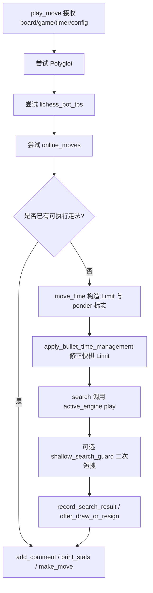
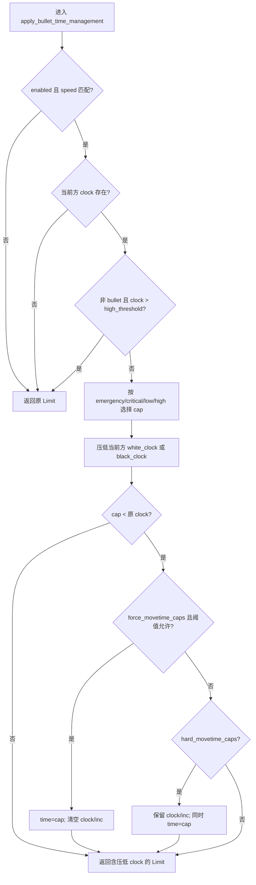
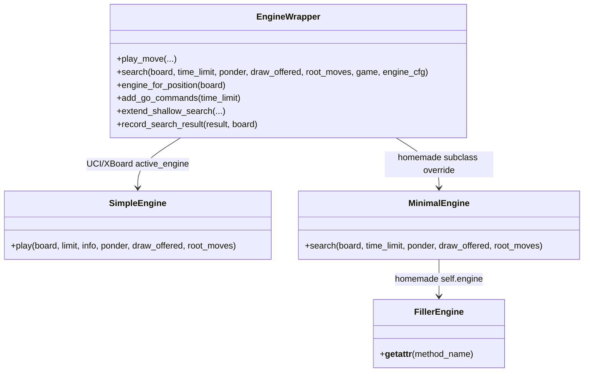

本页定位在“引擎集成”链路中，解释 lichess-bot 在真正调用引擎搜索前如何构造时间限制，如何决定是否允许 ponder，如何叠加 `go_commands`、快棋保护和浅层搜索补偿，最后如何把搜索结果转化为走法、统计信息、求和或认输信号。它不展开外部开局库、云分析或残局库的选择策略；这些属于[外部走法来源：Polyglot、云分析、Opening Explorer 与 Tablebase](26-wai-bu-zou-fa-lai-yuan-polyglot-yun-fen-xi-opening-explorer-yu-tablebase)。Sources: [engine_wrapper.py](lib/engine_wrapper.py#L170-L251), [engine_wrapper.py](lib/engine_wrapper.py#L320-L351)

## 架构假设与验证结论

从第一性原理看，走法生成并不是“直接让引擎想一步棋”，而是一个受时钟、外部走法、引擎协议、局面类别和配置约束共同支配的决策管线：`play_move()` 先尝试本地书、残局表和在线走法；若没有可直接执行的 `PlayResult`，才计算 `chess.engine.Limit`，应用快棋时间管理，调用 `search()`，再记录注释、打印统计并通过 Lichess API 落子或认输。Sources: [engine_wrapper.py](lib/engine_wrapper.py#L196-L251)

这条管线的关键分层是：**时间预算由独立函数生成**，**搜索参数由包装器追加**，**实际搜索由当前局面选择的引擎执行**，**搜索结果再回流到注释、统计、求和与认输判断**；因此，高级开发者调试超时、浅搜或错误走法时，应先定位是时间限制构造问题、参数覆盖问题，还是 `active_engine.play()` 之后的结果处理问题。Sources: [engine_wrapper.py](lib/engine_wrapper.py#L220-L229), [engine_wrapper.py](lib/engine_wrapper.py#L340-L351), [engine_wrapper.py](lib/engine_wrapper.py#L401-L405)

## 时间限制的三种入口

`move_time()` 是时间管理的入口，它根据棋局阶段和对局类型返回二元组：一个 `chess.engine.Limit`，以及是否继续允许 ponder。开局前两个半回合以内会走 `first_move_time()`，对应固定 10 秒搜索，并强制关闭这一步之后的 ponder；通信棋走 `single_move_time()`；普通实时棋走 `game_clock_time()`。Sources: [engine_wrapper.py](lib/engine_wrapper.py#L772-L795), [engine_wrapper.py](lib/engine_wrapper.py#L828-L838)

| 场景 | 触发条件 | 生成的 `Limit` | Ponder 处理 | 设计含义 |
|---|---:|---|---|---|
| 首步保护 | `len(board.move_stack) < 2` | `Limit(time=10, clock_id="first move")` | 返回 `False` | 首步使用固定搜索时间，并避免新时钟开始后的 ponder |
| 通信棋 / 无限棋式处理 | `is_correspondence` 为真 | `Limit(time=min(configured_time, remaining_clock_after_overhead), clock_id="correspondence")` | 保留传入值 | 使用单步定长思考，但不超过扣除 overhead 后的剩余时钟 |
| 实时棋 | 其他情况 | `Limit(white_clock, black_clock, white_inc, black_inc, clock_id="real time")` | 保留传入值 | 把双边时钟和增量交给引擎自身时间管理 |

Sources: [engine_wrapper.py](lib/engine_wrapper.py#L791-L795), [engine_wrapper.py](lib/engine_wrapper.py#L808-L825), [engine_wrapper.py](lib/engine_wrapper.py#L841-L864)

通信棋时间计算会先读取 `setup_timer.time_since_reset()` 作为收到对手走法之后已经消耗的预处理时间，再加上 `move_overhead`，从当前走棋方的 Lichess 时钟中扣除，最后在配置的 `correspondence.move_time` 与扣除 overhead 后的剩余时间之间取较小值。Sources: [engine_wrapper.py](lib/engine_wrapper.py#L808-L825), [config.yml.default](config.yml.default#L157-L162)

实时棋时间计算同样扣除 `setup_timer` 与 `move_overhead`，但只修正当前走棋方的时钟；随后把白方剩余时间、黑方剩余时间、白方增量和黑方增量一起传给 python-chess 的 `Limit`，让 UCI/XBoard 引擎继续执行自身的时间分配策略。Sources: [engine_wrapper.py](lib/engine_wrapper.py#L841-L864), [config.yml.default](config.yml.default#L150-L154)

## Ponder 的边界

配置层存在 `engine.ponder` 和 `correspondence.ponder`，并且配置加载会为 `engine` 与 `correspondence` 两个 section 填充 `ponder` 与 `uci_ponder` 默认值；但在本页关注的搜索路径中，真正传给引擎的是 `move_time()` 返回的 `can_ponder`，随后由 `search()` 原样传入 `active_engine.play(..., ponder=ponder)`。Sources: [config.yml.default](config.yml.default#L4-L15), [config.yml.default](config.yml.default#L157-L162), [config.py](lib/config.py#L311-L314), [engine_wrapper.py](lib/engine_wrapper.py#L320-L347)

Ponder 的唯一显式时间管理特例是首步：`move_time()` 在半回合数小于 2 时返回 `False`，注释说明原因是“新时钟随后开始”，因此即使外层允许 ponder，首步之后也不会把 ponder 权限传给引擎。Sources: [engine_wrapper.py](lib/engine_wrapper.py#L791-L795)

浅层搜索补偿不会 ponder：`extend_shallow_search()` 的第二次短搜固定使用 `ponder=False`，并以 `clock_id="shallow search guard"` 的精确 `Limit(time=extra_movetime)` 执行。这避免补偿搜索与对手时间思考混合。Sources: [engine_wrapper.py](lib/engine_wrapper.py#L353-L375)

## `go_commands` 如何覆盖搜索参数

`EngineWrapper.__init__()` 会从引擎 options 中弹出 `go_commands` 并保存为 `Configuration`，因此它不会作为普通 UCI/XBoard option 配置给引擎，而是在每次搜索前由 `add_go_commands()` 叠加到 `chess.engine.Limit` 上。Sources: [engine_wrapper.py](lib/engine_wrapper.py#L96-L107), [engine_wrapper.py](lib/engine_wrapper.py#L252-L261)

`go_commands.movetime` 的行为是“只收紧，不放宽”：如果现有 `time_limit.time` 为空，或现有时间大于配置的 `movetime`，才把 `time_limit.time` 改成该毫秒值；而 `depth` 与 `nodes` 会直接写入 `Limit.depth` 与 `Limit.nodes`。Sources: [engine_wrapper.py](lib/engine_wrapper.py#L252-L261)

| 参数 | 适用位置 | 行为 | 注意点 |
|---|---|---|---|
| `movetime` | UCI `go_commands` 示例 | 限制精确搜索毫秒数，且不会扩大已有更短时间 | 配置示例标注为整数毫秒 |
| `depth` | UCI/XBoard `go_commands` 示例 | 写入 `Limit.depth` | 可用于固定搜索深度 |
| `nodes` | UCI 示例 | 写入 `Limit.nodes` | 默认配置注释只在 UCI 示例中列出 |
| XBoard `movetime` / `nodes` | XBoard 注释 | 配置文件注释提示可能导致不良时间管理 | XBoard 示例只推荐 `depth` |

Sources: [config.yml.default](config.yml.default#L125-L146), [engine_wrapper.py](lib/engine_wrapper.py#L252-L261)

## 快棋时间管理：报告时钟、强制 movetime 与硬 watchdog

`apply_bullet_time_management()` 是搜索前的可选修正层；当 `engine_cfg.bullet_time_management` 不存在、未启用，或当前 `game.speed` 不在配置的 `speeds` 中时，它直接返回原始 `Limit`。如果当前走棋方的 clock 不存在，也不会修改时间限制。Sources: [engine_wrapper.py](lib/engine_wrapper.py#L867-L882)

快棋保护的核心策略是把“报告给引擎的当前方时钟”压低到一个上限：先取 `max_clock_ms`，再根据当前方真实 clock 进入 emergency、critical、low、high 阈值区间，选择对应的 `*_clock_ms`；最后把当前方时钟改为 `min(real_clock, selected_cap)`，最低不低于 1 ms。Sources: [engine_wrapper.py](lib/engine_wrapper.py#L883-L901)

对于非 bullet 速度，函数还有一个“高时钟不干预”分支：如果 `game.speed != "bullet"` 且当前方 clock 大于 `high_clock_threshold_ms`，则直接返回原始 `Limit`。回归测试覆盖了 blitz 高时钟不封顶、低时钟封顶、强制 `movetime`、高时钟强制 `movetime`、阈值以下强制 `movetime` 以及硬 watchdog 等行为。Sources: [engine_wrapper.py](lib/engine_wrapper.py#L883-L917), [test_engine_time_management.py](test_bot/test_engine_time_management.py#L247-L327), [test_engine_time_management.py](test_bot/test_engine_time_management.py#L329-L445)

| 模式 | 修改 `clock` | 设置 `time` | 清空 increment | 典型效果 |
|---|---:|---:|---:|---|
| 仅压低报告时钟 | 是 | 否 | 否 | 仍让引擎按时钟管理，但看到更少剩余时间 |
| `force_movetime_caps` | 是，随后清空双边 clock | 是 | 是 | 用精确 `movetime` 限制本步，测试显示 `white_clock/black_clock/inc` 会被置空 |
| `hard_movetime_caps` | 是 | 是 | 否 | 同时保留时钟与增量，并增加一个 `time` watchdog |
| 非 bullet 高时钟跳过 | 否 | 否 | 否 | blitz/rapid 等在超过 high 阈值时不被干预 |

Sources: [engine_wrapper.py](lib/engine_wrapper.py#L897-L917), [test_engine_time_management.py](test_bot/test_engine_time_management.py#L299-L327), [test_engine_time_management.py](test_bot/test_engine_time_management.py#L386-L415)

项目文档记录了该机制的运行背景：Stockfish 对降低报告时钟反应良好，而 Lc0 大网络在快棋中可能需要精确 `movetime` caps；文档还给出 `engine.bullet_time_management` 的 Lc0 示例策略，包括 `speeds: [bullet, blitz]`、`force_movetime_caps: true` 以及多级 clock 阈值。Sources: [BOT_OPTIMIZATION_HISTORY.md](docs/BOT_OPTIMIZATION_HISTORY.md#L45-L78)

## 浅层搜索保护

标准 `search()` 在首次 `active_engine.play()` 后，如果同时收到 `game` 与 `engine_cfg`，会调用 `extend_shallow_search()`；该函数只在 `should_extend_shallow_search()` 返回真时执行一次额外短搜，并用额外结果替换首次结果。Sources: [engine_wrapper.py](lib/engine_wrapper.py#L340-L351), [engine_wrapper.py](lib/engine_wrapper.py#L353-L375)

浅层补偿必须满足全部条件：`shallow_search_guard` 存在且启用；当前 `game.speed` 在配置 speeds 内；已进行半回合数达到 `min_ply`；首次结果的 `depth` 是整数且小于 `min_depth`；我方剩余时间不少于 `min_clock_ms`；并且首次结果存在 `move`。Sources: [engine_wrapper.py](lib/engine_wrapper.py#L377-L399)

默认配置示例将 `shallow_search_guard.enabled` 设为 false，并给出 bullet、`min_depth: 10`、`extra_movetime_ms: 500`、`min_clock_ms: 15000`、`min_ply: 8`；配置加载也为这些字段填充默认值并把 speeds 转为列表，校验逻辑限制 speeds 必须属于 `ultraBullet`、`bullet`、`blitz`、`rapid`、`classical`，且数值字段必须非负。Sources: [config.yml.default](config.yml.default#L44-L51), [config.py](lib/config.py#L248-L254), [config.py](lib/config.py#L524-L530)

回归测试验证了一个典型场景：bullet、首次 depth 为 4、阈值 min_depth 为 10、我方还有 60 秒时，会触发第二次 700 ms 搜索；最终结果使用第二次返回的走法，且 wrapper 只记录最终结果的评分。Sources: [test_engine_time_management.py](test_bot/test_engine_time_management.py#L216-L245)

## 引擎选择与走法生成调用

`search()` 的实际执行者不是固定的 `self.engine`，而是 `engine_for_position(board)` 返回的 active engine；如果配置了残局专用引擎，且总子力数不超过 `endgame_engine_max_pieces`，或无后局面且子力数不超过 `endgame_engine_queenless_max_pieces`，则使用 `endgame_engine`，否则使用主引擎。Sources: [engine_wrapper.py](lib/engine_wrapper.py#L308-L318)

走法生成调用统一落在 `active_engine.play(board, time_limit, info=INFO_ALL, ponder=ponder, draw_offered=draw_offered, root_moves=...)`；当 `root_moves` 是列表时，它作为合法候选根走法传给引擎，否则传 `None`。这使外部来源可以不直接给出唯一走法，而是把搜索空间限制在一组候选走法内。Sources: [engine_wrapper.py](lib/engine_wrapper.py#L320-L347)

UCI 与 XBoard 引擎都通过 `chess.engine.SimpleEngine` 启动，UCI 使用 `popen_uci()`，XBoard 使用 `popen_xboard()`；Homemade 引擎继承 `MinimalEngine`，必须实现自己的 `search()` 并返回 `chess.engine.PlayResult`，而 `play_move()` 会检测子类是否覆盖了 `search()`，以兼容 Homemade 的旧签名。Sources: [engine_wrapper.py](lib/engine_wrapper.py#L612-L665), [engine_wrapper.py](lib/engine_wrapper.py#L668-L705), [engine_wrapper.py](lib/engine_wrapper.py#L225-L229)

## 搜索结果记录、PV 注释与最终动作

搜索完成后，`record_search_result()` 会把 `result.info["score"]` 追加到 `self.scores`，如果没有 score，则使用一个不会影响求和/认输判断的 `Mate(1)` 视角分数；随后 `offer_draw_or_resign()` 根据最近若干次评分、棋子数量和配置决定是否设置 `result.draw_offered` 或 `result.resigned`。Sources: [engine_wrapper.py](lib/engine_wrapper.py#L263-L292), [engine_wrapper.py](lib/engine_wrapper.py#L401-L405)

`add_comment()` 会把引擎返回的 `info` 保存到 `move_commentary`，并把 `pv`、`refutation`、`currmove` 转换成 SAN 友好的文本；`get_stats()` 再把 `score`、`wdl`、`nps`、`time` 等字段映射为 Evaluation、Winrate、Speed、Movetime 等展示项，未声明来源时默认标记为 `Engine`。Sources: [engine_wrapper.py](lib/engine_wrapper.py#L435-L451), [engine_wrapper.py](lib/engine_wrapper.py#L513-L551)

最终动作由 `play_move()` 决定：如果搜索结果标记 `resigned` 且棋盘至少已有两个半回合，则调用 `li.resign(game.id)`；否则调用 `li.make_move(game.id, best_move)`。在真正落子前，它还会执行 `min_time` 保护：如果从收到对手走法到当前的耗时小于配置的最小时间，就 sleep 到满足该下限。Sources: [engine_wrapper.py](lib/engine_wrapper.py#L240-L251)

## 失败边界：非法走法与可中止对局

当 `search()` 抛出 `chess.engine.EngineError` 且错误参数中包含 `IllegalMoveError` 或 `InvalidMoveError` 时，`play_move()` 不会继续尝试落子，而是记录错误，并根据 `game.is_abortable()` 选择 abort 或 resign；如果不是非法/无效走法类错误，则重新抛出异常。Sources: [engine_wrapper.py](lib/engine_wrapper.py#L225-L238), [model.py](lib/model.py#L245-L249)

这一边界说明走法生成的类型契约很严格：无论来自 UCI、XBoard 还是 Homemade，最终必须形成 python-chess 可接受的 `PlayResult.move`；Homemade 的抽象方法文档也明确要求 `search()` 返回 `chess.engine.PlayResult`。Sources: [engine_wrapper.py](lib/engine_wrapper.py#L697-L705), [engine_wrapper.py](lib/engine_wrapper.py#L230-L238)

## 调试矩阵

| 现象 | 首要检查点 | 代码锚点 |
|---|---|---|
| 首步不 ponder | `move_time()` 首步分支返回 `False` | [engine_wrapper.py](lib/engine_wrapper.py#L791-L795) |
| 通信棋思考时间超过预期 | `single_move_time()` 是否被 `clock_time` 截断 | [engine_wrapper.py](lib/engine_wrapper.py#L820-L825) |
| 实时棋频繁超时 | `move_overhead` 是否足够，当前方 clock 是否被扣减 | [engine_wrapper.py](lib/engine_wrapper.py#L854-L864), [config.yml.default](config.yml.default#L150-L154) |
| bullet/blitz 引擎想太久 | `bullet_time_management` 是否启用、speed 是否匹配、是否需要 `force_movetime_caps` | [engine_wrapper.py](lib/engine_wrapper.py#L867-L917), [BOT_OPTIMIZATION_HISTORY.md](docs/BOT_OPTIMIZATION_HISTORY.md#L56-L75) |
| 搜索深度过浅 | `shallow_search_guard` 条件是否全部满足 | [engine_wrapper.py](lib/engine_wrapper.py#L377-L399) |
| `go_commands` 不生效 | 是否放在对应协议 options 下，并确认 `add_go_commands()` 的覆盖规则 | [config.yml.default](config.yml.default#L125-L146), [engine_wrapper.py](lib/engine_wrapper.py#L252-L261) |
| 候选走法被限制 | `root_moves` 是否为 list；否则传给引擎的是 `None` | [engine_wrapper.py](lib/engine_wrapper.py#L340-L347) |

Sources: [engine_wrapper.py](lib/engine_wrapper.py#L252-L261), [engine_wrapper.py](lib/engine_wrapper.py#L772-L917)

## 下一步阅读

如果你要继续沿着“引擎集成”深入，下一页应阅读[外部走法来源：Polyglot、云分析、Opening Explorer 与 Tablebase](26-wai-bu-zou-fa-lai-yuan-polyglot-yun-fen-xi-opening-explorer-yu-tablebase)，因为本页只说明外部来源如何在搜索前短路或提供 `root_moves`，不展开其选择策略。若你要理解低子力局面为什么会切换到第二引擎，请阅读[残局专用引擎与浅层搜索保护](27-can-ju-zhuan-yong-yin-qing-yu-qian-ceng-sou-suo-bao-hu)。Sources: [engine_wrapper.py](lib/engine_wrapper.py#L201-L217), [engine_wrapper.py](lib/engine_wrapper.py#L308-L318)

如果你在调试时间控制数据本身，建议回到[时钟、计时器与不同时间控制的处理](21-shi-zhong-ji-shi-qi-yu-bu-tong-shi-jian-kong-zhi-de-chu-li)；如果你要理解 UCI、XBoard 与 Homemade 的统一封装边界，建议先读[统一引擎封装：UCI、XBoard 与 Homemade](24-tong-yin-qing-feng-zhuang-uci-xboard-yu-homemade)。Sources: [model.py](lib/model.py#L195-L224), [engine_wrapper.py](lib/engine_wrapper.py#L612-L705)