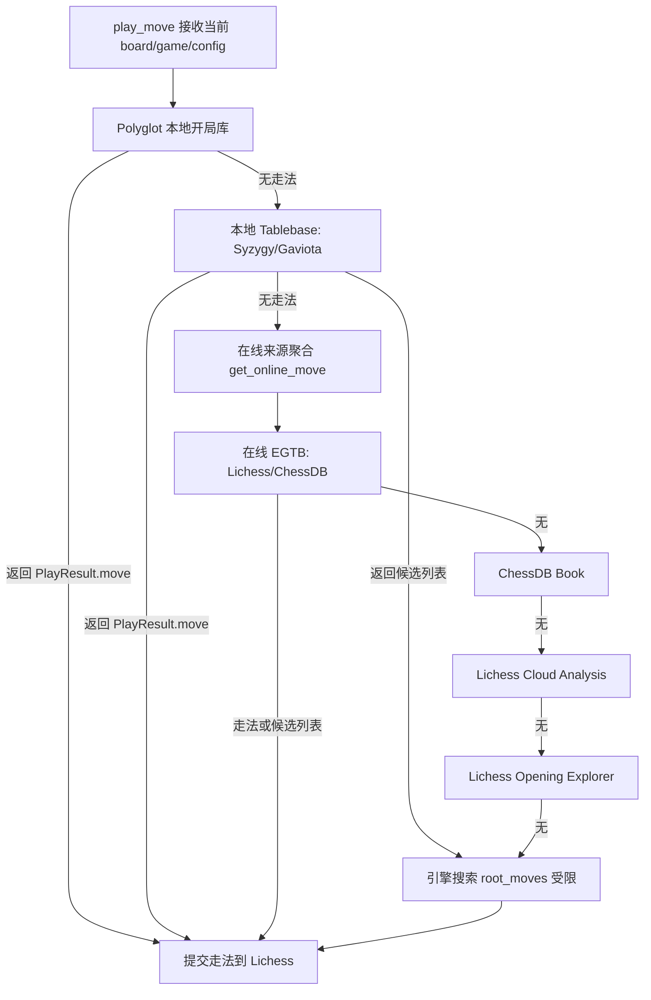

本页解释 lichess-bot 在调用常规引擎搜索之前，如何按顺序尝试**外部走法来源**：本地 Polyglot 开局库、本地残局库、在线残局库、ChessDB、Lichess Cloud Analysis 与 Lichess Opening Explorer。当前页面位于“引擎集成”章节，聚焦走法来源的选择、过滤、返回形态与降级路径；关于引擎协议封装本身请转向 [统一引擎封装：UCI、XBoard 与 Homemade](24-tong-yin-qing-feng-zhuang-uci-xboard-yu-homemade)，关于搜索时间与 Ponder 请转向 [时间管理、Ponder、搜索参数与走法生成](25-shi-jian-guan-li-ponder-sou-suo-can-shu-yu-zou-fa-sheng-cheng)。Sources: [engine_wrapper.py](lib/engine_wrapper.py#L170-L215), [config.yml.default](config.yml.default#L16-L117)

## 架构假设与验证结论

从第一性原理看，外部走法来源承担的是**短路搜索**职责：如果某个来源能给出确定走法，`play_move()` 就不会立刻进入常规引擎搜索；如果来源给出的是候选走法列表，则列表会作为 `root_moves` 约束交给引擎搜索；如果所有来源都失败，才进入普通引擎搜索。代码验证显示，实际顺序是 `get_book_move()` → `get_egtb_move()` → `get_online_move()` → `self.search()`，其中 `get_online_move()` 内部又先尝试在线残局库，再尝试在线开局类来源。Sources: [engine_wrapper.py](lib/engine_wrapper.py#L196-L229), [engine_wrapper.py](lib/engine_wrapper.py#L980-L1029)

上图的关键约束是：本地开局库优先于本地残局库，本地残局库优先于在线来源；在线来源中，`online_egtb` 不受在线开局“出库次数”限制影响，而 ChessDB、云分析与 Opening Explorer 共享 `max_depth` 与 `max_out_of_book_moves` 的停止逻辑。Sources: [engine_wrapper.py](lib/engine_wrapper.py#L201-L215), [engine_wrapper.py](lib/engine_wrapper.py#L987-L1029)

## 外部来源优先级与返回语义

外部来源并不都返回同一种语义。Polyglot、ChessDB 开局、Lichess 云分析与 Opening Explorer 返回单一 UCI 走法并封装为 `chess.engine.PlayResult`；Tablebase 在 `move_quality: "best"` 时也返回单一走法，但在 `move_quality: "suggest"` 且存在多个同等 WDL 走法时，会返回 `list[chess.Move]`，随后被传入引擎搜索的 `root_moves` 参数。Sources: [engine_wrapper.py](lib/engine_wrapper.py#L933-L977), [engine_wrapper.py](lib/engine_wrapper.py#L980-L1007), [engine_wrapper.py](lib/engine_wrapper.py#L320-L351)

| 来源 | 调用函数 | 主要阶段 | 返回形态 | 失败后行为 |
|---|---|---:|---|---|
| Polyglot | `get_book_move()` | 最先 | `PlayResult(move)` | 进入本地 Tablebase |
| 本地 Syzygy/Gaviota | `get_egtb_move()` | 第二 | `PlayResult(move)` 或 `list[chess.Move]` | 进入在线来源 |
| 在线 Lichess/ChessDB EGTB | `get_online_egtb_move()` | 在线来源第一步 | `PlayResult(move)` 或 `list[chess.Move]` | 继续在线开局类来源 |
| ChessDB Book | `get_chessdb_move()` | 在线开局类 1 | `PlayResult(move)` | 继续云分析 |
| Lichess Cloud Analysis | `get_lichess_cloud_move()` | 在线开局类 2 | `PlayResult(move)` | 继续 Opening Explorer |
| Lichess Opening Explorer | `get_opening_explorer_move()` | 在线开局类 3 | `PlayResult(move)` | 进入常规引擎搜索 |

表中的顺序来自 `play_move()` 与 `get_online_move()` 的控制流：前者决定本地来源与在线聚合器的相对顺序，后者决定在线残局库、ChessDB、云分析与 Opening Explorer 的内部顺序。Sources: [engine_wrapper.py](lib/engine_wrapper.py#L196-L229), [engine_wrapper.py](lib/engine_wrapper.py#L987-L1023)

## Polyglot：本地开局库的变体匹配与权重策略

Polyglot 配置位于 `engine.polyglot`，支持启用开关、按变体配置 `.bin` 文件列表、最小权重、选择策略、最大开局深度、权重归一化，以及按对手类型覆盖配置。默认示例中 `book.standard` 是文件路径列表，也提示可按 `atomic`、`chess960`、`giveaway`、`crazyhouse`、`horde`、`kingofthehill`、`racingkings` 与 `3check` 等变体使用同样结构。Sources: [config.yml.default](config.yml.default#L16-L43)

`get_book_move()` 首先叠加对手类型配置：对手是 BOT 时使用 `opponent_selection.bot`，否则使用 `opponent_selection.human`；随后用 `max_depth * 2 - 1` 限制半回合数，超过后直接返回空结果。变体选择逻辑为：Chess960 使用 `"chess960"`，标准国际象棋使用 `"standard"`，其他变体使用 `board.uci_variant` 字符串。Sources: [engine_wrapper.py](lib/engine_wrapper.py#L925-L950)

Polyglot 支持三种选法：`weighted_random` 调用 `reader.weighted_choice()`；`uniform_random` 调用 `reader.choice(..., minimum_weight=...)`；`best_move` 调用 `reader.find(..., minimum_weight=...)`。`min_weight` 会根据 `normalization` 调整：`sum` 以所有候选权重之和缩放，`max` 以最大权重缩放，`none` 则使用固定标尺 100。Sources: [engine_wrapper.py](lib/engine_wrapper.py#L952-L976)

配置校验保证 `selection` 只能是 `weighted_random`、`uniform_random` 或 `best_move`，`normalization` 只能是 `none`、`max` 或 `sum`，并且 `opponent_selection` 只能包含 `human` 与 `bot` 两类键。测试用例验证了人类对手与 BOT 对手可以分别使用不同书库、选择策略与最小权重：人类配置调用 `choice`，BOT 配置调用 `find`。Sources: [config.py](lib/config.py#L481-L522), [test_external_moves.py](test_bot/test_external_moves.py#L336-L392)

## 在线来源的全局门控：时间、深度与出库次数

在线开局类来源共享 `engine.online_moves` 的全局控制：`max_out_of_book_moves` 表示连续若干局面没有在线开局走法后停止查询在线开局书；`max_retries` 表示在线请求最大重试次数；`max_depth` 表示在线开局类来源的最大使用深度，默认配置注释说明没有设置时无深度限制。Sources: [config.yml.default](config.yml.default#L70-L103), [config.py](lib/config.py#L207-L234)

在实现中，`get_online_move()` 先尝试 `online_egtb`；只有在线残局库没有结果时，才检查 `max_depth * 2 - 1` 与 `out_of_online_opening_book_moves[game.id]`。这意味着在线残局库可在残局阶段继续使用，而 ChessDB Book、Lichess Cloud Analysis 与 Opening Explorer 会受到在线开局深度和“出库次数”限制。Sources: [engine_wrapper.py](lib/engine_wrapper.py#L987-L1013)

当 ChessDB、云分析和 Opening Explorer 都未返回走法时，`out_of_online_opening_book_moves[game.id]` 会增加；达到 `max_out_of_book_moves` 且至少启用了一个在线开局类来源时，日志会记录“停止使用在线开局书”。Sources: [engine_wrapper.py](lib/engine_wrapper.py#L1014-L1029)

## ChessDB Book：query/querybest/querypv 的质量分层

ChessDB Book 配置项包括 `enabled`、`min_time`、`max_time`、`move_quality` 与 `min_depth`。示例配置中 `move_quality` 可取 `"all"`、`"good"` 或 `"best"`，其中 `min_depth` 只用于 `"best"`。Sources: [config.yml.default](config.yml.default#L74-L80), [config.py](lib/config.py#L216-L220)

`get_chessdb_move()` 的门控条件是：必须启用、当前方剩余时间不能低于 `min_time`、对局初始时间不能超过 `max_time`、并且只支持标准国际象棋变体。其请求地址为 `https://www.chessdb.cn/cdb.php`，参数包含 `action`、`board` 与 `json=1`；`move_quality` 映射为 `best -> querypv`、`good -> querybest`、`all -> query`。Sources: [engine_wrapper.py](lib/engine_wrapper.py#L1032-L1051)

当 ChessDB 返回 `"status": "ok"` 且质量为 `"best"` 时，代码要求返回深度达到 `min_depth`，并把 `score`、`depth` 与 PV 写入 `comment`，同时标记来源字符串为 `lichess-bot-source:ChessDB`；非 `"best"` 模式则直接使用返回的 `move`。Sources: [engine_wrapper.py](lib/engine_wrapper.py#L1050-L1067)

## Lichess Cloud Analysis：深度、节点数与 MultiPV 过滤

Lichess Cloud Analysis 配置项包括启用开关、时间上下限、`move_quality`、`max_score_difference`、`min_depth` 与 `min_knodes`。`move_quality` 只能是 `"good"` 或 `"best"`；默认值由配置填充逻辑设置为 `"best"`、`min_depth=20`、`min_knodes=0`、`max_score_difference=50`。Sources: [config.yml.default](config.yml.default#L80-L87), [config.py](lib/config.py#L221-L227), [config.py](lib/config.py#L481-L484)

`get_lichess_cloud_move()` 的门控条件是：功能启用、当前方剩余时间至少 `min_time`、对局初始时间不超过 `max_time`。请求目标是 `https://lichess.org/api/cloud-eval`，参数包括当前 FEN、`multiPv` 与变体；当质量为 `"best"` 时 `multiPv=1`，否则为 5。Sources: [engine_wrapper.py](lib/engine_wrapper.py#L1070-L1091)

云分析返回后，代码要求 `depth >= min_depth` 且 `knodes >= min_knodes`。`"best"` 直接取第一条 PV；`"good"` 会依据最佳分数与 `max_score_difference` 过滤候选 PV，白方保留不低于最佳值减阈值的候选，黑方保留不高于最佳值加阈值的候选，然后随机选择。返回注释包含分数、深度、节点数、PV 与来源字符串 `Lichess Cloud Analysis`。Sources: [engine_wrapper.py](lib/engine_wrapper.py#L1092-L1119)

## Lichess Opening Explorer：masters、lichess 与 player 三种数据域

Opening Explorer 配置项包括 `enabled`、`min_time`、`max_time`、`source`、`player_name`、`sort` 与 `min_games`。`source` 只能是 `"lichess"`、`"masters"` 或 `"player"`，`sort` 只能是 `"winrate"` 或 `"games_played"`。Sources: [config.yml.default](config.yml.default#L88-L95), [config.py](lib/config.py#L228-L234), [config.py](lib/config.py#L545-L554)

`get_opening_explorer_move()` 的门控条件是：功能启用、当前方剩余时间至少 `min_time`、对局初始时间不超过 `max_time`；代码还包含一个针对 masters 与非标准变体的排除判断。根据 `source` 不同，请求端点分别为 `https://explorer.lichess.ovh/masters`、`https://explorer.lichess.ovh/player` 与 `https://explorer.lichess.ovh/lichess`。Sources: [engine_wrapper.py](lib/engine_wrapper.py#L1122-L1155)

Opening Explorer 会遍历响应中的 `moves`，计算每个候选的总局数 `white + black + draws` 与胜率；黑方走棋时胜率取 `1 - winrate`。只有总局数达到 `min_games` 的候选会进入排序，排序主键由 `sort` 决定，副键用于打破并列，最终取排序后的第一个 UCI 走法。Sources: [engine_wrapper.py](lib/engine_wrapper.py#L1156-L1172)

## 在线 Tablebase：Lichess 与 ChessDB 的残局裁决

`online_egtb` 配置项包括启用开关、时间上下限、最大棋子数、来源与走法质量。来源可配置为 `"lichess"` 或 `"chessdb"`；`move_quality` 可配置为 `"best"` 或 `"suggest"`，其中 `"suggest"` 会把所有同 WDL 的好走法交给引擎作为候选根走法，若只有一个好走法则立即返回该走法。Sources: [config.yml.default](config.yml.default#L96-L103), [config.py](lib/config.py#L210-L215), [config.py](lib/config.py#L481-L484)

`get_online_egtb_move()` 的门控条件较严格：必须启用、当前方剩余时间至少 `min_time`、对局初始时间不超过 `max_time`、棋子数不超过 `max_pieces`、局面无王车易位权。变体限制依来源不同：Lichess 来源支持 `chess`、`antichess` 与 `atomic`，ChessDB 来源只支持标准国际象棋。Sources: [engine_wrapper.py](lib/engine_wrapper.py#L1175-L1209)

Lichess Tablebase 使用 `https://tablebase.lichess.ovh/{variant}`，并将返回类别映射为 WDL：`loss -> -2`、`draw -> 0`、`win -> 2`，同时处理 `maybe-loss`、`blessed-loss`、`cursed-win` 与 `maybe-win` 为 ±1。标准棋在 8 子时还受到特殊约束：最多支持 8 子，但 8 子位置需要满足 `is_op1_position()` 判断；非标准变体最大 6 子。Sources: [engine_wrapper.py](lib/engine_wrapper.py#L1241-L1263), [engine_wrapper.py](lib/engine_wrapper.py#L1266-L1320)

ChessDB EGTB 同样请求 `https://www.chessdb.cn/cdb.php`，`best` 使用 `querypv`，`suggest` 使用 `queryall`。实现通过 `score_to_wdl()` 与 `score_to_dtz()` 把 ChessDB 分数离散化为 WDL 与 DTZ 语义；`suggest` 模式会筛选出与最佳 WDL 相同的所有候选，多个候选时返回 UCI 列表。Sources: [engine_wrapper.py](lib/engine_wrapper.py#L1323-L1373)

## 本地 Tablebase：lichess-bot 自读 Syzygy 与 Gaviota

本地残局库配置在 `engine.lichess_bot_tbs`，不同于引擎自身的 `SyzygyPath`：这里的 Syzygy 与 Gaviota 由 lichess-bot 代码直接读取，而不是转交给 UCI/XBoard 引擎。示例配置中 Syzygy 支持路径列表、最大 7 子和 `best/suggest`；Gaviota 支持路径列表、最大 5 子、`min_dtm_to_consider_as_wdl_1` 与 `best/suggest`。Sources: [config.yml.default](config.yml.default#L104-L117), [config.py](lib/config.py#L235-L241)

`get_egtb_move()` 先调用 `get_syzygy()`，若无结果再调用 `get_gaviota()`；返回走法后会根据 WDL 与 `draw_or_resign` 配置决定是否求和或认输，并把 WDL 映射为近似分数：`2 -> 9900`、`1 -> 500`、`0 -> 0`、`-1 -> -500`、`-2 -> -9900`。Sources: [engine_wrapper.py](lib/engine_wrapper.py#L1212-L1238)

Syzygy 读取路径中的第一个目录并追加其余目录，优先使用 DTZ 评分；如果缺少 `.rtbz` 导致 DTZ 查询失败，会退化为 WDL 查询。`suggest` 模式下，如果多个走法 WDL 相同，则返回候选列表；`best` 模式会在同 WDL 中选择 DTZ 最优走法，若有多个同 DTZ 走法则随机选择。Sources: [engine_wrapper.py](lib/engine_wrapper.py#L1376-L1427), [engine_wrapper.py](lib/engine_wrapper.py#L1429-L1447)

Gaviota 使用 DTM 而不是 DTZ，因此实现额外通过 `min_dtm_to_consider_as_wdl_1` 与若干阈值把 DTM 转换为类 Syzygy 的 WDL。`suggest` 模式会调用 `good_enough_gaviota_moves()` 过滤足够好的候选；`best` 模式在同 DTM 最优走法中随机选择。Sources: [engine_wrapper.py](lib/engine_wrapper.py#L1450-L1501), [engine_wrapper.py](lib/engine_wrapper.py#L1504-L1550)

## 来源标记、统计输出与可观测性

外部来源通过 `comment["string"] = "lichess-bot-source:..."` 写入来源标记；`get_stats()` 在输出统计时会识别此前缀，把它转换为 `Source` 字段。若没有来源标记，统计默认显示 `Source: Engine`。Sources: [engine_wrapper.py](lib/engine_wrapper.py#L513-L535)

Polyglot 的来源字符串是 `Opening Book`，ChessDB Book 是 `ChessDB`，Lichess Cloud Analysis 是 `Lichess Cloud Analysis`，Opening Explorer 会根据 `source` 标记为 `Lichess Opening Explorer (Masters|Player|Lichess)`，在线 Tablebase 会标记为 `Lichess EGTB` 或 `ChessDB EGTB`，本地 Tablebase 会标记为 `Syzygy EGTB` 或 `Gaviota EGTB`。Sources: [engine_wrapper.py](lib/engine_wrapper.py#L973-L976), [engine_wrapper.py](lib/engine_wrapper.py#L1056-L1062), [engine_wrapper.py](lib/engine_wrapper.py#L1110-L1116), [engine_wrapper.py](lib/engine_wrapper.py#L1140-L1155), [engine_wrapper.py](lib/engine_wrapper.py#L1319-L1320), [engine_wrapper.py](lib/engine_wrapper.py#L1372-L1373), [engine_wrapper.py](lib/engine_wrapper.py#L1219-L1234)

在线请求使用 Lichess 封装中的 `online_book_get()` 调用；测试中的 `MockLichess` 展示了该接口的形状：它通过 `other_session.get()` 请求外部 URL，支持 `params`、`stream` 与 `authenticated` 参数，并用 backoff 对连接断开、HTTP 错误与读取超时进行重试。Sources: [test_external_moves.py](test_bot/test_external_moves.py#L23-L53)

## 配置对照表

| 配置路径 | 关键字段 | 允许值/默认行为 | 代码作用 |
|---|---|---|---|
| `engine.polyglot` | `enabled`, `book`, `min_weight`, `selection`, `max_depth`, `normalization` | `selection`: `weighted_random`, `uniform_random`, `best_move`; `normalization`: `none`, `sum`, `max` | 控制本地开局库查询、权重缩放与深度限制 |
| `engine.polyglot.opponent_selection` | `human`, `bot` | 只允许这两个键 | 按对手类型覆盖基础 Polyglot 配置 |
| `engine.online_moves` | `max_out_of_book_moves`, `max_retries`, `max_depth` | `max_depth` 默认无限制 | 控制在线开局类来源的停止条件 |
| `engine.online_moves.chessdb_book` | `move_quality`, `min_depth` | `all`, `good`, `best` | 控制 ChessDB action 与 PV 深度门槛 |
| `engine.online_moves.lichess_cloud_analysis` | `move_quality`, `max_score_difference`, `min_depth`, `min_knodes` | `good`, `best` | 控制云分析 MultiPV 与过滤 |
| `engine.online_moves.lichess_opening_explorer` | `source`, `sort`, `min_games` | `source`: `lichess`, `masters`, `player`; `sort`: `winrate`, `games_played` | 控制 Explorer 数据域与候选排序 |
| `engine.online_moves.online_egtb` | `source`, `move_quality`, `max_pieces` | `source`: `lichess`, `chessdb`; `move_quality`: `best`, `suggest` | 控制在线残局库来源与单走法/候选列表 |
| `engine.lichess_bot_tbs.syzygy/gaviota` | `paths`, `max_pieces`, `move_quality` | `best`, `suggest` | 控制 lichess-bot 自读本地残局库 |

这些字段的默认值由 `insert_default_values()` 填充，合法值由配置校验函数约束；示例配置文件则展示了用户可直接复制修改的 YAML 结构。Sources: [config.py](lib/config.py#L207-L247), [config.py](lib/config.py#L481-L554), [config.yml.default](config.yml.default#L16-L117)

## 测试覆盖与行为证据

外部来源测试覆盖了 Lichess Cloud Analysis、ChessDB Book、Lichess 在线 Tablebase、ChessDB 在线 Tablebase 与本地 Polyglot。测试用例在外部站点不可用时会 `xfail`，可用时断言开局局面能得到在线走法、中局局面可能返回空、残局 WDL=-2 可触发认输、WDL=0 可触发求和。Sources: [test_external_moves.py](test_bot/test_external_moves.py#L187-L320)

另一个测试专门验证 `is_op1_position()` 对 8 子特殊残局位置的判断，并验证 Polyglot 的 `opponent_selection` 会根据对手是否为 BOT 选择不同配置。Sources: [test_external_moves.py](test_bot/test_external_moves.py#L323-L333), [test_external_moves.py](test_bot/test_external_moves.py#L336-L392)

## 阅读路径

若你要继续分析外部走法与搜索之间的边界，下一步应阅读 [残局专用引擎与浅层搜索保护](27-can-ju-zhuan-yong-yin-qing-yu-qian-ceng-sou-suo-bao-hu)，因为本页讨论的是“外部来源先行”，而该页关注“进入引擎搜索后如何选择专用残局引擎与防止浅层搜索”。如果你需要回溯配置加载与默认值填充，请阅读 [配置加载、默认值填充与校验机制](22-pei-zhi-jia-zai-mo-ren-zhi-tian-chong-yu-xiao-yan-ji-zhi)。Sources: [engine_wrapper.py](lib/engine_wrapper.py#L201-L229), [config.py](lib/config.py#L140-L247)