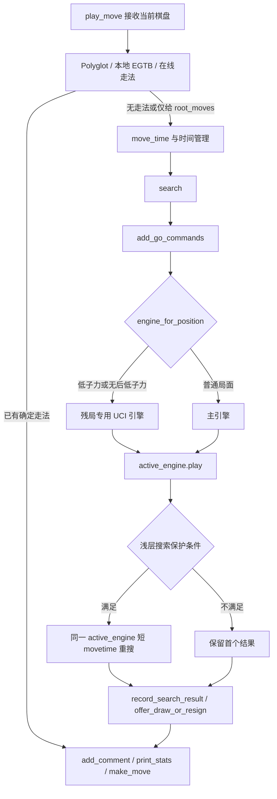

本页位于“引擎集成”章节，聚焦两个只在主搜索路径内生效的保护机制：**残局专用 UCI 引擎路由**与**浅层搜索二次补偿**。架构假设是：lichess-bot 先尝试外部确定性走法来源；只有进入引擎搜索时，才按局面选择主引擎或残局引擎，并在搜索结果深度过浅且时钟安全时追加一次短搜索。代码验证显示，`play_move()` 的顺序是 Polyglot → 本地 EGTB → 在线走法 → 引擎搜索；残局专用引擎选择发生在 `search()` 内部，而浅层搜索保护发生在同一次 `search()` 调用的首个 `play()` 结果之后。Sources: [engine_wrapper.py](lib/engine_wrapper.py#L196-L229), [engine_wrapper.py](lib/engine_wrapper.py#L320-L351)

## 架构假设与验证结论

从第一性原理看，这两个功能都不是独立走法来源，而是**引擎搜索阶段的路由与质量保护层**：残局专用引擎决定“由哪个 UCI 进程计算”，浅层搜索保护决定“是否对同一个活动引擎追加一次短搜索”。`create_engine()` 在创建主引擎后立即调用 `configure_endgame_engine()`，因此残局引擎与主引擎同属一个 `EngineWrapper` 生命周期；`search()` 先执行 `add_go_commands()`，再通过 `engine_for_position()` 选定活动引擎，然后调用 `active_engine.play()`，最后在存在 `game` 与 `engine_cfg` 时进入浅层搜索保护。Sources: [engine_wrapper.py](lib/engine_wrapper.py#L35-L65), [engine_wrapper.py](lib/engine_wrapper.py#L340-L351)

下面的图描述本页讨论范围内的概念关系：外部走法来源位于搜索前置层；残局专用引擎与浅层搜索保护位于搜索层；最终结果仍会走统一的记录、求和/认输判断与落子流程。Sources: [engine_wrapper.py](lib/engine_wrapper.py#L201-L250), [engine_wrapper.py](lib/engine_wrapper.py#L340-L351)



## 残局专用引擎的启动模型

残局专用引擎是一个**可选的第二 UCI 进程**，由 `engine.endgame_engine.enabled` 控制；未启用时 `configure_endgame_engine()` 直接返回，不改变主引擎路径。启用后，系统使用与普通引擎相同的 `engine_commands()` 规则组装命令，但通过 `chess.engine.SimpleEngine.popen_uci()` 启动，因此该专用引擎在实现上固定按 UCI 协议接入；其 stderr 静默、debug、工作目录与 UCI option 配置均来自 `endgame_engine` 子配置。Sources: [engine_wrapper.py](lib/engine_wrapper.py#L68-L79), [engine_wrapper.py](lib/engine_wrapper.py#L129-L154)

启动成功后，残局引擎会接收 `uci_options` 与 `game_specific_options(game)` 的合并配置；若配置失败，代码会关闭残局引擎、将引用置回 `None` 并重新抛出异常，避免半初始化的第二进程留在包装器中。主引擎与残局引擎共享 `EngineWrapper` 的运行时能力：例如 `set_strength_limit()` 与 `clear_strength_limit()` 会同时向两个引擎发送 `UCI_LimitStrength` / `UCI_Elo` 设置，`quit()` 也会先退出残局引擎再退出主引擎。Sources: [engine_wrapper.py](lib/engine_wrapper.py#L146-L154), [engine_wrapper.py](lib/engine_wrapper.py#L294-L306), [engine_wrapper.py](lib/engine_wrapper.py#L605-L609)

## 局面路由规则：低子力与无后局面

`engine_for_position()` 是残局专用引擎的唯一搜索路由入口。它先检查 `self.endgame_engine` 是否存在；若存在，则计算棋盘上总子力数 `chess.popcount(board.occupied)`，并用 `not (board.queens & board.occupied)` 判断当前是否无后。满足两类条件之一时返回残局引擎：总子力数小于等于 `endgame_engine_max_pieces`，或者配置了 `queenless_max_pieces`、当前无后、且总子力数小于等于该无后阈值；否则返回主引擎。Sources: [engine_wrapper.py](lib/engine_wrapper.py#L308-L318)

这意味着 `max_pieces` 是**绝对残局阈值**，而 `queenless_max_pieces` 是**无后技术局面提前切换阈值**。测试覆盖了四个边界：低于残局阈值时只调用残局引擎；普通初始局面高于阈值时只调用主引擎；无后且低于 `queenless_max_pieces` 时调用残局引擎；无后但高于该阈值时仍调用主引擎。Sources: [test_engine_time_management.py](test_bot/test_engine_time_management.py#L132-L170), [test_engine_time_management.py](test_bot/test_engine_time_management.py#L173-L213)

| 路由条件 | 活动引擎 | 关键判断 |
|---|---|---|
| 未启用或未成功启动 `endgame_engine` | 主引擎 | `self.endgame_engine` 为空 |
| `piece_count <= max_pieces` | 残局专用引擎 | 低子力绝对阈值 |
| `queenless_max_pieces > 0` 且无后且 `piece_count <= queenless_max_pieces` | 残局专用引擎 | 无后提前切换 |
| 其他局面 | 主引擎 | 不满足任何残局路由条件 |

Sources: [engine_wrapper.py](lib/engine_wrapper.py#L308-L318), [test_engine_time_management.py](test_bot/test_engine_time_management.py#L132-L213)

## 配置默认值与校验边界

配置加载阶段为残局专用引擎填充默认值：`enabled` 默认为 `False`，`dir` 与 `name` 默认继承主引擎，`working_dir` 默认为当前工作目录，`interpreter` 默认为 `None`，`interpreter_options` 默认为空列表，`engine_options` 与 `uci_options` 默认为空字典，`max_pieces` 默认为 `7`，`queenless_max_pieces` 默认为 `0`，`silence_stderr` 默认为 `False`。这些默认值说明该功能默认关闭，且在显式启用前不会改变主搜索行为。Sources: [config.py](lib/config.py#L186-L197)

启用后，配置校验要求残局引擎目录存在、工作目录为空或存在、引擎文件存在、引擎文件具备可执行权限、`max_pieces > 0`，并要求 `queenless_max_pieces >= 0`。这些校验只在 `endgame_engine.enabled` 为真时执行，因此未启用的默认配置不会因为缺少第二引擎文件而失败。Sources: [config.py](lib/config.py#L365-L381)

```yaml
engine:
  endgame_engine:
    enabled: true
    dir: "./engines/"
    name: "endgame_engine_binary"
    working_dir: ""
    interpreter:
    interpreter_options: []
    engine_options: {}
    uci_options:
      Hash: 256
      Threads: 2
    max_pieces: 7
    queenless_max_pieces: 0
    silence_stderr: false
```

上面的片段展示的是该子配置的结构化形态：`dir`、`name`、`interpreter`、`interpreter_options`、`engine_options` 会进入命令构造；`uci_options` 会在 UCI 进程启动后发送给残局引擎；`max_pieces` 与 `queenless_max_pieces` 只参与 `engine_for_position()` 的路由判断。Sources: [engine_wrapper.py](lib/engine_wrapper.py#L68-L79), [engine_wrapper.py](lib/engine_wrapper.py#L134-L154), [engine_wrapper.py](lib/engine_wrapper.py#L308-L318)

## 与外部残局库走法的边界

残局专用引擎不要与本地 Syzygy/Gaviota 或在线 EGTB 混淆：本地与在线残局库属于**引擎搜索前的走法来源**，而残局专用引擎只在需要搜索时替代主引擎。`play_move()` 先调用 `get_egtb_move()`，随后才调用 `get_online_move()`；只有当返回值为列表形式的候选根走法，或没有确定走法时，才进入 `search()`。因此，如果本地或在线残局库已经给出单一可落子结果，残局专用引擎不会参与该步计算。Sources: [engine_wrapper.py](lib/engine_wrapper.py#L201-L229)

若残局库以“suggest”语义返回候选走法列表，则 `search()` 会把该列表作为 `root_moves` 传给活动引擎；此时活动引擎仍通过 `engine_for_position()` 决定，可能是主引擎，也可能是残局专用引擎。换言之，候选走法约束与残局引擎路由是正交机制：前者限制搜索根节点，后者决定承担搜索的 UCI 进程。Sources: [engine_wrapper.py](lib/engine_wrapper.py#L217-L229), [engine_wrapper.py](lib/engine_wrapper.py#L340-L347)

## 浅层搜索保护的触发条件

浅层搜索保护由 `engine.shallow_search_guard.enabled` 控制，默认关闭；默认参数为：`speeds=["bullet"]`、`min_depth=10`、`extra_movetime_ms=500`、`min_clock_ms=15000`、`min_ply=8`。默认配置文件也给出了同名字段与注释：当实时搜索返回深度低于 `min_depth` 且剩余时钟足够时，运行一次短额外搜索。Sources: [config.py](lib/config.py#L248-L254), [config.yml.default](config.yml.default#L44-L51)

`should_extend_shallow_search()` 的判定是全条件门控：配置必须存在且启用；当前 `game.speed` 必须位于 `speeds` 列表；当前已走半回合数 `len(board.move_stack)` 必须不小于 `min_ply`；首个搜索结果的 `info["depth"]` 必须是整数且小于 `min_depth`；己方剩余时间换算为毫秒后必须不小于 `min_clock_ms`；最后，首个搜索结果必须包含非空走法。任一条件失败都会保留原结果，不追加搜索。Sources: [engine_wrapper.py](lib/engine_wrapper.py#L377-L399)

| 条件 | 目的 | 未满足时行为 |
|---|---|---|
| `enabled: true` | 显式启用保护 | 不追加搜索 |
| `game.speed in speeds` | 限定适用时控 | 不追加搜索 |
| `len(board.move_stack) >= min_ply` | 避免过早阶段触发 | 不追加搜索 |
| `depth` 是整数且 `< min_depth` | 识别浅层结果 | 不追加搜索 |
| `my_remaining_time >= min_clock_ms` | 保证时钟安全 | 不追加搜索 |
| `result.move is not None` | 确保首搜有合法候选 | 不追加搜索 |

Sources: [engine_wrapper.py](lib/engine_wrapper.py#L377-L399), [config.py](lib/config.py#L524-L530)

## 浅层补偿搜索的执行语义

当所有条件满足时，`extend_shallow_search()` 将 `extra_movetime_ms` 转换为 `datetime.timedelta`，记录日志，然后对**同一个 `active_engine`** 再调用一次 `play()`；这次搜索使用 `chess.engine.Limit(time=..., clock_id="shallow search guard")`，关闭 ponder，保留 `draw_offered`，并在 `root_moves` 是列表时继续传递相同根走法约束。该方法直接返回第二次搜索结果，不在本层比较两次结果的深度或分数。Sources: [engine_wrapper.py](lib/engine_wrapper.py#L353-L375)

测试用例验证了“只追加一次短搜索”的关键行为：构造浅层 bullet 结果、设置 `extra_movetime_ms=700` 后，`wrapper.search()` 触发两次引擎调用，第二次调用的 `time` 为 `0.7` 秒，并且最终只记录一次搜索评分。这说明浅层保护是单步内的补偿机制，而不是循环加深或反复重试机制。Sources: [test_engine_time_management.py](test_bot/test_engine_time_management.py#L216-L244)

## 与 `go_commands` 和时间管理的交互

浅层保护发生在 `add_go_commands()` 之后。`add_go_commands()` 可以把配置中的 `go_commands.movetime`、`depth`、`nodes` 写入当前 `Limit`：其中 `movetime` 只会在原始 `time_limit.time` 为空或大于配置值时收紧搜索时间，`depth` 与 `nodes` 会直接赋值。随后 `search()` 使用该限制进行首搜；如果首搜结果过浅，二次补偿搜索使用独立的 `Limit(time=extra_movetime_ms)`，而不是复用首搜的 depth/nodes 限制。Sources: [engine_wrapper.py](lib/engine_wrapper.py#L252-L261), [engine_wrapper.py](lib/engine_wrapper.py#L340-L375)

在 `play_move()` 层面，搜索前会先由 `move_time()` 生成时钟限制，再经过 `apply_bullet_time_management()` 处理，然后进入 `search()`。因此浅层保护不是主时间管理的替代品，而是对“首搜实际深度低于预期”的后置补偿；它仍受 `min_clock_ms` 保护，避免在剩余时间不足时继续消耗时钟。Sources: [engine_wrapper.py](lib/engine_wrapper.py#L220-L229), [engine_wrapper.py](lib/engine_wrapper.py#L396-L399)

## 配置策略对比

对于高级部署，残局专用引擎适合处理“主引擎中盘强、残局技术弱或参数不理想”的组合；浅层搜索保护适合处理“短时控中偶发返回低深度”的组合。二者可以同时启用，但作用点不同：残局引擎改变计算主体，浅层保护改变单步搜索预算。Sources: [engine_wrapper.py](lib/engine_wrapper.py#L308-L318), [engine_wrapper.py](lib/engine_wrapper.py#L353-L399)

| 机制 | 作用层 | 触发依据 | 主要配置 | 结果 |
|---|---|---|---|---|
| 残局专用引擎 | 引擎路由 | 子力数、是否无后 | `endgame_engine.max_pieces`, `queenless_max_pieces` | 由第二 UCI 引擎搜索 |
| 浅层搜索保护 | 搜索质量补偿 | 首搜深度、时控、手数、剩余时间 | `shallow_search_guard.min_depth`, `extra_movetime_ms`, `min_clock_ms` | 同一活动引擎追加一次短搜索 |
| `go_commands` | 首搜限制注入 | 静态配置 | `movetime`, `depth`, `nodes` | 改写首搜 `Limit` |
| EGTB suggest | 根走法约束 | 外部残局库返回候选列表 | `move_quality: suggest` | 限制 `root_moves`，仍由路由决定引擎 |

Sources: [engine_wrapper.py](lib/engine_wrapper.py#L252-L261), [engine_wrapper.py](lib/engine_wrapper.py#L340-L375), [engine_wrapper.py](lib/engine_wrapper.py#L1219-L1222)

## 失效模式与可观察信号

残局专用引擎的配置错误会在配置校验或启动配置阶段暴露：目录、工作目录、文件存在性、执行权限、阈值合法性由 `validate_config()` 检查；UCI 启动后若配置选项失败，则 `configure_endgame_engine()` 会关闭第二引擎并抛出异常。成功启动时日志会输出“Starting endgame engine for <= N pieces”以及可选的无后阈值信息。Sources: [config.py](lib/config.py#L365-L381), [engine_wrapper.py](lib/engine_wrapper.py#L137-L154)

浅层搜索保护的可观察信号是日志消息“Extending shallow search at depth ...”，其中包含首搜深度、追加搜索时长与 game id。若未看到该日志，应按门控顺序检查：是否启用、当前速度是否在 `speeds`、是否达到 `min_ply`、引擎是否返回整数 `depth`、己方剩余时间是否达到 `min_clock_ms`、首搜是否产生了走法。Sources: [engine_wrapper.py](lib/engine_wrapper.py#L361-L375), [engine_wrapper.py](lib/engine_wrapper.py#L377-L399)

## 推荐阅读路径

本页只解释残局专用引擎与浅层搜索保护在搜索链路中的位置。若需要理解搜索时间预算如何生成，请继续阅读[时间管理、Ponder、搜索参数与走法生成](25-shi-jian-guan-li-ponder-sou-suo-can-shu-yu-zou-fa-sheng-cheng)；若需要理解 Polyglot、云分析、Opening Explorer 与 Tablebase 如何在进入引擎前提供走法，请阅读[外部走法来源：Polyglot、云分析、Opening Explorer 与 Tablebase](26-wai-bu-zou-fa-lai-yuan-polyglot-yun-fen-xi-opening-explorer-yu-tablebase)；若需要理解 UCI、XBoard 与 Homemade 的统一包装层，请回到[统一引擎封装：UCI、XBoard 与 Homemade](24-tong-yin-qing-feng-zhuang-uci-xboard-yu-homemade)。Sources: [engine_wrapper.py](lib/engine_wrapper.py#L201-L229), [engine_wrapper.py](lib/engine_wrapper.py#L320-L351)