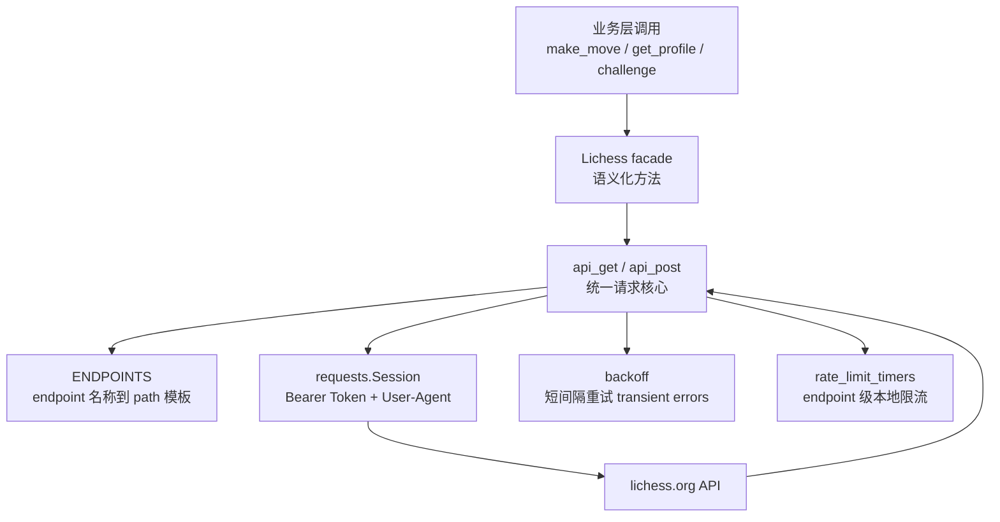
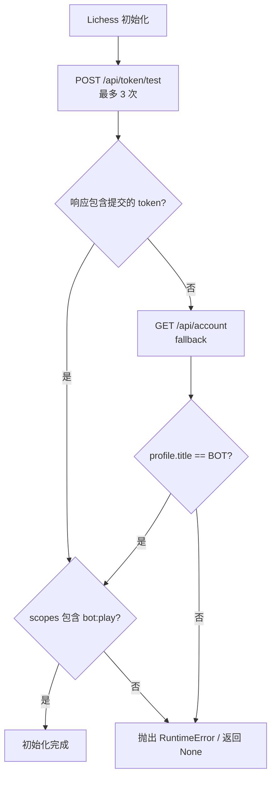
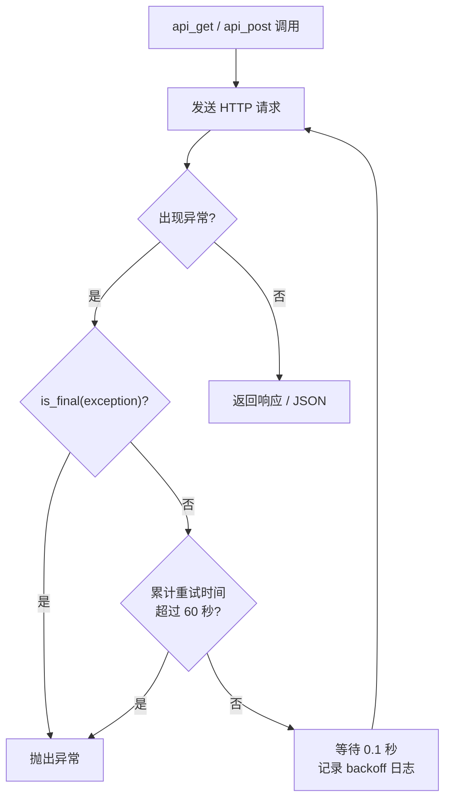
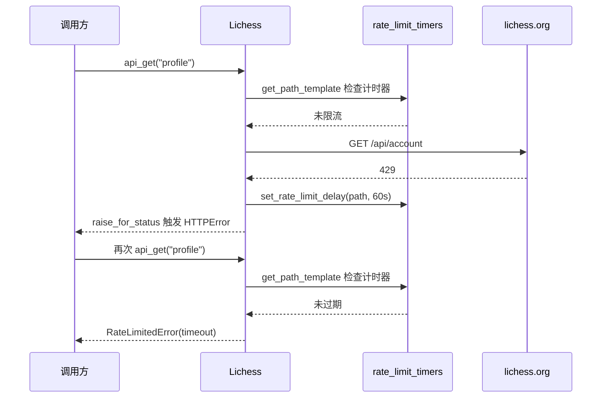

这一页解释 `lib/lichess.py` 如何把 Lichess Bot API 封装成一个集中式通信边界：它维护 endpoint 注册表、鉴权 Session、GET/POST 基础方法、JSON/文本/流式响应转换、OAuth Token 启动校验、请求重试，以及按 endpoint 记录的速率限制计时器。当前页面位于“深入解析 / 平台交互”中的 [Lichess Bot API 封装与请求重试策略](28-lichess-bot-api-feng-zhuang-yu-qing-qiu-zhong-shi-ce-lue)，不展开聊天业务、主动配对规则或更高层挑战冷却算法；这些内容分别属于 [聊天、问候语、悔棋、求和与认输交互](29-liao-tian-wen-hou-yu-hui-qi-qiu-he-yu-ren-shu-jiao-hu) 与 [速率限制识别、退避策略与挑战冷却](30-su-lu-xian-zhi-shi-bie-tui-bi-ce-lue-yu-tiao-zhan-leng-que)。Sources: [lichess.py](lib/lichess.py#L21-L45), [lichess.py](lib/lichess.py#L127-L170)

## 架构假设与验证结论

从第一性原理看，这个模块要解决三个问题：第一，把分散的 HTTP path 统一命名，避免业务层拼接 URL；第二，把请求失败分为“可重试的传输/服务端错误”和“不可重试的客户端/强制退出状态”；第三，把 Lichess 返回的 429 与挑战日限额转换为本地计时器状态，让调用方在再次访问同一 endpoint 前得到明确异常。代码验证显示，这三点分别由 `ENDPOINTS`、`api_get`/`api_post` 上的 `backoff.on_exception`、以及 `rate_limit_timers` 与 `RateLimitedError` 实现。Sources: [lichess.py](lib/lichess.py#L21-L45), [lichess.py](lib/lichess.py#L66-L77), [lichess.py](lib/lichess.py#L110-L124), [lichess.py](lib/lichess.py#L195-L228), [lichess.py](lib/lichess.py#L271-L315), [lichess.py](lib/lichess.py#L317-L362)

上图中的关键边界是 `Lichess` 类：业务层不直接使用 `requests`，而是调用 `get_profile`、`make_move`、`challenge`、`get_event_stream` 等语义化方法；这些方法再收敛到 `api_get`、`api_post`、`api_get_json`、`api_get_raw` 或 `api_get_list`。这种结构让鉴权、超时、编码、重试、限流状态更新集中在一个模块中。Sources: [lichess.py](lib/lichess.py#L195-L269), [lichess.py](lib/lichess.py#L364-L389), [lichess.py](lib/lichess.py#L410-L434), [lichess.py](lib/lichess.py#L521-L555)

## Endpoint 注册表：命名 API，而不是散落 URL

`ENDPOINTS` 是封装层的路由表：它把 `"profile"`、`"stream_event"`、`"move"`、`"challenge"`、`"token_test"`、`"join_arena"` 等稳定名称映射到 Lichess path 模板。`api_get` 和 `api_post` 通过 `get_path_template(endpoint_name)` 取出模板，再用 `urljoin(self.baseUrl, path_template.format(*template_args))` 生成完整 URL，因此上层方法只传 endpoint 名称和模板参数。Sources: [lichess.py](lib/lichess.py#L21-L45), [lichess.py](lib/lichess.py#L216-L219), [lichess.py](lib/lichess.py#L299-L303), [lichess.py](lib/lichess.py#L317-L329)

| 封装层名称 | HTTP 语义 | Path 模板 | 典型封装方法 | Sources |
|---|---:|---|---|---|
| `profile` | GET JSON | `/api/account` | `get_profile()` | [lichess.py](lib/lichess.py#L21-L24), [lichess.py](lib/lichess.py#L430-L434) |
| `stream_event` | GET stream | `/api/stream/event` | `get_event_stream()` | [lichess.py](lib/lichess.py#L21-L26), [lichess.py](lib/lichess.py#L410-L412) |
| `stream` | GET stream | `/api/bot/game/stream/{}` | `get_game_stream(game_id)` | [lichess.py](lib/lichess.py#L21-L26), [lichess.py](lib/lichess.py#L414-L416) |
| `move` | POST | `/api/bot/game/{}/move/{}` | `make_move(game_id, move)` | [lichess.py](lib/lichess.py#L21-L27), [lichess.py](lib/lichess.py#L368-L376) |
| `chat` | POST | `/api/bot/game/{}/chat` | `chat(game_id, room, text)` | [lichess.py](lib/lichess.py#L26-L29), [lichess.py](lib/lichess.py#L390-L404) |
| `challenge` | POST | `/api/challenge/{}` | `challenge(username, payload)` | [lichess.py](lib/lichess.py#L35-L37), [lichess.py](lib/lichess.py#L521-L524) |
| `token_test` | POST | `/api/token/test` | `get_token_info(token)` | [lichess.py](lib/lichess.py#L39-L40), [lichess.py](lib/lichess.py#L170-L193) |

## Session 初始化：鉴权、代理隔离与 User-Agent

`Lichess.__init__` 接收 token、base URL、版本号、日志级别和外部在线走法最大重试次数。初始化时会创建两个 `requests.Session`：`session` 用于 Lichess 鉴权请求并注入 `Authorization: Bearer <token>`，`other_session` 用于不需要鉴权的外部请求；两个 Session 都设置 `trust_env = False`，测试用例明确验证它们不会继承系统代理环境。Sources: [lichess.py](lib/lichess.py#L131-L154), [test_lichess_token_validation.py](test_bot/test_lichess_token_validation.py#L6-L14)

`set_user_agent` 会把请求头更新为 `lichess-bot/{version} user:{username}`。初始化阶段先用 `"?"` 设置临时 User-Agent；随后 `get_profile()` 取得真实用户名后再次调用 `set_user_agent(profile["username"])`，从而让后续请求携带更具体的客户端标识。Sources: [lichess.py](lib/lichess.py#L151-L153), [lichess.py](lib/lichess.py#L430-L455)

## OAuth Token 校验：启动阶段的前置门禁

启动校验通过 `get_token_info(token)` 完成。该方法最多调用三次 `api_post("token_test", data=token)`；只要 token-test 响应字典中包含提交的 token，就返回对应的 token 信息。若三次响应都没有包含该 token，它会退回到 `api_get_json("profile")`，只有当 `/api/account` 返回的 profile 标题为 `"BOT"` 时，才构造包含 `bot:play` scope 的 token 信息继续启动。Sources: [lichess.py](lib/lichess.py#L157-L170), [lichess.py](lib/lichess.py#L170-L193)

构造函数在拿到 token 信息后继续检查 `scopes` 字段；如果逗号分隔的 scope 列表中不包含 `"bot:play"`，会抛出 `RuntimeError`，提示必须使用具备 “Play games with the bot API (bot:play)” 权限的访问令牌。测试覆盖了正常 token-test 响应、空 token-test 响应但 BOT profile 兜底成功、以及非 BOT profile 兜底失败三种路径。Sources: [lichess.py](lib/lichess.py#L157-L169), [test_lichess_token_validation.py](test_bot/test_lichess_token_validation.py#L17-L59)

## GET 请求封装：Response、JSON、列表与文本的分层转换

`api_get` 是所有 GET 请求的底层入口：它设置 backoff 日志级别，解析 path 模板，拼出 URL，调用 `self.session.get(..., timeout=timeout, stream=stream)`，随后处理 429、本地编码和 `raise_for_status()`。默认 timeout 为 2 秒；事件流和游戏流通过封装方法显式传入 `stream=True, timeout=15`。Sources: [lichess.py](lib/lichess.py#L195-L228), [lichess.py](lib/lichess.py#L410-L416)

`api_get_json`、`api_get_list` 和 `api_get_raw` 是 `api_get` 之上的响应转换层：前者把响应解析为 JSON 字典，中者解析为用户 profile 列表，后者返回 UTF-8 文本。`get_profile`、`get_ongoing_games`、`is_online`、`get_public_data`、`get_game_pgn`、`get_online_bots` 等语义化方法分别复用这些转换层。Sources: [lichess.py](lib/lichess.py#L229-L269), [lichess.py](lib/lichess.py#L430-L470), [lichess.py](lib/lichess.py#L548-L555)

| 方法 | 输入 | 输出形态 | 主要职责 | Sources |
|---|---|---|---|---|
| `api_get` | endpoint 名称、模板参数、params、stream、timeout | `requests.Response` | 执行 GET、处理 429、抛出 HTTP 错误、设置编码 | [lichess.py](lib/lichess.py#L203-L228) |
| `api_get_json` | endpoint 名称、模板参数、params | JSON 字典或列表型 JSON | 复用 `api_get` 并调用 `response.json()` | [lichess.py](lib/lichess.py#L229-L242) |
| `api_get_list` | endpoint 名称、模板参数、params | `list[UserProfileType]` | 获取用户状态等列表响应 | [lichess.py](lib/lichess.py#L244-L256), [lichess.py](lib/lichess.py#L548-L551) |
| `api_get_raw` | endpoint 名称、模板参数、params | `str` | 获取 PGN、NDJSON 文本并返回 `response.text` | [lichess.py](lib/lichess.py#L258-L269), [lichess.py](lib/lichess.py#L456-L468) |

## POST 请求封装：普通动作与挑战响应分流

`api_post` 负责所有 POST 请求：它支持 `data`、自定义 `headers`、query `params`、JSON `payload` 以及是否执行 `raise_for_status`。`token_test` 使用 10 秒 timeout，其他 POST 使用 2 秒 timeout；普通响应会在可选 `raise_for_status()` 后返回 `response.json()`。Sources: [lichess.py](lib/lichess.py#L279-L315)

挑战创建是 `api_post` 中唯一的特殊分流：当 `endpoint_name == "challenge"` 时，方法不走普通 429 和 `raise_for_status` 路径，而是直接把响应交给 `handle_challenge(response)`。上层 `challenge(username, payload)` 又以 `raise_for_status=False` 调用 `api_post("challenge", ...)`，因此挑战失败响应可以作为结构化字典返回给调用方处理，而不是立即以 HTTP 异常中断。Sources: [lichess.py](lib/lichess.py#L305-L315), [lichess.py](lib/lichess.py#L331-L344), [lichess.py](lib/lichess.py#L521-L524)

| 语义化方法 | POST endpoint | 参数构造 | 错误处理特征 | Sources |
|---|---|---|---|---|
| `make_move` | `move` | game id、UCI move、`offeringDraw` query 参数 | 使用默认 `raise_for_status=True` | [lichess.py](lib/lichess.py#L368-L376), [lichess.py](lib/lichess.py#L279-L315) |
| `accept_takeback` | `takeback` | game id、`yes`/`no` | 捕获异常并返回 `False` | [lichess.py](lib/lichess.py#L378-L388) |
| `accept_challenge` | `accept` | challenge id | 使用默认 POST 行为 | [lichess.py](lib/lichess.py#L418-L420) |
| `decline_challenge` | `decline` | form body `reason=<reason>` | `contextlib.suppress(Exception)`，且 `raise_for_status=False` | [lichess.py](lib/lichess.py#L422-L428) |
| `challenge` | `challenge` | JSON payload | 交给 `handle_challenge` 返回结构化响应 | [lichess.py](lib/lichess.py#L521-L524), [lichess.py](lib/lichess.py#L331-L344) |

## 重试策略：只重试瞬态故障，不重试确定性客户端错误

`api_get` 与 `api_post` 都使用 `backoff.on_exception(backoff.constant, ...)` 装饰器，捕获 `RemoteDisconnected`、`RequestsConnectionError`、`HTTPError` 和 `ReadTimeout`。配置为 `max_time=60`、`interval=0.1`，因此在 60 秒时间窗口内以 0.1 秒常量间隔重试；重试与放弃日志级别都设置为 DEBUG，并通过 `backoff_handler` 记录目标函数、参数、等待时间和异常堆栈。Sources: [lichess.py](lib/lichess.py#L110-L124), [lichess.py](lib/lichess.py#L195-L203), [lichess.py](lib/lichess.py#L271-L278)

`giveup=is_final` 是重试边界的核心：当异常是带有响应对象的 `HTTPError` 且状态码小于 500，或者全局 `stop.force_quit` 为真时，不再重试。换言之，4xx 一类可归因于请求语义、权限或状态的错误会被视为最终错误；5xx、连接断开、连接错误和读超时则由 backoff 机制处理。Sources: [lichess.py](lib/lichess.py#L53-L63), [lichess.py](lib/lichess.py#L110-L113), [lichess.py](lib/lichess.py#L195-L203), [lichess.py](lib/lichess.py#L271-L278)

`backoff_handler` 对 `token_test` 做了额外的日志脱敏：如果参数中包含 `"token_test"`，它会把 `kwargs["data"]` 改为 `"<token redacted>"` 后再写入 DEBUG 日志，避免 token 在重试日志中以明文出现。Sources: [lichess.py](lib/lichess.py#L116-L124)

## Endpoint 级速率限制计时器

Lichess API 返回 429 时，封装层不会只依赖下一次 HTTP 请求失败来感知限流，而是把限流状态写入 `self.rate_limit_timers[path_template]`。`api_get` 中，如果响应是 429，则对 `move` endpoint 设置 1 秒延迟，对其他 GET endpoint 设置 60 秒延迟；`api_post` 中，普通非挑战 POST 的 429 会设置 60 秒延迟。Sources: [lichess.py](lib/lichess.py#L75-L77), [lichess.py](lib/lichess.py#L221-L227), [lichess.py](lib/lichess.py#L308-L315), [lichess.py](lib/lichess.py#L346-L354)

下一次调用同一 endpoint 前，`get_path_template` 会先检查 `is_rate_limited(path_template)`；如果本地计时器尚未过期，它不会发起 HTTP 请求，而是抛出 `RateLimitedError`，错误消息包含 path 模板和剩余等待时间，异常对象也携带 `timeout`。这使上层调用方可以基于本地剩余时间安排等待，而不是立即再次触发远端限流。Sources: [lichess.py](lib/lichess.py#L66-L73), [lichess.py](lib/lichess.py#L317-L329), [lichess.py](lib/lichess.py#L356-L362)

## 挑战响应中的日限额识别

挑战 endpoint 有额外的结构化限流识别。`is_daily_game_rate_limit` 会先检查状态码是否等于指定值，再解析 JSON，确认响应体包含 `"error"` 且 `ratelimit.key == "bot.vsBot.day"`；`is_opponent_rate_limit` 把 400 解释为对手达到 bot-vs-bot 日限额，`is_bot_rate_limit` 把 429 解释为本 bot 达到日限额。Sources: [lichess.py](lib/lichess.py#L79-L99)

`handle_challenge` 会解析挑战响应 JSON；当 bot 或对手触发日限额时，它从 `ratelimit.seconds` 计算 `datetime.timedelta`，并把 `bot_is_rate_limited`、`opponent_is_rate_limited`、`rate_limit_timeout` 写回响应字典。如果限流主体是本 bot，还会对 `ENDPOINTS["challenge"]` 设置本地限流计时器。`ChallengeType` 中也显式声明了这些扩展字段。Sources: [lichess.py](lib/lichess.py#L101-L107), [lichess.py](lib/lichess.py#L331-L344), [lichess_types.py](lib/lichess_types.py#L174-L199)

这里需要区分封装层与策略层：`lib/lichess.py` 负责把 Lichess 的挑战限流响应转换为结构化字段和 endpoint 计时器；更高层的 `Matchmaking.create_challenge` 会捕获 `RateLimitedError` 并把 `e.timeout` 放入自己的 `rate_limit_timer`，也会在挑战响应中读取 `bot_is_rate_limited` 与 `opponent_is_rate_limited`。本页只解释这些字段如何从 API 封装层产生。Sources: [lichess.py](lib/lichess.py#L331-L344), [matchmaking.py](lib/matchmaking.py#L100-L120), [matchmaking.py](lib/matchmaking.py#L122-L139)

## 外部在线走法请求的独立重试入口

`online_book_get` 是同一通信类中的外部在线走法请求入口，用于访问 chessdb、Lichess cloud eval、Opening Explorer 和 tablebase 等 URL。它在内部定义一个同名闭包并套用 `backoff.on_exception`，异常类型、`max_time=60`、`interval=0.1`、`giveup=is_final` 与主 API 请求保持一致，但额外设置 `max_tries=self.max_retries`，该值来自 `Lichess.__init__` 的构造参数。Sources: [lichess.py](lib/lichess.py#L131-L154), [lichess.py](lib/lichess.py#L530-L546)

这个方法根据 `authenticated` 参数选择 `self.session` 或 `self.other_session`：需要鉴权时复用带 Bearer Token 的 Lichess Session，不需要鉴权时使用独立 Session。调用处显示，外部走法模块会把不同服务的完整 URL 传给 `online_book_get`，而不是使用 `ENDPOINTS` 注册表。Sources: [lichess.py](lib/lichess.py#L530-L546), [engine_wrapper.py](lib/engine_wrapper.py#L1051-L1051), [engine_wrapper.py](lib/engine_wrapper.py#L1089-L1089), [engine_wrapper.py](lib/engine_wrapper.py#L1142-L1154), [engine_wrapper.py](lib/engine_wrapper.py#L1285-L1285), [engine_wrapper.py](lib/engine_wrapper.py#L1343-L1343)

| 请求族 | URL 来源 | Session 选择 | 重试限制 | Sources |
|---|---|---|---|---|
| Lichess Bot API GET/POST | `ENDPOINTS` + `baseUrl` | `self.session` | `max_time=60` | [lichess.py](lib/lichess.py#L195-L228), [lichess.py](lib/lichess.py#L271-L315) |
| 外部在线走法 | 调用方传入完整 `path` | `authenticated` 决定 `self.session` 或 `self.other_session` | `max_time=60` 且 `max_tries=self.max_retries` | [lichess.py](lib/lichess.py#L530-L546) |

## 模拟实现与测试边界

测试目录中存在 `test_bot/lichess.py`，它继承原始 `Lichess` 类但重写网络方法，用队列模拟事件流、游戏流和走法提交。`GameStream.iter_lines` 会先发送 `gameFull`，再根据棋盘队列持续产生 `gameState`；`EventStream.iter_lines` 会产生 `gameStart` 或空心跳；测试版 `make_move` 则把引擎走法放入 `move_queue`，避免真实访问 Lichess。Sources: [test_bot/lichess.py](test_bot/lichess.py#L35-L113), [test_bot/lichess.py](test_bot/lichess.py#L115-L146), [test_bot/lichess.py](test_bot/lichess.py#L148-L198)

真实 API 冒烟测试位于 `test_bot/test_lichess.py`，它需要环境变量 `LICHESS_BOT_TEST_TOKEN`；没有 token 时会跳过。测试会构造真实 `Lichess` 对象，验证在线 bot 列表、profile、当前对局、在线状态和公开用户数据等封装方法。Sources: [test_lichess.py](test_bot/test_lichess.py#L9-L46)

## 阅读路径

如果你想继续理解这些 API 调用在进程与事件循环中的位置，下一步应阅读 [主循环、事件流与多进程任务协作](17-zhu-xun-huan-shi-jian-liu-yu-duo-jin-cheng-ren-wu-xie-zuo)；如果你关心挑战响应字段如何驱动主动配对冷却，应阅读 [速率限制识别、退避策略与挑战冷却](30-su-lu-xian-zhi-shi-bie-tui-bi-ce-lue-yu-tiao-zhan-leng-que)；如果你关注 `chat`、`takeback`、`resign` 等语义化 POST 方法的业务行为，应阅读 [聊天、问候语、悔棋、求和与认输交互](29-liao-tian-wen-hou-yu-hui-qi-qiu-he-yu-ren-shu-jiao-hu)。Sources: [lichess.py](lib/lichess.py#L390-L428), [lichess.py](lib/lichess.py#L447-L449), [matchmaking.py](lib/matchmaking.py#L100-L139)