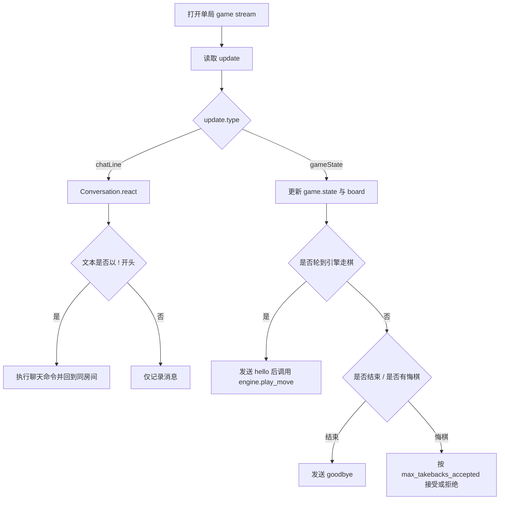
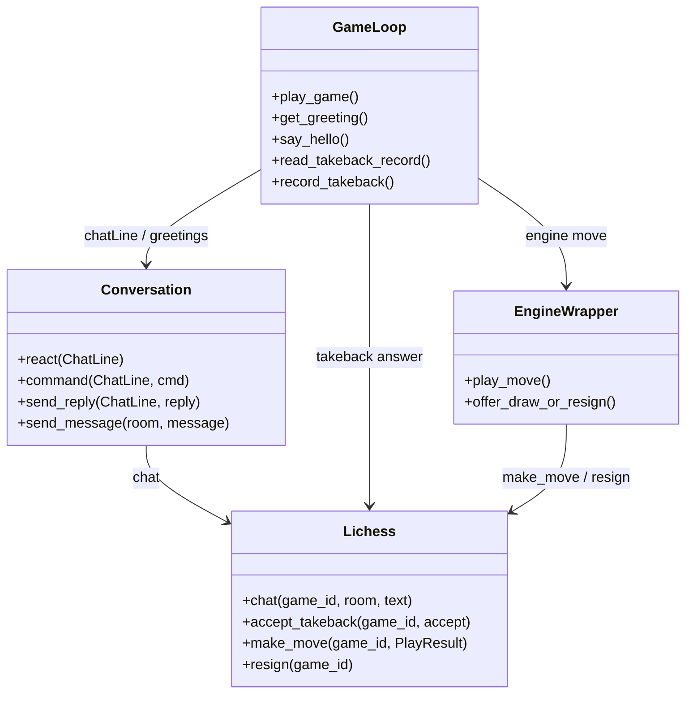

本页位于「深入解析 → 平台交互」中的 [聊天、问候语、悔棋、求和与认输交互](29-liao-tian-wen-hou-yu-hui-qi-qiu-he-yu-ren-shu-jiao-hu)，聚焦 lichess-bot 在**单局游戏流**里如何处理聊天命令、开局/终局问候、悔棋请求、求和提议与认输动作；它不展开挑战过滤、引擎搜索策略或速率限制细节，相关主题可继续阅读 [Lichess Bot API 封装与请求重试策略](28-lichess-bot-api-feng-zhuang-yu-qing-qiu-zhong-shi-ce-lue)、[速率限制识别、退避策略与挑战冷却](30-su-lu-xian-zhi-shi-bie-tui-bi-ce-lue-yu-tiao-zhan-leng-que) 与 [时间管理、Ponder、搜索参数与走法生成](25-shi-jian-guan-li-ponder-sou-suo-can-shu-yu-zou-fa-sheng-cheng)。Sources: [lichess_bot.py](lib/lichess_bot.py#L800-L923), [conversation.py](lib/conversation.py#L30-L66)

## 交互边界：游戏流驱动的轻量控制层

从第一原则看，本页涉及的交互都发生在**已开始的对局上下文**中：`play_game` 打开 `/api/bot/game/stream/{game_id}` 对局事件流，构造 `Game`、引擎封装与 `Conversation`，随后在循环中按事件类型分流；`chatLine` 交给 `Conversation.react()`，`gameState` 则更新棋盘、判断是否走棋、处理游戏结束与悔棋字段。Sources: [lichess_bot.py](lib/lichess_bot.py#L813-L864), [conversation.py](lib/conversation.py#L33-L63)



该结构体现了一个明确的职责切分：`Conversation` 只管理聊天消息、命令识别与回复；`lichess_bot.py` 的游戏循环决定何时发送问候、何时响应悔棋、何时在对局结束后发送告别；`Lichess` API 封装负责把聊天、走棋、悔棋与认输转换为 HTTP 请求。Sources: [conversation.py](lib/conversation.py#L30-L66), [lichess_bot.py](lib/lichess_bot.py#L862-L897), [lichess.py](lib/lichess.py#L368-L404)

## 聊天消息模型与命令入口

`ChatLine` 是对 Lichess `chatLine` 事件的薄封装，只保留三个字段：`room` 表示玩家房间或观战房间，`username` 表示发送者，`text` 表示原始文本；`Conversation.react()` 会把消息追加到内存列表、写入日志，并且仅当文本第一个字符等于命令前缀 `!` 时才进入命令处理。Sources: [conversation.py](lib/conversation.py#L17-L28), [conversation.py](lib/conversation.py#L51-L65)

`Conversation.command()` 支持的聊天命令包括 `!commands`/`!help`、`!wait`、`!name`、`!eval`、`!queue` 与 `!rating`；回复总是通过 `send_reply()` 发回原消息所在的 `room`，因此玩家房间触发的命令回到玩家房间，观战房间触发的命令回到观战房间。Sources: [conversation.py](lib/conversation.py#L67-L100), [conversation.py](lib/conversation.py#L148-L156)

| 命令 | 触发条件 | 行为 | 房间约束 |
|---|---|---|---|
| `!help` / `!commands` | 任意命令房间 | 返回支持命令列表 | 原房间回复 |
| `!wait` | 对局仍可 abort | 把游戏 ping 延长并回复等待 60 秒 | 原房间回复 |
| `!name` | 任意命令房间 | 返回机器人账号名、引擎名与 lichess-bot 版本 | 原房间回复 |
| `!eval...` | 自己发送或观战房间 | 返回引擎统计信息 | 对手在玩家房间请求会被拒绝 |
| `!queue` | 任意命令房间 | 返回当前挑战队列或空队列提示 | 原房间回复 |
| `!rating` | 需要启用并通过管理员校验 | 查询、设置或清除 UCI_Elo 限制 | 仅玩家房间管理员可控制 |

命令行为中最敏感的是 `!eval` 与 `!rating`：`!eval` 只允许机器人自己或观战房间查看引擎统计，若对手在玩家房间请求则回复不会透露；`!rating` 先检查 `rating_control.enabled`，再要求消息来自 `player` 房间且用户名匹配管理员列表，之后才允许查询、设置或恢复引擎强度。Sources: [conversation.py](lib/conversation.py#L74-L93), [conversation.py](lib/conversation.py#L101-L146)

## 聊天发送路径与长度保护

所有主动聊天回复最终都会调用 `Lichess.chat(game_id, room, text)`，该方法使用 `ENDPOINTS["chat"] = "/api/bot/game/{}/chat"`，并以 `{"room": room, "text": text}` 作为 POST 数据；`Conversation.send_message()` 会先检查消息非空，再构造一个空 `ChatLine` 复用 `send_reply()`。Sources: [lichess.py](lib/lichess.py#L21-L29), [lichess.py](lib/lichess.py#L390-L404), [conversation.py](lib/conversation.py#L148-L161)

`Lichess.chat()` 定义了 `MAX_CHAT_MESSAGE_LEN = 140`，当文本长度超过该值时会记录 warning，包括实际长度、最大长度与消息内容；随后代码仍会构造数据并调用 `api_post("chat", ...)`，因此开发者配置问候语时应主动保持短句，避免平台侧拒绝或用户体验问题。Sources: [lichess.py](lib/lichess.py#L48-L51), [lichess.py](lib/lichess.py#L390-L404)

## 问候语：模板、随机列表与发送时机

问候语配置位于 `greeting` 节，支持面向对手房间的 `hello`/`goodbye`，也支持面向观战房间的 `hello_spectators`/`goodbye_spectators`；默认示例说明 `{opponent}` 会替换为对手名、`{me}` 会替换为机器人名，其他未知占位会通过 `defaultdict(str)` 映射为空字符串。Sources: [config.yml.default](config.yml.default#L214-L222), [lichess_bot.py](lib/lichess_bot.py#L840-L844)

`get_greeting()` 从配置中取出指定问候字段；若字段是列表，则随机选择其中一个元素，空列表返回空字符串；最后对文本执行 `format_map(keyword_map)`，因此单字符串与字符串列表都能使用同一套 `{me}`、`{opponent}` 模板。Sources: [lichess_bot.py](lib/lichess_bot.py#L964-L969), [test_greetings.py](test_bot/test_greetings.py#L8-L30)

```mermaid
sequenceDiagram
    participant Loop as play_game 循环
    participant Conv as Conversation
    participant API as Lichess.chat
    Loop->>Loop: 构造 keyword_map(me, opponent)
    Loop->>Loop: get_greeting(hello/goodbye/...)
    Loop->>Conv: say_hello(..., board)
    alt move_stack < 2
        Conv->>API: player hello
        Conv->>API: spectator hello_spectators
    else 已超过开局前两个半回合
        Loop-->>Loop: 不再发送 hello
    end
    Loop->>Conv: game over 后发送 goodbye
    Conv->>API: player goodbye
    Conv->>API: spectator goodbye_spectators
```

`hello` 的发送不是在游戏刚创建时立即发生，而是在 `gameState` 触发且判断为引擎需要走棋时调用 `say_hello()`；该函数只在 `len(board.move_stack) < 2` 时发送开局问候，所以它覆盖机器人执白首着或执黑第一回合的早期时机，避免中途重连后反复问候。Sources: [lichess_bot.py](lib/lichess_bot.py#L869-L876), [lichess_bot.py](lib/lichess_bot.py#L972-L977)

`goodbye` 的发送发生在游戏循环识别到 `is_game_over(game)` 后：先记录/上报结果，再向 `player` 房间发送 `goodbye`，向 `spectator` 房间发送 `goodbye_spectators`；如果对应配置为空字符串，`Conversation.send_message()` 不会发出聊天请求。Sources: [lichess_bot.py](lib/lichess_bot.py#L886-L890), [conversation.py](lib/conversation.py#L158-L161)

## 悔棋交互：状态字段、限额与持久计数

悔棋处理由 `gameState` 驱动：机器人执白时读取 `btakeback`，机器人执黑时读取 `wtakeback`，也就是只观察对手颜色对应的悔棋请求字段；只有当存在悔棋字段、当前不是机器人走棋、并且 `li.accept_takeback()` 调用成功时，才会增加本局已接受悔棋次数、写入记录，并丢弃上一手注释。Sources: [lichess_bot.py](lib/lichess_bot.py#L864-L897)

是否接受悔棋由 `takebacks_accepted < max_takebacks_accepted` 决定，其中 `max_takebacks_accepted` 来自顶层配置；默认配置示例与默认值填充都将其设为 `0`，因此默认行为是拒绝所有对手悔棋请求。Sources: [lichess_bot.py](lib/lichess_bot.py#L837-L838), [config.yml.default](config.yml.default#L150-L155), [config.py](lib/config.py#L180-L180)

悔棋计数不是单纯内存状态：`read_takeback_record()` 会尝试从 `takeback-count-{game_id}.txt` 读取已接受次数，`record_takeback()` 会写回次数，`delete_takeback_record()` 在游戏结束后删除该文件；这让机器人在对局过程中重连或进程恢复时仍能保留本局悔棋限额。Sources: [lichess_bot.py](lib/lichess_bot.py#L925-L944), [lichess_bot.py](lib/lichess_bot.py#L959-L961)

启动或维护阶段还会通过 `prune_takeback_records(all_games)` 清理已不在进行中列表里的悔棋计数文件：它收集当前活跃 `gameId`，扫描 `takeback-count-*` 文件，并删除不属于活跃游戏的记录。Sources: [lichess_bot.py](lib/lichess_bot.py#L947-L956), [lichess_bot.py](lib/lichess_bot.py#L959-L961)

`Lichess.accept_takeback(game_id, accept)` 把布尔决策映射为 `/api/bot/game/{}/takeback/yes` 或 `/api/bot/game/{}/takeback/no`；接受时记录“Opponent took back previous move.”，拒绝时记录“Refused opponent's take back request.”，异常时返回 `False`，从而阻止上层增加已接受计数。Sources: [lichess.py](lib/lichess.py#L21-L29), [lichess.py](lib/lichess.py#L378-L388)

## 求和交互：收到求和、主动提和与随走棋提交

收到对手求和并不是由聊天命令处理，而是由引擎搜索入口读取游戏状态字段：`check_for_draw_offer(game)` 会检查 `game.state` 中对手颜色前缀对应的 `draw` 字段，例如对手为白方时检查 `wdraw`，对手为黑方时检查 `bdraw`；该布尔值作为 `draw_offered` 传入搜索。Sources: [engine_wrapper.py](lib/engine_wrapper.py#L217-L229), [engine_wrapper.py](lib/engine_wrapper.py#L920-L922)

主动提和由 `EngineWrapper.offer_draw_or_resign()` 决定：当 `offer_draw_enabled` 为真、已有分数数量至少达到 `offer_draw_moves`、棋盘总子力数不超过 `offer_draw_pieces`，并且最近若干分数的绝对值都不超过 `offer_draw_score` 时，它把 `PlayResult.draw_offered` 设为 `True`。Sources: [engine_wrapper.py](lib/engine_wrapper.py#L263-L281), [config.yml.default](config.yml.default#L64-L68)

残局库路径也能触发提和：在线残局库与本地 Syzygy/Gaviota 逻辑在 WDL 为 `0` 时，若 `offer_draw_enabled` 与 `offer_draw_for_egtb_zero` 同时启用，会创建 `draw_offered=True` 的 `PlayResult`；这与普通搜索分数规则共同汇入同一个走棋提交路径。Sources: [engine_wrapper.py](lib/engine_wrapper.py#L980-L1006), [engine_wrapper.py](lib/engine_wrapper.py#L1219-L1238)

最终，求和不是单独 API 调用，而是随走棋提交：`Lichess.make_move()` 调用 `/api/bot/game/{}/move/{uci}`，并带上 `params={"offeringDraw": str(move.draw_offered).lower()}`；因此提和动作与机器人下一步棋绑定。Sources: [lichess.py](lib/lichess.py#L368-L376), [engine_wrapper.py](lib/engine_wrapper.py#L245-L250)

## 认输交互：分数阈值、残局 WDL 与 API 动作

普通搜索后的认输决策同样位于 `offer_draw_or_resign()`：当 `resign_enabled` 为真、最近分数数量至少达到 `resign_moves`，且这些分数都小于等于 `resign_score` 时，`PlayResult.resigned` 会被设为 `True`。Sources: [engine_wrapper.py](lib/engine_wrapper.py#L282-L292), [config.yml.default](config.yml.default#L59-L63)

残局库也能触发认输：在线残局库与本地残局库在 WDL 为 `-2` 时，如果 `resign_enabled` 与 `resign_for_egtb_minus_two` 同时启用，会返回 `resigned=True` 的 `PlayResult`；这使必败残局可以绕过长期分数累计条件直接进入认输路径。Sources: [engine_wrapper.py](lib/engine_wrapper.py#L987-L1006), [engine_wrapper.py](lib/engine_wrapper.py#L1224-L1238)

`play_move()` 在添加注释与打印统计后检查 `best_move.resigned`，并且要求 `len(board.move_stack) >= 2` 才调用 `li.resign(game.id)`；否则正常通过 `li.make_move()` 走棋。Sources: [engine_wrapper.py](lib/engine_wrapper.py#L245-L250)

底层 `Lichess.resign()` 只是对 `/api/bot/game/{}/resign` 发起 POST 请求；同一文件中还定义了 `abort`，但在本页范围内，认输路径对应的是 `resign` 端点，而非聊天消息或求和参数。Sources: [lichess.py](lib/lichess.py#L21-L33), [lichess.py](lib/lichess.py#L447-L449)

## 配置项速查

下表只列出本页交互相关配置：问候语决定聊天文本，`max_takebacks_accepted` 决定悔棋限额，`draw_or_resign` 决定提和与认输条件，`rating_control` 决定是否允许管理员通过聊天命令调整引擎 UCI_Elo。Sources: [config.yml.default](config.yml.default#L53-L69), [config.yml.default](config.yml.default#L150-L155), [config.yml.default](config.yml.default#L214-L222)

| 配置路径 | 默认示例/默认值 | 作用 |
|---|---:|---|
| `greeting.hello` | `"Hi! I'm {me}..."` | 开局向对手房间发送 |
| `greeting.goodbye` | `"Good game!"` | 结束后向对手房间发送 |
| `greeting.hello_spectators` | `"Hi! I'm {me}..."` | 开局向观战房间发送 |
| `greeting.goodbye_spectators` | `"Thanks for watching!"` | 结束后向观战房间发送 |
| `max_takebacks_accepted` | `0` | 每局最多接受对手悔棋次数 |
| `engine.draw_or_resign.offer_draw_enabled` | 示例为 `true`，默认填充为 `false` | 是否允许主动提和/接受残局提和条件 |
| `engine.draw_or_resign.offer_draw_score` | `0` | 近似均势的厘兵阈值 |
| `engine.draw_or_resign.offer_draw_moves` | 示例为 `10`，默认填充为 `5` | 连续多少次分数满足提和条件 |
| `engine.draw_or_resign.offer_draw_pieces` | `10` | 总子力数不超过该值才按分数规则提和 |
| `engine.draw_or_resign.resign_enabled` | `false` | 是否允许自动认输 |
| `engine.draw_or_resign.resign_score` | `-1000` | 认输分数阈值，单位厘兵 |
| `engine.draw_or_resign.resign_moves` | `3` | 连续多少次分数低于阈值才认输 |
| `engine.rating_control.enabled` | `false` | 是否启用 `!rating` 管理命令 |
| `engine.rating_control.admins` | `[]` | 允许控制强度的用户名列表 |
| `engine.rating_control.min_elo` / `max_elo` | `1320` / `3190` | `!rating <elo>` 的允许范围 |

注意示例配置文件与默认值填充之间存在一个可见差异：示例 `config.yml.default` 中 `offer_draw_enabled` 为 `true`，而代码默认填充为 `false`；如果用户配置文件完全缺少该键，运行时会采用代码默认值。Sources: [config.yml.default](config.yml.default#L64-L68), [config.py](lib/config.py#L198-L206)

## 模块交互关系

下面的关系图强调本页交互的边界：聊天命令沿 `Conversation → Lichess.chat` 流动，问候由游戏循环调度后复用同一聊天出口，悔棋由游戏状态字段与配置限额决定，求和与认输则从引擎 `PlayResult` 汇入 Lichess Bot API。Sources: [conversation.py](lib/conversation.py#L148-L161), [lichess_bot.py](lib/lichess_bot.py#L837-L897), [engine_wrapper.py](lib/engine_wrapper.py#L245-L292), [lichess.py](lib/lichess.py#L368-L404)



从开发视角看，修改聊天命令应优先进入 `lib/conversation.py`，修改问候发送时机应查看 `say_hello()` 与游戏循环，修改悔棋策略应围绕 `max_takebacks_accepted` 与记录文件函数，修改提和/认输阈值则应在 `engine.draw_or_resign` 配置与 `EngineWrapper.offer_draw_or_resign()` 之间保持一致。Sources: [conversation.py](lib/conversation.py#L67-L146), [lichess_bot.py](lib/lichess_bot.py#L964-L977), [lichess_bot.py](lib/lichess_bot.py#L925-L961), [engine_wrapper.py](lib/engine_wrapper.py#L263-L292)

## 测试证据与可验证行为

仓库中对问候语选择有专门测试：单字符串会正常格式化，字符串列表会随机返回其中一个格式化结果，空列表返回空字符串；这验证了配置可从单一问候扩展为随机问候集合。Sources: [test_greetings.py](test_bot/test_greetings.py#L8-L30)

仓库中对 `!rating` 有专门测试：管理员在 `player` 房间发送 `!rating 2500` 后，假引擎的 `strength_limit_elo` 被设置，随后 `!rating full` 会清除限制，且两个回复都被记录到玩家房间。Sources: [test_conversation.py](test_bot/test_conversation.py#L74-L88)

## 阅读路径

如果你想理解这些交互如何嵌入完整 HTTP 封装与重试机制，下一步阅读 [Lichess Bot API 封装与请求重试策略](28-lichess-bot-api-feng-zhuang-yu-qing-qiu-zhong-shi-ce-lue)；如果你关心聊天、走棋或挑战请求遇到 429 后如何退避，阅读 [速率限制识别、退避策略与挑战冷却](30-su-lu-xian-zhi-shi-bie-tui-bi-ce-lue-yu-tiao-zhan-leng-que)；如果你要调试提和/认输背后的搜索分数来源，阅读 [时间管理、Ponder、搜索参数与走法生成](25-shi-jian-guan-li-ponder-sou-suo-can-shu-yu-zou-fa-sheng-cheng)。Sources: [lichess.py](lib/lichess.py#L195-L200), [engine_wrapper.py](lib/engine_wrapper.py#L217-L250), [engine_wrapper.py](lib/engine_wrapper.py#L263-L292)