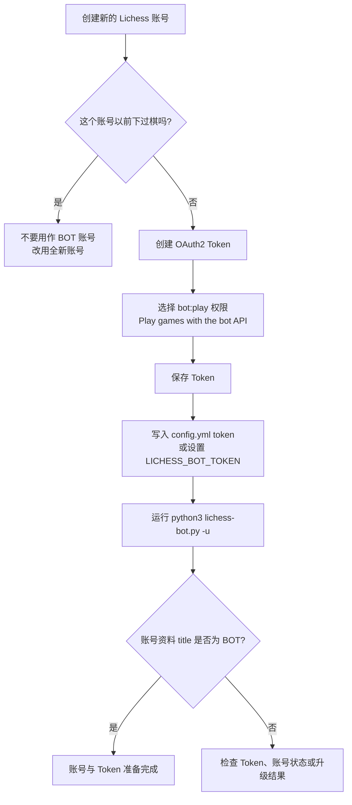
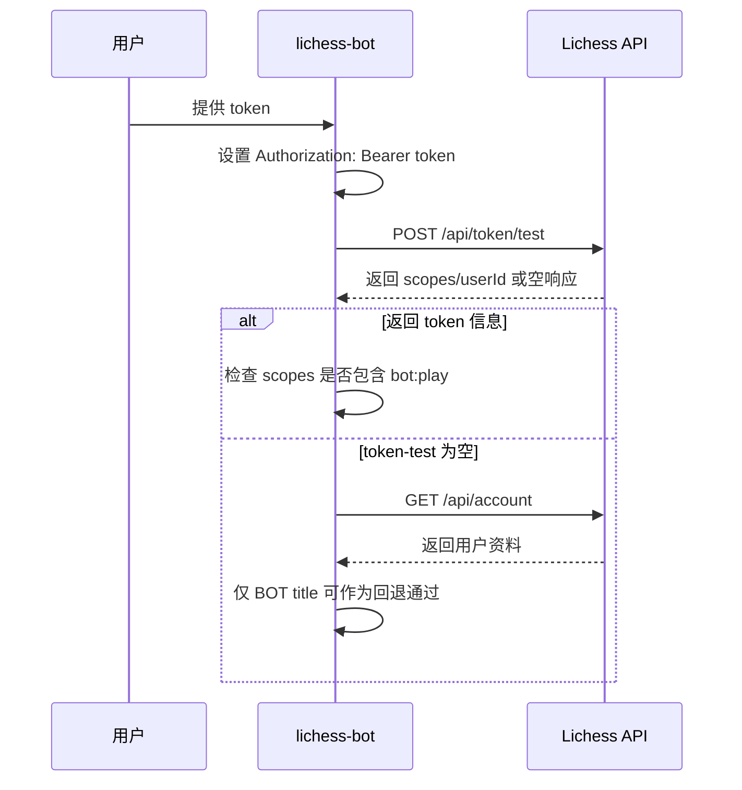

本页位于“快速开始 → 首次部署”路径中的 **[创建 Lichess BOT 账号与 OAuth Token](3-chuang-jian-lichess-bot-zhang-hao-yu-oauth-token)**，目标是帮助初学者完成三件事：创建专用于机器人的 Lichess 账号、生成具备 `bot:play` 权限的 OAuth Token、并理解 lichess-bot 在启动时如何验证这个 Token 与 BOT 身份。本页只覆盖账号与 Token，不展开 Python 安装、引擎配置或正式运行流程；这些内容会在后续页面继续处理。Sources: [How-to-create-a-Lichess-OAuth-token.md](wiki/How-to-create-a-Lichess-OAuth-token.md#L1-L8), [Upgrade-to-a-BOT-account.md](wiki/Upgrade-to-a-BOT-account.md#L1-L9)

## 架构假设：Token 是 lichess-bot 连接 Lichess Bot API 的身份凭据

从实现上看，lichess-bot 将 OAuth Token 放入 HTTP `Authorization: Bearer ...` 请求头，然后使用该身份访问 Lichess API；启动阶段会调用 Token 检查逻辑，确认 Token 可用且包含 `bot:play` 权限，否则程序会抛出错误并提示检查配置或权限范围。Sources: [lichess.py](lib/lichess.py#L131-L168)

```mermaid
flowchart LR
    A[专用 Lichess 账号] --> B[OAuth Token]
    B --> C[config.yml token 字段<br/>或 LICHESS_BOT_TOKEN 环境变量]
    C --> D[lichess-bot 启动]
    D --> E[Authorization: Bearer Token]
    E --> F[/api/token/test]
    F --> G{是否包含 bot:play?}
    G -- 是 --> H[继续检查账号是否为 BOT]
    G -- 否 --> I[启动失败并提示权限错误]
```

这个图中的关键边界是：Token 只解决“程序代表哪个 Lichess 账号发请求”的问题，而账号是否已经升级为 BOT 是另一个状态检查；主程序在创建 `Lichess` 客户端后读取用户资料，如果资料标题是 `BOT` 才进入机器人主流程，否则会提示该账号不是 bot account。Sources: [lichess_bot.py](lib/lichess_bot.py#L1367-L1380)

## 相关文件视图

下面是本页涉及的最小项目结构：`config.yml.default` 展示 Token 字段的位置，`lib/config.py` 说明环境变量可以覆盖配置文件中的 Token，`lib/lichess.py` 负责 API 端点、鉴权请求头、Token 权限验证与账号升级请求，`lib/lichess_bot.py` 负责命令行 `-u` 参数和启动时的 BOT 身份判断。Sources: [config.yml.default](config.yml.default#L1-L2), [config.py](lib/config.py#L573-L581), [lichess.py](lib/lichess.py#L21-L45), [lichess_bot.py](lib/lichess_bot.py#L1341-L1380)

```text
lichess-bot/
├── config.yml.default          # token: "..." 示例字段
├── lichess-bot.py              # 程序入口，调用 start_program()
├── lib/
│   ├── config.py               # 读取 config.yml，并允许 LICHESS_BOT_TOKEN 覆盖 token
│   ├── lichess.py              # 设置 Authorization 头、验证 token、调用账号升级 API
│   └── lichess_bot.py          # 解析 -u 参数，判断账号是否为 BOT
└── wiki/
    ├── How-to-create-a-Lichess-OAuth-token.md
    └── Upgrade-to-a-BOT-account.md
```

## 步骤总览

创建 BOT 账号与 Token 的流程可以按“账号 → Token → 配置 → 升级 → 验证”理解：先创建一个专用 Lichess 账号，再生成带 `bot:play` scope 的 OAuth Token，把 Token 写入配置文件或环境变量，随后使用 `-u` 将账号升级为 BOT；程序启动时会验证 Token 权限，并读取账号资料确认是否为 BOT。Sources: [How-to-create-a-Lichess-OAuth-token.md](wiki/How-to-create-a-Lichess-OAuth-token.md#L2-L6), [Upgrade-to-a-BOT-account.md](wiki/Upgrade-to-a-BOT-account.md#L2-L5), [lichess.py](lib/lichess.py#L156-L168), [lichess_bot.py](lib/lichess_bot.py#L1367-L1380)



## 第 1 步：创建专用 Lichess 账号

请为机器人创建一个新的 Lichess 账号，而不是复用已经下过棋的个人账号；项目原始文档明确说明，如果一个已有账号以前玩过对局，就不能再用作 bot account。Sources: [How-to-create-a-Lichess-OAuth-token.md](wiki/How-to-create-a-Lichess-OAuth-token.md#L2-L4)

| 项目 | 推荐做法 | 原因 |
|---|---|---|
| 账号用途 | 为机器人单独注册新账号 | 已经下过棋的账号不能作为 bot account |
| 个人账号 | 不建议复用 | 避免升级流程不可用 |
| 初学者检查点 | 注册后保持登录状态 | 后续 Token 创建页面基于当前登录账号 |

Sources: [How-to-create-a-Lichess-OAuth-token.md](wiki/How-to-create-a-Lichess-OAuth-token.md#L2-L4)

## 第 2 步：创建 OAuth Token，并选择 `bot:play`

登录机器人的 Lichess 账号后，创建一个 personal OAuth2 token，并确保选择 **“Play games with the bot API”**，也就是 `bot:play` scope；这是 lichess-bot 启动验证时明确检查的权限，缺少该 scope 会导致程序抛出权限错误。Sources: [How-to-create-a-Lichess-OAuth-token.md](wiki/How-to-create-a-Lichess-OAuth-token.md#L4-L5), [lichess.py](lib/lichess.py#L164-L168)

| Token 参数 | 必须值或行为 | lichess-bot 侧验证 |
|---|---|---|
| Scope | `bot:play` | 启动时检查 `scopes` 中是否包含 `bot:play` |
| Description | 需要填写描述 | 原始文档建议使用创建链接并添加 description |
| 显示次数 | 只显示一次 | 原始文档提醒不会再次看到该 Token |
| 用途 | 允许 Bot API 对局 | 程序将 Token 放入 Bearer Authorization 请求头 |

Sources: [How-to-create-a-Lichess-OAuth-token.md](wiki/How-to-create-a-Lichess-OAuth-token.md#L4-L6), [lichess.py](lib/lichess.py#L141-L168)

## 第 3 步：保存 Token

Token 创建完成后，Lichess 会显示一个类似 `xxxxxxxxxxxxxxxx` 的字符串；请立即保存，因为原始文档明确提醒该 Token 之后不会再次显示。Sources: [How-to-create-a-Lichess-OAuth-token.md](wiki/How-to-create-a-Lichess-OAuth-token.md#L5-L6)

你可以把 Token 写入 `config.yml` 的 `token` 字段；默认配置模板的第一行展示了该字段的格式，即 `token: "xxxxxxxxxxxxxxxxxxxxxx"`，第二行则保留 Lichess 基础 URL 为 `https://lichess.org/`。Sources: [config.yml.default](config.yml.default#L1-L2)

```yaml
token: "你的_Lichess_OAuth2_Token"
url: "https://lichess.org/"
```

也可以使用环境变量 `LICHESS_BOT_TOKEN` 提供 Token；配置加载逻辑会在检测到该环境变量时，用环境变量值覆盖配置对象中的 `token` 字段，然后继续插入默认值、处理 block list、记录配置并校验配置。Sources: [config.py](lib/config.py#L573-L581)

## 配置方式对比：`config.yml` 与环境变量

对初学者而言，`config.yml` 更直观，适合本地学习；环境变量更适合不希望把 Token 写入文件的场景。项目实现同时支持两者，并且环境变量存在时优先覆盖配置文件中的 Token。Sources: [How-to-create-a-Lichess-OAuth-token.md](wiki/How-to-create-a-Lichess-OAuth-token.md#L5-L5), [config.py](lib/config.py#L573-L581)

| 方式 | 示例 | 优先级 | 适合场景 |
|---|---|---:|---|
| `config.yml` | `token: "..."` | 低 | 本地入门、手动配置 |
| `LICHESS_BOT_TOKEN` | `export LICHESS_BOT_TOKEN="..."` | 高 | 避免把 Token 固定写入配置文件 |

Sources: [config.yml.default](config.yml.default#L1-L2), [config.py](lib/config.py#L573-L581)

## Before / After：从占位 Token 到真实 Token

默认配置中的 Token 是占位符，不能直接用于连接 Lichess；你需要把占位字符串替换为创建 OAuth Token 时得到的真实值，或者保留配置文件占位符但通过 `LICHESS_BOT_TOKEN` 环境变量覆盖。Sources: [config.yml.default](config.yml.default#L1-L2), [config.py](lib/config.py#L573-L581)

| 状态 | 配置片段 | 含义 |
|---|---|---|
| Before | `token: "xxxxxxxxxxxxxxxxxxxxxx"` | 默认模板中的占位 Token |
| After | `token: "真实的_OAuth_Token"` | 使用 Lichess 创建页面显示的一次性 Token |
| Alternative | `LICHESS_BOT_TOKEN="真实的_OAuth_Token"` | 环境变量覆盖配置中的 `token` |

Sources: [config.yml.default](config.yml.default#L1-L2), [How-to-create-a-Lichess-OAuth-token.md](wiki/How-to-create-a-Lichess-OAuth-token.md#L5-L6), [config.py](lib/config.py#L573-L581)

## 第 4 步：升级为 BOT 账号

账号升级通过运行 `python3 lichess-bot.py -u` 触发；原始文档明确警告升级不可逆，且主程序的命令行参数中 `-u` 的含义就是 “Upgrade your account to a bot account.”。Sources: [Upgrade-to-a-BOT-account.md](wiki/Upgrade-to-a-BOT-account.md#L1-L4), [lichess_bot.py](lib/lichess_bot.py#L1341-L1345)

```bash
python3 lichess-bot.py -u
```

在代码路径上，`-u` 参数被解析后，程序会加载配置、创建 `Lichess` 客户端、读取用户资料；如果当前资料还不是 BOT 且传入了 `-u`，程序会调用升级函数，成功后记录 “Successfully upgraded to Bot Account!”。Sources: [lichess_bot.py](lib/lichess_bot.py#L1355-L1378), [lichess_bot.py](lib/lichess_bot.py#L116-L125)

底层 API 封装中，账号升级端点被命名为 `"upgrade"`，路径是 `/api/bot/account/upgrade`；`upgrade_to_bot_account()` 方法会对这个端点发起 POST 请求。Sources: [lichess.py](lib/lichess.py#L21-L45), [lichess.py](lib/lichess.py#L364-L366)

## 启动时 lichess-bot 如何验证 Token

`Lichess` 客户端初始化时会先设置 `Authorization: Bearer <token>` 请求头，然后调用 `get_token_info(token)`；如果无法取得 Token 信息，会提示检查配置文件中的 Token 是否复制正确。Sources: [lichess.py](lib/lichess.py#L141-L162)

Token 信息取得后，程序会读取 `scopes` 字段，并用逗号拆分后检查是否包含 `bot:play`；如果没有这个权限，错误信息会要求使用包含 “Play games with the bot API (bot:play)” scope 的 API access token。Sources: [lichess.py](lib/lichess.py#L164-L168)

`get_token_info()` 会最多三次调用 `/api/token/test`，如果响应中没有包含提交的 Token，会等待并重试；如果三次后仍未得到 Token 信息，代码会尝试使用 `/api/account` 作为回退验证，只有当用户资料的 `title` 为 `BOT` 时才继续启动。Sources: [lichess.py](lib/lichess.py#L170-L193)

对应测试覆盖了三类行为：正常 token-test 响应直接返回、空 token-test 响应但 BOT profile 可以通过回退验证、非 BOT profile 不能通过回退验证。Sources: [test_lichess_token_validation.py](test_bot/test_lichess_token_validation.py#L17-L60)



## 常见问题排查

如果启动时报错要求检查 Token 是否复制正确，优先确认 `config.yml` 的 `token` 字段或 `LICHESS_BOT_TOKEN` 环境变量是否确实是 Lichess 创建页面显示的完整 Token；程序在无法取得 Token 信息时会抛出“Please check that it was copied correctly into your configuration file”的错误。Sources: [How-to-create-a-Lichess-OAuth-token.md](wiki/How-to-create-a-Lichess-OAuth-token.md#L5-L6), [lichess.py](lib/lichess.py#L156-L162)

| 现象 | 可验证原因 | 对应处理 |
|---|---|---|
| 提示检查 Token 是否复制正确 | Token 信息无法取得 | 重新确认 `config.yml` 或 `LICHESS_BOT_TOKEN` |
| 提示需要 `bot:play` | Token scopes 不含 `bot:play` | 重新创建带 “Play games with the bot API” 权限的 Token |
| 提示账号不是 bot account | 用户资料 `title` 不是 `BOT` | 使用 `python3 lichess-bot.py -u` 升级 |
| Token 找不到第二次显示入口 | Lichess 创建后不会再次显示 Token | 创建时立即保存，丢失则重新创建 |

Sources: [lichess.py](lib/lichess.py#L156-L168), [lichess_bot.py](lib/lichess_bot.py#L1374-L1380), [How-to-create-a-Lichess-OAuth-token.md](wiki/How-to-create-a-Lichess-OAuth-token.md#L5-L6)

## 完成标准

本页完成后，你应该已经拥有一个未用于普通对局的专用 Lichess 账号、一个包含 `bot:play` scope 的 OAuth Token、一个可供 lichess-bot 读取的 Token 配置来源，以及一个已经通过 `-u` 升级或准备升级的 BOT 账号。Sources: [How-to-create-a-Lichess-OAuth-token.md](wiki/How-to-create-a-Lichess-OAuth-token.md#L2-L6), [Upgrade-to-a-BOT-account.md](wiki/Upgrade-to-a-BOT-account.md#L2-L5), [config.py](lib/config.py#L573-L581)

## 下一步阅读

完成账号与 Token 后，按目录顺序继续阅读 **[安装 Python 环境并运行测试](4-an-zhuang-python-huan-jing-bing-yun-xing-ce-shi)**；如果你已经完成环境准备，再进入 **[配置并验证国际象棋引擎](5-pei-zhi-bing-yan-zheng-guo-ji-xiang-qi-yin-qing)**，最后阅读 **[启动机器人并观察运行日志](6-qi-dong-ji-qi-ren-bing-guan-cha-yun-xing-ri-zhi)**。Sources: [How-to-create-a-Lichess-OAuth-token.md](wiki/How-to-create-a-Lichess-OAuth-token.md#L8-L10), [Upgrade-to-a-BOT-account.md](wiki/Upgrade-to-a-BOT-account.md#L7-L9)