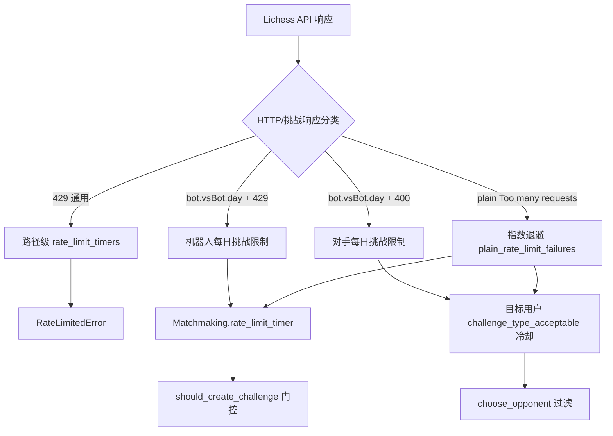
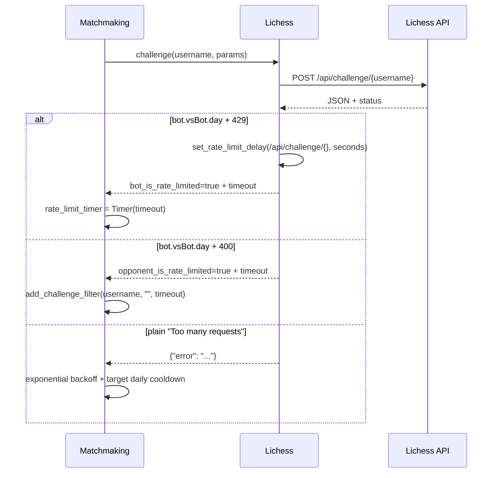

本页解释 lichess-bot 在平台交互层如何识别 Lichess 速率限制、如何把“短期请求退避”和“长期挑战冷却”分离建模，以及主动配对流程如何利用这些计时器避免重复触发同一类错误；范围限定在 API 429/挑战端点错误、backoff 重试、matchmaking 冷却与状态持久化，不展开普通挑战筛选、引擎走法或事件流生命周期。Sources: [lichess.py](lib/lichess.py#L66-L107), [matchmaking.py](lib/matchmaking.py#L20-L44)

## 架构假设与验证结论

从第一性原理看，这里的核心问题不是“失败后重试”，而是**把失败原因转化为可组合的时间约束**：`Lichess` 负责把 HTTP 响应和路径级速率限制转成 `RateLimitedError` 或响应标记，`Matchmaking` 负责把这些信号转成全局主动挑战退避、目标用户冷却、无候选人等待和持久化状态；`Timer` 提供统一的倒计时语义，所有上层逻辑只查询 `is_expired()`、`time_until_expiration()` 和 `time_since_reset()`。Sources: [lichess.py](lib/lichess.py#L317-L362), [matchmaking.py](lib/matchmaking.py#L69-L83), [timer.py](lib/timer.py#L60-L99)

这个设计的关键边界是：**API 封装层只知道端点与响应，主动配对层才知道挑战目标与业务冷却**。`Lichess.get_path_template()` 在发请求前检查路径是否仍处于冷却，并在未过期时抛出 `RateLimitedError`；`Matchmaking.create_challenge()` 捕获该异常后把 `e.timeout` 写入自己的 `rate_limit_timer`，从而阻止后续主动挑战尝试。Sources: [lichess.py](lib/lichess.py#L317-L329), [matchmaking.py](lib/matchmaking.py#L100-L120)

## HTTP 层：429 识别与路径级限流计时器

通用速率限制的最小识别条件是 HTTP 状态码 `429`，由 `is_new_rate_limit()` 判断；`Lichess` 初始化时维护 `rate_limit_timers: defaultdict[str, Timer]`，键是路径模板而不是完整 URL，因此同类端点调用共享同一个冷却窗口。Sources: [lichess.py](lib/lichess.py#L75-L78), [lichess.py](lib/lichess.py#L131-L155)

GET 请求在收到 429 后会为对应路径设置冷却：走子端点 `move` 使用 1 秒，其它 GET 端点使用 60 秒；随后仍执行 `response.raise_for_status()`，因此 429 会继续作为 HTTPError 进入 backoff 或调用方异常路径。Sources: [lichess.py](lib/lichess.py#L203-L227)

POST 请求对普通端点也在 429 时写入 60 秒路径级冷却；但 `challenge` 端点被特殊分流到 `handle_challenge()`，因为挑战响应需要区分机器人自身、对手以及非结构化的挑战频率限制。Sources: [lichess.py](lib/lichess.py#L279-L315), [lichess.py](lib/lichess.py#L331-L344)

| 层级 | 识别条件 | 冷却对象 | 冷却时长来源 | 后续行为 |
|---|---|---|---|---|
| GET 通用端点 | `status_code == 429` | `rate_limit_timers[path_template]` | `move` 为 1 秒，其它为 60 秒 | `raise_for_status()` 继续抛错 |
| POST 通用端点 | `status_code == 429` | `rate_limit_timers[path_template]` | 固定 60 秒 | 可继续 `raise_for_status()` |
| POST challenge | 进入 `handle_challenge()` | 结构化响应字段或调用方处理 | Lichess 响应中的 `ratelimit.seconds`，或 Matchmaking 自行计算 | 返回 `ChallengeType` 给主动配对层 |

Sources: [lichess.py](lib/lichess.py#L221-L225), [lichess.py](lib/lichess.py#L305-L314), [lichess.py](lib/lichess.py#L331-L344)

路径级冷却的执行点在 `get_path_template()`：只要 `is_rate_limited(path_template)` 为真，就计算剩余时间并抛出 `RateLimitedError`，错误对象携带 `timeout`；这使“不要再打这个端点”的决策发生在请求发出之前，而不是等服务端再次返回 429。Sources: [lichess.py](lib/lichess.py#L317-L329), [lichess.py](lib/lichess.py#L346-L362)

## backoff：瞬态异常重试与限流冷却的分工

`api_get()` 与 `api_post()` 都使用 `backoff.on_exception(backoff.constant, ...)` 包装，覆盖 `RemoteDisconnected`、`RequestsConnectionError`、`HTTPError` 和 `ReadTimeout`，采用 `interval=0.1`、`max_time=60` 的常量退避；这层机制解决的是连接中断、读超时和 5xx 等瞬态失败，而不是长期挑战冷却。Sources: [lichess.py](lib/lichess.py#L195-L202), [lichess.py](lib/lichess.py#L271-L278)

`is_final()` 定义了重试停止条件：当异常是带响应的 `HTTPError` 且状态码小于 500，或者全局 `stop.force_quit` 为真时，不再重试；因此 4xx 类错误不会被 backoff 反复打爆，而会交给上层错误处理或限流计时器。Sources: [lichess.py](lib/lichess.py#L110-L124)

`backoff_handler()` 只负责日志观测：它记录等待秒数、尝试次数、目标函数、参数和异常栈；当参数中包含 `token_test` 时会把数据替换为 `<token redacted>`，避免在 debug 日志中泄露 token。Sources: [lichess.py](lib/lichess.py#L116-L124)

## 挑战端点：结构化每日限制识别

挑战端点存在专用识别逻辑：`is_daily_game_rate_limit()` 要求状态码匹配，并且 JSON 响应中存在 `error`，同时 `ratelimit.key == "bot.vsBot.day"`；在此基础上，400 被解释为对手受每日 bot 对局限制，429 被解释为本 bot 受每日 bot 对局限制。Sources: [lichess.py](lib/lichess.py#L79-L99)

`get_challenge_timeout()` 只接受 `ratelimit.key == "bot.vsBot.day"` 的结构化响应，并把 `ratelimit.seconds` 转成 `datetime.timedelta`；这意味着每日限制的冷却时长以服务端返回秒数为准，而不是客户端猜测。Sources: [lichess.py](lib/lichess.py#L101-L107)

`handle_challenge()` 在挑战响应中注入三个字段：`bot_is_rate_limited`、`opponent_is_rate_limited` 和 `rate_limit_timeout`；如果是机器人自身受限，还会把 `/api/challenge/{}` 路径写入 Lichess 的路径级冷却表。Sources: [lichess.py](lib/lichess.py#L331-L344)

## 主动挑战门控：多个计时器取最大约束

主动挑战并不是只看“是否启用 matchmaking”。`should_create_challenge()` 同时要求上一局结束后的等待、全局速率限制计时器、无候选人计时器都已过期，并且距上次创建挑战超过 `min_wait_time`；初始化时 `min_wait_time` 固定为 60 秒，用于避免 API 频率限制。Sources: [matchmaking.py](lib/matchmaking.py#L31-L44), [matchmaking.py](lib/matchmaking.py#L69-L83)

如果已有挑战 ID 且 `last_challenge_created_delay` 已过期，`should_create_challenge()` 会先对挑战目标执行 12 小时冷却，再调用 `li.cancel()` 取消挑战、清理本地挑战状态并打印下一次挑战时间；这里的语义是“无人响应的挑战不应立即重投给同一目标”。Sources: [matchmaking.py](lib/matchmaking.py#L69-L83), [matchmaking.py](lib/matchmaking.py#L427-L437)

`challenge()` 入口还叠加并发约束：当活动对局数加挑战队列长度达到允许上限，或在已有游戏时还没达到最大等待间隔，或 `should_create_challenge()` 返回 false，就直接返回；当没有候选人时会把 `rate_limit_timer` 设置为 60 秒，避免立即再次进入候选选择。Sources: [matchmaking.py](lib/matchmaking.py#L274-L301)

`show_earliest_challenge_time()` 通过取赛后等待、最小挑战间隔、全局速率限制、无候选人等待四者的最大剩余时间，计算并记录下一次可能创建挑战的墙钟时间；这个日志是排查“为什么 bot 不再主动挑战”的主要入口。Sources: [matchmaking.py](lib/matchmaking.py#L319-L328)

## 非结构化 Too many requests：指数退避与目标日冷却

旧式或非结构化挑战限流通过字符串匹配识别：`is_plain_rate_limit_response()` 检查响应 `error` 字段的小写文本中是否包含 `too many requests`；这一路径没有服务端返回的秒级超时，因此由客户端计算退避时间。Sources: [matchmaking.py](lib/matchmaking.py#L122-L150)

非结构化挑战限流采用指数退避：初始 30 分钟，每次失败翻倍，上限 1440 分钟；实现上 `plain_rate_limit_failures` 每次加一，`next_plain_rate_limit_delay()` 返回 `min(30 * 2 ** (failures - 1), 1440)` 分钟。Sources: [matchmaking.py](lib/matchmaking.py#L20-L24), [matchmaking.py](lib/matchmaking.py#L141-L150)

当触发 plain rate limit 时，`handle_challenge_error_response()` 同时做两件事：把全局 `rate_limit_timer` 设置为指数退避时长，并对当前目标用户添加 1 天冷却，日志明确表示当天不再挑战该用户以及挑战端点进入退避。Sources: [matchmaking.py](lib/matchmaking.py#L122-L139)

测试覆盖了这条路径的关键不变量：第一次 plain rate limit 后全局退避为 30 分钟；目标用户进入 1 天冷却；连续 4 次失败后退避达到 4 小时；连续 8 次后退避封顶为 1 天。Sources: [test_matchmaking.py](test_bot/test_matchmaking.py#L661-L745)

## 对手冷却：拒绝、无人响应与候选池耗尽

对手冷却统一存储在 `challenge_type_acceptable[(username, game_aspect)] -> Timer` 中。`add_challenge_filter()` 默认使用 6 小时冷却，空 `game_aspect` 等价于阻止再次挑战该用户；`should_accept_challenge()` 只检查对应计时器是否过期。Sources: [matchmaking.py](lib/matchmaking.py#L338-L358)

拒绝挑战时，`declined_challenge()` 会根据 Lichess 的 `declineReasonKey` 映射到不同问题维度：速度、变体、rated/casual 或空维度；当过滤模式是 `FINE` 时只冷却具体问题维度，当过滤模式不是 `FINE` 时使用空维度形成更粗粒度的用户冷却。Sources: [matchmaking.py](lib/matchmaking.py#L457-L494)

如果拒绝原因是 `nobot`，系统调用 `add_to_block_list()`，实际添加一个 10 年冷却；如果对方要求 rated/casual 的相反模式，而当前配置不是 `random`，系统还会额外添加空维度 6 小时冷却，避免继续用固定模式骚扰同一对手。Sources: [matchmaking.py](lib/matchmaking.py#L472-L500), [matchmaking.py](lib/matchmaking.py#L330-L337)

无人响应的外发挑战由两条路径冷却：本地发现挑战过期时在 `should_create_challenge()` 中处理，事件流收到取消/过期事件时在 `cancelled_challenge()` 中处理；两者最终都调用 `cool_down_challenge_target()`，对目标添加 12 小时冷却并清理挑战元数据。Sources: [matchmaking.py](lib/matchmaking.py#L69-L83), [matchmaking.py](lib/matchmaking.py#L427-L455)

候选池耗尽也有冷却：`choose_opponent()` 在过滤后如果存在合适 bot 但没有任何 bot 通过拒绝过滤，会设置 `no_candidate_timer = Timer(NO_CANDIDATE_DELAY)`；如果根本没有在线候选人，同样设置 15 分钟等待，避免高频轮询在线 bot 列表。Sources: [matchmaking.py](lib/matchmaking.py#L230-L250), [matchmaking.py](lib/matchmaking.py#L20-L25)

| 场景 | 冷却对象 | 默认/计算时长 | 代码路径 | 行为目的 |
|---|---|---:|---|---|
| 普通拒绝 | 用户或具体 `game_aspect` | 6 小时 | `add_challenge_filter()` | 避免重复发送对方刚拒绝的类型 |
| `nobot` 拒绝 | 用户空维度 | 10 年 | `add_to_block_list()` | 长期排除不接收 bot 挑战的账号 |
| 外发挑战无人响应 | 用户空维度 | 12 小时 | `cool_down_challenge_target()` | 避免挑战过期后立即重投 |
| plain rate limit 涉及目标 | 用户空维度 | 1 天 | `handle_challenge_error_response()` | 降低当天继续命中挑战端点限制的概率 |
| 无候选人或全被过滤 | 全局候选选择 | 15 分钟 | `choose_opponent()` | 避免频繁轮询与重复计算 |

Sources: [matchmaking.py](lib/matchmaking.py#L20-L25), [matchmaking.py](lib/matchmaking.py#L338-L358), [matchmaking.py](lib/matchmaking.py#L427-L437)

## 候选选择中的冷却应用

`choose_opponent()` 先按自身账号、blocklist、对手该类型对局数、评级上下限筛出 suitable opponents；之后再应用 `ready_for_challenge()`，在 `FINE` 模式下检查 `variant`、`game_type` 和 `mode` 三个维度的冷却是否都已过期。Sources: [matchmaking.py](lib/matchmaking.py#L212-L240)

如果 suitable opponents 非空但全部被冷却过滤排除，系统不会退回去挑战“已知不合适”的对象，而是记录错误、设置 15 分钟 `no_candidate_timer` 并清空候选池；测试明确断言这种情况下不会调用 `get_public_data()` 去进一步查询被过滤对象。Sources: [matchmaking.py](lib/matchmaking.py#L240-L260), [test_matchmaking.py](test_bot/test_matchmaking.py#L548-L620)

这一区分对高级维护者很重要：**评级/在线状态筛选失败**和**拒绝冷却筛选失败**都会导致 15 分钟等待，但前者表示当前没有合适市场，后者表示有合适市场但近期行为表明不应继续挑战。Sources: [matchmaking.py](lib/matchmaking.py#L223-L250), [test_matchmaking.py](test_bot/test_matchmaking.py#L623-L658)

## 状态持久化：让冷却跨重启生效

主动配对状态文件由 `matchmaking.state_file` 配置启用；初始化时读取 `state_file` 并调用 `load_state()`，运行中 `handle_challenge_error_response()`、`add_challenge_filter()` 等路径会调用 `save_state()`，因此冷却不是纯内存状态。Sources: [matchmaking.py](lib/matchmaking.py#L60-L67), [matchmaking.py](lib/matchmaking.py#L122-L139), [matchmaking.py](lib/matchmaking.py#L338-L349)

`save_state()` 持久化三类数据：未过期的用户/维度冷却列表、`plain_rate_limit_failures`、以及全局 `rate_limit_timer` 的过期墙钟时间；写入格式是 JSON，并在 `state_file.parent` 不存在时创建父目录。Sources: [matchmaking.py](lib/matchmaking.py#L382-L400)

`load_state()` 读取 JSON 后恢复未过期冷却，忽略无效或已过期的时间戳；如果存在未过期的全局 rate limit，则恢复 `rate_limit_timer` 并恢复 `plain_rate_limit_failures`，最后再调用 `save_state()` 清理过期项。Sources: [matchmaking.py](lib/matchmaking.py#L402-L425)

测试验证了两类关键持久化：普通对手冷却在重启后仍使 `should_accept_challenge()` 返回 false；plain rate limit 的全局退避在重启后仍未过期，并且失败计数保持为 1。Sources: [test_matchmaking.py](test_bot/test_matchmaking.py#L842-L864), [test_matchmaking.py](test_bot/test_matchmaking.py#L886-L908)

## 可观测性与排障入口

当端点被标记为限流时，`set_rate_limit_delay()` 会记录“Endpoint ... is rate limited”以及等待秒数；当再次请求仍处于限流的路径时，`get_path_template()` 抛出的 `RateLimitedError` 文本包含路径和剩余秒数，`Matchmaking.create_challenge()` 捕获后会 warning 并展示下一次挑战时间。Sources: [lichess.py](lib/lichess.py#L317-L329), [lichess.py](lib/lichess.py#L346-L354), [matchmaking.py](lib/matchmaking.py#L111-L120)

主动挑战相关日志按阶段分布：创建挑战前记录随机 bot 挑战和目标变体，创建失败时记录“Could not create challenge”，拒绝挑战时记录对手、挑战描述和拒绝原因，取消/无人响应时记录 12 小时不再挑战该对手。Sources: [matchmaking.py](lib/matchmaking.py#L289-L301), [matchmaking.py](lib/matchmaking.py#L457-L500), [matchmaking.py](lib/matchmaking.py#L427-L437)

| 现象 | 直接检查点 | 可验证原因 |
|---|---|---|
| 日志显示 endpoint rate limited | `Lichess.rate_limit_timers[path]` 是否未过期 | 429 已被路径级计时器吸收 |
| 主动挑战长时间不创建 | `show_earliest_challenge_time()` 输出 | 最大剩余时间来自赛后等待、最小间隔、rate limit 或 no candidate |
| 某个 bot 不再被挑战 | `challenge_type_acceptable[(username, aspect)]` | 拒绝、无人响应、plain rate limit 或 blocklist 冷却 |
| 重启后仍不挑战 | `state_file` 中 `cooldowns` 或 `rate_limit_expires_at` | 冷却状态被持久化恢复 |

Sources: [matchmaking.py](lib/matchmaking.py#L319-L328), [matchmaking.py](lib/matchmaking.py#L382-L425), [matchmaking.py](lib/matchmaking.py#L338-L358)

## 与相邻页面的阅读关系

如果需要理解这些限流信号如何从底层 API 请求产生，下一步阅读 [Lichess Bot API 封装与请求重试策略](28-lichess-bot-api-feng-zhuang-yu-qing-qiu-zhong-shi-ce-lue)；如果需要追踪挑战创建、接受、拒绝、取消事件如何进入主动配对状态机，阅读 [游戏生命周期：从挑战到对局结束](18-you-xi-sheng-ming-zhou-qi-cong-tiao-zhan-dao-dui-ju-jie-shu)；如果要调整主动配对输入条件，再回到 [启用主动配对并挑战其他机器人](12-qi-yong-zhu-dong-pei-dui-bing-tiao-zhan-qi-ta-ji-qi-ren)。Sources: [lichess.py](lib/lichess.py#L195-L315), [matchmaking.py](lib/matchmaking.py#L274-L301), [matchmaking.py](lib/matchmaking.py#L439-L500)