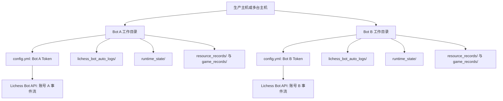
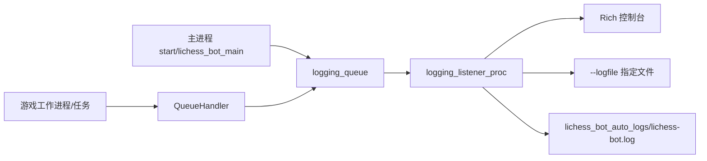
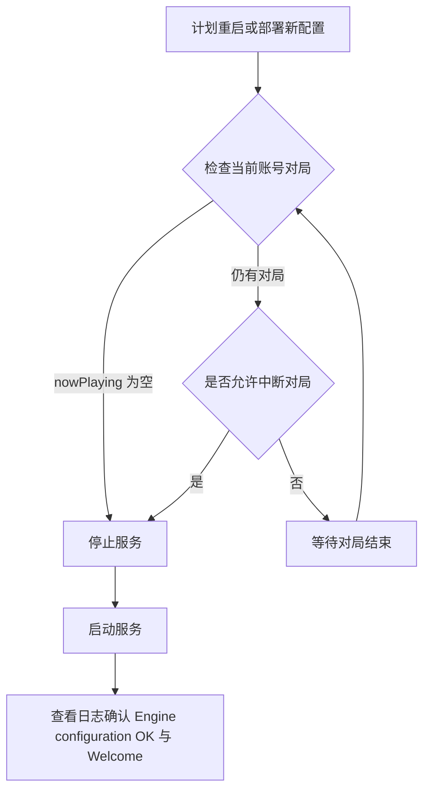

本页位于“运维与质量”章节，聚焦 **生产部署：多机器人、后台运行与日志管理**。架构假设是：生产环境中的 lichess-bot 不是一个“单进程脚本”，而是一个以账号级 Lichess 事件流为入口、以多进程任务协作为运行骨架、以文件日志和运行产物目录为可观测边界的服务；因此生产部署的关键不是单次启动，而是确保 **一个 BOT 账号只对应一个运行实例**、每个机器人拥有独立配置与状态目录，并通过 systemd、LaunchAgent 或等价守护机制持续运行。该假设由部署指南对账号隔离的约束、运行文档的后台服务示例，以及入口程序的多进程启动逻辑共同验证。Sources: [DEPLOYMENT.md](docs/DEPLOYMENT.md#L3-L6), [How-to-Run-lichess‐bot.md](wiki/How-to-Run-lichess‐bot.md#L28-L46), [lichess_bot.py](lib/lichess_bot.py#L304-L352)

## 生产部署的边界：一个账号，一个实例，一套私有目录

生产部署的第一条硬约束是：**不要在两台机器或两个进程中同时运行同一个 Lichess BOT 账号**。部署指南明确说明 Bot API 事件流是账号级的；两个活跃进程可能在挑战事件、游戏流、走子和取消操作上发生竞争，因此应为每个已部署机器人使用独立的 Lichess bot 账号。这个约束直接决定了多机器人部署的拓扑：多机器人不是复制同一个 `config.yml` 并并行启动，而是为每个机器人准备独立账号、独立 Token、独立仓库或工作目录、独立配置和独立日志/运行产物。Sources: [DEPLOYMENT.md](docs/DEPLOYMENT.md#L3-L6), [DEPLOYMENT.md](docs/DEPLOYMENT.md#L243-L250)



上图的核心不是目录命名，而是隔离原则：部署指南要求两个研究机器人分别拥有账号、Token、机器、仓库检出、配置和日志，并明确要求不要共享 `runtime_state`、`resource_records`、`game_records` 或 `config.yml`。默认配置中也能看到这些运行产物的默认位置：PGN 可写入 `game_records`，资源监控可写入 `resource_records/resource_usage.csv`，主动配对状态可持久化到 `runtime_state/matchmaking_state.json`。Sources: [DEPLOYMENT.md](docs/DEPLOYMENT.md#L243-L250), [config.yml.default](config.yml.default#L224-L233), [config.yml.default](config.yml.default#L262-L282)

## 启动命令：从前台验证到生产参数

最小启动命令是 `python3 lichess-bot.py`；如果需要更多输出，可加 `-v`；如果需要记录到指定日志文件，可使用 `-l` 或 `--logfile`；如果同一份代码目录下运行不同机器人，必须使用 `--config` 指向不同配置文件。运行文档还说明，引擎执行的工作目录默认是 lichess-bot 目录；如果引擎依赖其他位置的文件，应使用绝对路径或把文件放入合适目录，这一点在后台运行时尤其重要，因为服务管理器的工作目录必须显式设置。Sources: [How-to-Run-lichess‐bot.md](wiki/How-to-Run-lichess‐bot.md#L1-L26)

| 场景 | 命令参数 | 生产含义 |
|---|---|---|
| 前台启动 | `python3 lichess-bot.py` | 用默认 `./config.yml` 启动，适合首次验证 |
| 详细诊断 | `-v` | 将日志级别提升到 DEBUG，包含更多通信与调试信息 |
| 指定日志 | `-l <file>` 或 `--logfile <file>` | 将控制台输出同步写入指定文件 |
| 指定配置 | `--config <file>` | 多机器人部署时为每个账号指定不同配置 |
| 关闭自动日志 | `--disable_auto_logging` | 禁用自动日志目录与轮转文件 |

这些参数由命令行解析器直接定义：`-v` 控制 `logging.DEBUG` 与 `logging.INFO` 的选择，`--config` 指定配置文件，`--logfile` 指定日志文件，`--disable_auto_logging` 关闭自动日志；入口脚本 `lichess-bot.py` 只调用 `lib.lichess_bot.start_program()`，实际部署参数均由 `start_lichess_bot()` 解析。Sources: [lichess-bot.py](lichess-bot.py#L1-L6), [lichess_bot.py](lib/lichess_bot.py#L1341-L1358)

## 后台运行：Linux systemd 服务

Linux 生产环境推荐把机器人交给服务管理器运行，而不是依赖交互式终端。项目 Wiki 提供了 systemd 示例，其中服务在 `network-online.target` 之后启动，设置 `PYTHONUNBUFFERED=1`，通过 `ExecStart` 调用 Python 与 `lichess-bot.py`，通过 `WorkingDirectory` 固定工作目录，并设置 `Restart=always` 实现异常退出后的自动重启。Sources: [How-to-Run-lichess‐bot.md](wiki/How-to-Run-lichess‐bot.md#L28-L46)

```ini
[Unit]
Description=lichess-bot
After=network-online.target
Wants=network-online.target

[Service]
Environment="PYTHONUNBUFFERED=1"
ExecStart=/usr/bin/python3 /home/thibault/lichess-bot/lichess-bot.py --config /home/thibault/lichess-bot/config.yml -l /home/thibault/lichess-bot/lichess_bot_auto_logs/run.log
WorkingDirectory=/home/thibault/lichess-bot/
User=thibault
Group=thibault
Restart=always

[Install]
WantedBy=multi-user.target
```

如果在同一台 Linux 主机上运行多个机器人，应为每个机器人创建不同的 systemd unit、不同的 `WorkingDirectory`、不同的 `--config` 和不同的日志路径；这不是额外优化，而是由账号级事件流和运行产物隔离要求推导出的部署约束。部署指南明确要求每个 Bot 拥有独立账号、Token、机器、仓库检出、配置和日志，并要求不要共享状态、资源记录、PGN 记录或配置文件。Sources: [DEPLOYMENT.md](docs/DEPLOYMENT.md#L243-L250), [DEPLOYMENT.md](docs/DEPLOYMENT.md#L264-L270)

## 后台运行：macOS LaunchAgent

macOS 上的无人值守运行可使用 LaunchAgent。部署指南给出模板：`ProgramArguments` 中包含虚拟环境 Python、`-u`、`lichess-bot.py`、`--config` 和 `-l` 参数；`RunAtLoad` 让服务加载时启动，`KeepAlive` 让服务保持运行，`StandardOutPath` 和 `StandardErrorPath` 分别保存标准输出与错误输出。Sources: [DEPLOYMENT.md](docs/DEPLOYMENT.md#L156-L193)

```xml
<key>ProgramArguments</key>
<array>
  <string>/absolute/path/to/lichess-bot/.venv/bin/python</string>
  <string>-u</string>
  <string>/absolute/path/to/lichess-bot/lichess-bot.py</string>
  <string>--config</string>
  <string>/absolute/path/to/lichess-bot/config.yml</string>
  <string>-l</string>
  <string>/absolute/path/to/lichess-bot/lichess_bot_auto_logs/run.log</string>
</array>
<key>RunAtLoad</key>
<true/>
<key>KeepAlive</key>
<true/>
```

部署指南还给出加载与检查方式：使用 `launchctl bootstrap` 加载 LaunchAgent，使用 `launchctl kickstart -k` 触发重启，使用 `launchctl print` 查看状态，并使用 `tail -f lichess_bot_auto_logs/run.log` 跟踪运行日志；在重启前，应检查当前账号是否仍有活动对局，除非明确接受中断对局的后果。Sources: [DEPLOYMENT.md](docs/DEPLOYMENT.md#L196-L213)

## 日志架构：控制台、指定日志与自动轮转日志

lichess-bot 的日志输出分为三层：控制台处理器、用户通过 `--logfile` 指定的文件处理器、以及默认启用的自动日志。`logging_configurer()` 总是创建 Rich 控制台处理器；当传入文件名时，它创建 `FileHandler` 并写入带时间、logger 名称、文件名、行号、级别和消息的格式；当未禁用自动日志时，它创建 `lichess_bot_auto_logs/lichess-bot.log`，并使用 `TimedRotatingFileHandler` 按午夜轮转，保留 7 个备份。Sources: [lichess_bot.py](lib/lichess_bot.py#L223-L264), [lichess_bot.py](lib/lichess_bot.py#L1327-L1327)

| 日志层 | 启用条件 | 位置或输出 | 适合用途 |
|---|---|---|---|
| 控制台日志 | 始终启用 | 终端或服务 stdout | 即时观察启动与错误 |
| 指定日志文件 | 使用 `-l/--logfile` | 用户指定路径 | 服务级主日志、集中采集 |
| 自动日志 | 默认启用 | `lichess_bot_auto_logs/lichess-bot.log` | 长期调试，自动按日轮转 |
| 配置快照 | 自动日志未禁用时 | `lichess_bot_auto_logs/config.log` | 排查实际生效配置 |

自动日志还会保存配置快照：启动时如果没有传入 `--disable_auto_logging`，程序会把当前加载后的配置写入 `lichess_bot_auto_logs/config.log`。这对于生产排障很重要，因为配置加载阶段会填充默认值；排查时应查看快照中的实际值，而不仅是手写的 `config.yml`。Sources: [lichess_bot.py](lib/lichess_bot.py#L1351-L1358), [config.py](lib/config.py#L140-L155)

## 多进程日志汇聚：为什么日志能覆盖游戏子任务

生产日志不仅来自主循环，也来自游戏处理任务。启动函数创建 `multiprocessing.Manager()`、控制流队列、日志队列、PGN 队列、资源监控进程，并启动一个 `logging_listener` 进程专门消费日志队列；游戏侧调用 `thread_logging_configurer()` 后，会清空本地 root logger 处理器并安装 `QueueHandler`，把日志记录送回统一监听进程。Sources: [lichess_bot.py](lib/lichess_bot.py#L317-L352), [lichess_bot.py](lib/lichess_bot.py#L267-L301)



这意味着在生产环境中，查看 `--logfile` 指定文件或自动日志文件通常比只看服务管理器的 stdout 更完整，因为子任务日志会被送入统一的日志监听进程处理。程序退出清理阶段会等待一秒以允许日志队列中的最终消息被处理，然后重新配置日志并终止日志监听进程。Sources: [lichess_bot.py](lib/lichess_bot.py#L332-L352), [lichess_bot.py](lib/lichess_bot.py#L366-L381)

## 运行产物：PGN、资源记录与匹配状态

生产部署中需要区分日志和运行产物。PGN 记录由 `pgn_directory` 控制，默认配置示例建议使用 `game_records`，并支持按单局、对手或全部游戏分组；保存逻辑会在游戏结束事件中读取 PGN headers，创建目录，并按 `pgn_file_grouping` 决定写入单局文件、对手文件或总文件。Sources: [config.yml.default](config.yml.default#L224-L228), [lichess_bot.py](lib/lichess_bot.py#L1286-L1310)

资源记录由 `resource_monitor` 控制。默认配置中该功能关闭；启用后会把 CPU、RSS、进程数量、进程 ID、活动游戏 ID 和采样间隔等字段追加到 `resource_records/resource_usage.csv`。资源监控代码会采样 lichess-bot 根进程及其子进程树，并在有活动游戏时按 `sample_period` 记录，在空闲时按 `idle_sample_period` 记录。Sources: [config.yml.default](config.yml.default#L230-L234), [resource_monitor.py](lib/resource_monitor.py#L19-L28), [resource_monitor.py](lib/resource_monitor.py#L149-L175)

主动配对的持久状态由 `matchmaking.state_file` 控制，默认是 `runtime_state/matchmaking_state.json`，用于在重启后保留拒绝过滤器和挑战速率限制冷却状态。多机器人部署时不要共享这个文件，否则不同账号的配对状态会混在一起；部署指南明确把 `runtime_state` 列为不可共享目录。Sources: [config.yml.default](config.yml.default#L262-L282), [DEPLOYMENT.md](docs/DEPLOYMENT.md#L243-L250)

## 运行健康检查：进程、日志、资源与当前对局

生产环境的最小健康检查应覆盖四个面：进程是否存在、日志是否持续推进、资源记录是否写入、账号是否仍有活动对局。部署指南给出命令：用 `ps` 查看 `lichess-bot` 和引擎进程，用 `tail` 查看最近日志，用 `tail` 查看 `resource_records/resource_usage.csv`，并通过 Lichess `/api/account/playing` 检查当前游戏。Sources: [DEPLOYMENT.md](docs/DEPLOYMENT.md#L214-L234)

| 检查面 | 示例命令 | 健康信号 |
|---|---|---|
| 进程 | `ps -o pid,ppid,%cpu,%mem,rss,command -ax | rg 'lichess-bot|stockfish'` | 主进程与引擎子进程存在 |
| 主日志 | `tail -n 100 lichess_bot_auto_logs/run.log` | 能看到启动、挑战、配对或等待信息 |
| 资源记录 | `tail -n 20 resource_records/resource_usage.csv` | 启用资源监控后持续追加采样 |
| 当前对局 | `curl ... /api/account/playing` | 重启前确认 `nowPlaying` 状态 |

部署指南列出的健康日志包括：引擎启动时显示使用的线程数，主日志周期性显示下一次挑战创建时间，当没有可用对手时不会每隔几秒重复发出挑战，Arena 集成在存在符合条件的比赛时可能记录入队或加入尝试。这些信号适合判断服务是否“活着”，但是否需要进一步容量规划应转到后续页面处理。Sources: [DEPLOYMENT.md](docs/DEPLOYMENT.md#L236-L242)

## 退出与重启：避免破坏正在进行的对局

手动退出使用 `CTRL+C`。如果配置中的 `quit_after_all_games_finish` 为 `true`，lichess-bot 会等待所有对局结束后再退出；否则当前游戏会立即退出。运行文档还提示，所有游戏退出后程序可能还需要数秒才能完全结束。代码中也能看到该配置的默认值是 `False`，主循环在该值为真时会记录“退出时先等待所有运行中游戏结束”和“再次按 Ctrl-C 立即退出”的提示。Sources: [How-to-Run-lichess‐bot.md](wiki/How-to-Run-lichess‐bot.md#L48-L51), [config.py](lib/config.py#L146-L149), [lichess_bot.py](lib/lichess_bot.py#L452-L455)



部署指南明确建议：重启前检查当前账号是否有活动游戏，只有在 `nowPlaying` 为空时才重启，除非你有意放弃正在进行的游戏。首次运行或重启后的关键启动日志包括 `Checking engine configuration ...`、`Engine configuration OK`、`Welcome <bot username>!` 以及 `You're now connected to https://lichess.org/ and awaiting challenges.`。Sources: [DEPLOYMENT.md](docs/DEPLOYMENT.md#L139-L154), [DEPLOYMENT.md](docs/DEPLOYMENT.md#L205-L213)

## 多机器人部署清单

多机器人生产部署可以按以下清单执行：每个机器人使用一个独立 Lichess BOT 账号和 OAuth Token；每个机器人使用独立工作目录或至少独立配置、日志和状态目录；每个机器人只启动一个服务实例；每个服务显式设置 `WorkingDirectory`、`--config` 和 `-l`；如果启用 PGN、资源监控或主动配对状态持久化，应确认对应目录不会被其他机器人共享。Sources: [DEPLOYMENT.md](docs/DEPLOYMENT.md#L243-L250), [How-to-Run-lichess‐bot.md](wiki/How-to-Run-lichess‐bot.md#L23-L46), [config.yml.default](config.yml.default#L224-L233), [config.yml.default](config.yml.default#L262-L282)

| 项目 | 单机器人 | 多机器人生产要求 |
|---|---|---|
| Lichess 账号 | 1 个 BOT 账号 | 每个机器人 1 个独立 BOT 账号 |
| Token | 1 个 `config.yml` 中的 Token | 每个机器人独立 Token，不能混用 |
| 工作目录 | 可使用仓库根目录 | 推荐每个机器人独立目录 |
| 日志目录 | `lichess_bot_auto_logs/` | 每个机器人独立日志目录或独立工作目录 |
| PGN 目录 | 可选 `game_records/` | 不共享 |
| 资源目录 | 可选 `resource_records/` | 不共享 |
| 匹配状态 | `runtime_state/matchmaking_state.json` | 不共享 |

安全边界也属于生产部署的一部分：部署指南要求尊重 Lichess bot 限制，不要刷挑战，使用冷却和退避，保持 Token 私密，保持每个 bot 账号只有一个运行进程，并把机器特定的 `config.yml` 留在私有位置。更深入的 Token 权限与贡献安全实践应继续阅读 [安全实践：Token 保护、权限范围与贡献规范](34-an-quan-shi-jian-token-bao-hu-quan-xian-fan-wei-yu-gong-xian-gui-fan)。Sources: [DEPLOYMENT.md](docs/DEPLOYMENT.md#L264-L270)

## 下一步阅读

如果你正在从单机试运行进入生产环境，建议先回看 [启动机器人并观察运行日志](6-qi-dong-ji-qi-ren-bing-guan-cha-yun-xing-ri-zhi)，确认启动日志和引擎配置检查的基本含义；如果你使用容器运行，应阅读 [使用 Docker 运行机器人](7-shi-yong-docker-yun-xing-ji-qi-ren)，尤其注意 PGN 目录在 Docker 中需要挂载卷的警告；完成本页部署后，下一步应进入 [资源监控、性能调优与并发容量规划](32-zi-yuan-jian-kong-xing-neng-diao-you-yu-bing-fa-rong-liang-gui-hua)，用 `resource_records/resource_usage.csv` 支撑并发与引擎线程配置调整。Sources: [README.md](README.md#L39-L52), [config.py](lib/config.py#L426-L443), [DEPLOYMENT.md](docs/DEPLOYMENT.md#L223-L227)