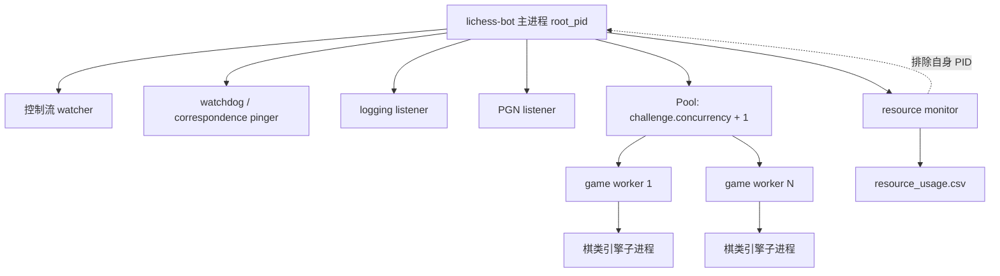
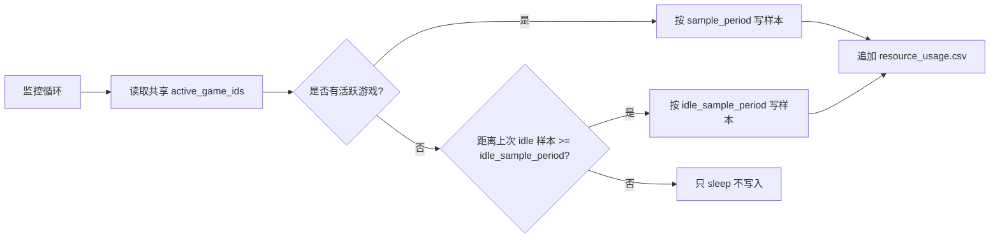
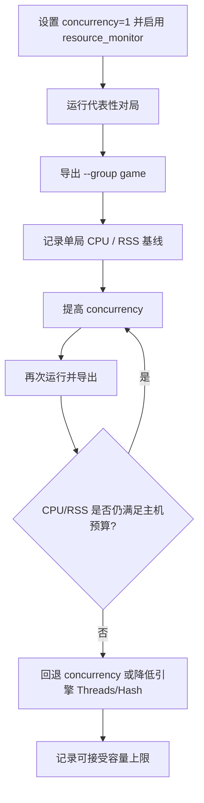

本页位于“深入解析 / 运维与质量”中的 **[资源监控、性能调优与并发容量规划](32-zi-yuan-jian-kong-xing-neng-diao-you-yu-bing-fa-rong-liang-gui-hua)**，关注 lichess-bot 如何记录自身进程树的 CPU、内存与活跃对局信息，如何把采样数据导出为可比较的汇总报表，以及如何用这些数据校准 `challenge.concurrency`、引擎线程数和引擎内存配置；不展开部署、Token、安全、API 重试或引擎走法生成细节。Sources: [lib/resource_monitor.py](lib/resource_monitor.py#L19-L28), [config.yml.default](config.yml.default#L125-L128), [config.yml.default](config.yml.default#L163-L165)

## 架构假设与验证结论

从第一原则看，lichess-bot 的资源容量不是单个 Python 主进程的容量，而是 **主进程、控制流/日志/PGN/资源监控等辅助进程、游戏 worker 进程池，以及每局棋可能拉起的引擎子进程**共同形成的进程树容量；代码验证显示，资源监控模块确实按 root PID 遍历后代进程，聚合每个进程的 CPU 百分比与 RSS 内存，并显式排除监控进程自身以避免自计入。Sources: [lib/resource_monitor.py](lib/resource_monitor.py#L69-L83), [lib/resource_monitor.py](lib/resource_monitor.py#L86-L120), [lib/resource_monitor.py](lib/resource_monitor.py#L149-L165)



启动阶段会创建 `Manager` 共享列表保存活跃游戏 ID，然后将当前进程 PID、共享活跃游戏列表和 `config.resource_monitor` 传给资源监控进程；主循环在初始化和每次事件处理后通过 `sync_resource_active_games()` 把 `active_games` 同步给监控进程，因此 CSV 中的 `active_game_ids` 是主循环视角下的当前活跃对局集合。Sources: [lib/lichess_bot.py](lib/lichess_bot.py#L320-L350), [lib/lichess_bot.py](lib/lichess_bot.py#L421-L436), [lib/lichess_bot.py](lib/lichess_bot.py#L470-L522), [lib/lichess_bot.py](lib/lichess_bot.py#L528-L530)

## 资源监控采样模型

资源监控的 CSV 字段固定为 `timestamp`、`root_pid`、`pid_count`、`pids`、`active_game_ids`、`cpu_percent`、`rss_bytes`、`interval_seconds`；这些字段分别覆盖采样时间、进程树范围、活跃对局归因、CPU 合计百分比、RSS 合计字节数与本采样代表的时间间隔。Sources: [lib/resource_monitor.py](lib/resource_monitor.py#L19-L28), [lib/resource_monitor.py](lib/resource_monitor.py#L55-L67), [lib/resource_monitor.py](lib/resource_monitor.py#L123-L140)

| 字段 | 含义 | 容量规划用途 |
|---|---|---|
| `pid_count` / `pids` | root PID 及其后代进程数量和 PID 列表 | 判断并发局数增加后是否按预期增加 worker/引擎进程 |
| `active_game_ids` | 当前活跃游戏 ID，以分号拼接 | 把 CPU/RSS 样本归因到具体对局或 idle 状态 |
| `cpu_percent` | 进程树内所有进程 CPU 百分比求和 | 估算并发局数对应的 CPU 占用 |
| `rss_bytes` | 进程树内所有进程 RSS 字节数求和 | 估算并发局数对应的内存占用 |
| `interval_seconds` | 本样本在汇总计算中代表的时间长度 | 用于加权平均 CPU/RSS 和 CPU seconds |

`sample_process_tree()` 在没有传入测试用 `ps_output` 时会执行 `ps -axo pid=,ppid=,pcpu=,rss=,comm=`，随后解析所有进程、从 root PID 向下选择后代、过滤显式排除 PID，并对被选进程的 `cpu_percent` 与 `rss_bytes` 求和；测试用例验证了 root、子进程、孙进程会被选中，而无关进程不会被计入。Sources: [lib/resource_monitor.py](lib/resource_monitor.py#L69-L83), [lib/resource_monitor.py](lib/resource_monitor.py#L86-L120), [test_bot/test_resource_monitor.py](test_bot/test_resource_monitor.py#L12-L27)

## 启用与采样周期配置

默认配置中 `resource_monitor.enabled` 为 `false`，目录为 `resource_records`，`sample_period` 与 `idle_sample_period` 默认示例均为 5 秒；配置加载还会为缺失项填充默认值，其中 `idle_sample_period` 在未显式配置时等于 `resource_monitor.sample_period`。Sources: [config.yml.default](config.yml.default#L230-L234), [lib/config.py](lib/config.py#L152-L155), [test_bot/test_config.py](test_bot/test_config.py#L66-L79)

```yaml
resource_monitor:
  enabled: true
  directory: "resource_records"
  sample_period: 5
  idle_sample_period: 30
```

`start_resource_monitor()` 只有在 `resource_cfg` 存在且 `enabled` 为真时才启动独立 `multiprocessing.Process`；校验逻辑要求 `sample_period` 和 `idle_sample_period` 都大于 0，测试也覆盖了 `idle_sample_period: 0` 会触发异常的路径。Sources: [lib/resource_monitor.py](lib/resource_monitor.py#L168-L175), [lib/config.py](lib/config.py#L440-L443), [test_bot/test_config.py](test_bot/test_config.py#L82-L98)

| 配置项 | 默认行为 | 约束 | 影响 |
|---|---:|---:|---|
| `resource_monitor.enabled` | `false` | 布尔开关 | 控制是否启动资源监控进程 |
| `resource_monitor.directory` | `resource_records` | 空值会回填默认目录 | 决定 `resource_usage.csv` 写入位置 |
| `resource_monitor.sample_period` | `5` | 必须大于 0 | 活跃对局期间的循环睡眠周期 |
| `resource_monitor.idle_sample_period` | 默认等于 `sample_period` | 必须大于 0 | 无活跃对局时降低或保持采样频率 |

## 活跃与空闲采样策略

资源监控不是无条件每次循环都写 CSV：`should_append_sample()` 在存在活跃游戏时始终返回真，在无活跃游戏时只有距离上次 idle 采样达到 `idle_sample_period` 才返回真；测试用例验证了活跃游戏保持高分辨率采样，而 idle 状态会被节流以避免日志无限增长。Sources: [lib/resource_monitor.py](lib/resource_monitor.py#L143-L146), [lib/resource_monitor.py](lib/resource_monitor.py#L149-L165), [test_bot/test_resource_monitor.py](test_bot/test_resource_monitor.py#L71-L80)



这种策略使容量数据天然分成两类：对局期间样本用于评估真实负载，`active_game_ids` 为空的样本会在后续汇总中归入 `idle`，用于观察机器人常驻但未下棋时的基础开销。Sources: [lib/resource_monitor.py](lib/resource_monitor.py#L157-L165), [lib/resource_monitor.py](lib/resource_monitor.py#L208-L217), [test_bot/test_resource_monitor.py](test_bot/test_resource_monitor.py#L29-L68)

## 汇总报表与导出命令

资源采样可以按文件或目录读取：如果输入路径是单个文件则读取该文件，如果是目录则读取目录下的 `*.csv`；每行 CSV 会被解析回 `ResourceSample`，其中 `active_game_ids` 和 `pids` 都按分号拆分。Sources: [lib/resource_monitor.py](lib/resource_monitor.py#L178-L189), [lib/resource_monitor.py](lib/resource_monitor.py#L192-L205)

导出脚本提供 `--input`、`--group` 和 `--output` 参数，默认输入为 `resource_records`，分组方式可选 `game`、`day`、`week`，默认按 `day` 汇总；如果未指定 `--output`，汇总 CSV 会写到标准输出。Sources: [scripts/export_resource_usage.py](scripts/export_resource_usage.py#L14-L22), [scripts/export_resource_usage.py](scripts/export_resource_usage.py#L25-L34)

```bash
python scripts/export_resource_usage.py --input resource_records --group game --output resource_by_game.csv
python scripts/export_resource_usage.py --input resource_records --group day --output resource_by_day.csv
python scripts/export_resource_usage.py --input resource_records --group week --output resource_by_week.csv
```

汇总字段固定为 `group`、`sample_count`、`started_at`、`ended_at`、`active_seconds`、`cpu_seconds`、`avg_cpu_percent`、`avg_rss_mb`、`peak_rss_mb`；其中 `avg_cpu_percent` 与 `avg_rss_mb` 按 `interval_seconds` 加权，`cpu_seconds` 由 `cpu_percent / 100 * interval_seconds` 累加得到。Sources: [lib/resource_monitor.py](lib/resource_monitor.py#L31-L41), [lib/resource_monitor.py](lib/resource_monitor.py#L220-L246)

| 汇总指标 | 计算方式 | 解读方式 |
|---|---|---|
| `active_seconds` | 分组内 `interval_seconds` 求和 | 该分组覆盖的有效采样时长 |
| `cpu_seconds` | `cpu_percent / 100 * interval_seconds` 累加 | 该分组消耗的 CPU 时间量 |
| `avg_cpu_percent` | CPU 百分比按 interval 加权平均 | 长时间平均 CPU 压力 |
| `avg_rss_mb` | RSS 字节数按 interval 加权平均后转 MB | 长时间平均内存占用 |
| `peak_rss_mb` | 分组内最大 RSS 转 MB | 内存容量规划优先关注的峰值 |

按 `game` 分组时，一个样本如果包含多个活跃游戏 ID，会被加入每个游戏对应的分组；如果样本没有活跃游戏 ID，则分组键为 `idle`。测试用例验证了按游戏分组会得到 `gameA` 和 `idle`，按日分组会得到日期字符串，按周分组会得到 ISO 周格式。Sources: [lib/resource_monitor.py](lib/resource_monitor.py#L208-L217), [lib/resource_monitor.py](lib/resource_monitor.py#L220-L246), [test_bot/test_resource_monitor.py](test_bot/test_resource_monitor.py#L29-L68)

## 性能调优的可观测参数

并发容量的第一入口是 `challenge.concurrency`：默认配置示例为 `1`，注释说明它代表同时进行的游戏数量；配置加载也会在缺失时填充默认值 `1`，校验阶段仅对 `0` 发出警告，提示这种设置会让机器人不接受也不创建挑战。Sources: [config.yml.default](config.yml.default#L163-L165), [lib/config.py](lib/config.py#L260-L260), [lib/config.py](lib/config.py#L391-L392)

运行时主循环把 `max_games` 设为 `config.challenge.concurrency`，并创建大小为 `max_games + 1` 的 `multiprocessing.pool.Pool`；接受挑战、启动低时间剩余游戏、检查 correspondence 游戏时都以 `len(active_games) < max_games` 为启动条件，因此并发上限直接约束活跃游戏集合的增长。Sources: [lib/lichess_bot.py](lib/lichess_bot.py#L421-L456), [lib/lichess_bot.py](lib/lichess_bot.py#L506-L518), [lib/lichess_bot.py](lib/lichess_bot.py#L586-L591), [lib/lichess_bot.py](lib/lichess_bot.py#L604-L616)

引擎侧可观测的主要资源参数在默认配置示例中体现为 UCI `Threads` 与 `Hash`：`Threads` 注释为引擎可用最大 CPU 线程数，`Hash` 注释为引擎可分配的最大内存 MB；XBoard 示例中也有 `cores` 和 `memory` 选项，说明不同协议的资源限制参数位于不同配置段。Sources: [config.yml.default](config.yml.default#L125-L129), [config.yml.default](config.yml.default#L136-L146)

| 调优旋钮 | 配置位置 | 直接影响 | 用什么指标验证 |
|---|---|---|---|
| 并发局数 | `challenge.concurrency` | 同时活跃游戏数量与 Pool 大小 | `active_game_ids` 数量、`pid_count`、`avg_cpu_percent`、`peak_rss_mb` |
| UCI 线程 | `engine.uci_options.Threads` | 单个引擎最大 CPU 线程 | `cpu_percent`、`cpu_seconds` |
| UCI Hash | `engine.uci_options.Hash` | 单个引擎内存上限 | `avg_rss_mb`、`peak_rss_mb` |
| XBoard cores/memory | `engine.xboard_options` | XBoard 引擎 CPU/内存参数 | `cpu_percent`、`rss_bytes` |

## 并发容量规划方法

容量规划应以本仓库实际采样数据为基线：先在 `challenge.concurrency: 1` 下启用资源监控并完成一批对局，导出按 `game` 分组报表，记录每局的 `avg_cpu_percent`、`cpu_seconds`、`avg_rss_mb` 与 `peak_rss_mb`；这些指标都由 `summarize_resource_samples()` 直接计算，避免只凭进程瞬时观察做判断。Sources: [lib/resource_monitor.py](lib/resource_monitor.py#L220-L246), [scripts/export_resource_usage.py](scripts/export_resource_usage.py#L14-L30), [config.yml.default](config.yml.default#L163-L165)

第二步逐级提高 `challenge.concurrency`，每次运行后比较 `pid_count`、`active_game_ids`、`avg_cpu_percent` 和 `peak_rss_mb` 的变化；由于运行时 Pool 大小为 `concurrency + 1`，而每个对局通过 `pool.apply_async(play_game, ...)` 启动，实际容量曲线应以 CSV 中进程树总量和活跃游戏集合为准。Sources: [lib/lichess_bot.py](lib/lichess_bot.py#L456-L456), [lib/lichess_bot.py](lib/lichess_bot.py#L658-L678), [lib/resource_monitor.py](lib/resource_monitor.py#L107-L120)

第三步把引擎线程和内存参数纳入同一实验矩阵：固定 `challenge.concurrency` 时调整 `Threads` 或 `Hash`，观察 `avg_cpu_percent`、`cpu_seconds`、`avg_rss_mb`、`peak_rss_mb`；固定引擎参数时调整 `challenge.concurrency`，观察总进程树是否线性或阶梯式增长。Sources: [config.yml.default](config.yml.default#L125-L129), [lib/resource_monitor.py](lib/resource_monitor.py#L220-L246)



在报告解释上，`avg_cpu_percent` 适合判断长期 CPU 压力，`cpu_seconds` 适合比较不同分组消耗的总 CPU 时间，`peak_rss_mb` 适合判断内存容量边界；如果要比较空闲开销与对局开销，应同时查看 `idle` 分组和具体 game 分组。Sources: [lib/resource_monitor.py](lib/resource_monitor.py#L208-L217), [lib/resource_monitor.py](lib/resource_monitor.py#L227-L245), [test_bot/test_resource_monitor.py](test_bot/test_resource_monitor.py#L58-L68)

## 运行期现象与排查表

如果启用了监控但没有看到 CSV，首先确认 `resource_monitor.enabled` 是否为真，因为启动函数在配置不存在或未启用时直接返回 `None`；其次确认目录配置，因为写样本时会自动创建父目录并向 `directory/resource_usage.csv` 追加记录。Sources: [lib/resource_monitor.py](lib/resource_monitor.py#L123-L140), [lib/resource_monitor.py](lib/resource_monitor.py#L149-L175), [config.yml.default](config.yml.default#L230-L234)

| 现象 | 可验证位置 | 解释 |
|---|---|---|
| 没有 `resource_usage.csv` | `resource_monitor.enabled` | 未启用时不会启动监控进程 |
| 空闲时样本变少 | `idle_sample_period` | 无活跃游戏时会按 idle 周期节流 |
| 对局样本中一个分组出现多个游戏 | `active_game_ids` | 同一采样时刻可包含多个活跃游戏 ID |
| `avg_rss_mb` 低于峰值很多 | `avg_rss_mb` 与 `peak_rss_mb` | 平均值按时间加权，峰值取分组最大 RSS |
| 并发没有继续增加 | `challenge.concurrency` 与 `active_games` | 启动逻辑以 `len(active_games) < max_games` 为条件 |

如果空闲记录过多，可以增大 `idle_sample_period`；代码已明确区分活跃对局采样和 idle 采样，因此这种调整只影响无活跃游戏时的写入频率，不改变有活跃游戏时每轮满足条件即写样本的行为。Sources: [lib/resource_monitor.py](lib/resource_monitor.py#L143-L165), [config.yml.default](config.yml.default#L230-L234), [test_bot/test_resource_monitor.py](test_bot/test_resource_monitor.py#L71-L80)

如果内存峰值接近主机预算，应先用 `--group game` 找到 `peak_rss_mb` 较高的对局分组，再结合引擎 `Hash` 配置和并发局数评估；本仓库提供的是进程树级别 RSS 汇总，因此它反映的是 lichess-bot 及其子进程合计内存，而不是单个引擎内部的细粒度内存分解。Sources: [lib/resource_monitor.py](lib/resource_monitor.py#L107-L120), [lib/resource_monitor.py](lib/resource_monitor.py#L220-L246), [config.yml.default](config.yml.default#L125-L129)

## 与相邻页面的阅读路径

如果你需要先理解资源监控进程为何能看到主循环、worker 与辅助进程之间的关系，建议回读 [主循环、事件流与多进程任务协作](17-zhu-xun-huan-shi-jian-liu-yu-duo-jin-cheng-ren-wu-xie-zuo)；如果你正在调整引擎时间、Ponder 或搜索参数，再阅读 [时间管理、Ponder、搜索参数与走法生成](25-shi-jian-guan-li-ponder-sou-suo-can-shu-yu-zou-fa-sheng-cheng)；如果你要把监控结果转化为生产运行策略，下一步应阅读 [生产部署：多机器人、后台运行与日志管理](31-sheng-chan-bu-shu-duo-ji-qi-ren-hou-tai-yun-xing-yu-ri-zhi-guan-li) 和 [测试体系：模拟引擎、模拟 API 与核心行为验证](33-ce-shi-ti-xi-mo-ni-yin-qing-mo-ni-api-yu-he-xin-xing-wei-yan-zheng)。Sources: [lib/lichess_bot.py](lib/lichess_bot.py#L320-L381), [lib/lichess_bot.py](lib/lichess_bot.py#L395-L456), [config.yml.default](config.yml.default#L125-L129)