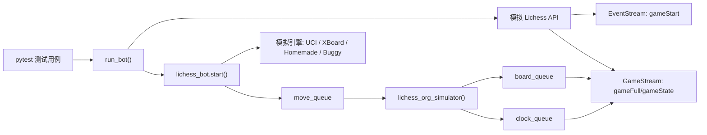
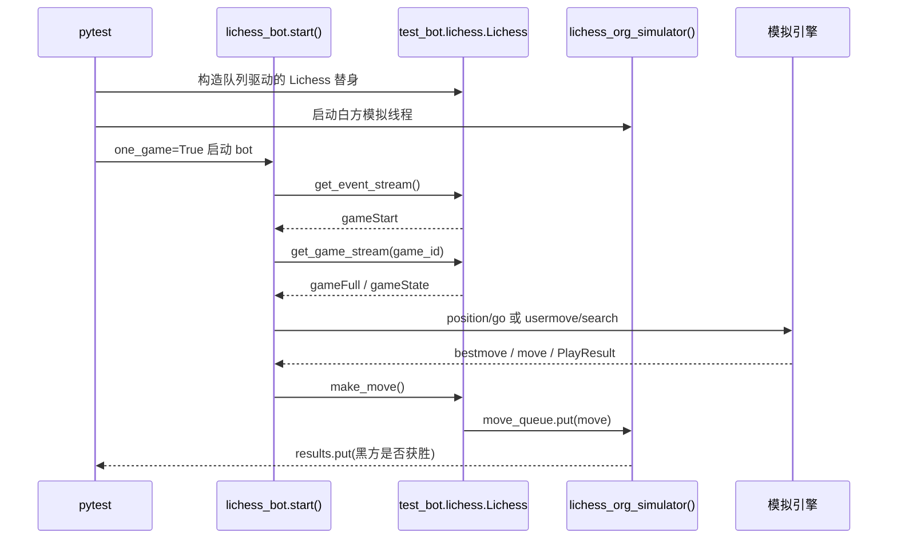
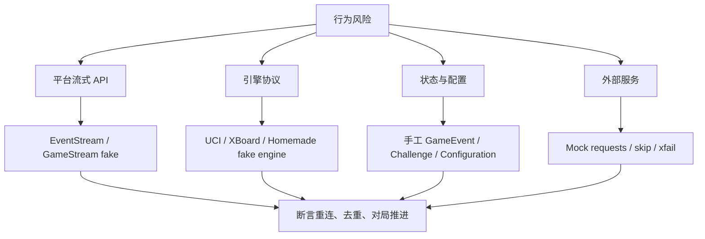

本页位于“运维与质量”章节，聚焦 lichess-bot 的测试体系：它如何用**模拟 Lichess API、模拟棋类引擎、队列驱动的对局流**验证主循环、游戏流、引擎协议、时间管理、配置校验与核心领域模型。这里不讨论生产部署或安全策略；相关后续阅读可转向 [安全实践：Token 保护、权限范围与贡献规范](34-an-quan-shi-jian-token-bao-hu-quan-xian-fan-wei-yu-gong-xian-gui-fan)，若需要理解运行时并发背景，可回看 [主循环、事件流与多进程任务协作](17-zhu-xun-huan-shi-jian-liu-yu-duo-jin-cheng-ren-wu-xie-zuo)。Sources: [test_bot.py](test_bot/test_bot.py#L31-L119), [lichess.py](test_bot/lichess.py#L35-L198)

## 架构假设：测试环境用可控替身替代真实平台与真实引擎

从第一性原理看，lichess-bot 的关键风险来自三个边界：**Lichess 流式 API 是否可靠解析、引擎协议是否正确交互、主循环是否能在事件重复或连接中断时保持一致状态**。测试体系对应地构造了三类替身：`test_bot/lichess.py` 模拟事件流与游戏流，`test_bot/uci_engine.py`、`test_bot/xboard_engine.py` 与 `test_bot/homemade.py` 模拟不同引擎协议，若干测试文件使用 fake/stub 对象直接验证主循环、控制流、游戏流和配置逻辑。Sources: [lichess.py](test_bot/lichess.py#L35-L198), [uci_engine.py](test_bot/uci_engine.py#L11-L43), [xboard_engine.py](test_bot/xboard_engine.py#L11-L37), [homemade.py](test_bot/homemade.py#L12-L25)

这张图的核心模式是**双向队列闭环**：模拟服务器把棋盘和时钟状态写入 `board_queue`、`clock_queue`，模拟 Lichess 游戏流再把它们转换成 JSON 行；机器人下出的走法通过 `make_move()` 写入 `move_queue`，再由 `lichess_org_simulator()` 推进棋局。这个闭环使测试可以在不访问真实 Lichess 对局的情况下验证完整对局路径。Sources: [test_bot.py](test_bot/test_bot.py#L31-L78), [lichess.py](test_bot/lichess.py#L51-L105), [lichess.py](test_bot/lichess.py#L173-L198)

## 测试目录的职责分层

测试目录不是单一类型测试集合，而是按系统边界分层：端到端对局测试集中在 `test_bot.py`，协议替身集中在 `uci_engine.py`、`xboard_engine.py`、`homemade.py`，流恢复测试集中在 `test_control_stream.py` 与 `test_game_stream.py`，领域与配置测试集中在 `test_model.py`、`test_config.py`、`test_timer.py` 等文件。Sources: [test_bot.py](test_bot/test_bot.py#L122-L198), [test_control_stream.py](test_bot/test_control_stream.py#L78-L158), [test_game_stream.py](test_bot/test_game_stream.py#L182-L222), [test_model.py](test_bot/test_model.py#L13-L218), [test_config.py](test_bot/test_config.py#L9-L99)

| 测试层级 | 代表文件 | 被验证边界 | 主要替身或断言方式 |
|---|---|---|---|
| 完整对局闭环 | `test_bot.py` | bot 启动、游戏流、引擎走法、PGN 保存 | 模拟 Lichess、队列、学者杀固定走法 |
| 引擎协议 | `uci_engine.py`、`xboard_engine.py`、`homemade.py` | UCI、XBoard、Homemade 协议适配 | 固定返回 `scholars_mate` 走法 |
| 流恢复 | `test_control_stream.py`、`test_game_stream.py` | 控制流断线、游戏流中途断开、重复事件 | fake response、fake process、monkeypatch |
| 核心模型与配置 | `test_model.py`、`test_config.py`、`test_timer.py` | 挑战过滤、Game/Player 建模、配置默认值、时间换算 | 手工构造 typed dict 与断言 |
| 外部依赖边界 | `test_external_moves.py`、`test_blocklist.py`、`test_lichess.py` | 在线走法、在线 blocklist、真实 Lichess API 可用性 | mock requests、可跳过的真实 token 测试 |

Sources: [test_games.py](test_bot/test_games.py#L1-L4), [test_external_moves.py](test_bot/test_external_moves.py#L23-L80), [test_blocklist.py](test_bot/test_blocklist.py#L10-L228), [test_lichess.py](test_bot/test_lichess.py#L9-L46)

## 模拟 Lichess API：事件流与游戏流的可控复现

`test_bot/lichess.py` 中的 `EventStream` 模拟 bot 控制流入口：第一次 `iter_lines()` 产生一个 `gameStart` 事件，事件里包含固定 game id `zzzzzzzz`、来源 `friend` 以及 bot/board 兼容性字段；如果已经发送过对局，则产生空行并等待。这直接服务于主循环测试，让测试能够观察 bot 是否只启动预期的一局。Sources: [lichess.py](test_bot/lichess.py#L115-L145)

`GameStream` 模拟棋盘流入口：它首先发送 `gameFull` 事件，包含标准变体、bullet 时限、双方 BOT 玩家、初始 FEN 与空走法状态；随后循环从 `board_queue` 与 `clock_queue` 读取棋盘和时钟，把棋盘 move stack 转换为 Lichess `gameState.moves` 字符串，把 `timedelta` 转换为毫秒字段。Sources: [lichess.py](test_bot/lichess.py#L35-L105)

当棋盘结束时，模拟游戏流会把状态标记为 `outoftime` 并设置 `winner` 为 `black`；当棋盘已有走法但未结束时，它发送 `started` 状态。这使测试闭环可以把“棋局是否被 bot 赢下”转化为确定性断言，而不是依赖真实网络、真实对手或随机引擎输出。Sources: [lichess.py](test_bot/lichess.py#L90-L105), [test_bot.py](test_bot/test_bot.py#L74-L78)

`Lichess` 测试替身继承真实 `lib.lichess.Lichess`，但初始化时只保存 `move_queue`、`board_queue` 与 `clock_queue`，并把 `baseUrl` 固定为 `"testing"`；`make_move()` 不发 HTTP 请求，而是把 bot 选择的 `PlayResult.move` 放入 `move_queue`。这是一种边界替换：保留调用形状，替换副作用。Sources: [lichess.py](test_bot/lichess.py#L148-L198)

## 模拟引擎：用固定棋谱覆盖三种协议

所有协议替身共享同一个固定走法列表 `scholars_mate`：`["a2a3", "e7e5", "a3a4", "f8c5", "a4a5", "d8h4", "a5a6", "h4f2"]`。这个序列让测试可以精确预测每一 ply 的响应，并最终验证黑方是否按预期获胜。Sources: [test_games.py](test_bot/test_games.py#L1-L4), [test_bot.py](test_bot/test_bot.py#L51-L78)

UCI 替身首先断言收到 `uci`，随后输出 `id name`、`id author` 与 `uciok`；运行循环处理 `quit`、`isready`、`position startpos moves ...` 与 `go`，并在 `go` 时按当前 move stack 长度返回 `bestmove`。这覆盖了 lichess-bot 与 UCI 引擎之间最小但关键的握手、就绪检查、局面同步和走法生成路径。Sources: [uci_engine.py](test_bot/uci_engine.py#L11-L43)

XBoard 替身首先断言收到 `xboard` 和 `protover 2`，再输出 feature 行声明 `myname`、`ping`、`setboard`、`usermove` 等能力；运行循环处理 `quit`、`ping`、`new` 与 `usermove`，在收到用户走法后返回 `move <uci>` 并同步内部棋盘。Sources: [xboard_engine.py](test_bot/xboard_engine.py#L11-L37)

Homemade 替身通过 `ScholarsMate` 继承 `ExampleEngine`，重写 `search()`，按当前棋盘 move stack 长度从固定棋谱中解析下一步，并返回 `chess.engine.PlayResult`。这验证 homemade 协议不是通过标准输入输出通信，而是通过 Python 类接口进入统一引擎封装。Sources: [homemade.py](test_bot/homemade.py#L1-L25)

| 协议替身 | 初始化信号 | 局面输入 | 走法输出 | 验证重点 |
|---|---|---|---|---|
| UCI | `uci` → `uciok` | `position startpos moves ...` | `bestmove <move>` | 标准 UCI 命令处理 |
| XBoard | `xboard`、`protover 2` | `usermove <move>` | `move <move>` | XBoard feature 与 ping/usermove |
| Homemade | Python 类构造 | `search(board, limit, ...)` 参数 | `PlayResult(move, None)` | 类接口与统一封装适配 |

Sources: [uci_engine.py](test_bot/uci_engine.py#L11-L43), [xboard_engine.py](test_bot/xboard_engine.py#L11-L37), [homemade.py](test_bot/homemade.py#L12-L25)

## 端到端对局测试：从配置到 PGN 落盘

`run_bot()` 是完整闭环的测试入口：它先插入配置默认值并构造 `Configuration`，创建 multiprocessing manager 下的 `board_queue`、`clock_queue`、`move_queue`，再用这些队列构造模拟 Lichess 实例；随后读取用户 profile，确认 title 是 BOT，禁用重启逻辑，启动 `lichess_org_simulator()` 线程，并调用 `lichess_bot.start(..., one_game=True)`。Sources: [test_bot.py](test_bot/test_bot.py#L80-L119)

`lichess_org_simulator()` 扮演固定白方对手：白方回合直接按 `scholars_mate` 走棋并把棋盘、时钟写入队列；黑方回合从 `move_queue` 等待 bot 走法，遇到 `None` 时会把当前棋盘和时钟再次写入队列；棋局结束后把“黑方获胜”布尔值写入 `results`。Sources: [test_bot.py](test_bot/test_bot.py#L31-L78)

端到端测试分别覆盖 UCI、XBoard、Homemade 与一个 buggy engine 配置。每个测试读取 `config.yml.default`，把 token 清空，调整 engine 的目录、名称、协议或解释器，设置临时 PGN 目录，调用 `run_bot()`，断言 bot 获胜，并检查 `bo vs b - zzzzzzzz.pgn` 文件存在。Sources: [test_bot.py](test_bot/test_bot.py#L122-L198)

这个端到端路径的价值在于它同时覆盖**配置装配、事件消费、游戏状态解析、引擎调用、走法提交与 PGN 保存**。它不是单纯单元测试，而是以固定棋谱降低不确定性的集成行为验证。Sources: [test_bot.py](test_bot/test_bot.py#L80-L119), [test_bot.py](test_bot/test_bot.py#L122-L198)

## 主循环与流恢复：验证重复事件、断线与看门狗行为

主循环层测试直接调用 `lichess_bot.start_game()`：当 `gameStart` 的 game id 已在 active/started 集合中时，不应再次调用 `start_game_thread()`；当 game id 是新值时，应启动 worker；当 game id 是已接受挑战预留在 active_games 中但尚未 started 时，第一次 `gameStart` 仍应启动 worker。Sources: [test_main_loop.py](test_bot/test_main_loop.py#L7-L65)

通信队列相关测试使用 `FakeQueue` 验证 correspondence 游戏：如果不是己方回合且已进入延迟队列，重复 `gameStart` 不应启动 worker，也不应重复入队；当低时间对局或定期 check-in 启动 worker 时，pending 状态会被清除。Sources: [test_main_loop.py](test_bot/test_main_loop.py#L67-L141)

控制流恢复测试构造 `_FakeLichess`：第一次 `get_event_stream()` 抛出 `RequestsConnectionError`，第二次返回包含 challenge 事件的 `_FakeResponse`；测试断言 `watch_control_stream()` 会重连而不是立即强制重启，并且事件最终进入队列。Sources: [test_control_stream.py](test_bot/test_control_stream.py#L35-L45), [test_control_stream.py](test_bot/test_control_stream.py#L78-L95)

控制流看门狗测试构造 `_FakeProcess` 与 `ControlStreamState`：当流超时陈旧时，旧进程应被 terminate 和 join，并通过 `spawn_control_stream()` 替换为新进程；当进程仍近期活跃或只是安静一分钟时，不应重启。Sources: [test_control_stream.py](test_bot/test_control_stream.py#L47-L75), [test_control_stream.py](test_bot/test_control_stream.py#L97-L158)

游戏流恢复测试构造 `_FakeLichess`、`_FakeResponse` 与 `_FakeEngine`：第一段响应发送 `gameFull` 和一条 `gameState` 后模拟连接错误或 EOF，第二段响应继续发送后续状态直到 mate；测试通过 monkeypatch 替换引擎创建与 sleep，验证 active game 在中途掉线后会重新打开棋盘流。Sources: [test_game_stream.py](test_bot/test_game_stream.py#L80-L180), [test_game_stream.py](test_bot/test_game_stream.py#L182-L222)

## 引擎时间管理与搜索保护的行为验证

时间管理测试用手工构造的 `GameEventType` 创建 bullet 或 blitz 游戏，并通过 fake engine 记录 `chess.engine.Limit` 调用。`FakeEngine` 会先返回浅 depth 结果，再返回更深结果；测试断言启用 `shallow_search_guard` 后，在安全时钟下会追加一次短搜索，第二次搜索使用 `extra_movetime_ms` 对应的 0.7 秒。Sources: [test_engine_time_management.py](test_bot/test_engine_time_management.py#L27-L78), [test_engine_time_management.py](test_bot/test_engine_time_management.py#L81-L108), [test_engine_time_management.py](test_bot/test_engine_time_management.py#L216-L245)

残局引擎切换测试构造 `EngineWrapper`，把 `main_engine` 和 `endgame_engine` 替换为 `NamedFakeEngine`，再通过棋子数量阈值或无后局面阈值断言 search 由哪个 engine 接管；低于阈值时使用残局引擎，高于阈值时保留主引擎。Sources: [test_engine_time_management.py](test_bot/test_engine_time_management.py#L110-L130), [test_engine_time_management.py](test_bot/test_engine_time_management.py#L132-L213)

bullet/blitz 时间封顶测试直接调用 `apply_bullet_time_management()`：高时钟 blitz 保持原始 clock management；低时钟 blitz 可把己方时钟限制到配置秒数；启用 `force_movetime_caps` 时，可以把限制转换为精确 `Limit.time`，并清空 clock/inc 字段；另有测试验证高时钟强制 movetime、非强制 clock 限制和 hard cap 组合。Sources: [test_engine_time_management.py](test_bot/test_engine_time_management.py#L247-L399)

## 配置、模型、聊天与 blocklist 的核心行为验证

配置测试覆盖两类机制：基础断言与默认值/校验。`config_assert(False, ...)` 应抛出指定错误，`config_warn(False, ...)` 应记录 warning；资源监控的 `idle_sample_period` 默认应继承 `sample_period`，而非正数 idle period 应触发校验异常；polyglot 的 opponent-specific selection 非法值也应被验证拒绝。Sources: [test_config.py](test_bot/test_config.py#L9-L35), [test_config.py](test_bot/test_config.py#L36-L99)

模型测试手工构造 challenge、user profile 与 game event，验证 `Challenge` 的 id、rated、variant、speed、time control、color 解析，以及 `is_supported()` 在默认配置下接受、在最小时限不满足时拒绝；评分过滤测试覆盖 min/max rating、rating_difference、AI opponent 以及 `always_allow_users` 绕过评分过滤。Sources: [test_model.py](test_bot/test_model.py#L13-L69), [test_model.py](test_bot/test_model.py#L70-L170)

`Game` 模型测试验证 game id、casual/rated 模式、bot 是否执白、颜色、完整 URL、短 URL、PGN event、时间控制字符串和 abortable 状态；`Player` 测试则构造玩家 typed dict，验证玩家对象的基础字段解析。Sources: [test_model.py](test_bot/test_model.py#L173-L218)

聊天命令测试构造管理员对局、`FakeEngine` 与 `FakeLichess`，通过 `Conversation.react()` 处理 `!rating 2500` 和 `!rating full`，断言 engine 的强度限制被设置后恢复为 `None`，并且聊天回复记录为 “Playing at UCI_Elo 2500.” 和 “Playing at full strength.”。Sources: [test_conversation.py](test_bot/test_conversation.py#L11-L88)

blocklist 测试使用 `unittest.mock.patch` 替换 `requests.get`，验证 URL blocklist 解析成功、不同换行符、304 not modified、ETag 请求头、空响应、空白行、前后空白裁剪和异常传播；`OnlineBlocklist` 初始化与刷新行为也通过 mock response 序列进行验证。Sources: [test_blocklist.py](test_bot/test_blocklist.py#L10-L228)

## 外部依赖测试：可跳过、可 mock、可隔离

外部走法测试定义了 `MockLichess`，只初始化 `other_session` 和 `max_retries`，并重写 `online_book_get()`：该方法使用 backoff 包装 `requests.Session.get(...).json()`，对远端断开、连接错误、HTTP 错误和读超时执行有限重试；`is_website_up()` 用短超时判断外部服务是否可用。Sources: [test_external_moves.py](test_bot/test_external_moves.py#L23-L63)

外部走法配置构造会启用 Lichess cloud analysis、online EGTB、draw/resign、polyglot，并把标准开局库路径指向 `TEMP/gm2001.bin`；另一个配置启用 chessdb book 并把 online EGTB source 改为 chessdb。测试还定义了 BOT 对 BOT 和 human 对 BOT 的 game fixture，用于验证外部走法来源在不同对手类型下的行为。Sources: [test_external_moves.py](test_bot/test_external_moves.py#L64-L145)

`download_opening_book()` 会在 `TEMP/gm2001.bin` 不存在时创建 `TEMP` 并下载开局库；如果下载失败，测试通过 `pytest.xfail()` 标记不可完成。测试会话结束时，`conftest.py` 在非 GitHub Actions 环境下删除 `TEMP`，避免本地测试残留。Sources: [test_external_moves.py](test_bot/test_external_moves.py#L148-L159), [conftest.py](test_bot/conftest.py#L1-L16)

真实 Lichess 通信测试需要环境变量 `LICHESS_BOT_TEST_TOKEN`；没有 token 时直接 `pytest.skip()`。有 token 时，它会实例化真实 `lib.lichess.Lichess`，验证在线 bot 数量、profile、ongoing games、is_online 和 public data 返回结构。这类测试显式依赖外部平台状态，因此与大部分离线替身测试不同。Sources: [test_lichess.py](test_bot/test_lichess.py#L9-L46)

## 测试设计模式总结

该测试体系的主导模式是**确定性替身 + 行为断言**：完整对局使用固定学者杀棋谱和队列闭环，协议测试使用最小可交互引擎脚本，流恢复测试使用 fake response/process 直接模拟故障，配置与模型测试使用手工 typed dict 精确覆盖边界条件。Sources: [test_games.py](test_bot/test_games.py#L1-L4), [test_bot.py](test_bot/test_bot.py#L31-L119), [test_control_stream.py](test_bot/test_control_stream.py#L78-L158), [test_game_stream.py](test_bot/test_game_stream.py#L182-L222)

| 设计模式 | 代码表现 | 好处 | 注意点 |
|---|---|---|---|
| 固定棋谱 | `scholars_mate` | 结果可预测，可验证整局胜负 | 只覆盖预设走法路径 |
| 队列闭环 | `move_queue`、`board_queue`、`clock_queue` | 模拟流式 API 与 bot 走法提交 | 需要 join/task_done 保持同步 |
| Fake 对象 | `_FakeLichess`、`_FakeEngine`、`_FakeProcess` | 精确注入连接错误、进程状态、走法结果 | fake 必须保持被测接口形状 |
| monkeypatch | 替换 `start_game_thread`、`sleep`、`create_engine` | 避免真实线程/等待/引擎副作用 | 适合单一行为断言 |
| skip/xfail | token 缺失 skip、外部服务失败 xfail | 区分代码失败与环境不可用 | 外部测试不应作为唯一回归保障 |

Sources: [test_bot.py](test_bot/test_bot.py#L104-L119), [test_main_loop.py](test_bot/test_main_loop.py#L7-L65), [test_game_stream.py](test_bot/test_game_stream.py#L194-L197), [test_external_moves.py](test_bot/test_external_moves.py#L148-L169), [test_lichess.py](test_bot/test_lichess.py#L9-L13)

## 阅读与维护建议

如果你要扩展测试，优先判断新增行为属于哪个边界：引擎协议问题应靠近 `uci_engine.py`、`xboard_engine.py` 或 homemade fake；流恢复问题应靠近 `test_control_stream.py` 或 `test_game_stream.py`；挑战、配置、时间控制等纯逻辑应放在模型、配置或时间管理测试中。这样可以保持测试意图清晰，避免把所有行为都塞进完整对局测试。Sources: [uci_engine.py](test_bot/uci_engine.py#L11-L43), [xboard_engine.py](test_bot/xboard_engine.py#L11-L37), [test_control_stream.py](test_bot/test_control_stream.py#L78-L158), [test_engine_time_management.py](test_bot/test_engine_time_management.py#L132-L399)

建议的阅读路径是：先回看 [主循环、事件流与多进程任务协作](17-zhu-xun-huan-shi-jian-liu-yu-duo-jin-cheng-ren-wu-xie-zuo) 理解为什么测试需要队列和进程替身；再阅读 [游戏生命周期：从挑战到对局结束](18-you-xi-sheng-ming-zhou-qi-cong-tiao-zhan-dao-dui-ju-jie-shu) 对照完整对局闭环；若关注引擎测试，则继续阅读 [统一引擎封装：UCI、XBoard 与 Homemade](24-tong-yin-qing-feng-zhuang-uci-xboard-yu-homemade) 与 [时间管理、Ponder、搜索参数与走法生成](25-shi-jian-guan-li-ponder-sou-suo-can-shu-yu-zou-fa-sheng-cheng)。Sources: [test_bot.py](test_bot/test_bot.py#L80-L119), [test_game_stream.py](test_bot/test_game_stream.py#L182-L222), [test_engine_time_management.py](test_bot/test_engine_time_management.py#L216-L399)