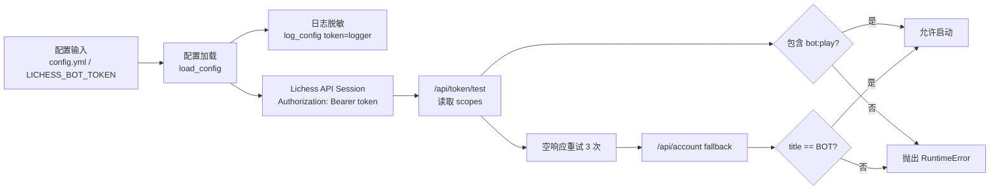
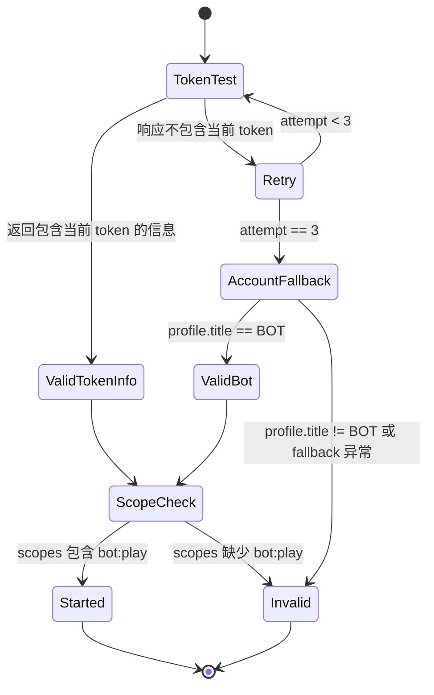

本页定位在目录的最后一个运维与质量主题：[安全实践：Token 保护、权限范围与贡献规范](34-an-quan-shi-jian-token-bao-hu-quan-xian-fan-wei-yu-gong-xian-gui-fan)。它不重复安装、运行、挑战规则或引擎集成细节，而是从 **OAuth Token 生命周期、权限范围校验、日志脱敏、问题上报与贡献流程** 这几个可验证机制出发，说明高级开发者在维护 lichess-bot 时应如何避免凭据泄露并保持贡献链路可审计。Sources: [README.md](README.md#L18-L25), [wiki/How-to-create-a-Lichess-OAuth-token.md](wiki/How-to-create-a-Lichess-OAuth-token.md#L1-L8), [docs/SECURITY.md](docs/SECURITY.md#L1-L10)

## 架构假设与验证结论

本页的初始架构假设是：lichess-bot 的安全边界主要由三层组成——**配置输入层** 保存或注入 Token，**Lichess API 封装层** 使用 Token 并验证 `bot:play` 权限，**贡献协作层** 约束日志、配置与安全问题的公开方式。代码验证后，这个假设成立：`config.yml.default` 定义 `token` 字段，`load_config` 支持 `LICHESS_BOT_TOKEN` 环境变量覆盖配置文件中的 Token，`Lichess.__init__` 将 Token 写入 Bearer Authorization 头并调用 Token 校验逻辑，贡献文档和 issue 模板明确要求遵守贡献规范、提交测试/文档，并在上传配置时删除 Token。Sources: [config.yml.default](config.yml.default#L1-L2), [lib/config.py](lib/config.py#L560-L579), [lib/lichess.py](lib/lichess.py#L141-L168), [.github/ISSUE_TEMPLATE/bug_report.md](.github/ISSUE_TEMPLATE/bug_report.md#L21-L23), [.github/pull_request_template.md](.github/pull_request_template.md#L14-L19)

上图表达的是代码中的实际安全控制流：Token 在配置加载后进入 Lichess 会话，启动阶段会调用 `/api/token/test` 验证 Token 信息，并检查 `scopes` 中是否包含 `bot:play`；当 Token 测试连续返回空结果时，代码会回退到 `/api/account`，只有账户 `title` 为 `BOT` 时才继续启动。Sources: [lib/lichess.py](lib/lichess.py#L156-L193), [test_bot/test_lichess_token_validation.py](test_bot/test_lichess_token_validation.py#L17-L60)

## Token 存储边界：配置文件、环境变量与仓库排除

默认配置文件将 Token 作为顶层 `token` 字段，并在注释中标明它是 Lichess OAuth2 Token；官方 wiki 步骤也说明 Token 可以写入 `config.yml` 的 `token` 字段，或者通过环境变量 `$LICHESS_BOT_TOKEN` 提供。对于生产或共享开发环境，环境变量路径更适合降低误提交风险，因为 `load_config` 会在读取配置文件并完成一次脱敏日志记录后，用 `LICHESS_BOT_TOKEN` 覆盖 `CONFIG["token"]`。Sources: [config.yml.default](config.yml.default#L1-L2), [wiki/How-to-create-a-Lichess-OAuth-token.md](wiki/How-to-create-a-Lichess-OAuth-token.md#L4-L6), [lib/config.py](lib/config.py#L560-L579)

仓库的 `.gitignore` 第一行忽略 `*.yml`，这意味着常见的 `config.yml` 不应被提交；同时它还忽略引擎目录内容、自动日志、资源记录、运行状态、PGN、日志和文本文件。这一排除策略与 bug report 模板中的要求互补：如果用户上传 `config.yml` 或其他配置文件，必须先删除 Token。Sources: [.gitignore](.gitignore#L1-L14), [.github/ISSUE_TEMPLATE/bug_report.md](.github/ISSUE_TEMPLATE/bug_report.md#L21-L23)

| Token 输入方式 | 代码支持点 | 安全含义 | 操作边界 |
|---|---|---|---|
| `config.yml` 顶层 `token` | 默认配置声明 `token` 字段 | 直接、可读，但需要依赖 `.gitignore` 和人工审查防止上传 | 不要提交真实配置；公开 issue 附件前删除 Token |
| `LICHESS_BOT_TOKEN` | `load_config` 检测环境变量并覆盖配置值 | 可避免把真实 Token 写入项目配置文件 | 启动环境必须显式提供该变量 |
| `config.yml.default` 示例值 | 示例为 `"xxxxxxxxxxxxxxxxxxxxxx"` | 仅作为占位符，不包含真实凭据 | 可作为模板复制，不可直接用于运行 |

上述表格只描述仓库中已经实现或文档化的输入路径；它没有引入额外的密钥管理系统，因为当前代码验证范围只显示了配置字段、环境变量覆盖、`.gitignore` 排除和 issue 模板删除 Token 的要求。Sources: [config.yml.default](config.yml.default#L1-L2), [lib/config.py](lib/config.py#L571-L579), [.gitignore](.gitignore#L1-L14), [.github/ISSUE_TEMPLATE/bug_report.md](.github/ISSUE_TEMPLATE/bug_report.md#L21-L23)

## 日志脱敏：配置输出与重试输出的两道保护

配置日志由 `log_config` 统一处理：它复制配置字典，将 `logger_config["token"]` 改写为 `"logger"`，再输出 YAML 格式配置。`load_config` 在环境变量覆盖前后都会调用 `log_config`，因此无论 Token 来自配置文件还是 `LICHESS_BOT_TOKEN`，进入配置日志时都会被替换为固定字符串。Sources: [lib/config.py](lib/config.py#L330-L340), [lib/config.py](lib/config.py#L571-L579)

API 重试日志也有独立脱敏逻辑：`backoff_handler` 在发现调用参数中包含 `"token_test"` 时，会把 `kwargs["data"]` 改为 `"<token redacted>"` 后再记录重试详情。这一点很关键，因为 `/api/token/test` 的 POST 请求会把 Token 作为 `data` 发送，如果没有该分支，调试级重试日志可能暴露提交给 Token 测试接口的原始字符串。Sources: [lib/lichess.py](lib/lichess.py#L116-L124), [lib/lichess.py](lib/lichess.py#L170-L180), [lib/lichess.py](lib/lichess.py#L279-L315)

| 日志位置 | 触发场景 | 脱敏方式 | 可验证实现 |
|---|---|---|---|
| 配置日志 | `load_config` 读取配置后、默认值填充后 | 将 `token` 字段替换为 `"logger"` | `log_config` |
| backoff 重试日志 | `/api/token/test` 请求遇到可重试异常 | 将 `data` 替换为 `"<token redacted>"` | `backoff_handler` |
| issue 附件 | 用户上传日志或配置到 GitHub issue | 模板要求删除 Token | bug report 模板 |

这三处形成了从本地日志到公开协作的最小保护闭环：代码负责常规日志脱敏，模板负责人工上传前的最后检查。Sources: [lib/config.py](lib/config.py#L330-L340), [lib/lichess.py](lib/lichess.py#L116-L124), [.github/ISSUE_TEMPLATE/bug_report.md](.github/ISSUE_TEMPLATE/bug_report.md#L21-L23)

## 权限范围：只强制检查 `bot:play`

Lichess API 封装层在构造 `Lichess` 对象时，把 Token 放入 `Authorization: Bearer <token>` 请求头，然后调用 `get_token_info(token)`。如果无法取得 Token 信息，会抛出运行时错误并提示检查配置文件中的 Token；如果 Token 信息存在但 `scopes.split(",")` 中不包含 `bot:play`，也会抛出运行时错误，并明确要求使用带有 `"Play games with the bot API (bot:play)"` 范围的访问 Token。Sources: [lib/lichess.py](lib/lichess.py#L141-L168)

需要注意的是，当前实现只验证 **是否包含** `bot:play`，并不会拒绝额外 scope；因此最小权限实践应在创建 Token 时只选择 wiki 中明确要求的 `bot:play` scope，而不是依赖运行时代码剔除多余权限。wiki 的 Token 创建步骤也只指向带 `scopes[]=bot:play` 的创建链接，并说明 Token 显示后不会再次出现在 Lichess 页面上。Sources: [lib/lichess.py](lib/lichess.py#L164-L168), [wiki/How-to-create-a-Lichess-OAuth-token.md](wiki/How-to-create-a-Lichess-OAuth-token.md#L4-L6)

| 校验对象 | 当前行为 | 失败结果 | 对开发者的安全结论 |
|---|---|---|---|
| Token 信息可获取性 | `/api/token/test` 返回 Token 信息，或 fallback 验证 BOT 账号 | 抛出 Token 信息获取错误 | 启动失败优于带未知凭据继续运行 |
| `bot:play` scope | `scopes` 逗号分割后包含 `bot:play` | 抛出 scope 错误 | Token 必须具备 Bot API 对局权限 |
| 额外 scope | 未在代码中拒绝 | 不触发失败 | 创建 Token 时主动保持最小权限 |

该表的关键结论是：**权限收敛发生在 Token 创建阶段，权限可用性检查发生在启动阶段**。运行时代码保证机器人不会在缺少 `bot:play` 时启动，但最小权限仍需要开发者在 Lichess Token 创建页面上完成。Sources: [lib/lichess.py](lib/lichess.py#L156-L168), [wiki/How-to-create-a-Lichess-OAuth-token.md](wiki/How-to-create-a-Lichess-OAuth-token.md#L4-L6)

## Token 校验容错：重试、BOT 账号 fallback 与测试覆盖

`get_token_info` 对 `/api/token/test` 执行最多三次尝试：每次 POST Token 后，从返回字典中查找当前 Token 对应的信息；如果没有找到，就记录 warning 并等待一秒后重试。三次之后，代码会调用 `/api/account` 作为 fallback；只有 profile 的 `title` 等于 `"BOT"` 时，才构造 `{"scopes": "bot:play", "userId": profile.get("id", "")}` 并允许继续。Sources: [lib/lichess.py](lib/lichess.py#L170-L193)

测试文件覆盖了四个关键路径：正常 Token 测试响应直接返回且不会调用 profile fallback；空 Token 测试响应可以被 BOT 账号 profile 救回；非 BOT profile 不会通过 fallback；Lichess 会话初始化时 `session.trust_env` 与 `other_session.trust_env` 都被设置为 `False`，避免继承系统代理环境。Sources: [test_bot/test_lichess_token_validation.py](test_bot/test_lichess_token_validation.py#L6-L60), [lib/lichess.py](lib/lichess.py#L146-L150)

这个状态图说明项目把「Token 测试接口偶发空响应」和「无效或权限不足 Token」区分处理：前者通过有限重试和 BOT 账号 fallback 提高启动鲁棒性，后者仍然通过 `RuntimeError` 阻断启动。Sources: [lib/lichess.py](lib/lichess.py#L156-L193), [test_bot/test_lichess_token_validation.py](test_bot/test_lichess_token_validation.py#L17-L60)

## API 会话边界：Bearer 头与系统代理继承

`Lichess.__init__` 创建两个 `requests.Session`：`session` 和 `other_session`，并将 `trust_env` 都设置为 `False`；随后只把包含 Bearer Token 的 header 更新到 `self.session.headers`。测试明确断言两个 session 的 `trust_env` 均为 `False`，说明当前实现刻意避免从系统环境继承代理配置。Sources: [lib/lichess.py](lib/lichess.py#L141-L151), [test_bot/test_lichess_token_validation.py](test_bot/test_lichess_token_validation.py#L6-L15)

从安全实践角度看，这个边界的可验证含义是：带 Token 的主 API session 不依赖系统代理环境，降低了因外部代理变量影响请求路径的可能性；但 Token 仍然会作为 Bearer header 存在于会话内，因此调试、异常输出和贡献附件仍必须遵守前述脱敏规则。Sources: [lib/lichess.py](lib/lichess.py#L141-L151), [lib/config.py](lib/config.py#L330-L340), [.github/ISSUE_TEMPLATE/bug_report.md](.github/ISSUE_TEMPLATE/bug_report.md#L21-L23)

## 安全问题披露：不要用公开 issue 曝光漏洞细节

项目的安全文档要求通过 GitHub Security Advisory 的 “Report a Vulnerability” 入口报告安全问题；维护团队会回复后续处理步骤，并在修复和公告推进过程中保持沟通，必要时请求更多信息或指导。第三方模块中的安全问题应报告给对应模块的维护者。Sources: [docs/SECURITY.md](docs/SECURITY.md#L1-L10)

这意味着 Token 泄露、认证绕过、日志泄密、权限校验缺陷等安全类问题应进入私有披露流程，而不是普通 issue；普通 bug issue 模板适用于可公开复现的问题，并且它在日志上传段落中特别要求如果上传 `config.yml` 或其他配置文件，必须删除 Token。Sources: [docs/SECURITY.md](docs/SECURITY.md#L5-L10), [.github/ISSUE_TEMPLATE/bug_report.md](.github/ISSUE_TEMPLATE/bug_report.md#L21-L23)

## 贡献规范：PR、测试、文档与行为准则

贡献文档接受 bug report、feature request、代码变更和文档改进；标准流程是 fork 仓库、创建分支、修改并提交、推送分支、向主仓库提交 pull request，并要求提交 PR 时遵循 `.github/pull_request_template.md`。PR 模板的 checklist 要求贡献者已阅读并遵循贡献指南、已添加必要文档、现有测试通过。Sources: [docs/CONTRIBUTING.md](docs/CONTRIBUTING.md#L19-L30), [docs/CONTRIBUTING.md](docs/CONTRIBUTING.md#L42-L57), [.github/pull_request_template.md](.github/pull_request_template.md#L14-L19)

行为准则要求社区成员提供无骚扰、开放、包容和健康的参与环境；不可接受行为包括发布他人私人信息，例如物理地址或电子邮件地址，且社区负责人有权移除、编辑或拒绝不符合行为准则的评论、提交、代码、wiki 编辑、issue 和其他贡献。Sources: [docs/CODE_OF_CONDUCT.md](docs/CODE_OF_CONDUCT.md#L3-L13), [docs/CODE_OF_CONDUCT.md](docs/CODE_OF_CONDUCT.md#L28-L49)

对于安全相关贡献，实际审查重点应落在三类证据上：是否避免在测试、日志或 issue 中暴露真实 Token；是否补充或更新覆盖 Token 校验、脱敏或配置路径的测试；是否在 PR 描述中清楚说明变更类型、关联 issue、文档和测试状态。Sources: [.github/ISSUE_TEMPLATE/bug_report.md](.github/ISSUE_TEMPLATE/bug_report.md#L21-L23), [.github/pull_request_template.md](.github/pull_request_template.md#L1-L19), [test_bot/test_lichess_token_validation.py](test_bot/test_lichess_token_validation.py#L1-L60)

## 高级开发者安全检查清单

在修改 Token、配置加载或 API 会话相关代码前，先确认变更不会破坏当前的三项基础保护：`log_config` 必须继续替换 `token` 字段，`backoff_handler` 必须继续对 `token_test` 的 `data` 脱敏，`Lichess.__init__` 必须继续拒绝缺少 `bot:play` 的 Token。Sources: [lib/config.py](lib/config.py#L330-L340), [lib/lichess.py](lib/lichess.py#L116-L124), [lib/lichess.py](lib/lichess.py#L156-L168)

在提交 bug report 或 PR 前，确认附件和日志中没有真实 Token；如果必须上传配置或 `config.log`，按照 issue 模板删除 Token；如果变更涉及安全漏洞，不走公开 issue，而是使用 GitHub Security Advisory 报告入口。Sources: [.github/ISSUE_TEMPLATE/bug_report.md](.github/ISSUE_TEMPLATE/bug_report.md#L21-L23), [docs/SECURITY.md](docs/SECURITY.md#L5-L10)

在扩展测试时，优先复用现有 Token 校验测试模式：通过 monkeypatch 构造 `api_post` 和 `api_get_json`，验证正常 Token 信息、BOT fallback、非 BOT 拒绝和 session 代理继承关闭这些安全边界。Sources: [test_bot/test_lichess_token_validation.py](test_bot/test_lichess_token_validation.py#L6-L60)

## 后续阅读路径

如果你需要重新创建或收敛 Token 权限，下一步阅读 [创建 Lichess BOT 账号与 OAuth Token](3-chuang-jian-lichess-bot-zhang-hao-yu-oauth-token)；如果你要理解配置字段如何被加载、补默认值与校验，阅读 [配置加载、默认值填充与校验机制](22-pei-zhi-jia-zai-mo-ren-zhi-tian-chong-yu-xiao-yan-ji-zhi)；如果你要为安全相关变更补测试，阅读 [测试体系：模拟引擎、模拟 API 与核心行为验证](33-ce-shi-ti-xi-mo-ni-yin-qing-mo-ni-api-yu-he-xin-xing-wei-yan-zheng)；如果安全变更涉及生产运行环境，再阅读 [生产部署：多机器人、后台运行与日志管理](31-sheng-chan-bu-shu-duo-ji-qi-ren-hou-tai-yun-xing-yu-ri-zhi-guan-li)。Sources: [wiki/How-to-create-a-Lichess-OAuth-token.md](wiki/How-to-create-a-Lichess-OAuth-token.md#L1-L11), [lib/config.py](lib/config.py#L560-L582), [test_bot/test_lichess_token_validation.py](test_bot/test_lichess_token_validation.py#L1-L60), [README.md](README.md#L44-L52)