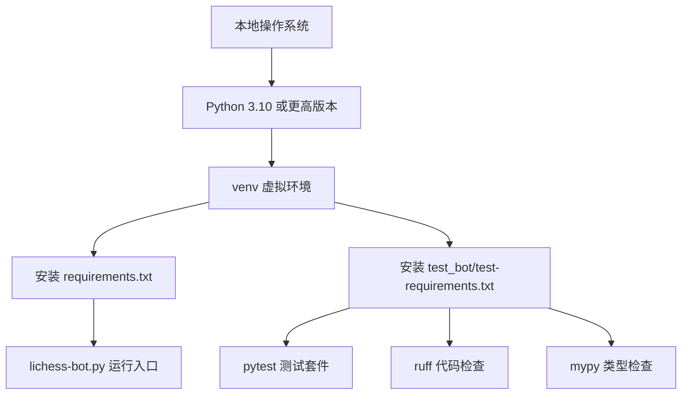
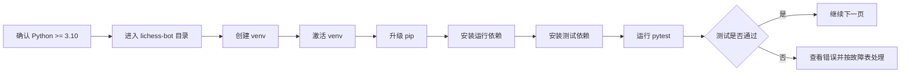

本页位于“快速开始 → 首次部署”路径中，目标是让初学者在本地建立可隔离、可复现的 Python 运行环境，并在继续配置引擎和启动机器人之前，先用测试命令确认依赖、代码和测试工具链可以正常工作；本页只覆盖 Python 环境、依赖安装和测试执行，不讲 OAuth Token、引擎配置或正式启动流程。Sources: [README.md](README.md#L39-L50), [wiki/How-to-Install.md](wiki/How-to-Install.md#L1-L16)

## 架构假设与验证结果

**架构假设**：lichess-bot 的本地开发环境由三层组成：Python 解释器提供运行时，虚拟环境隔离依赖，测试工具链验证代码质量与行为；这一假设由仓库中的安装文档、运行入口、运行依赖、测试依赖和 GitHub Actions 流水线共同验证。Sources: [wiki/How-to-Install.md](wiki/How-to-Install.md#L1-L13), [lichess-bot.py](lichess-bot.py#L1-L6), [requirements.txt](requirements.txt#L1-L6), [test_bot/test-requirements.txt](test_bot/test-requirements.txt#L1-L7)

下面的图展示本页关注的范围：你先安装 Python，再创建虚拟环境，然后安装运行依赖与测试依赖，最后执行 pytest；ruff 和 mypy 是仓库 CI 中使用的质量检查工具，可在测试通过后作为进阶验证。Sources: [.github/workflows/python-test.yml](.github/workflows/python-test.yml#L23-L43), [.github/workflows/python-build.yml](.github/workflows/python-build.yml#L22-L34), [.github/workflows/mypy.yml](.github/workflows/mypy.yml#L21-L32)



## 你需要准备什么

lichess-bot 明确支持 Python 3.10 及更高版本，并可运行在 Windows、Linux、MacOS 和 Docker 上；如果你是首次部署并准备在本机运行测试，优先选择本页的 Python 虚拟环境流程，而不是直接进入 Docker 或生产部署。Sources: [README.md](README.md#L39-L42), [wiki/How-to-Install.md](wiki/How-to-Install.md#L1-L2)

运行依赖保存在 `requirements.txt` 中，包含 `chess`、`PyYAML`、`requests`、`backoff` 和 `rich`；测试与质量检查依赖保存在 `test_bot/test-requirements.txt` 中，包含 `pytest`、`pytest-timeout`、`ruff`、`mypy` 以及类型存根包。Sources: [requirements.txt](requirements.txt#L1-L6), [test_bot/test-requirements.txt](test_bot/test-requirements.txt#L1-L7)

| 文件 | 用途 | 初学者需要知道的结论 |
|---|---|---|
| `requirements.txt` | 安装机器人运行所需依赖 | 不安装它，主程序和库模块可能无法导入 |
| `test_bot/test-requirements.txt` | 安装测试、代码检查和类型检查工具 | 不安装它，`pytest`、`ruff` 或 `mypy` 可能不可用 |
| `test_bot/ruff.toml` | 定义 ruff 检查规则 | CI 使用它检查语法和代码风格 |
| `.github/workflows/python-test.yml` | 定义自动测试流程 | 本地测试命令可参考其中的 `pytest --log-cli-level=10` |

Sources: [requirements.txt](requirements.txt#L1-L6), [test_bot/test-requirements.txt](test_bot/test-requirements.txt#L1-L7), [test_bot/ruff.toml](test_bot/ruff.toml#L1-L47), [.github/workflows/python-test.yml](.github/workflows/python-test.yml#L27-L43)

## 项目结构速览

本页会直接接触的文件很少：`requirements.txt` 和 `test_bot/test-requirements.txt` 用于安装依赖，`test_bot/` 保存测试代码和模拟组件，`lichess-bot.py` 是主程序入口，但本页不会启动机器人，只会验证环境和测试套件。Sources: [requirements.txt](requirements.txt#L1-L6), [test_bot/test-requirements.txt](test_bot/test-requirements.txt#L1-L7), [lichess-bot.py](lichess-bot.py#L1-L6)

```text
lichess-bot/
├── lichess-bot.py                 # 主程序入口，本页不启动它
├── requirements.txt               # 运行依赖
├── test_bot/
│   ├── test-requirements.txt      # 测试与质量工具依赖
│   ├── ruff.toml                  # ruff 配置
│   ├── conftest.py                # pytest 会话清理逻辑
│   └── test_*.py                  # 测试用例
└── wiki/
    └── How-to-Install.md          # 上游安装说明
```

## 安装流程总览

按照下面流程执行：确认 Python 版本，进入仓库目录，创建并激活虚拟环境，安装运行依赖和测试依赖，最后运行测试；官方安装文档展示了 Linux、Mac/BSD 和 Windows 的虚拟环境创建方式，CI 流程展示了测试依赖安装和 pytest 执行方式。Sources: [wiki/How-to-Install.md](wiki/How-to-Install.md#L1-L54), [.github/workflows/python-test.yml](.github/workflows/python-test.yml#L27-L43)



## 第 1 步：确认 Python 版本

在终端中运行 `python3 --version` 或 `python --version`，确认版本不低于 3.10；仓库安装说明明确写明只支持 Python 3.10 或更高版本，CI 也在 Python 3.10 到 3.14 的版本矩阵上运行构建或测试。Sources: [wiki/How-to-Install.md](wiki/How-to-Install.md#L1-L2), [.github/workflows/python-build.yml](.github/workflows/python-build.yml#L16-L18), [.github/workflows/python-test.yml](.github/workflows/python-test.yml#L16-L18)

```bash
python3 --version
# 或
python --version
```

如果你的系统没有合适版本的 Python，Linux 用户需要安装 `python3`、`python3-pip`、`python3-virtualenv` 和 `python3-venv`，非 Ubuntu 发行版需要把 `apt` 替换成对应的软件包管理器；Windows 用户安装 Python 时应勾选 “add Python to PATH”。Sources: [wiki/How-to-Install.md](wiki/How-to-Install.md#L5-L6), [wiki/How-to-Install.md](wiki/How-to-Install.md#L34-L39)

## 第 2 步：进入仓库目录

下载仓库后，进入 `lichess-bot` 目录再执行后续命令；安装说明要求先进入项目目录，因为依赖文件 `requirements.txt` 和测试目录 `test_bot/` 都以仓库根目录为相对路径。Sources: [wiki/How-to-Install.md](wiki/How-to-Install.md#L3-L4), [requirements.txt](requirements.txt#L1-L6), [test_bot/test-requirements.txt](test_bot/test-requirements.txt#L1-L7)

```bash
cd lichess-bot
```

## 第 3 步：创建并激活虚拟环境

在 Linux 或 Mac/BSD 上，使用 `python3 -m venv venv` 创建虚拟环境，再用 `source ./venv/bin/activate` 或 `. venv/bin/activate` 激活；安装文档还给出了 `virtualenv venv -p python3` 作为创建虚拟环境的命令。Sources: [wiki/How-to-Install.md](wiki/How-to-Install.md#L7-L13), [wiki/How-to-Install.md](wiki/How-to-Install.md#L24-L29)

```bash
python3 -m venv venv
source ./venv/bin/activate
```

在 Windows 上，安装文档使用 `py -m venv venv` 创建虚拟环境，并通过 `venv\Scripts\activate` 激活；如果 PowerShell 无法执行激活脚本，安装文档提示需要先调整执行策略。Sources: [wiki/How-to-Install.md](wiki/How-to-Install.md#L40-L51)

```powershell
py -m venv venv
venv\Scripts\activate
```

| 操作系统 | 创建虚拟环境 | 激活虚拟环境 |
|---|---|---|
| Linux | `python3 -m venv venv` | `source ./venv/bin/activate` |
| Mac/BSD | `python3 -m venv venv` | `. venv/bin/activate` |
| Windows | `py -m venv venv` | `venv\Scripts\activate` |

Sources: [wiki/How-to-Install.md](wiki/How-to-Install.md#L7-L13), [wiki/How-to-Install.md](wiki/How-to-Install.md#L24-L29), [wiki/How-to-Install.md](wiki/How-to-Install.md#L45-L50)

## 第 4 步：安装运行依赖和测试依赖

先升级 pip，再安装 `requirements.txt` 和 `test_bot/test-requirements.txt`；这是 GitHub Actions 在测试流程中采用的顺序，因此适合作为本地环境的基准安装方式。Sources: [.github/workflows/python-test.yml](.github/workflows/python-test.yml#L27-L31)

```bash
python -m pip install --upgrade pip
python -m pip install -r requirements.txt
python -m pip install -r test_bot/test-requirements.txt
```

安装完成后，你的环境应同时具备运行依赖和测试工具：运行依赖来自 `requirements.txt`，测试工具来自 `test_bot/test-requirements.txt`，其中 `pytest` 是测试入口，`ruff` 和 `mypy` 分别对应代码检查与类型检查。Sources: [requirements.txt](requirements.txt#L1-L6), [test_bot/test-requirements.txt](test_bot/test-requirements.txt#L1-L7), [.github/workflows/python-build.yml](.github/workflows/python-build.yml#L31-L34), [.github/workflows/mypy.yml](.github/workflows/mypy.yml#L30-L32)

## 第 5 步：运行测试

运行 `pytest --log-cli-level=10` 执行测试；该命令与仓库 Python Test 工作流中的测试命令一致，并会在终端显示更详细的日志，适合初学者观察失败原因。Sources: [.github/workflows/python-test.yml](.github/workflows/python-test.yml#L39-L43)

```bash
pytest --log-cli-level=10
```

测试目录本身包含一个 `__init__.py`，文件注释说明如果没有它，pytest 不会搜索 `test_bot/`；测试结束时，`conftest.py` 会删除测试产生的 `TEMP` 目录，但在 GitHub Actions 环境中会保留该目录用于缓存引擎。Sources: [test_bot/__init__.py](test_bot/__init__.py#L1-L2), [test_bot/conftest.py](test_bot/conftest.py#L1-L16)

## 可选：运行与 CI 一致的代码检查

如果测试已经通过，可以继续运行 ruff；CI 中的 Python Build 工作流使用 `ruff check --config test_bot/ruff.toml` 检查语法错误和代码风格，`test_bot/ruff.toml` 设置了 Python 目标版本为 `py310`，行宽为 127，并启用了 `ALL` 规则集后忽略部分规则。Sources: [.github/workflows/python-build.yml](.github/workflows/python-build.yml#L31-L34), [test_bot/ruff.toml](test_bot/ruff.toml#L1-L47)

```bash
ruff check --config test_bot/ruff.toml
```

你也可以运行 mypy；CI 的 Mypy 工作流在安装运行依赖和测试依赖后执行 `mypy --strict .`，因此本地执行同一命令可以提前发现严格类型检查问题。Sources: [.github/workflows/mypy.yml](.github/workflows/mypy.yml#L25-L32)

```bash
mypy --strict .
```

## 命令前后对照

下面的对照表把“只安装运行依赖”和“同时安装测试依赖”的差异放在一起；如果你的目标是运行测试，必须包含 `test_bot/test-requirements.txt`，因为其中定义了 `pytest`、`pytest-timeout`、`ruff` 和 `mypy`。Sources: [requirements.txt](requirements.txt#L1-L6), [test_bot/test-requirements.txt](test_bot/test-requirements.txt#L1-L7)

| 场景 | 命令 | 结果 |
|---|---|---|
| 只准备运行程序 | `python -m pip install -r requirements.txt` | 安装运行库，但不保证有 pytest |
| 准备运行测试 | `python -m pip install -r requirements.txt`<br>`python -m pip install -r test_bot/test-requirements.txt` | 同时安装运行库和测试工具 |
| 模拟 CI 测试 | `pytest --log-cli-level=10` | 执行仓库测试流程中的 pytest 命令 |
| 模拟 CI 代码检查 | `ruff check --config test_bot/ruff.toml` | 执行仓库构建流程中的 ruff 命令 |
| 模拟 CI 类型检查 | `mypy --strict .` | 执行仓库类型检查流程中的 mypy 命令 |

Sources: [.github/workflows/python-test.yml](.github/workflows/python-test.yml#L27-L43), [.github/workflows/python-build.yml](.github/workflows/python-build.yml#L27-L34), [.github/workflows/mypy.yml](.github/workflows/mypy.yml#L25-L32)

## 常见问题排查

如果 `python3 -m venv venv` 失败，安装文档提示可能是 Python3 没有加入 PATH；在 Linux 上还需要确认已安装 `python3-venv`，在 Windows 上安装 Python 时应启用 “add Python to PATH”。Sources: [wiki/How-to-Install.md](wiki/How-to-Install.md#L5-L10), [wiki/How-to-Install.md](wiki/How-to-Install.md#L34-L39)

| 现象 | 可能原因 | 处理方式 |
|---|---|---|
| `python3: command not found` | 系统找不到 Python | 安装 Python 3.10 或更高版本，并确认 PATH |
| `No module named venv` | 缺少 venv 组件 | Linux 上安装 `python3-venv` |
| `pytest: command not found` | 没有安装测试依赖或虚拟环境未激活 | 激活 venv 后安装 `test_bot/test-requirements.txt` |
| PowerShell 无法激活 venv | 执行策略阻止脚本运行 | 按安装文档提示调整 PowerShell 执行策略 |
| 测试中需要 Lichess Token 的用例被跳过 | 环境变量不存在 | 这是测试代码中的显式跳过逻辑，不影响本地基础验证 |

Sources: [wiki/How-to-Install.md](wiki/How-to-Install.md#L5-L13), [wiki/How-to-Install.md](wiki/How-to-Install.md#L40-L51), [test_bot/test-requirements.txt](test_bot/test-requirements.txt#L1-L7), [test_bot/test_lichess.py](test_bot/test_lichess.py#L9-L14)

## 完成标准

当你可以在虚拟环境中成功安装 `requirements.txt` 与 `test_bot/test-requirements.txt`，并能执行 `pytest --log-cli-level=10` 时，本页目标就完成了；如果你还成功执行了 `ruff check --config test_bot/ruff.toml` 和 `mypy --strict .`，你的本地验证流程就与仓库 CI 的主要 Python 检查更加接近。Sources: [.github/workflows/python-test.yml](.github/workflows/python-test.yml#L27-L43), [.github/workflows/python-build.yml](.github/workflows/python-build.yml#L31-L34), [.github/workflows/mypy.yml](.github/workflows/mypy.yml#L30-L32)

## 下一步阅读

完成 Python 环境和测试验证后，按目录顺序继续阅读 [配置并验证国际象棋引擎](5-pei-zhi-bing-yan-zheng-guo-ji-xiang-qi-yin-qing)；如果你还没有创建 Lichess BOT 账号和 OAuth Token，请先回到上一页 [创建 Lichess BOT 账号与 OAuth Token](3-chuang-jian-lichess-bot-zhang-hao-yu-oauth-token)，之后再继续 [启动机器人并观察运行日志](6-qi-dong-ji-qi-ren-bing-guan-cha-yun-xing-ri-zhi)。Sources: [README.md](README.md#L44-L50), [wiki/How-to-Install.md](wiki/How-to-Install.md#L14-L16)