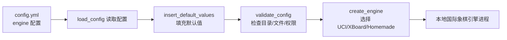
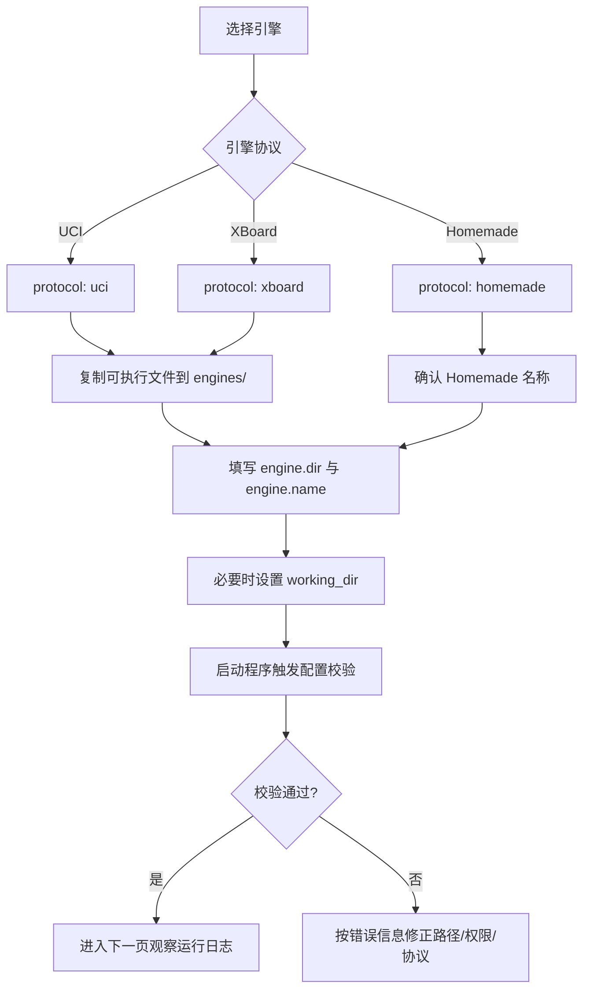

本页位于“首次部署”路径中的 **[配置并验证国际象棋引擎](5-pei-zhi-bing-yan-zheng-guo-ji-xiang-qi-yin-qing)**，目标是在已经安装 Python 环境之后，把一个本地国际象棋引擎接入 lichess-bot，并理解程序会怎样检查 `config.yml` 中的引擎目录、可执行文件、工作目录、协议类型和启动参数；本文不展开挑战规则、开局库、残局库或正式启动后的日志观察，这些内容会在后续页面继续处理。Sources: [Setup-the-engine.md](wiki/Setup-the-engine.md#L2-L10), [config.yml.default](config.yml.default#L4-L15)

## 架构假设与验证结论

从第一性原理看，lichess-bot 不是棋力引擎本身，而是 **Lichess Bot API 与本地棋类引擎之间的桥接层**；README 明确说明项目连接 Lichess Bot API 和 chess engines，并支持 UCI、XBoard、Homemade 三类引擎，因此本页的核心任务就是让配置文件能够准确描述“如何启动你的引擎”。Sources: [README.md](README.md#L18-L30)



上图对应的代码路径是：`load_config()` 读取 YAML，随后填充默认值、处理列表、记录配置并调用 `validate_config()`；验证通过后，`create_engine()` 根据 `engine.protocol` 选择 `UCIEngine`、`XBoardEngine` 或 Homemade 引擎，并用 `engine_commands()` 拼出启动命令。Sources: [config.py](lib/config.py#L557-L581), [engine_wrapper.py](lib/engine_wrapper.py#L35-L65)

## 引擎配置在项目中的位置

默认配置把引擎放在 `./engines/` 目录，并要求你填写 `engine.name`；官方 wiki 也说明可以把引擎二进制文件和它需要的附属文件复制到 lichess-bot 项目内的 `engines` 文件夹中，这是一个方便但不是强制的放置位置。Sources: [config.yml.default](config.yml.default#L4-L13), [Setup-the-engine.md](wiki/Setup-the-engine.md#L3-L10)

```text
lichess-bot/
├── config.yml              # 你实际编辑的配置文件
├── config.yml.default      # 默认模板，可作为参考
├── engines/                # 推荐放置本地引擎与权重/依赖文件
│   └── stockfish           # 示例：Linux/macOS 可执行文件名
│   └── stockfish.exe       # 示例：Windows 可执行文件名
├── lichess-bot.py          # 程序入口
└── lib/
    ├── config.py           # 读取、补默认值、验证配置
    └── engine_wrapper.py   # 创建并启动引擎进程
```

程序入口 `lichess-bot.py` 只调用 `start_program()`，真正与本页相关的配置读取和校验发生在 `lib/config.py`，真正与引擎进程启动相关的命令构造和协议选择发生在 `lib/engine_wrapper.py`。Sources: [lichess-bot.py](lichess-bot.py#L1-L6), [config.py](lib/config.py#L557-L581), [engine_wrapper.py](lib/engine_wrapper.py#L68-L79)

## 最小可用配置

对初学者来说，先完成最小引擎配置即可：`engine.dir` 指向包含引擎可执行文件的目录，`engine.name` 是可执行文件名，`engine.protocol` 通常是 `"uci"`，`engine.working_dir` 可以先留空；默认模板已经展示了这些字段，并说明 `dir` 可以是绝对路径，也可以是相对于 lichess-bot 项目的路径。Sources: [config.yml.default](config.yml.default#L4-L15)

| 字段 | 初学者建议 | 作用 | 常见错误 |
|---|---:|---|---|
| `engine.dir` | `./engines/` | 引擎可执行文件所在目录 | 写成文件路径而不是目录 |
| `engine.name` | `stockfish` 或 `stockfish.exe` | 引擎可执行文件名 | 忘记 Windows 的 `.exe` |
| `engine.protocol` | `uci` | 引擎通信协议 | 把 UCI 引擎误写成 `xboard` |
| `engine.working_dir` | 先留空 | 引擎读写文件时使用的工作目录 | 相对路径理解错误 |
| `engine.debug` | `False` | 是否记录引擎启动通信 | 排错时忘记临时打开 |

下面是一个从模板状态到可用状态的对比；请把 `engine_name` 替换为你实际下载的引擎文件名，不要只复制示例名称。Sources: [config.yml.default](config.yml.default#L4-L15), [Setup-the-engine.md](wiki/Setup-the-engine.md#L3-L8)

| 修改前 | 修改后：Linux/macOS 示例 |
|---|---|
| `dir: "./engines/"`<br/>`name: "engine_name"`<br/>`protocol: "uci"` | `dir: "./engines/"`<br/>`name: "stockfish"`<br/>`protocol: "uci"` |

| 修改前 | 修改后：Windows 示例 |
|---|---|
| `dir: "./engines/"`<br/>`name: "engine_name"`<br/>`protocol: "uci"` | `dir: "./engines/"`<br/>`name: "stockfish.exe"`<br/>`protocol: "uci"` |

## 配置步骤流程

本页推荐的操作顺序是：先确定引擎协议，再把可执行文件放到稳定目录，然后只改最少字段，最后让 lichess-bot 的配置校验告诉你路径、文件和权限是否正确。Sources: [config.py](lib/config.py#L343-L363), [engine_wrapper.py](lib/engine_wrapper.py#L35-L65)



`validate_config()` 会检查顶层 `token`、`url`、`engine`、`challenge` 是否存在并且类型正确，也会检查 `engine.dir` 和 `engine.name` 是字符串；因此，即使本页聚焦引擎，配置文件仍然必须保留这些必需结构，不能只留下 `engine` 段。Sources: [config.py](lib/config.py#L343-L351)

## 理解 `dir`、`name` 与 `working_dir`

`engine.dir` 和 `engine.name` 合在一起形成实际的引擎路径；代码使用 `os.path.join(CONFIG["engine"]["dir"], CONFIG["engine"]["name"])` 拼出路径，然后检查该文件是否存在、是否具有可执行权限，除非协议是 `homemade`。Sources: [config.py](lib/config.py#L352-L363)

`engine.working_dir` 不是“引擎文件所在目录”，而是引擎进程启动后的工作目录；默认模板说明，如果设置了它，引擎会相对于这个目录查找文件和目录，例如 Syzygy 路径，而绝对路径不受影响。Sources: [config.yml.default](config.yml.default#L11-L12), [Setup-the-engine.md](wiki/Setup-the-engine.md#L6-L8)

`insert_default_values()` 会在 `engine.working_dir` 为空或缺失时把它设置为当前工作目录，所以初学者可以先留空；只有当你的引擎需要在特定目录读取权重、网络文件或其他资源时，再显式填写该字段。Sources: [config.py](lib/config.py#L181-L185), [config.yml.default](config.yml.default#L11-L12)

## 选择协议：UCI、XBoard 或 Homemade

lichess-bot 支持 UCI、XBoard 和 Homemade 三类引擎；`create_engine()` 会根据 `engine.protocol` 的值选择对应封装，如果不是这三者之一，就抛出 “Expected xboard, uci, or homemade” 的错误。Sources: [README.md](README.md#L27-L30), [engine_wrapper.py](lib/engine_wrapper.py#L47-L59)

| 协议 | 适合对象 | 配置值 | 验证重点 |
|---|---|---|---|
| UCI | Stockfish、Lc0 等常见现代引擎 | `protocol: "uci"` | 文件存在、可执行、UCI 选项有效 |
| XBoard | 支持 CECP/XBoard 的旧式或特定引擎 | `protocol: "xboard"` | 文件存在、可执行、避免不兼容选项 |
| Homemade | 项目内自定义 Python 引擎模式 | `protocol: "homemade"` | 不按普通二进制文件检查 |

测试目录中的模拟 UCI 引擎以接收 `uci` 命令开始，并返回 `uciok`；模拟 XBoard 引擎以接收 `xboard` 和 `protover 2` 开始，并返回 `feature ... done=1`，这说明两种协议的启动握手不同，不能随意互换。Sources: [uci_engine.py](test_bot/uci_engine.py#L11-L21), [xboard_engine.py](test_bot/xboard_engine.py#L11-L20)

## 可选：解释器与启动参数

如果你的引擎不是直接可执行文件，而是需要解释器启动，例如 Java `.jar`，默认模板提供了 `engine.interpreter` 和 `engine.interpreter_options` 的注释示例；启动命令构造时，程序会先加入解释器和解释器参数，再加入引擎绝对路径，最后追加 `engine_options`。Sources: [config.yml.default](config.yml.default#L8-L10), [engine_wrapper.py](lib/engine_wrapper.py#L68-L79)

| 场景 | 配置字段 | 启动命令构造逻辑 |
|---|---|---|
| 普通二进制引擎 | `dir` + `name` | 直接启动拼出的引擎绝对路径 |
| Java 或脚本包装 | `interpreter` + `interpreter_options` | 先放解释器，再放引擎路径 |
| 需要命令行参数 | `engine_options` | 以 `--key=value` 或 `--key` 形式追加 |

`engine_options` 用于传给引擎进程的命令行参数，而 `uci_options` 和 `xboard_options` 是传给对应协议引擎的运行选项；默认模板把这些区域分开，是为了避免把命令行参数、UCI 选项和 XBoard 选项混在一起。Sources: [config.yml.default](config.yml.default#L119-L147), [engine_wrapper.py](lib/engine_wrapper.py#L60-L63)

## 可选：UCI 选项的安全起点

对 UCI 引擎，模板展示了 `Move Overhead`、`Threads`、`Hash`、`SyzygyPath` 和 `UCI_ShowWDL` 等常见选项；初学者可以先保留较保守的线程数和内存值，确认引擎能启动后再做性能调优。Sources: [config.yml.default](config.yml.default#L125-L134)

`remove_managed_options()` 会移除 python-chess 自己管理的引擎选项，因此并非所有看起来能写入的选项都会直接传给引擎；如果配置了引擎不支持的选项，`EngineWrapper.configure()` 注释说明可能触发 `chess.engine.EngineError`。Sources: [engine_wrapper.py](lib/engine_wrapper.py#L82-L87), [engine_wrapper.py](lib/engine_wrapper.py#L114-L127)

## Leela Chess Zero 的特别注意点

官方引擎设置页对 Leela Chess Zero 给出额外步骤：Linux/macOS 需要下载权重、构建二进制文件，把二进制和权重文件放入 `engine.dir`，并把 `engine.name` 和相关权重配置改为对应名称；Windows CPU 示例则要求把 `lc0.exe`、`dnnl.dll` 和权重文件复制到 `engines` 目录，并把 `engine.name` 改为 `lc0.exe`。Sources: [Setup-the-engine.md](wiki/Setup-the-engine.md#L12-L28)

这类引擎通常比 Stockfish 多一个“附属文件是否在正确目录”的风险；如果使用 `working_dir`，引擎查找权重或残局库时会相对于 `working_dir`，而不是相对于你启动 lichess-bot 的目录。Sources: [Setup-the-engine.md](wiki/Setup-the-engine.md#L6-L8), [config.yml.default](config.yml.default#L11-L12)

## 程序会怎样验证你的引擎配置

配置加载时，`load_config()` 会读取 YAML，记录配置，允许环境变量 `LICHESS_BOT_TOKEN` 覆盖 token，然后插入默认值、处理 block list、再次记录配置并调用 `validate_config()`；因此，引擎验证不是单独命令，而是程序启动流程中的一部分。Sources: [config.py](lib/config.py#L557-L581)

`validate_config()` 对普通 UCI/XBoard 引擎执行三类关键检查：`engine.dir` 必须是目录，`working_dir` 如果填写也必须是目录，`engine.dir + engine.name` 拼出的文件必须存在并且可执行；这些检查失败时会抛出明确错误信息。Sources: [config.py](lib/config.py#L352-L363)

| 检查项 | 失败信息含义 | 修正方向 |
|---|---|---|
| `engine.dir` 不是目录 | 引擎目录写错 | 改成包含引擎文件的目录 |
| `working_dir` 不是目录 | 工作目录写错 | 留空或改成真实目录 |
| 引擎文件不存在 | `name` 或 `dir` 拼接后找不到文件 | 检查文件名大小写和扩展名 |
| 没有执行权限 | 文件存在但不可执行 | Linux/macOS 上给文件执行权限 |
| 协议为 `homemade` | 跳过普通文件存在/权限检查 | 进入 Homemade 专用配置路径 |

## 初学者排错表

如果你看到 “engine directory is not a directory”，优先检查 `engine.dir` 是否写成了引擎文件本身；正确做法是目录写在 `dir`，文件名写在 `name`。Sources: [config.py](lib/config.py#L349-L353), [config.yml.default](config.yml.default#L4-L7)

如果你看到 “engine file does not exist”，说明 `os.path.join(engine.dir, engine.name)` 拼出的路径找不到文件；在 Windows 上，官方 wiki 特别提醒可执行文件名可能需要包含 `.exe`。Sources: [config.py](lib/config.py#L359-L361), [Setup-the-engine.md](wiki/Setup-the-engine.md#L3-L5)

如果你看到 “doesn't have execute (x) permission”，说明文件存在但没有执行权限；错误信息本身提示可尝试 `chmod +x <engine>`，这通常发生在 Linux 或 macOS 上。Sources: [config.py](lib/config.py#L362-L363)

如果引擎启动后立即报不支持某个选项，先删除或简化 `uci_options` / `xboard_options`，因为 `configure()` 会把配置选项发送给引擎，不支持的选项可能导致配置阶段失败。Sources: [engine_wrapper.py](lib/engine_wrapper.py#L114-L127), [config.yml.default](config.yml.default#L125-L147)

## 本页完成标准

你完成本页时，应该已经知道自己的引擎文件放在哪里、`engine.dir` 和 `engine.name` 如何组合、`engine.protocol` 为什么必须匹配引擎协议、`working_dir` 何时需要设置，以及 lichess-bot 会在启动流程中检查目录、文件存在性和执行权限。Sources: [config.py](lib/config.py#L343-L363), [engine_wrapper.py](lib/engine_wrapper.py#L35-L79)

下一步建议继续阅读 **[启动机器人并观察运行日志](6-qi-dong-ji-qi-ren-bing-guan-cha-yun-xing-ri-zhi)**，在那里你会把本页配置好的引擎真正运行起来并观察日志；如果你想先系统理解配置文件整体结构，可以转到 **[配置文件结构与必填字段](8-pei-zhi-wen-jian-jie-gou-yu-bi-tian-zi-duan)**。Sources: [README.md](README.md#L44-L50), [config.py](lib/config.py#L557-L581)