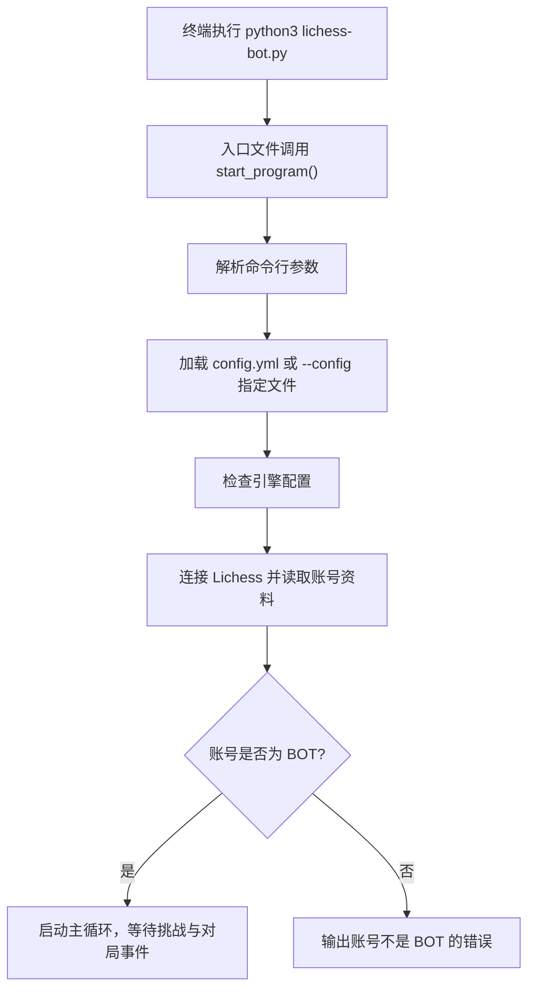
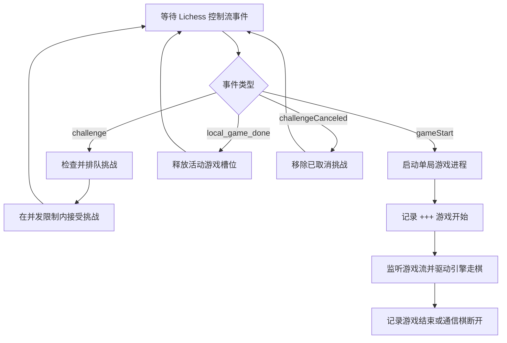

本页位于“首次部署”路径中的 **[启动机器人并观察运行日志](6-qi-dong-ji-qi-ren-bing-guan-cha-yun-xing-ri-zhi)**，目标是让初学者完成第一次启动，并知道终端日志、自动日志文件和常见启动信息分别代表什么；本页不展开 Token 创建、引擎配置细节或 Docker 运行，这些内容分别属于前置的 [创建 Lichess BOT 账号与 OAuth Token](3-chuang-jian-lichess-bot-zhang-hao-yu-oauth-token)、[配置并验证国际象棋引擎](5-pei-zhi-bing-yan-zheng-guo-ji-xiang-qi-yin-qing) 和后续的 [使用 Docker 运行机器人](7-shi-yong-docker-yun-xing-ji-qi-ren)。Sources: [README.md](README.md#L44-L50), [How-to-Run-lichess‐bot.md](wiki/How-to-Run-lichess‐bot.md#L1-L26)

## 启动前的最小心智模型

lichess-bot 的入口文件非常薄：`lichess-bot.py` 只导入 `lib.lichess_bot.start_program`，并在作为主程序运行时调用它；真正的启动流程在 `lib/lichess_bot.py` 中完成，包括解析命令行参数、加载配置、检查引擎、连接 Lichess、确认账号是否为 BOT，然后进入主循环等待挑战。Sources: [lichess-bot.py](lichess-bot.py#L1-L6), [lichess_bot.py](lib/lichess_bot.py#L1341-L1381)



上图只描述本页关注的“启动到等待挑战”阶段：代码会先配置日志，再调用 `load_config` 读取配置文件，随后用 `engine_wrapper.create_engine` 做一次引擎配置检查，接着创建 `Lichess` 客户端并读取用户资料；只有当账号标题为 `BOT` 时才会调用 `start(...)` 进入运行状态。Sources: [lichess_bot.py](lib/lichess_bot.py#L1351-L1379)

## 项目中与启动和日志直接相关的文件

第一次启动时，初学者只需要关注少数几个文件：入口脚本负责启动，配置文件决定 Token、引擎和运行规则，核心模块负责日志、连接、事件流和游戏进程，旧版英文 wiki 给出了最小启动命令。Sources: [lichess-bot.py](lichess-bot.py#L1-L6), [lichess_bot.py](lib/lichess_bot.py#L223-L264), [How-to-Run-lichess‐bot.md](wiki/How-to-Run-lichess‐bot.md#L1-L26)

```text
lichess-bot/
├── lichess-bot.py              # 命令入口：调用 start_program()
├── config.yml                  # 实际运行配置；默认从 ./config.yml 读取
├── config.yml.default          # 配置模板，供复制和修改
├── lib/
│   └── lichess_bot.py          # 启动、日志、事件流、主循环
└── wiki/
    └── How-to-Run-lichess‐bot.md # 原始运行命令说明
```

## 第一次启动：使用默认配置文件

在完成前置安装、Token、BOT 账号升级和引擎配置后，在仓库根目录运行 `python3 lichess-bot.py`；英文运行说明明确要求在激活虚拟环境后执行该命令，并说明引擎的工作目录会是 lichess-bot 目录，因此如果引擎依赖其他文件，应使用绝对路径或把文件放到合适位置。Sources: [How-to-Run-lichess‐bot.md](wiki/How-to-Run-lichess‐bot.md#L1-L6)

```bash
python3 lichess-bot.py
```

启动后，程序会依次输出介绍信息、加载配置、写入自动配置日志、检查引擎配置、检查 Python 版本、连接 Lichess、欢迎当前用户名；当账号是 BOT 时，程序会进入 `start(...)`，并输出“已连接并等待挑战”的信息。Sources: [lichess_bot.py](lib/lichess_bot.py#L1351-L1379), [lichess_bot.py](lib/lichess_bot.py#L304-L318)

## 观察终端日志：普通模式与详细模式

普通模式使用 `INFO` 级别，适合第一次确认机器人是否能正常上线；详细模式使用 `-v`，代码会把日志级别切换为 `DEBUG`，并且英文运行说明说明 `-v` 会输出更多信息，包括引擎思考输出和调试信息。Sources: [lichess_bot.py](lib/lichess_bot.py#L1343-L1352), [How-to-Run-lichess‐bot.md](wiki/How-to-Run-lichess‐bot.md#L8-L11)

| 场景 | 命令 | 你会看到什么 | 何时使用 |
|---|---|---|---|
| 普通启动 | `python3 lichess-bot.py` | 主要运行状态，例如引擎检查、欢迎信息、等待挑战、接受挑战、游戏结束 | 第一次启动、日常前台运行 |
| 详细启动 | `python3 lichess-bot.py -v` | 额外调试信息，例如 Lichess 通信事件、游戏初始状态、游戏状态更新、Python 与库版本 | 排查连接、事件流、引擎走法问题 |

详细日志中，代码会在收到非 `ping` 事件时记录 `Event: ...`，在打开单局游戏流时记录 `Initial state: ...`，在收到游戏状态更新时记录 `Game state: ...`；这些信息较多，适合排查问题，不一定适合长期在终端阅读。Sources: [lichess_bot.py](lib/lichess_bot.py#L542-L560), [lichess_bot.py](lib/lichess_bot.py#L795-L804), [lichess_bot.py](lib/lichess_bot.py#L998-L1004)

## 把日志保存到文件

如果希望把终端输出额外记录到指定文件，可以使用 `-l` 或 `--logfile` 加文件名；英文运行说明给出的示例是 `python3 lichess-bot.py --logfile log.txt`，代码中也定义了 `-l/--logfile` 参数，并在日志配置中为该文件创建 `FileHandler`。Sources: [How-to-Run-lichess‐bot.md](wiki/How-to-Run-lichess‐bot.md#L18-L21), [lichess_bot.py](lib/lichess_bot.py#L1343-L1348), [lichess_bot.py](lib/lichess_bot.py#L237-L243)

```bash
python3 lichess-bot.py --logfile log.txt
```

指定日志文件时，文件日志格式包含时间、模块名、文件名、行号、日志级别和消息；这比终端上的简短消息更适合事后定位问题。Sources: [lichess_bot.py](lib/lichess_bot.py#L237-L243)

## 自动日志目录：默认会生成什么

除非显式使用 `--disable_auto_logging`，程序会创建 `lichess_bot_auto_logs` 目录，并在其中写入自动轮转日志 `lichess-bot.log`；这个自动日志使用 `TimedRotatingFileHandler`，按午夜轮转，并保留 7 份备份。Sources: [lichess_bot.py](lib/lichess_bot.py#L245-L260), [lichess_bot.py](lib/lichess_bot.py#L1327-L1358)

```text
lichess_bot_auto_logs/
├── lichess-bot.log   # 自动运行日志
└── config.log        # 启动时写出的配置快照
```

启动过程中，如果未禁用自动日志，程序还会把加载后的配置写入 `lichess_bot_auto_logs/config.log`；这有助于确认程序实际读取到的配置值，但也意味着你需要注意不要公开包含敏感信息的日志文件。Sources: [lichess_bot.py](lib/lichess_bot.py#L1355-L1358)

## 禁用自动日志

如果不希望程序创建自动日志目录和自动日志文件，可以使用 `--disable_auto_logging`；英文运行说明给出了该命令，代码也定义了该参数，并且日志配置只有在未禁用时才会创建自动日志目录和自动轮转日志。Sources: [How-to-Run-lichess‐bot.md](wiki/How-to-Run-lichess‐bot.md#L13-L16), [lichess_bot.py](lib/lichess_bot.py#L1343-L1348), [lichess_bot.py](lib/lichess_bot.py#L245-L260)

```bash
python3 lichess-bot.py --disable_auto_logging
```

| 运行方式 | 自动 `lichess_bot_auto_logs/lichess-bot.log` | 自动 `config.log` | 手动 `--logfile` |
|---|---:|---:|---:|
| `python3 lichess-bot.py` | 会生成 | 会生成 | 不生成 |
| `python3 lichess-bot.py --logfile log.txt` | 会生成 | 会生成 | 会生成 `log.txt` |
| `python3 lichess-bot.py --disable_auto_logging` | 不生成 | 不生成 | 不生成，除非同时指定 `--logfile` |

上表来自日志配置路径：自动日志由 `disable_auto_logs` 控制，而手动日志文件由 `filename` 是否存在控制，两者是两个独立条件。Sources: [lichess_bot.py](lib/lichess_bot.py#L223-L264), [lichess_bot.py](lib/lichess_bot.py#L1351-L1358)

## 使用不同配置文件启动

默认情况下，程序读取 `./config.yml`；如果你有多个配置文件，可以用 `--config` 指定其他文件，例如 `config2.yml`，英文运行说明和代码参数定义都支持这一点。Sources: [How-to-Run-lichess‐bot.md](wiki/How-to-Run-lichess‐bot.md#L23-L26), [lichess_bot.py](lib/lichess_bot.py#L1343-L1355)

```bash
python3 lichess-bot.py --config config2.yml
```

| 启动前 | 启动后 |
|---|---|
| `python3 lichess-bot.py` 读取默认 `./config.yml` | `python3 lichess-bot.py --config config2.yml` 读取指定配置文件 |
| 适合单机器人、单配置 | 适合临时切换配置或验证另一套配置 |

代码中 `load_config(args.config or "./config.yml")` 明确表示：只要提供 `--config`，就使用指定路径；否则回退到当前目录下的 `config.yml`。Sources: [lichess_bot.py](lib/lichess_bot.py#L1343-L1355)

## 你应该重点识别的启动日志

当看到 `Checking engine configuration ...` 后又看到 `Engine configuration OK`，说明程序已经创建过一次引擎并完成配置检查；这是进入 Lichess 连接和主循环之前的重要确认点。Sources: [lichess_bot.py](lib/lichess_bot.py#L1359-L1362)

当看到 `Welcome <username>!`，说明程序已经通过 Token 调用 Lichess 读取到了用户资料；如果随后进入 `start(...)`，会继续输出 `You're now connected to ... and awaiting challenges.`，表示机器人已经连接到配置中的 Lichess 地址并开始等待挑战。Sources: [lichess_bot.py](lib/lichess_bot.py#L1367-L1378), [lichess_bot.py](lib/lichess_bot.py#L304-L318)

当机器人接受挑战时，会记录 `Accept ...`，并把该挑战加入活动游戏集合；随后游戏启动时会记录进程占用情况，例如 `--- Process Queued` 或 `--- Process Used`，用于观察当前并发对局数量。Sources: [lichess_bot.py](lib/lichess_bot.py#L604-L620), [lichess_bot.py](lib/lichess_bot.py#L384-L392), [lichess_bot.py](lib/lichess_bot.py#L658-L678)

当单局游戏真正开始时，会记录 `+++ {game}`；当游戏结束时，会记录 `--- <game-url> Game over`，如果是未完成的通信棋对局并且需要稍后继续，则会记录 `--- Disconnecting from <game-url>`。Sources: [lichess_bot.py](lib/lichess_bot.py#L813-L824), [lichess_bot.py](lib/lichess_bot.py#L1069-L1085)

## 启动后的运行流

启动成功后，主循环会从控制队列读取事件，并按事件类型处理挑战、挑战取消、挑战被拒绝、游戏开始、本地游戏完成等情况；每一轮还会处理低剩余时间通信棋、通信棋检查、接受排队挑战、竞技场任务、主动配对、在线状态检查、控制流看门狗和资源活动游戏同步。Sources: [lichess_bot.py](lib/lichess_bot.py#L395-L456), [lichess_bot.py](lib/lichess_bot.py#L456-L523)



这个流程说明：机器人不是一次性“运行一个游戏”，而是在一个长期主循环中持续处理来自 Lichess 的账号级事件，并在需要时为具体对局启动工作进程。Sources: [lichess_bot.py](lib/lichess_bot.py#L128-L157), [lichess_bot.py](lib/lichess_bot.py#L317-L352), [lichess_bot.py](lib/lichess_bot.py#L456-L523)

## 常见问题与日志线索

下表只列出与“启动和观察日志”直接相关的现象；更深入的配置校验、挑战规则、引擎封装和资源监控，请继续阅读对应后续页面。Sources: [lichess_bot.py](lib/lichess_bot.py#L1351-L1381), [lichess_bot.py](lib/lichess_bot.py#L140-L148), [lichess_bot.py](lib/lichess_bot.py#L1424-L1434)

| 现象 | 日志线索 | 含义 | 下一步 |
|---|---|---|---|
| 启动停在引擎检查附近 | `Checking engine configuration ...` 后没有 `Engine configuration OK` | 程序正在创建或检查引擎 | 回到 [配置并验证国际象棋引擎](5-pei-zhi-bing-yan-zheng-guo-ji-xiang-qi-yin-qing) |
| 账号无法进入等待挑战 | `<username> is not a bot account...` | Token 对应账号不是 BOT 账号 | 回到 [创建 Lichess BOT 账号与 OAuth Token](3-chuang-jian-lichess-bot-zhang-hao-yu-oauth-token) |
| 控制流断开后又继续 | `Control stream disconnected. Reconnecting.` | 账号级事件流断开，程序会重连 | 观察是否频繁出现；深入见 [控制流看门狗、断线重连与优雅退出](19-kong-zhi-liu-kan-men-gou-duan-xian-zhong-lian-yu-you-ya-tui-chu) |
| 网络异常后程序重启 | `Restarting lichess-bot due to a network error:` | 顶层启动循环捕获请求异常并触发重启 | 继续观察日志；长期部署见 [生产部署：多机器人、后台运行与日志管理](31-sheng-chan-bu-shu-duo-ji-qi-ren-hou-tai-yun-xing-yu-ri-zhi-guan-li) |
| 游戏流异常后重连 | `Game stream ... ended unexpectedly` 或 `failed with ... Reconnecting.` | 单局游戏流异常，程序尝试重新连接 | 使用 `-v` 获取更多游戏状态日志 |

表中的日志线索都来自代码中的显式日志消息：账号非 BOT 会输出错误，控制流断开会输出重连警告，顶层网络异常会记录重启原因，单局游戏流异常会记录对应游戏 URL 和异常类型。Sources: [lichess_bot.py](lib/lichess_bot.py#L1377-L1381), [lichess_bot.py](lib/lichess_bot.py#L140-L148), [lichess_bot.py](lib/lichess_bot.py#L905-L917), [lichess_bot.py](lib/lichess_bot.py#L1424-L1434)

## 停止机器人

前台运行时，可以按 `CTRL+C` 停止机器人；英文运行说明指出，如果配置中的 `quit_after_all_games_finish` 为 `true`，程序会等待当前所有游戏结束，否则会立即退出所有游戏，并且在所有游戏退出后仍可能需要数秒完成退出。Sources: [How-to-Run-lichess‐bot.md](wiki/How-to-Run-lichess‐bot.md#L48-L51)

代码中，第一次收到 `SIGINT` 会设置终止标志，第二次收到 `SIGINT` 会设置强制退出标志；如果启用了“等待所有游戏结束后退出”，程序还会输出提示，说明退出时会先等待正在运行的游戏结束，并提示按两次 `Ctrl-C` 可立即退出。Sources: [lichess_bot.py](lib/lichess_bot.py#L103-L113), [lichess_bot.py](lib/lichess_bot.py#L452-L455), [lichess_bot.py](lib/lichess_bot.py#L533-L540)

## 本页命令速查

以下命令覆盖本页所有启动和日志观察场景；初学者建议先用普通启动确认能上线，再用 `-v` 排查细节，最后根据需要决定是否保存日志或禁用自动日志。Sources: [How-to-Run-lichess‐bot.md](wiki/How-to-Run-lichess‐bot.md#L1-L26), [lichess_bot.py](lib/lichess_bot.py#L1343-L1358)

| 目的 | 命令 |
|---|---|
| 默认启动 | `python3 lichess-bot.py` |
| 输出详细调试日志 | `python3 lichess-bot.py -v` |
| 保存终端日志到文件 | `python3 lichess-bot.py --logfile log.txt` |
| 使用指定配置文件 | `python3 lichess-bot.py --config config2.yml` |
| 禁用自动日志目录 | `python3 lichess-bot.py --disable_auto_logging` |
| 详细日志并保存到文件 | `python3 lichess-bot.py -v --logfile log.txt` |

## 下一步阅读路径

如果你已经看到机器人成功输出等待挑战的信息，下一步可以按部署方式选择：需要容器化运行时继续阅读 [使用 Docker 运行机器人](7-shi-yong-docker-yun-xing-ji-qi-ren)；需要理解配置文件中各字段如何影响运行时行为时，进入 [配置文件结构与必填字段](8-pei-zhi-wen-jian-jie-gou-yu-bi-tian-zi-duan)；如果你在启动日志中遇到断线、重连或退出问题，后续可深入 [控制流看门狗、断线重连与优雅退出](19-kong-zhi-liu-kan-men-gou-duan-xian-zhong-lian-yu-you-ya-tui-chu)。Sources: [README.md](README.md#L44-L52), [lichess_bot.py](lib/lichess_bot.py#L140-L148), [lichess_bot.py](lib/lichess_bot.py#L1417-L1435)