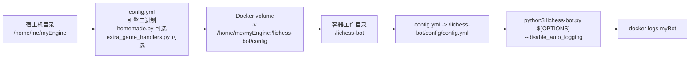
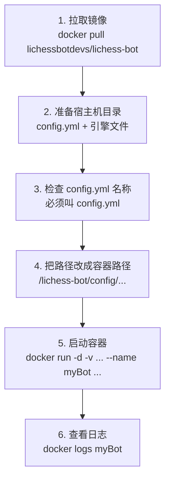
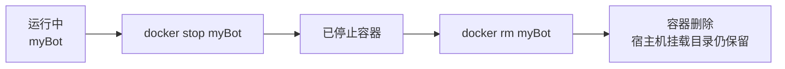

本页说明如何用官方 Docker 镜像启动 lichess-bot，并限定在容器化运行所需的镜像选择、配置目录挂载、启动/停止命令、日志查看、路径注意事项与少量镜像扩展场景；如果你还没有创建 Token、准备引擎或完成本机启动验证，请先按前序页面完成 [创建 Lichess BOT 账号与 OAuth Token](3-chuang-jian-lichess-bot-zhang-hao-yu-oauth-token)、[配置并验证国际象棋引擎](5-pei-zhi-bing-yan-zheng-guo-ji-xiang-qi-yin-qing) 与 [启动机器人并观察运行日志](6-qi-dong-ji-qi-ren-bing-guan-cha-yun-xing-ri-zhi)。Sources: [How-to-use-the-Docker-image.md](wiki/How-to-use-the-Docker-image.md#L1-L18), [Dockerfile](docker/Dockerfile#L13-L23)

## 架构假设与验证结论

**架构假设**：官方镜像把 lichess-bot 程序固定放在容器内的 `/lichess-bot` 工作目录，并把用户自己的 `config.yml`、引擎文件、Homemade 扩展文件作为外部配置目录挂载到 `/lichess-bot/config`；容器启动时再通过符号链接让程序读取 `/lichess-bot/config/config.yml`，最后执行 `python3 lichess-bot.py ${OPTIONS} --disable_auto_logging`。这个假设由 Dockerfile 的 `WORKDIR`、`ln -s` 与 `CMD` 验证，且入口脚本确实只调用 `lib.lichess_bot.start_program()` 启动主程序。Sources: [Dockerfile](docker/Dockerfile#L13-L23), [lichess-bot.py](lichess-bot.py#L1-L6)



这个结构的关键后果是：你在 `config.yml` 中写给引擎使用的路径，必须从**容器内部视角**理解，而不是从宿主机视角理解；官方文档明确提醒 `dir` 和 `working_dir` 应指向容器内路径，通常应以 `/lichess-bot/config/` 开头。Sources: [How-to-use-the-Docker-image.md](wiki/How-to-use-the-Docker-image.md#L20-L33), [config.yml.default](config.yml.default#L4-L13)

## 官方镜像从哪里来

官方镜像发布在 Docker Hub 与 GitHub Container Registry 两个位置：Docker Hub 使用 `lichessbotdevs/lichess-bot`，GitHub Container Registry 使用 `ghcr.io/lichess-bot-devs/lichess-bot`；二者的组织名格式不同，包名都是 `lichess-bot`。Sources: [How-to-use-the-Docker-image.md](wiki/How-to-use-the-Docker-image.md#L2-L8)

| 镜像来源 | 拉取命令 | 后续示例中应替换的镜像名前缀 |
|---|---|---|
| Docker Hub | `docker pull lichessbotdevs/lichess-bot` | `lichessbotdevs` |
| GitHub Container Registry | `docker pull ghcr.io/lichess-bot-devs/lichess-bot` | `ghcr.io/lichess-bot-devs` |

Sources: [How-to-use-the-Docker-image.md](wiki/How-to-use-the-Docker-image.md#L2-L8)

官方镜像有两个主要变体：默认镜像基于 `python:3`，适合不确定需求时直接使用；`alpine` 变体基于 Alpine Linux，镜像体积更小，但由于 Alpine 使用 musl libc，某些依赖 glibc 假设的软件可能遇到兼容性问题。Sources: [How-to-use-the-Docker-image.md](wiki/How-to-use-the-Docker-image.md#L39-L55), [Dockerfile](docker/Dockerfile#L1-L2)

| 变体 | 示例标签 | 基础镜像 | 适用场景 | 注意点 |
|---|---|---|---|---|
| 默认变体 | `lichess-bot:latest` | `python:3` | 首次 Docker 部署、追求兼容性 | 镜像体积相对较大 |
| Alpine 变体 | `lichess-bot:alpine` | `python:3-alpine` 等变体 | 追求更小镜像体积 | 依赖 musl libc，部分引擎或运行时可能不兼容 |

Sources: [How-to-use-the-Docker-image.md](wiki/How-to-use-the-Docker-image.md#L43-L55), [Dockerfile](docker/Dockerfile#L1-L2)

## 准备宿主机部署目录

在宿主机创建一个专用目录，例如 `/home/me/myEngine`，并把 `config.yml`、UCI/XBoard 引擎程序、必要的数据文件，以及可选的 `homemade.py` 或 `extra_game_handlers.py` 放入该目录；官方文档要求配置文件必须命名为 `config.yml`，而容器启动脚本会在发现 `/lichess-bot/config/homemade.py` 或 `/lichess-bot/config/extra_game_handlers.py` 时，把它们链接到 `/lichess-bot/` 根目录供程序使用。Sources: [How-to-use-the-Docker-image.md](wiki/How-to-use-the-Docker-image.md#L10-L18), [copy_files.sh](docker/copy_files.sh#L1-L10)

```text
/home/me/myEngine/
├── config.yml
├── stockfish              # 示例：Linux 可执行引擎文件
├── book.bin               # 可选：开局库或其他资源
├── homemade.py            # 可选：Homemade 引擎入口
└── extra_game_handlers.py # 可选：额外对局处理逻辑
```

如果你需要查看默认配置模板，可以直接从镜像中读取 `config.yml.default`：`docker run --rm --entrypoint=cat lichessbotdevs/lichess-bot config.yml.default`；默认模板显示 `token`、`url` 与 `engine` 区块，其中 `engine.dir` 可以是绝对路径，也可以是相对于 `/lichess-bot/` 的路径，`working_dir` 则会影响引擎读写文件时的相对路径基准。Sources: [How-to-use-the-Docker-image.md](wiki/How-to-use-the-Docker-image.md#L13-L18), [config.yml.default](config.yml.default#L1-L13)

## 让配置路径匹配容器视角

Docker 运行时，宿主机目录会被挂载到容器内的 `/lichess-bot/config`，因此推荐把引擎目录配置为容器内路径，例如 `engine.dir: "/lichess-bot/config"`，而不是宿主机路径 `/home/me/myEngine`；官方警告明确指出，`dir` 和 `working_dir` 应设置为容器操作系统中的正确路径。Sources: [How-to-use-the-Docker-image.md](wiki/How-to-use-the-Docker-image.md#L20-L33), [config.yml.default](config.yml.default#L4-L13)

| 配置项 | 宿主机思维中的错误倾向 | Docker 中推荐写法 | 原因 |
|---|---|---|---|
| `engine.dir` | `/home/me/myEngine` | `/lichess-bot/config` | 引擎在容器内运行，只能按容器文件系统解析路径 |
| `engine.name` | `stockfish` | `stockfish` | 文件名本身不变，只要它位于挂载目录内 |
| `engine.working_dir` | `/home/me/myEngine` | `/lichess-bot/config` 或留空 | 设置后，引擎会以该目录解析相对文件路径 |

Sources: [How-to-use-the-Docker-image.md](wiki/How-to-use-the-Docker-image.md#L29-L33), [config.yml.default](config.yml.default#L4-L13)

**Before / After 示例**如下，重点不是改变 Token 或引擎名称，而是把路径从宿主机路径改成容器路径。Sources: [How-to-use-the-Docker-image.md](wiki/How-to-use-the-Docker-image.md#L22-L33), [config.yml.default](config.yml.default#L1-L13)

| 场景 | 配置片段 |
|---|---|
| 不适合 Docker 的宿主机路径 | `engine:`<br/>`  dir: "/home/me/myEngine"`<br/>`  name: "stockfish"`<br/>`  working_dir: "/home/me/myEngine"` |
| 适合 Docker 的容器路径 | `engine:`<br/>`  dir: "/lichess-bot/config"`<br/>`  name: "stockfish"`<br/>`  working_dir: "/lichess-bot/config"` |

Sources: [How-to-use-the-Docker-image.md](wiki/How-to-use-the-Docker-image.md#L29-L33), [config.yml.default](config.yml.default#L4-L13)

## 启动机器人

准备好部署目录后，使用 `docker run -d -v /home/me/myEngine:/lichess-bot/config --name myBot lichessbotdevs/lichess-bot` 在后台启动机器人；官方文档建议使用绝对路径挂载，因为相对路径可能导致问题。Sources: [How-to-use-the-Docker-image.md](wiki/How-to-use-the-Docker-image.md#L20-L27)



如果你从 GitHub Container Registry 拉取镜像，只需要把命令中的 `lichessbotdevs/lichess-bot` 替换为 `ghcr.io/lichess-bot-devs/lichess-bot`；官方文档也说明后续步骤可按同样方式替换镜像来源前缀。Sources: [How-to-use-the-Docker-image.md](wiki/How-to-use-the-Docker-image.md#L2-L8)

## 查看日志与传递启动参数

容器使用 Docker 标准日志系统，且官方 Dockerfile 固定以 `--disable_auto_logging` 参数启动 lichess-bot，因此查看运行输出应使用 `docker logs myBot`；程序本身支持 `-v`、`--config`、`--logfile` 与 `--disable_auto_logging` 等命令行参数，但 Docker 镜像默认通过环境变量 `OPTIONS` 把额外参数拼接到启动命令中。Sources: [How-to-use-the-Docker-image.md](wiki/How-to-use-the-Docker-image.md#L29-L33), [Dockerfile](docker/Dockerfile#L20-L23), [lichess_bot.py](lib/lichess_bot.py#L1341-L1358)

| 目标 | 命令 |
|---|---|
| 查看当前日志 | `docker logs myBot` |
| 持续跟随日志 | `docker logs -f myBot` |
| 以详细模式启动 | `docker run -d -v /home/me/myEngine:/lichess-bot/config --env OPTIONS=-v --name myBot lichessbotdevs/lichess-bot` |
| 查看镜像内版本文件 | `docker run --rm --entrypoint=cat lichessbotdevs/lichess-bot lib/versioning.yml` |

Sources: [How-to-use-the-Docker-image.md](wiki/How-to-use-the-Docker-image.md#L68-L75), [Dockerfile](docker/Dockerfile#L20-L23), [lichess_bot.py](lib/lichess_bot.py#L1341-L1358)

## 保存 PGN 或其他输出文件时的挂载规则

如果你在配置中把 PGN 保存目录设置到了 `/lichess-bot/config` 之外，必须额外挂载对应目录；官方警告说明，如果没有为该目录挂载 volume，保存的对局文件会留在容器内部而不是宿主机可管理的位置。Sources: [How-to-use-the-Docker-image.md](wiki/How-to-use-the-Docker-image.md#L29-L33)

| 输出位置 | 是否需要额外挂载 | 说明 |
|---|---:|---|
| `/lichess-bot/config` 内部 | 通常不需要 | 已由主配置目录 volume 覆盖 |
| `/lichess-bot/config/pgn` | 通常不需要 | 仍在主挂载目录下 |
| `/lichess-bot/pgn` 或其他容器路径 | 需要 | 否则文件只存在于容器文件系统 |
| 宿主机任意目录 | 需要通过 `-v 宿主机目录:容器目录` 映射 | 容器只能看到映射后的容器路径 |

Sources: [How-to-use-the-Docker-image.md](wiki/How-to-use-the-Docker-image.md#L29-L33), [Dockerfile](docker/Dockerfile#L13-L23)

## 停止并删除容器

如果你按示例用 `--name myBot` 启动容器，停止命令是 `docker stop myBot`，删除命令是 `docker rm myBot`；这两个命令只管理容器本身，不会删除你挂载在宿主机上的 `/home/me/myEngine` 配置目录。Sources: [How-to-use-the-Docker-image.md](wiki/How-to-use-the-Docker-image.md#L35-L37)



## 当引擎需要额外软件时

如果你的引擎需要镜像内没有预装的软件，就需要基于官方镜像制作自己的派生镜像；官方示例展示了基于 `lichessbotdevs/lichess-bot:alpine` 安装 Java 17 的 Dockerfile，并提醒 Alpine 变体应使用 `apk` 安装软件。Sources: [How-to-use-the-Docker-image.md](wiki/How-to-use-the-Docker-image.md#L56-L67)

```dockerfile
FROM lichessbotdevs/lichess-bot:alpine

RUN apk add --no-cache openjdk17-jre
```

这个扩展场景只改变容器内可用的软件环境，不改变 lichess-bot 的运行约定：配置目录仍应挂载到 `/lichess-bot/config`，配置文件仍必须命名为 `config.yml`，Dockerfile 中的启动命令仍会执行 `docker/copy_files.sh` 并运行 `python3 lichess-bot.py ${OPTIONS} --disable_auto_logging`。Sources: [How-to-use-the-Docker-image.md](wiki/How-to-use-the-Docker-image.md#L10-L18), [Dockerfile](docker/Dockerfile#L20-L23), [copy_files.sh](docker/copy_files.sh#L1-L10)

## 常见问题排查表

下表只覆盖 Docker 运行路径上的问题；如果日志显示的是配置字段校验、挑战规则或引擎协议行为，请继续阅读 [配置文件结构与必填字段](8-pei-zhi-wen-jian-jie-gou-yu-bi-tian-zi-duan) 与 [配置并验证国际象棋引擎](5-pei-zhi-bing-yan-zheng-guo-ji-xiang-qi-yin-qing)。Sources: [How-to-use-the-Docker-image.md](wiki/How-to-use-the-Docker-image.md#L20-L33), [config.yml.default](config.yml.default#L4-L13)

| 现象 | 最可能原因 | 修正动作 |
|---|---|---|
| 容器启动后找不到 `config.yml` | 宿主机目录未正确挂载，或文件名不是 `config.yml` | 确认 `-v /absolute/path:/lichess-bot/config`，并确认文件名精确为 `config.yml` |
| 引擎文件找不到 | `engine.dir` 写成了宿主机路径 | 改为 `/lichess-bot/config` 或其子目录 |
| 引擎能启动但找不到自己的数据文件 | `working_dir` 与引擎期望的相对路径不匹配 | 将 `working_dir` 设为 `/lichess-bot/config` 或引擎数据所在容器路径 |
| 看不到 lichess-bot 自动日志文件 | Docker 镜像默认带 `--disable_auto_logging` | 使用 `docker logs myBot` 查看容器日志 |
| PGN 文件没有出现在宿主机 | 保存目录不在已挂载 volume 内 | 把 PGN 目录放到 `/lichess-bot/config` 下，或为目标目录添加额外 volume |
| Alpine 镜像中引擎无法运行 | 引擎或依赖可能不兼容 musl libc，或缺少运行时 | 换用默认镜像，或制作派生镜像安装所需软件 |

Sources: [How-to-use-the-Docker-image.md](wiki/How-to-use-the-Docker-image.md#L29-L67), [Dockerfile](docker/Dockerfile#L20-L23), [config.yml.default](config.yml.default#L4-L13)

## 下一步阅读

完成 Docker 启动后，建议按目录顺序进入基础配置阶段，阅读 [配置文件结构与必填字段](8-pei-zhi-wen-jian-jie-gou-yu-bi-tian-zi-duan) 来系统理解 `config.yml`；如果你需要调整挑战过滤条件，继续阅读 [挑战接收规则：变体、时限、评级与并发](9-tiao-zhan-jie-shou-gui-ze-bian-ti-shi-xian-ping-ji-yu-bing-fa)；如果你计划长期运行容器并管理日志、多个机器人或后台部署，再阅读 [生产部署：多机器人、后台运行与日志管理](31-sheng-chan-bu-shu-duo-ji-qi-ren-hou-tai-yun-xing-yu-ri-zhi-guan-li)。Sources: [How-to-use-the-Docker-image.md](wiki/How-to-use-the-Docker-image.md#L20-L37), [config.yml.default](config.yml.default#L1-L13)