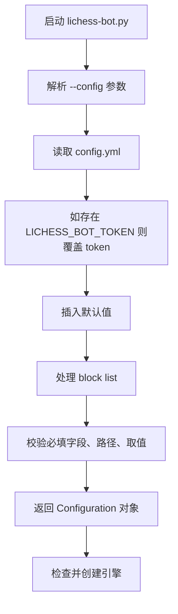

本页位于“基础配置”中的 **[配置文件结构与必填字段](8-pei-zhi-wen-jian-jie-gou-yu-bi-tian-zi-duan)**，目标是帮助初学者理解 `config.yml` 的顶层结构、最小可运行字段，以及程序加载配置时如何填充默认值和执行校验；本页只讨论“配置文件结构与必填字段”，挑战筛选细节、开局库、聊天行为等内容请在后续专题页继续阅读。Sources: [config.yml.default](config.yml.default#L1-L16), [lib/config.py](lib/config.py#L557-L581)

## 架构假设与验证结论

**架构假设**：lichess-bot 的配置系统以 YAML 文件为入口，先读取用户提供的 `config.yml`，再将缺失的可选字段补成默认值，最后对关键字段、路径和枚举值做校验；因此初学者不需要一次理解全部 300 多行默认配置，但必须保证身份、站点地址和引擎定位字段正确。验证结果显示，启动流程默认读取 `./config.yml`，也允许通过 `--config` 指定其他配置文件；读取后会执行 `load_config()`，随后检查引擎配置并创建引擎实例。Sources: [lib/lichess_bot.py](lib/lichess_bot.py#L1341-L1362), [lib/config.py](lib/config.py#L557-L581)



上图描述的是配置文件从“文本文件”变成“运行时配置对象”的路径：程序入口调用主模块，主模块解析命令行参数，默认使用 `./config.yml`，然后 `load_config()` 读取 YAML、覆盖环境变量 Token、填充默认值、处理列表并校验配置。Sources: [lichess-bot.py](lichess-bot.py#L1-L6), [lib/lichess_bot.py](lib/lichess_bot.py#L1341-L1358), [lib/config.py](lib/config.py#L557-L581)

## 配置文件在项目中的位置

初学者通常从仓库根目录的 `config.yml.default` 开始：它是完整模板，不是程序默认读取的文件；实际运行时，程序默认读取根目录下的 `config.yml`，除非你用 `--config` 指定其他路径。因此常见做法是复制模板为 `config.yml`，再只修改必要字段。Sources: [config.yml.default](config.yml.default#L1-L16), [lib/lichess_bot.py](lib/lichess_bot.py#L1341-L1355)

```text
lichess-bot/
├── config.yml.default   # 官方默认模板，包含完整配置示例
├── config.yml           # 你实际运行时通常使用的配置文件
├── lichess-bot.py       # 程序入口
├── lib/
│   ├── lichess_bot.py   # 解析 --config 并启动机器人
│   └── config.py        # 读取、补默认值、校验配置
└── engines/             # 默认示例中建议放置引擎的位置
```

这个结构的核心关系是：`lichess-bot.py` 只负责进入主程序；`lib/lichess_bot.py` 负责解析 `--config` 并调用 `load_config()`；`lib/config.py` 负责真正读取 YAML、插入默认值、校验字段和返回可通过 `config.key1.key2` 访问的 `Configuration` 对象。Sources: [lichess-bot.py](lichess-bot.py#L1-L6), [lib/lichess_bot.py](lib/lichess_bot.py#L1341-L1358), [lib/config.py](lib/config.py#L15-L40)

## 顶层结构：先认识配置文件的大块

`config.yml.default` 的顶层结构从 `token`、`url` 开始，然后进入 `engine`、`correspondence`、`challenge`、`greeting`、`resource_monitor`、`arena`、`matchmaking` 等区块；其中本页重点关注能让机器人启动并找到引擎的基础结构，而不是逐项解释每个功能区块。Sources: [config.yml.default](config.yml.default#L1-L16), [config.yml.default](config.yml.default#L150-L164), [config.yml.default](config.yml.default#L214-L236), [config.yml.default](config.yml.default#L262-L289)

| 层级 | 示例字段 | 初学者理解 | 本页处理方式 |
|---|---|---|---|
| 顶层身份字段 | `token`, `url` | 告诉程序连接哪个 Lichess 服务、用哪个 OAuth Token | 必须理解 |
| 引擎区块 | `engine.dir`, `engine.name`, `engine.protocol` | 告诉程序引擎在哪里、叫什么、用什么协议通信 | 必须理解 |
| 挑战区块 | `challenge` | 告诉程序接受哪些挑战 | 只说明结构入口 |
| 其他功能区块 | `greeting`, `resource_monitor`, `arena`, `matchmaking` | 聊天、监控、锦标赛、主动配对等扩展能力 | 本页不展开 |

这些顶层区块在默认模板中已经按照 YAML 缩进组织好；对初学者来说，最重要的规则是“带冒号的字段形成键值”，“缩进表示从属关系”，例如 `dir` 和 `name` 缩进在 `engine:` 下面，所以它们是 `engine.dir` 和 `engine.name`。Sources: [config.yml.default](config.yml.default#L1-L16), [config.yml.default](config.yml.default#L163-L195)

## 最小可运行配置骨架

下面是面向初学者的最小配置骨架：它保留了身份字段、引擎定位字段、引擎协议字段，以及一个基础 `challenge` 区块；虽然程序会为许多缺失项填充默认值，但保留这些结构能让你更容易对照默认模板和错误信息。Sources: [config.yml.default](config.yml.default#L1-L16), [config.yml.default](config.yml.default#L163-L195), [lib/config.py](lib/config.py#L140-L183)

```yaml
token: "你的 Lichess OAuth Token"
url: "https://lichess.org/"

engine:
  dir: "./engines/"
  name: "你的引擎文件名"
  protocol: "uci"
  ponder: true

challenge:
  concurrency: 1
  variants:
    - standard
  time_controls:
    - bullet
    - blitz
    - rapid
    - classical
  modes:
    - casual
```

这个骨架中的 `token` 和 `url` 是顶层字符串；`engine` 是字典；`engine.dir` 和 `engine.name` 是字符串；`engine.protocol` 在默认模板中给出为 `"uci"`，并在校验引擎文件是否存在、是否可执行时用于判断 homemade 引擎例外路径。Sources: [config.yml.default](config.yml.default#L1-L16), [lib/config.py](lib/config.py#L343-L363)

## 程序硬性校验的必填字段

配置校验函数会明确检查 `token`、`url`、`engine`、`challenge`、`engine.dir`、`engine.name` 是否存在且类型正确；其中 `token` 和 `url` 必须是带引号的字符串，`engine` 和 `challenge` 必须是带缩进键值的字典，`engine.dir` 和 `engine.name` 也必须是字符串。Sources: [lib/config.py](lib/config.py#L79-L95), [lib/config.py](lib/config.py#L343-L350)

| 字段 | YAML 位置 | 程序期望类型 | 作用 | 初学者常见错误 |
|---|---|---|---|---|
| `token` | 顶层 | 字符串 | Lichess OAuth Token | 忘记引号、复制了错误 Token |
| `url` | 顶层 | 字符串 | Lichess 基础 URL | 删除末尾 `/` 后难以对照模板 |
| `engine` | 顶层 | 字典 | 引擎配置容器 | 写成 `engine: stockfish` |
| `challenge` | 顶层 | 字典 | 挑战配置容器 | 整段删除后难以理解挑战行为 |
| `engine.dir` | `engine` 下 | 字符串 | 引擎所在目录 | 路径不存在 |
| `engine.name` | `engine` 下 | 字符串 | 引擎文件名 | 写成目录名而不是文件名 |

`check_config_section()` 的错误信息也体现了这些类型规则：字符串必须用引号包裹，字典必须是“缩进的键 + 冒号”形式；这说明 YAML 格式错误和字段缺失都会在启动早期暴露出来。Sources: [lib/config.py](lib/config.py#L79-L95), [lib/config.py](lib/config.py#L343-L350)

## 引擎字段：目录、文件名与协议

`engine.dir` 表示包含引擎文件的目录，可以是绝对路径，也可以是相对于 lichess-bot 项目根目录的路径；默认模板使用 `./engines/`。`engine.name` 是目录中的具体二进制文件名；程序会把 `engine.dir` 与 `engine.name` 拼接成完整路径，然后检查该目录是否存在、文件是否存在、文件是否具备执行权限。Sources: [config.yml.default](config.yml.default#L4-L13), [lib/config.py](lib/config.py#L352-L363)

| 字段 | 示例 | 校验行为 | 说明 |
|---|---|---|---|
| `engine.dir` | `"./engines/"` | 必须是存在的目录 | 放引擎文件的文件夹 |
| `engine.name` | `"stockfish"` | 必须能与目录拼成存在的文件 | 引擎可执行文件名 |
| `engine.protocol` | `"uci"` | 参与 homemade 例外判断和 xboard 规则判断 | 默认模板给出 `"uci"`, `"xboard"` 或 `"homemade"` |

如果 `engine.protocol` 是 `"homemade"`，程序在检查引擎文件是否存在、是否可执行时会走例外条件；如果协议是 `"xboard"`，程序还会限制部分残局或在线走法配置不能使用 `move_quality: suggest`。因此即使 `protocol` 不在 `check_config_section()` 的显式必填列表中，初学者也应保留默认模板中的 `engine.protocol` 字段。Sources: [config.yml.default](config.yml.default#L13-L14), [lib/config.py](lib/config.py#L359-L389)

## Token 字段与环境变量覆盖

`token` 可以直接写在 `config.yml` 顶层，也可以通过环境变量 `LICHESS_BOT_TOKEN` 覆盖：程序读取 YAML 后，如果发现环境变量存在，就把配置中的 `token` 替换为环境变量值。对初学者来说，最简单的方式是先在 `config.yml` 中填写 Token；如果在服务器或 Docker 环境中更重视保密，再使用环境变量覆盖。Sources: [config.yml.default](config.yml.default#L1-L2), [lib/config.py](lib/config.py#L571-L575)

需要注意的是，配置日志会把 `token` 改写成 `"logger"` 再输出，避免真实 Token 出现在调试日志中；这表示你在日志里看到的 `"logger"` 不是实际用于连接 Lichess 的 Token。Sources: [lib/config.py](lib/config.py#L330-L340)

## 默认值填充：为什么模板很长，但你不必全写

`insert_default_values()` 会为大量可选字段插入默认值，例如 `abort_time`、`move_overhead`、`rate_limiting_delay`、`pgn_directory`、`resource_monitor`、`arena`、`engine.interpreter`、`engine.working_dir`、`engine.silence_stderr` 等；这就是为什么配置模板很长，但最小配置可以短得多。Sources: [lib/config.py](lib/config.py#L140-L185)


默认值填充不是“跳过配置”，而是把未写出的可选项补成程序可理解的结构；例如挑战并发、排序偏好、是否接受 bot、最大/最小时限等挑战字段都有默认值，后续页面会专门解释这些规则。Sources: [lib/config.py](lib/config.py#L260-L280)

## YAML 缩进规则：最容易犯错的地方

YAML 中缩进决定字段归属：`dir`、`name`、`protocol` 必须缩进在 `engine:` 下面；`variants`、`time_controls`、`modes` 必须缩进在 `challenge:` 下面；列表项使用 `-` 表示。默认模板正是用这种结构表达引擎设置和挑战规则。Sources: [config.yml.default](config.yml.default#L4-L16), [config.yml.default](config.yml.default#L163-L195)

| 错误写法 | 正确写法 | 原因 |
|---|---|---|
| `engine: "./engines/stockfish"` | `engine:` 下写 `dir` 和 `name` | 程序要求 `engine` 是字典 |
| `dir: "./engines/"` 放在顶层 | `engine:` 下缩进 `dir` | 程序检查的是 `engine.dir` |
| `variants: standard` | `variants:` 下使用 `- standard` | 默认模板用列表表达多个变体 |
| `token: xxxxx` | `token: "xxxxx"` | 校验错误信息要求字符串用引号包裹 |

程序的类型检查会在字段缺失或类型错误时抛出异常，例如缺少必需 section 时提示配置文件没有对应 section，字符串类型错误时提示必须用引号包裹，字典类型错误时提示必须使用缩进键值结构。Sources: [lib/config.py](lib/config.py#L79-L95)

## 启动时会检查哪些路径

启动过程中，配置校验会确认 `engine.dir` 是目录；如果设置了 `engine.working_dir`，也会确认它是目录；随后会将 `engine.dir` 与 `engine.name` 拼接成引擎路径，并在非 homemade 协议下检查文件存在和可执行权限。Sources: [lib/config.py](lib/config.py#L352-L363)

这意味着“配置文件格式正确”并不等于“引擎配置正确”：如果 YAML 写对了，但 `./engines/stockfish` 文件不存在，或者文件没有执行权限，程序仍会在配置校验阶段报错。Sources: [lib/config.py](lib/config.py#L352-L363)

## 初学者配置检查清单

在第一次运行前，建议按顺序检查：`config.yml` 是否位于项目根目录或通过 `--config` 指定；`token` 是否为字符串；`url` 是否为字符串；`engine.dir` 是否指向真实目录；`engine.name` 是否是目录中的真实文件；`engine.protocol` 是否保留为 `"uci"`、`"xboard"` 或 `"homemade"` 中与你的引擎匹配的值。Sources: [lib/lichess_bot.py](lib/lichess_bot.py#L1341-L1355), [config.yml.default](config.yml.default#L1-L16), [lib/config.py](lib/config.py#L343-L363)

| 检查项 | 通过标准 | 相关错误方向 |
|---|---|---|
| 配置文件路径 | 默认是 `./config.yml`，或用 `--config` 指定 | 程序读不到配置文件 |
| `token` | 顶层字符串 | 认证失败或字段校验失败 |
| `url` | 顶层字符串，如 `"https://lichess.org/"` | API 基础地址错误 |
| `engine.dir` | 存在的目录 | `not a directory` |
| `engine.name` | 存在的引擎文件 | `file does not exist` |
| 执行权限 | 非 homemade 引擎文件可执行 | `doesn't have execute (x) permission` |

这个清单覆盖的是本页范围内的结构和必填字段；至于接受哪些变体、时限、评级范围和并发数量，属于挑战规则配置，应继续阅读下一页。Sources: [lib/config.py](lib/config.py#L343-L363), [lib/config.py](lib/config.py#L391-L409)

## 推荐阅读顺序

完成本页后，建议继续阅读 [挑战接收规则：变体、时限、评级与并发](9-tiao-zhan-jie-shou-gui-ze-bian-ti-shi-xian-ping-ji-yu-bing-fa)，因为 `challenge` 区块虽然可以依赖默认值启动，但实际机器人是否接受挑战主要由该区块决定；如果你还没有完成引擎安装，应回到 [配置并验证国际象棋引擎](5-pei-zhi-bing-yan-zheng-guo-ji-xiang-qi-yin-qing)。Sources: [config.yml.default](config.yml.default#L163-L195), [lib/config.py](lib/config.py#L260-L280)

如果你已经能稳定启动机器人，再按需求阅读 [开局库、在线走法与残局库配置](10-kai-ju-ku-zai-xian-zou-fa-yu-can-ju-ku-pei-zhi)、[认输、求和、悔棋与聊天行为配置](11-ren-shu-qiu-he-hui-qi-yu-liao-tian-xing-wei-pei-zhi)；想理解程序内部如何加载、补默认值和校验配置，则阅读深入解析中的 [配置加载、默认值填充与校验机制](22-pei-zhi-jia-zai-mo-ren-zhi-tian-chong-yu-xiao-yan-ji-zhi)。Sources: [config.yml.default](config.yml.default#L59-L118), [config.yml.default](config.yml.default#L214-L234), [lib/config.py](lib/config.py#L140-L319)